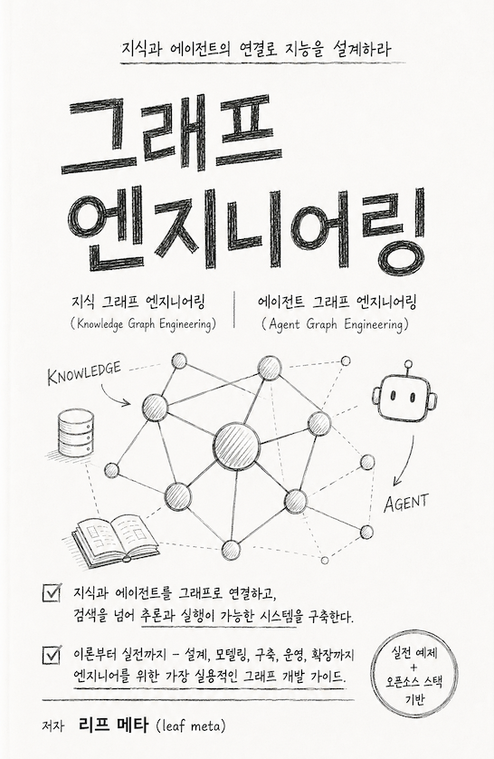

<p align="center">
  
</p>

<h1 align="center">그래프 엔지니어링</h1>
<p align="center">
  쾨니히스베르크의 다리에서 에이전트 하네스까지<br>
  지식 그래프와 에이전트 그래프, 두 트랙을 하나의 백본으로<br>
  <br>
  <b>리프 메타 (leaf meta)</b>
</p>

<p align="center">
  <a href="https://github.com/leaf-kit/book-graph-engineering/releases/download/v2026.08.02/graph-engineering-v2026.08.02.pdf">
    
  </a>
  &nbsp;
  <a href="https://github.com/leaf-kit/book-graph-engineering/releases/tag/v2026.08.02">
    
  </a>
</p>

<p align="center">
  <sub>
    최신 판은 <a href="../../releases/latest">릴리즈 목록</a>에서 확인하세요 ·
    현재 판 <code>v2026.08.02</code> · 2026년 8월 2일
  </sub>
</p>

---

## 라이선스

이 책은 **[크리에이티브 커먼즈 저작자표시 4.0 국제 (CC BY 4.0)](https://creativecommons.org/licenses/by/4.0/deed.ko)** 로 배포합니다. 자세한 내용은 [`LICENSE`](LICENSE)에 있습니다.

---

## 목차

본문 35장, 부록 6편. 8부로 나뉩니다. 1부와 2부를 지나면 **트랙 1(지식 그래프)** 과 **트랙 2(에이전트 그래프)** 로 갈라졌다가 5부에서 다시 합칩니다. 급하면 2부부터 읽어도 되고, 에이전트만 필요하면 4부로 바로 가도 막히지 않게 썼습니다.

제목을 누르면 그 장의 요약 페이지로 갑니다. 절 목록, 한 장 요약, 키워드별 1차 출처, 예제 실행법이 한 쪽에 들어 있습니다. PDF를 내려받기 전에 어느 장이 지금 필요한지 고르는 데 쓰세요.

### 1부 — 뿌리: 그래프는 어디에 있었나

초기 AI는 그래프였습니다. 딥러닝이 그걸 벡터로 녹여 버렸고, LLM 에이전트 시대에 와서 우리는 다시 그래프를 그리고 있습니다. 그 60년과 최근 2년을 압축합니다.

| 장 | 제목 | 무엇을 다루나 |
|---|---|---|
| 1 | [그래프로 다시 읽는 AI의 60년](content/ch01/code/README.md) | 기호주의에서 벡터로, 다시 그래프로. 하네스 엔지니어링이라는 착지점 |
| 2 | [하네스 엔지니어링에서 그래프 엔지니어링으로](content/ch02/code/README.md) | 에이전트·스킬·오케스트레이터를 노드·서브그래프·실행기로 번역 |
| 3 | [다리 일곱 개를 건널 수 없었던 이유, 그리고 표가 이긴 이유](content/ch03/code/README.md) | 오일러의 증명, 관계형 모델이 이긴 이유와 놓친 것 |
| 4 | [시맨틱 웹은 왜 실패한 것처럼 보였나](content/ch04/code/README.md) | RDF·OWL의 야심, 좌절, 그리고 지금 남은 것 |
| 5 | [문자열이 아니라 사물](content/ch05/code/README.md) | 구글 지식 그래프 선언과 프로퍼티 그래프의 부상 |
| 6 | [벡터에 녹인 관계를 되찾는 데 10년이 걸렸다](content/ch06/code/README.md) | 그래프 임베딩과 GNN, RAG의 한계와 GraphRAG로의 선회 |

### 2부 — 그래프의 기초 문법

노드·엣지·속성부터 순회·중심성·쿼리 언어까지. 두 트랙 어디로 가든 여기를 밟고 갑니다.

| 장 | 제목 | 무엇을 다루나 |
|---|---|---|
| 7 | [노드 하나 잘못 그려서 3주를 날렸다](content/ch07/code/README.md) | 노드·엣지·속성·라벨, 방향과 가중치, 스키마와 제약 |
| 8 | [그래프는 메모리에서 이렇게 생겼다](content/ch08/code/README.md) | 인접 리스트와 CSR, 저장 레이아웃이 성능에 미치는 영향 |
| 9 | [몇 다리 건너인지 세다가 서버가 죽었다](content/ch09/code/README.md) | BFS와 DFS, 최단 경로, 홉 수가 늘 때 폭발하는 비용 |
| 10 | [누가 중요한 노드인가](content/ch10/code/README.md) | 중심성 지표들과 커뮤니티 탐지, 각각이 답하는 질문 |
| 11 | [같은 질문, 세 가지 언어](content/ch11/code/README.md) | Cypher · SPARQL · Gremlin 비교, ISO GQL과 SQL/PGQ |

### 3부 — 지식 그래프 엔지니어링 (트랙 1)

모델이 **무엇을 아는가**. 온톨로지 설계부터 트리플 추출, 시간성, 하이브리드 검색까지.

| 장 | 제목 | 무엇을 다루나 |
|---|---|---|
| 12 | [온톨로지를 3주 만에 갈아엎은 이야기](content/ch12/code/README.md) | 질의 우선 어휘 추출, 스키마를 언제 고정할 것인가 |
| 13 | [검증하지 않은 그래프는 그냥 링크 뭉치다](content/ch13/code/README.md) | SHACL 제약, OWL 추론, 검증 시점 설계 |
| 14 | [같은 사람이 노드 네 개로 앉아 있다](content/ch14/code/README.md) | 엔티티 해상도와 중복 병합, 병합을 되돌리는 법 |
| 15 | [문서 1만 건에서 트리플을 뽑았더니 절반이 거짓이었다](content/ch15/code/README.md) | 비정형 문서 추출의 정밀도와 재현율 관리 |
| 16 | [어제는 맞았고 오늘은 틀리다](content/ch16/code/README.md) | 유효 시간과 기록 시간, 출처와 신뢰도(PROV-O) |
| 17 | [벡터만으로 답이 안 나오는 질문들](content/ch17/code/README.md) | 하이브리드 검색, GraphRAG·LightRAG·HippoRAG 비교 |

### 4부 — 에이전트 그래프 엔지니어링 (트랙 2)

모델이 **무엇을 하는가**. 이 분야는 아직 자리를 잡는 중이라, 어디까지가 검증된 사실이고 어디부터가 추정인지 문장으로 구분해 뒀습니다.

| 장 | 제목 | 무엇을 다루나 |
|---|---|---|
| 18 | [체인은 어디서 부러지는가](content/ch18/code/README.md) | 선형 체인의 한계, 왜 그래프로 그리는가 |
| 19 | [상태 그래프와 리듀서, 그리고 슈퍼스텝](content/ch19/code/README.md) | 상태 병합 규칙, 슈퍼스텝 스케줄링 |
| 20 | [끝나지 않는 루프를 끝내는 법](content/ch20/code/README.md) | 조건 분기와 순환, 종료 조건, 노드 폭발 막기 |
| 21 | [프로세스가 죽어도 작업은 살아 있어야 한다](content/ch21/code/README.md) | 체크포인트와 내구성 있는 실행 |
| 22 | [되돌릴 수 없는 일을 되갚는 법](content/ch22/code/README.md) | 재시도와 타임아웃, 보상 트랜잭션 |
| 23 | [사람이 끼어드는 지점](content/ch23/code/README.md) | Human in the Loop 중단점과 재개 |
| 24 | [컨텍스트가 꽉 찼습니다](content/ch24/code/README.md) | 압축·요약·오프로딩, 메모리 계층, 서브에이전트 격리 |
| 25 | [여섯 가지 위상, 그리고 도구를 꽂는 구멍](content/ch25/code/README.md) | 멀티 에이전트 위상 카탈로그, 도구 호출과 MCP |
| 26 | [무엇을 못 하게 할 것인가](content/ch26/code/README.md) | 가드레일과 권한 경계, 관측성·트레이싱·평가 |

### 5부 — 두 그래프가 만나는 곳

두 트랙이 합류하는 지점. 이 책의 클라이맥스입니다.

| 장 | 제목 | 무엇을 다루나 |
|---|---|---|
| 27 | [에이전트에게 기억을 주는 가장 싼 방법](content/ch27/code/README.md) | 지식 그래프를 에이전트의 장기 기억으로 |
| 28 | [에이전트가 스스로 그래프를 넓히다](content/ch28/code/README.md) | 자기확장 루프, 그리고 그 위험 |
| 29 | [하나의 백본](content/ch29/code/README.md) | 두 트랙을 하나로 합치는 참조 아키텍처 |

### 6부 — 백본: 상태 관리 엔진

책의 심장. 전부 실제 코드와 그림으로 갑니다.

| 장 | 제목 | 무엇을 다루나 |
|---|---|---|
| 30 | [무엇이 언제 바뀌었는지 아무도 모른다](content/ch30/code/README.md) | 이벤트 소싱, 멱등성과 정확히 한 번 실행 |
| 31 | [두 에이전트가 같은 노드를 동시에 고쳤다](content/ch31/code/README.md) | 낙관적 잠금과 충돌 해결, 사가 패턴 |
| 32 | [스키마를 바꾸는 날](content/ch32/code/README.md) | 확장-축소 마이그레이션, 이중 읽기, 버전 관리 |

### 7부 — 운영

| 장 | 제목 | 무엇을 다루나 |
|---|---|---|
| 33 | [쿼리 플랜을 읽으면 비용이 보인다](content/ch33/code/README.md) | 성능 튜닝, 인덱스 효과, 비용 모델 |
| 34 | [그래프에서 개인정보를 지운다는 것](content/ch34/code/README.md) | 삭제권, 재식별 위험, 연쇄 삭제의 범위 |

### 8부 — 미래

| 장 | 제목 | 무엇을 다루나 |
|---|---|---|
| 35 | [3년 뒤 틀렸을 가능성이 가장 큰 주장 5개](content/ch35/code/README.md) | 저자가 자기 주장 다섯 개를 직접 지목하고 반증 조건을 붙인다 |

### 부록

용어집(한글-영문) · 전체 참고 링크 · Cypher·SPARQL·GQL 대조 치트시트 · 엔진 비교 표 · 예제 코드 실행 가이드 · 연습문제 해답 색인

---

## 출처

**[📎 출처 링크 모음 — SOURCES.md](SOURCES.md)**

본문 각 장 첫머리의 키워드 상자에 걸린 1차 출처를 한 페이지에 모았습니다. 링크 172개, 키워드 228개입니다. 장별로도 볼 수 있고, 여러 장에서 함께 걸리는 출처만 따로 모아 둔 표도 있습니다.

이 책은 모든 키워드에 셋 중 하나를 붙였습니다. **[표준]**(공식 명세가 있다), **[사실상 표준]**(명세는 없지만 업계가 널리 쓴다), **[실험]**(아직 자리를 잡는 중이다). 어느 문장이 검증된 사실이고 어느 문장이 저자의 추정인지 가르는 게 이 라벨입니다. 라벨이 틀렸다고 보시면 [이의를 걸어 주세요](../../issues/new?template=03-status-label.yml).

---

## 책 내려받기

**[📕 graph-engineering-v2026.08.02.pdf 내려받기](https://github.com/leaf-kit/book-graph-engineering/releases/download/v2026.08.02/graph-engineering-v2026.08.02.pdf)** · [릴리즈 노트](https://github.com/leaf-kit/book-graph-engineering/releases/tag/v2026.08.02) · [지난 판 전부](../../releases)

### 현재 판

| | |
|---|---|
| 판 번호 | [`v2026.08.02`](https://github.com/leaf-kit/book-graph-engineering/releases/tag/v2026.08.02) |
| 낸 날 | 2026년 8월 2일 |
| 분량 | 453쪽 |
| 크기 | 9.4 MB (9,860,823 바이트) |
| 파일 | `graph-engineering-v2026.08.02.pdf` |
| SHA-256 | `585db39bd37eefb267e4981c5c93ae5283d5eec0e88ed0ce6fea4111d4748178` |

내려받은 파일이 온전한지 확인하려면:

```bash
shasum -a 256 graph-engineering-v2026.08.02.pdf
```

### 왜 저장소에 PDF가 없나

PDF는 커밋하지 않습니다. 10MB에 가까운 빌드 산출물을 판올림마다 쌓으면 git 히스토리가 금방 무거워지고, 한 번 들어간 건 지워도 히스토리에 남습니다. 그래서 저장소에는 원본(`.tex`, `.mmd`, `.py`)만 두고 결과물은 릴리즈 첨부로 내보냅니다.

### 파일 이름으로 판을 구분합니다

첨부 파일 이름에 판 번호가 그대로 박혀 있습니다.

| 조각 | 뜻 |
|---|---|
| `graph-engineering` | 책 이름 |
| `v2026.08.02` | 판 번호 |
| `.pdf` | 본문 |

판 번호는 `vYYYY.MM.DD` 형식이고, **그 PDF를 빌드한 날짜**입니다. 같은 날 두 번 이상 냈다면 뒤에 `-2`, `-3`이 붙습니다(`graph-engineering-v2026.08.02-2.pdf`).

내려받은 파일 이름만 봐도 어느 판인지 알 수 있으니, 이름을 바꾸지 말고 두시길 권합니다. 어딘가에 인용할 때도 판 번호를 같이 적어 주면 나중에 대조하기 쉽습니다. 지난 판은 [릴리즈 목록](../../releases)에 그대로 남아 있습니다.

---

## 예제 코드

본문에 나오는 실행 가능한 예제를 장별로 담았습니다.

```
content/
├─ ch01/code/     # 각 장의 예제. README.md 에 실행법이 있다
├─ ch02/code/
│  ...
└─ ch35/code/
```

대부분 파이썬 3.11 이상에서 추가 설치 없이 돌아갑니다. 데이터베이스나 외부 API가 필요한 예제는 해당 장의 `code/README.md`에 필요한 버전과 설치 명령, 샘플 데이터를 함께 적어 뒀습니다. 실행 가이드 전체는 책의 부록에 있습니다.

---

## 틀린 곳과 반증

이 책은 정확해서 믿을 만한 책이 아닙니다. **틀린 곳이 드러나면 고치기 때문에** 믿을 만한 책입니다. 그 고치는 자리가 여기 [Issues](../../issues)입니다.

책 안에는 제보 문구를 한 줄도 넣지 않았습니다. 인쇄된 페이지에 붙은 연락처는 몇 년이면 죽는데, 그때부터는 「고칠 생각이 있다」는 시늉만 남거든요. 대신 저장소를 열어 뒀습니다.

### 세 가지 창구

| 무엇을 | 어떤 때 | 열기 |
|---|---|---|
| **사실 오류 신고** | 본문 내용이 사실과 다를 때. 쪽수·원문·근거 세 가지만 | [작성](../../issues/new?template=01-fact-error.yml) |
| **반증 제출** | 35장의 주장 다섯 개 중 하나가 틀렸다는 근거가 있을 때 | [작성](../../issues/new?template=02-refutation.yml) |
| **용어 라벨 이의** | [표준]/[사실상 표준]/[실험] 분류가 틀렸을 때 | [작성](../../issues/new?template=03-status-label.yml) |

셋 중 어디에도 안 맞으면 그냥 빈 이슈로 여세요. 양식은 적는 사람을 돕자고 만든 것이지 문턱을 세우려는 게 아닙니다.

### 반증부터 걸어 뒀습니다

35장에서 저자는 이 책의 주장 다섯 개를 직접 지목하고, 각각에 **무엇이 참이면 이 주장이 틀리는지**를 미리 적었습니다. 평균 확신은 46%입니다. 절반 아래예요.

그 다섯 개를 이슈로 열어 두고 고정해 뒀습니다. 빈 종이를 채우는 건 부담스러워도 열린 스레드에 답글은 달 만하니까요. 여러분 환경에서 재 보시고 다르게 나오면, 해당 스레드에 숫자를 적어 주세요.

| 주장 | 확신 | 이게 참이면 저는 틀립니다 |
|---|---|---|
| 1 · 모델 호출이 응답 시간의 90% 넘게 차지한다 (33장) | 35% | 같은 작업의 모델 지연이 10분의 1이 되면 60% 아래로 내려간다 |
| 2 · 프롬프트 인젝션은 프롬프트 층에서 못 막는다 (26장) | 55% | 지시와 데이터를 구조적으로 나눈 모델이 나오면 틀린다 |
| 3 · 에이전트가 스스로 넓힌 그래프는 관문 없이 못 쓴다 (28장) | 70% | 추출 정확도가 99.9%가 되면 관문 넷 중 셋이 필요 없어진다 |
| 4 · 지식 그래프와 에이전트 상태는 따로 두는 게 옳다 (29장) | 50% | 그래프 DB 쓰기 성능이 키-값 저장소 수준이 되면 합쳐도 된다 |
| 5 · 「에이전트 그래프 엔지니어링」이라는 용어가 자리를 잡는다 (서문) | 20% | 3년 뒤에 아무도 이 말을 안 쓰면 틀린 것이다 |

반증 조건을 못 쓰는 문장은 주장이 아니라 의견입니다. 책을 쓰면서 그리로 빠진 문장은 전부 뺐습니다. 이 표는 그 규칙을 저자 자신에게도 적용한 결과입니다.

### 적기 전에 이것만

- 최신 판에서 이미 고쳐졌는지 [릴리즈 목록](../../releases)에서 확인해 주세요. 판 번호는 내려받은 파일 이름에 박혀 있습니다.
- 근거는 1차 출처로 부탁드립니다. 공식 명세, 제품 공식 문서, RFC, 논문, 공식 저장소. 이 책이 그 기준으로 쓰였고, 고칠 때도 같은 기준을 씁니다.
- 「제 환경에서는 이렇게 나왔습니다」가 이 책에서 가장 센 근거입니다. 책의 숫자는 자릿수와 방향으로만 쓰시고, 값은 직접 재세요.

---

## 이 책에 대해

교과서가 아니라 **밤에 혼자 읽다가 노트북을 여는 책**을 목표로 썼습니다. 모든 절이 네 박자로 갑니다. 막힌 상황, 왜 막혔는지, 최소한으로 뚫는 방법, 그리고 그 방법이 언제 배신하는지.

그래서 성공담보다 실패담이 깁니다. 장마다 저자가 자기 주장을 의심하고, 확인해 보고, 틀렸으면 앞에서 한 말을 정정하는 대목이 최소 세 번 나옵니다. 매끄럽게 다듬어 지우지 않았습니다. 이 책의 신뢰는 정확함이 아니라 **정정하는 습관**에서 나온다고 믿기 때문입니다.

모든 개념에는 **[표준] / [사실상 표준] / [실험]** 중 하나를 붙였습니다. 특히 4부에서 다루는 '에이전트 그래프 엔지니어링'은 용어 자체가 아직 정립되지 않았습니다. 어디까지가 검증된 사실이고 어디부터가 저자의 추정인지, 본문에서 문장으로 구분해 뒀습니다.

각 장 끝에는 「내가 아직 모르는 것」이 있습니다. 저자가 확신하지 못하는 것 두세 개를 그대로 적어 둔 상자입니다.
