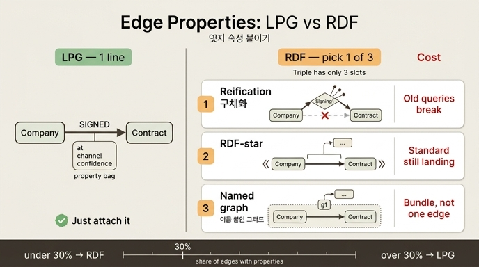

# 엣지에 속성을 달 때 — LPG는 한 줄, RDF는 선택

## 한 줄 정리

관계 자체에 대해 뭔가를 말하려 할 때(언제 맺어졌나, 어디서 왔나, 얼마나 믿을 만한가) LPG는 엣지의 속성 주머니에 그냥 넣으면 끝난다. RDF는 트리플이 `주어-술어-목적어` 세 자리뿐이라 **네 번째 자리가 없다**. 그래서 트리플을 다시 가리키는 우회로 세 가지 중 하나를 **골라야** 하고, 그 선택이 곧 대가다.

## 문제의 뿌리 — 자리 개수

| 모델 | 관계를 적는 단위 | 관계에 속성을 붙일 자리 |
|---|---|---|
| LPG (프로퍼티 그래프) | 엣지 = 타입 + 속성 주머니 | 있다. 주머니가 처음부터 달려 있다 |
| RDF | 트리플 = 3자리 | 없다. 3자리가 전부다 |

이 비대칭이 5.2절의 "세는 단위가 다르다"와 짝을 이룬다. LPG는 속성을 **주머니에 담고**, RDF는 속성마다 **한 줄로 편다**. 편면 손가락으로 가리킬 수 있어서 좋은데(트리플 하나에 출처를 달 수 있다), 관계에 붙는 속성에서는 반대로 불리해진다.

## LPG — 한 줄

```python
# model.py
LPG_EDGES = [
    {"from": "n1", "type": "SIGNED", "to": "n2",
     "props": {"at": "2025-06-02", "channel": "직접", "confidence": 0.98}},
]
```

Cypher로 쓰면 이게 전부다.

```cypher
CREATE (a)-[:SIGNED {at: date('2025-06-02'), channel: '직접', confidence: 0.98}]->(b)
```

부담: 없다시피 하다. 대신 **속성 하나를 가리킬 손잡이가 없다** — `confidence` 값 자체에 "이건 어느 모델이 매긴 점수"라고 메타를 또 달 방법이 없다. 그때는 LPG도 결국 관계를 노드로 승격해야 한다.

## RDF 방법 (1) 구체화(reification) — 관계를 노드로 승격

```python
RDF_REIFIED = [
    ("ex:Gaon",     "ex:hasSigning", "ex:Signing1"),
    ("ex:Signing1", "rdf:type",      "ex:Signing"),
    ("ex:Signing1", "ex:contract",   "ex:C2025118"),
    ("ex:Signing1", "ex:at",         '"2025-06-02"^^xsd:date'),
    ("ex:Signing1", "ex:channel",    '"직접"'),
    ("ex:Signing1", "ex:confidence", '"0.98"^^xsd:decimal'),
]
```

- 트리플 모양: 관계가 노드(`ex:Signing1`)가 되고, 원래의 주어/목적어가 그 노드에 매달린다.
- **대가**: 원래 있던 `ex:Gaon ex:signed ex:C2025118` 엣지가 **사라진다**. 즉 `?c ex:signed ?x`로 쓰던 기존 질의가 전부 깨진다. 홉이 1에서 2로 늘어나 질의도 길어진다.
- 표준 자체는 RDF 1.0 시절부터 있던 관용(`rdf:Statement` / `rdf:subject` / `rdf:predicate` / `rdf:object`)이지만, 실무에서는 위처럼 도메인 이름을 쓴 "n-ary relation" 패턴을 더 많이 쓴다.

원래 엣지를 살려 두려면 중복해서 같이 적는 방법도 있는데, 그러면 두 표현이 어긋날 위험을 떠안는다.

```turtle
ex:Gaon ex:signed ex:C2025118 .          # 살려 두면 질의는 안 깨지지만
ex:Gaon ex:hasSigning ex:Signing1 .      # 같은 사실이 두 곳에 존재한다
```

## RDF 방법 (2) RDF-star — 트리플 자체를 주어로

```turtle
ex:Gaon ex:signed ex:C2025118 .
<< ex:Gaon ex:signed ex:C2025118 >> ex:at         "2025-06-02"^^xsd:date .
<< ex:Gaon ex:signed ex:C2025118 >> ex:channel    "직접" .
<< ex:Gaon ex:signed ex:C2025118 >> ex:confidence "0.98"^^xsd:decimal .
```

- 트리플 모양: `<< ... >>`로 감싼 트리플이 그대로 주어가 된다. 표기가 가장 짧고 직관적이다.
- **장점**: 원래 엣지가 남아 있어서 **기존 질의가 안 깨진다**.
- **대가**: RDF 1.2(triple terms)로 표준화가 진행되는 중이고, 책 확인 시점 기준으로는 아직 후보 권고안 단계다. 엔진마다 지원 범위와 의미론(주장 여부, occurrence 대 statement)이 갈리므로 **엔진 종속**을 감수해야 한다. 질의도 SPARQL-star 지원이 있어야 쓸 수 있다.
- 1차 출처: [RDF 1.2 Concepts — triple terms](https://www.w3.org/TR/rdf12-concepts/)

## RDF 방법 (3) 이름 붙인 그래프(named graph)

```turtle
GRAPH ex:g1 { ex:Gaon ex:signed ex:C2025118 . }
ex:g1 ex:at      "2025-06-02"^^xsd:date .
ex:g1 ex:channel "직접" .
```

- 트리플 모양: 트리플 **묶음**에 이름을 주고, 그 이름에 속성을 단다. 트리플이 4번째 자리(그래프 이름)를 갖는 쿼드가 된다.
- **장점**: RDF 1.1 Datasets로 완전히 표준이고, 사실상 모든 트리플 스토어가 지원한다. 출처·수집 시각처럼 **묶음 단위 메타**에는 가장 자연스럽다.
- **대가**: 단위가 묶음이라, 엣지 **하나**만 가리키려면 그 엣지만 담은 1개짜리 그래프를 만들어야 한다. 엣지 수만큼 그래프 이름이 생기고, 이름 관리와 저장 비용이 따라온다. 게다가 그래프 이름을 이미 출처 구분에 쓰고 있으면 두 용도가 충돌한다.
- 1차 출처: [RDF 1.1 Datasets](https://www.w3.org/TR/rdf11-datasets/)

## 셋을 나란히

| 방법 | 원래 엣지 보존 | 표준 성숙도 | 가리키는 단위 | 주된 부담 |
|---|---|---|---|---|
| 구체화 | 안 됨(중복 적으면 됨) | 오래된 표준 | 관계 1개 | 기존 질의 깨짐, 홉 증가 |
| RDF-star | 됨 | RDF 1.2 진행 중 | 트리플 1개 | 엔진 종속, 의미론 미정착 |
| 이름 붙인 그래프 | 됨 | RDF 1.1 표준 | 트리플 묶음 | 1개짜리 그래프 남발, 이름 관리 |

## 실무 판단 기준

- 엣지 속성이 **드물게** 필요하면 RDF로 충분하다. 세 방법 중 하나를 고르면 된다.
- 엣지 속성이 **기본**이면 LPG가 편하다. 관계마다 시각·출처·신뢰도를 다는 경우다.
- 책의 기준: **관계의 30% 이상에 속성이 붙으면 LPG, 그 밑이면 RDF.**
- 그리고 5.5절의 조언: 표현력으로 고르지 말고 상황으로 고른다. 밖에서 오는 데이터를 합치는 일이 많으면 RDF, 우리가 만드는 데이터면 LPG. 고르기 전에 질의 다섯 개를 두 언어로 써 보는 반나절이 4개월을 아낀다.

## 함께 볼 예제

- `code/model.py` — `LPG_EDGES`, `RDF_REIFIED`, `RDF_STAR`, `RDF_NAMED_GRAPH`
- `code/ex2_edge_properties.py` — 세 방법의 줄 수와 대가를 나란히 출력

## 인포그래픽


