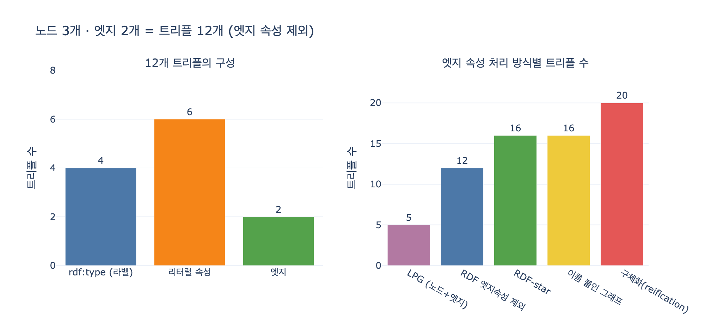

# 노드 3개 · 엣지 2개 → 트리플 12개

## 질문

노드 3개·엣지 2개인 LPG 데이터를 RDF로 옮기면 몇 트리플이 되는가?

## 답

**12개 트리플이 된다(엣지 속성은 제외).** 같은 사실이지만 세는 단위가 다르기 때문이다.

---

## 세는 규칙 세 줄

5장 `code/model.py`는 「같은 사실 여섯 개」를 LPG와 RDF 두 벌로 적어 둔다.
LPG를 RDF로 옮길 때 쓰는 변환 규칙은 딱 세 줄이다.

| LPG 쪽 | RDF 쪽 | 개수 |
|---|---|---|
| 노드 라벨 하나 | `rdf:type` 트리플 하나 | 라벨 수만큼 |
| 노드 속성 하나 | 리터럴을 목적어로 갖는 트리플 하나 | 속성 수만큼 |
| 엣지 하나 | 트리플 하나 (술어 = 엣지 타입) | 엣지 수만큼 |

노드 자체는 트리플을 만들지 않는다. **노드는 「주어」일 뿐**이고, 트리플이 되는 건
그 노드가 가진 라벨과 속성이다. 그래서 「노드 3개」에서 3이 아니라 10이 나온다.

## 원본 LPG 데이터

```python
LPG_NODES = {
    "n1": {"labels": ["Company"],            "props": {"name": "가온테크", "grade": "A"}},
    "n2": {"labels": ["Contract"],           "props": {"id": "C-2025-118", "amount": 5_000_000}},
    "n3": {"labels": ["Person", "Employee"], "props": {"name": "김하늘", "title": "부장"}},
}
LPG_EDGES = [
    {"from": "n1", "type": "SIGNED",     "to": "n2",
     "props": {"at": "2025-06-02", "channel": "직접", "confidence": 0.98}},
    {"from": "n1", "type": "MANAGED_BY", "to": "n3",
     "props": {"since": "2023-04-01"}},
]
```

여기서 눈여겨볼 것 하나. **`n3`은 라벨이 두 개**(`Person`, `Employee`)다.
이것 때문에 `rdf:type`이 노드 수(3)가 아니라 4개가 된다.

## 12개 트리플 전체 나열

`model.py`의 `RDF_TRIPLES`가 바로 이 12줄이다.

| # | 주어 | 술어 | 목적어 | 유래 |
|---:|---|---|---|---|
| 1 | `ex:Gaon` | `rdf:type` | `ex:Company` | n1 라벨 |
| 2 | `ex:Gaon` | `ex:name` | `"가온테크"` | n1 속성 |
| 3 | `ex:Gaon` | `ex:grade` | `"A"` | n1 속성 |
| 4 | `ex:C2025118` | `rdf:type` | `ex:Contract` | n2 라벨 |
| 5 | `ex:C2025118` | `ex:id` | `"C-2025-118"` | n2 속성 |
| 6 | `ex:C2025118` | `ex:amount` | `"5000000"^^xsd:integer` | n2 속성 |
| 7 | `ex:Kim` | `rdf:type` | `ex:Person` | n3 라벨 ① |
| 8 | `ex:Kim` | `rdf:type` | `ex:Employee` | n3 라벨 ② |
| 9 | `ex:Kim` | `ex:name` | `"김하늘"` | n3 속성 |
| 10 | `ex:Kim` | `ex:title` | `"부장"` | n3 속성 |
| 11 | `ex:Gaon` | `ex:signed` | `ex:C2025118` | 엣지 SIGNED |
| 12 | `ex:Gaon` | `ex:managedBy` | `ex:Kim` | 엣지 MANAGED_BY |

## 항목별 개수의 합

| 항목 | 계산 | 개수 |
|---|---|---:|
| `rdf:type` (라벨 → 타입) | Company 1 + Contract 1 + Person 1 + Employee 1 | **4** |
| 리터럴 속성 (노드 속성) | (name, grade) 2 + (id, amount) 2 + (name, title) 2 | **6** |
| 엣지 | `ex:signed` 1 + `ex:managedBy` 1 | **2** |
| | 합계 | **12** |

즉 `4 + 6 + 2 = 12`.

일반식으로 쓰면, 노드 $i$가 라벨 $L_i$개·속성 $P_i$개를 갖고 엣지가 $E$개일 때

$$T = \sum_{i=1}^{n}\bigl(|L_i| + |P_i|\bigr) + |E|
    = (1{+}2) + (1{+}2) + (2{+}2) + 2 = 12$$

## 왜 「세는 단위가 다르다」인가

- LPG로 세면 **5개**(노드 3 + 엣지 2). 속성은 노드/엣지 안의 주머니에 들어 있어
  세는 대상이 아니다.
- RDF로 세면 **12개**. 속성마다 한 줄로 펴져 각각이 독립된 문장이 된다.

데이터가 늘어난 게 아니다. **같은 사실을 다른 자로 재는 것**이다. `ex1_two_models.py`의
마지막 출력이 이 점을 짚는다.

> 같은 사실인데 «단위»가 다르다.
> LPG 는 속성을 주머니에 담아 노드 하나로 세고, RDF 는 속성마다 한 줄이다.

그럼 실무 차이는 어디서 생기나. 새 속성 추가는 양쪽 다 한 줄/한 키로 쉽다.
차이는 **「속성 하나를 손가락으로 가리킬 수 있는가」**에서 난다.
RDF는 「가온테크의 grade가 A다」라는 트리플 하나를 지목해 거기에 출처·시점·신뢰도를
달 수 있다. LPG는 그 속성이 노드 주머니 안에 있어서 잡을 손잡이가 없다.

## 「엣지 속성은 제외」라는 조건이 붙는 이유

위 12개에는 엣지 속성 4개(`at`, `channel`, `confidence`, `since`)가 빠져 있다.
LPG는 엣지 속성도 주머니에 그냥 넣어서 엣지 수가 2개로 유지되지만, RDF에는
엣지 속성을 적을 자리가 없어서 `ex2_edge_properties.py`가 보여 주는 세 방법 중 하나를
골라야 한다. 그리고 방법마다 트리플 수가 다르게 늘어난다.

| 방식 | 트리플 수 | 특징 |
|---|---:|---|
| LPG (노드 + 엣지) | 5 | 엣지 속성을 붙여도 그대로 5 |
| RDF, 엣지 속성 제외 | **12** | 이 카드의 기준 |
| RDF-star (`<< >>`) | 16 | 원래 엣지 트리플이 남아 기존 질의가 안 깨짐 |
| 이름 붙인 그래프 | 16 (+ 그래프 3개) | 트리플 «묶음» 단위라 엣지 하나만 가리키려면 묶음도 하나짜리로 |
| 구체화(reification) | 20 | 관계를 노드로 승격 → 원래 `ex:signed` 엣지가 **사라진다** |

계산 근거:

- **RDF-star**: 원래 엣지 트리플을 그대로 두고 속성마다 한 줄. $12 + 4 = 16$
- **이름 붙인 그래프**: 엣지 트리플을 named graph로 감싸고 그래프 이름에 속성을 단다.
  문장 수는 $12 + 4 = 16$이지만 그래프가 default + 엣지 2개 = 3개로 늘어난다.
- **구체화**: 엣지마다 `엣지 트리플 1개 삭제` → `hasX 1 + rdf:type 1 + target 1 + 속성 수`.
  SIGNED는 $-1 + 3 + 3 = +5$, MANAGED_BY는 $-1 + 3 + 1 = +3$. $12 + 5 + 3 = 20$

`model.py`의 `RDF_REIFIED`가 SIGNED 쪽 6줄에 해당한다. 기존 `ex:signed` 엣지가
없어지는 것이 구체화의 진짜 비용이고, 이게 「관계의 30% 이상에 속성이 붙으면 LPG」라는
5장의 기준이 나온 배경이다.

## 외우는 법

- 노드 수는 트리플 수에 직접 안 들어간다. **라벨 + 속성 + 엣지**만 센다.
- 이 예제는 `4 + 6 + 2`. 라벨 4개인 이유는 `김하늘`이 `Person`이면서 `Employee`라서.
- 「12개」는 데이터가 2배 넘게 불었다는 뜻이 아니라 자를 바꿨다는 뜻이다.

## 시각화



왼쪽은 12개의 구성(`rdf:type` 4 + 리터럴 속성 6 + 엣지 2), 오른쪽은 엣지 속성 처리
방식별 트리플 수(LPG 5 / RDF 12 / RDF-star 16 / 이름 붙인 그래프 16 / 구체화 20).
`expy.py`를 실행하면 재생성된다.
