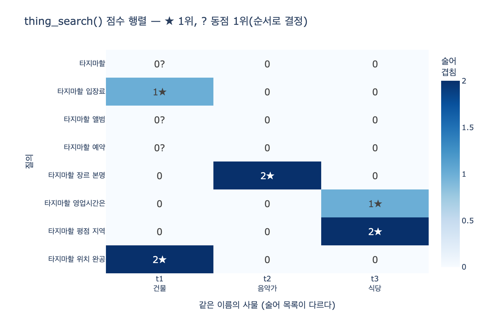

# `thing_search()`는 어떤 방식으로 사물을 판별하는가

> **답**: 질문에 사물 이름이 있는 후보만 남기고, 질문의 낱말이 그 사물의 속성 키(술어)와 겹치는 개수로 점수를 매겨 정렬한다.

근거 코드는 5장 `code/ex4_things_not_strings.py`다. 함수 본문이 열 줄도 안 되지만,
2012년 구글의 「things, not strings」 선언이 실제로 무슨 뜻이었는지가 이 열 줄에 다 들어 있다.

---

## 1. 재료 — 이름이 같고 술어가 다른 세 사물

```python
# 같은 이름을 가진 서로 다른 사물 셋. 각자 다른 술어를 갖는다.
THINGS = {
    "t1": {"name": "타지마할", "type": "건물", "props": {
        "위치": "인도 아그라", "완공": "1653", "입장료": "1,100루피"}},
    "t2": {"name": "타지마할", "type": "음악가", "props": {
        "장르": "블루스", "활동시작": "1968", "본명": "헨리 세인트클레어 프레드릭스"}},
    "t3": {"name": "타지마할", "type": "식당", "props": {
        "지역": "서울 이태원", "영업시간": "11:00-22:00", "평점": "4.2"}},
}
```

세 사물의 `name`은 **전부 똑같다**. 다른 것은 `props`의 키 목록뿐이다.

| id | type | 술어(속성 키) 목록 |
|---|---|---|
| `t1` | 건물 | 위치, 완공, 입장료 |
| `t2` | 음악가 | 장르, 활동시작, 본명 |
| `t3` | 식당 | 지역, 영업시간, 평점 |

이름으로는 셋을 구분할 수 없다. **술어 목록으로는 구분된다.** 이게 판별의 전제다.

## 2. 비교군 — 문자열 검색은 무엇을 하나

```python
def string_search(q):
    return [d for d in DOCS if all(w in d for w in q.split())]
```

질문의 모든 낱말이 문서 문자열 안에 있는지만 본다. `"타지마할"`로 물으면 네 문서가 전부 나온다.

```
- 타지마할은 인도 아그라에 있는 무굴 제국의 묘당이다.   ← 건물
- 타지마할의 앨범은 블루스와 카리브 음악을 섞었다.       ← 음악가
- 이태원 타지마할은 저녁 예약이 어렵다.                ← 식당
- 타지마할 입장료가 올해 인상되었다.                   ← 건물
```

건물·음악가·식당이 **한 목록에 섞여** 나온다. 어느 사물 이야기인지 고르는 일은 사람 몫이다.
검색기는 애초에 "사물"이라는 개념을 갖고 있지 않다.

## 3. `thing_search()` 전문 — 두 단계

```python
def thing_search(q):
    """질문에 나온 낱말이 어느 사물의 «술어»와 겹치는지 본다."""
    words = q.split()
    scored = []
    for tid, t in THINGS.items():
        if t["name"] not in q:                  # ← (1단계) 이름 필터
            continue
        hit = sum(1 for w in words              # ← (2단계) 술어 겹침 점수
                  for k in t["props"]
                  if k in w or w in k)
        scored.append((hit, tid, t))
    scored.sort(reverse=True, key=lambda x: x[0])   # ← (3) 점수 내림차순 정렬
    return scored
```

### 1단계: 이름 필터 — 후보 집합 만들기

```python
if t["name"] not in q:
    continue
```

질문 문자열 `q` 안에 사물의 `name`이 부분 문자열로 들어 있지 않으면 **아예 후보에서 빼 버린다.**
`"타지마할 입장료"`에는 세 사물의 이름이 모두 들어 있으니 셋 다 통과한다.

이 단계는 점수를 매기지 않는다. **"무엇에 대한 질문인가"의 범위만 정한다.**
비교 대상이 `q.split()`이 아니라 원본 문자열 `q`라는 점에 주의 — 그래서 "타지마할은",
"타지마할의"처럼 조사가 붙어도 통과하고, "타지마할역"(지하철역)까지 통과한다.

### 2단계: 술어 겹침 점수 — 후보 안에서 고르기

```python
hit = sum(1 for w in words for k in t["props"] if k in w or w in k)
```

질문 낱말 `w`와 그 사물의 속성 키(술어) `k`를 **모든 조합으로** 비교해서,
한쪽이 다른 쪽의 부분 문자열이면 1점을 더한다. `props`의 **값(value)은 전혀 보지 않는다.**
오직 **키**만 본다.

- `k in w` — 술어가 낱말 안에: `"영업시간"`이 `"영업시간은"` 안에 있다 (조사 흡수)
- `w in k` — 낱말이 술어 안에: `"시작"`이 `"활동시작"` 안에 있다 (부분 낱말 흡수)

### 3단계: 정렬

```python
scored.sort(reverse=True, key=lambda x: x[0])
```

점수 내림차순. `list.sort`는 **안정 정렬**이고 `reverse=True`도 동점 순서를 뒤집지 않으므로,
동점이면 `THINGS`의 **딕셔너리 삽입 순서**가 그대로 남는다. 뒤에서 다시 본다.

## 4. 수식으로

질문 낱말 집합을 $Q = \{w_1, \dots, w_n\}$, 사물 $t$의 술어 집합을 $P_t$라 하자.
이 방식이 노리는 이상적인 점수는 교집합의 크기다.

$$\mathrm{score}_{\text{ideal}}(t) = |Q \cap P_t|$$

코드가 실제로 세는 것은 부분 문자열 관계($w \sqsubseteq k$: $w$가 $k$의 부분 문자열)를
만족하는 **쌍의 개수**다.

$$\mathrm{score}(t) = \bigl|\{(w,k) \in Q \times P_t \;\mid\; k \sqsubseteq w \;\lor\; w \sqsubseteq k\}\bigr|$$

정확히 같을 때만 세는 $|Q \cap P_t|$ 와 달리 이 쪽은 한 낱말이 여러 술어에 걸리면 중복으로
세어지므로 항상 $\mathrm{score}(t) \ge |Q \cap P_t|$ 다. 조사·활용을 흡수하는 관용성과
뒤에서 볼 오탐이 **같은 뿌리**에서 나온다.

최종 결과는

$$\mathrm{answer}(q) = \arg\max_{t \,\in\, \{t \,:\, \mathrm{name}(t) \sqsubseteq q\}} \mathrm{score}(t)$$

이고, $\arg\max$가 여러 개일 때 무엇을 고를지에 대한 규정이 코드에 **없다**.

## 5. 손으로 계산 — 질의별 점수표

### 질의 A: `"타지마할 입장료"` → `words = ["타지마할", "입장료"]`

| 사물 | 이름 필터 | 검사한 (낱말, 술어) 쌍 | 겹친 쌍 | 점수 |
|---|---|---|---|---|
| t1 건물 | 통과 | (타지마할, 위치/완공/입장료), (입장료, 위치/완공/입장료) | **(입장료, 입장료)** | **1** |
| t2 음악가 | 통과 | (타지마할·입장료) × (장르/활동시작/본명) | 없음 | 0 |
| t3 식당 | 통과 | (타지마할·입장료) × (지역/영업시간/평점) | 없음 | 0 |

정렬 → `[(1, t1, 건물), (0, t2, 음악가), (0, t3, 식당)]` → **확정: 건물**

"입장료"라는 술어를 가진 사물이 셋 중 **하나뿐**이라 답이 단번에 정해진다.

### 질의 B: `"타지마할 앨범"`

| 사물 | 점수 | 겹친 쌍 |
|---|---|---|
| t1 건물 | 0 | 없음 |
| t2 음악가 | 0 | 없음 ("앨범"은 술어가 아니다) |
| t3 식당 | 0 | 없음 |

전원 0점 → 동점 → 삽입 순서로 **t1(건물)이 1위**. **틀렸다.** 앨범은 음악가 이야기다.
같은 질의를 문자열 검색에 넣으면 `"타지마할의 앨범은 블루스와..."`를 정확히 찾아낸다.
여기서는 문자열 검색이 이긴다.

### 질의 C: `"타지마할 예약"`

| 사물 | 점수 |
|---|---|
| t1 건물 | 0 |
| t2 음악가 | 0 |
| t3 식당 | 0 |

역시 전원 0점 → **t1(건물) 오답**. "예약"은 식당의 술어 목록에 없다("영업시간"만 있다).

### 질의 D: 그냥 `"타지마할"` → `words = ["타지마할"]`

| 사물 | 점수 |
|---|---|
| t1 건물 | 0 |
| t2 음악가 | 0 |
| t3 식당 | 0 |

술어 힌트가 아예 없으니 판별 불가. 그런데 코드는 침묵하지 않고 **t1을 1위로 내놓는다.**
"모르겠다"를 표현할 방법이 없다.

### 종합

| 질의 | t1 건물 | t2 음악가 | t3 식당 | `thing_search` 확정 | 맞나 | 문자열검색 |
|---|---|---|---|---|---|---|
| `타지마할` | 0 | 0 | 0 | 건물 (동점) | 판별 불가 | 4건 |
| `타지마할 입장료` | **1** | 0 | 0 | 건물 | 맞음 | 1건 |
| `타지마할 앨범` | 0 | 0 | 0 | 건물 (동점) | **틀림** | 1건 |
| `타지마할 예약` | 0 | 0 | 0 | 건물 (동점) | **틀림** | 1건 |
| `타지마할 장르 본명` | 0 | **2** | 0 | 음악가 | 맞음 | 0건 |
| `타지마할 영업시간은` | 0 | 0 | **1** | 식당 | 맞음 | 0건 |
| `타지마할 평점 지역` | 0 | 0 | **2** | 식당 | 맞음 | 0건 |
| `타지마할 위치 완공` | **2** | 0 | 0 | 건물 | 맞음 | 0건 |

마지막 네 줄을 보라. 문자열 검색은 0건인데(그런 문서가 없으니) `thing_search()`는 답을 낸다.
**문서를 안 보고 사물의 구조만 봐서** 판별했기 때문이다.

## 6. 문자열 검색과 근본적으로 다른 지점

| | 문자열 검색 | `thing_search()` |
|---|---|---|
| 세는 단위 | 문서 | **사물** |
| 판단 근거 | 낱말이 문서 텍스트에 있나 | 낱말이 **술어 키**와 겹치나 |
| 참조 대상 | 문서 본문(값의 세계) | 속성 키 목록(스키마의 세계) |
| 결과 | 건물·음악가·식당이 섞인 목록 | 후보 중 **하나로 확정** |
| 애매함 해소 | 사람이 목록에서 고른다 | 술어 목록이 대신 한다 |
| 문서가 없으면 | 0건 | 그래도 답이 나온다 |

핵심은 이 문장이다. **술어 목록이 곧 그 사물의 정체다.**

- 건물은 "입장료·위치·완공"을 가진 것이고
- 음악가는 "장르·활동시작·본명"을 가진 것이고
- 식당은 "지역·영업시간·평점"을 가진 것이다.

그래서 질문이 어떤 술어를 요구하는지 보면 **어떤 사물인지 역추적할 수 있다.**
문자열에는 이런 손잡이가 없다. 문자열은 그냥 문자열이고, "타지마할"이라는 다섯 글자에는
자기가 건물인지 음악가인지 적혀 있지 않다.

2012년 선언의 핵심이 "**더 많이 저장하자**"가 아니라
"**사물마다 다른 술어를 갖게 하자**"였다는 게 이 뜻이다.
이 발상은 4부의 도구 라우팅으로 돌아온다. 에이전트가 어떤 도구를 부를지 고르는 일도
결국 "이 도구가 어떤 술어(파라미터·능력)를 가졌나"를 보는 일이다.

## 7. 한계 — 이 구현은 어디서 무너지나

### (a) 이름 필터가 정확한 부분 문자열 일치다

`t["name"] not in q`는 오직 문자 단위 일치만 본다.

```
'타즈마할 입장료'      → 후보 0개 []        (오타 하나에 전멸)
'Taj Mahal 입장료'    → 후보 0개 []        (다른 표기)
'타지마할역 근처 입장료' → 후보 3개 (전원 통과) (과탐)
'타지마할 입장료'      → 후보 3개
```

- **별칭·동의어·다국어 표기를 모른다.** "Taj Mahal", "타지 마할"(공백), "타즈마할"이 전부 실패.
- **결과가 빈 리스트가 된다.** `ex4`의 `main()`은 `thing_search(q)[0]`을 바로 쓰므로 `IndexError`.
- 반대로 이름을 부분 문자열로 포함하기만 하면 통과하므로 "타지마할역"(지하철역) 같은
  전혀 다른 대상도 세 후보를 다 통과시킨다. **엄격한 동시에 허술하다.**

### (b) 이름 필터가 없으면 점수만으로는 판별이 안 된다

"경복궁"을 후보 풀에 넣고 이름 필터를 지우면:

```
이름 필터 있음: [(1, t1, 타지마할, 건물), (0, t2, 음악가), (0, t3, 식당)]
이름 필터 없음: [(1, t1, 타지마할, 건물), (1, x1, 경복궁, 건물), (0, t2, ...), (0, t3, ...)]
```

경복궁도 "입장료" 술어를 가졌으니 **동점 1위로 올라온다.** 두 단계의 역할이 다르다는 증거다.
이름 필터가 후보 집합을 만들고, 점수는 그 안에서 **누가 그 후보인가**만 가린다.
점수 단계는 "무엇에 대한 질문인가"를 알아내는 능력이 없다.

### (c) 부분 문자열 매칭이 만드는 오탐 / 중복 계산

```
'타지마할 시'         → t2 음악가 1점 (시 ⊑ 활동시작), t3 식당 1점 (시 ⊑ 영업시간) → 동점
'타지마할 장'         → t1 건물 1점 (장 ⊑ 입장료), t2 음악가 1점 (장 ⊑ 장르)       → 동점
'타지마할 지역영업시간' → t3 식당 2점 — 낱말은 하나인데 술어 두 개에 각각 걸렸다
```

마지막 줄이 $\mathrm{score}(t_3)=2 > |Q \cap P_{t_3}|=0$ 인 경우다. 정답 사물을 골랐지만
"술어 두 개를 맞혔다"는 근거는 허수다. 한 글자짜리 낱말은 아무 술어에나 걸릴 수 있다.

### (d) 정규화가 전혀 없다

- 대소문자·공백·유니코드 정규화 없음
- 형태소 분석·어간 추출 없음 — "영업시간은"이 통하는 건 우연히 술어가 접두사여서다.
  "영업 시간"(공백), "몇 시에 문 닫나"는 통하지 않는다
- 어휘 확장 없음 — "앨범"↔"장르", "예약"↔"영업시간", "티켓값"↔"입장료"가 이어지지 않는다

### (e) 동점 처리와 임계값이 없다

- 0점 동점이면 **`THINGS`의 딕셔너리 삽입 순서**로 승자가 정해진다.
  키 순서를 뒤집으면 승자가 건물 → 식당으로 바뀐다. 실력이 아니라 선언 순서다.
- 점수 임계값이 없어서 **"판별 불가"를 표현할 수 없다.** 0점이어도 1위가 나온다.
- 점수가 정규화되지 않아(술어 개수가 많은 사물이 유리) **신뢰도로 해석할 수 없다.**

### (f) 술어를 미리 다 알고 있어야 한다

"앨범"은 음악가의 술어가 아니었다. 실제 지식 그래프에서 t2에 `앨범` 술어를 넣어 두면 맞혔을 것이다.
즉 이 방식의 정확도는 **스키마를 얼마나 촘촘히 채웠는지**에 전적으로 달려 있다.
술어 목록이 정체라는 말은, 정체를 결정하는 책임이 데이터 설계자에게 있다는 말이기도 하다.

## 8. 실제 엔티티 링킹은 이 자리에 무엇을 넣나

`thing_search()`의 골격 — **후보 생성(candidate generation) → 후보 순위화(ranking)** — 은
실무 엔티티 링킹과 정확히 같다. 각 단계의 내용물만 바뀐다.

| 단계 | `thing_search()` | 실무 |
|---|---|---|
| 후보 생성 | `name in q` 부분 문자열 | **별칭/표기 사전**(위키 리다이렉트·앵커 텍스트), n-gram 인덱스, 퍼지 매칭(편집 거리), 멘션 탐지(NER) |
| 후보 순위화 | 술어 키 부분 문자열 겹침 개수 | **임베딩 유사도**(질의 문장 ↔ 엔티티 임베딩), **문맥**(앞뒤 문장, 문서 주제, 사용자 위치·이력), **인기도 사전확률** $P(t \mid \text{mention})$, 같은 문서 내 엔티티들의 **집합적 일관성**(coherence), 학습된 재순위화 모델 |
| 결정 | `[0]` 무조건 채택 | 신뢰도 임계값, **NIL 예측**("해당 엔티티 없음"), 동점 시 보류 후 사람 확인 |

그래도 뼈대는 남는다. 후보를 좁히고, 그 사물이 가진 것과 질문이 요구하는 것이 얼마나 맞는지 재는 것.
`ex4`는 그 뼈대를 의존성 없는 열 줄로 보여 주려고 일부러 가장 거친 매칭을 골랐다.

## 시각화

질의 × 사물 점수 행렬. ★는 1위, `?`는 동점 1위(삽입 순서로 결정된 것)를 뜻한다.
`0?`이 찍힌 세 줄이 이 방식이 판별에 실패한 지점이다.



## 실행

```bash
python3 expy.py     # 필요 패키지: plotly, kaleido (로직 자체는 의존성 없음)
```

`expy.py`는 위 표를 전부 손으로 재현하는 `trace()` 함수와, 이름 필터 제거·동점·부분 문자열
오탐 실험 셀을 담고 있다. 각 셀 아래에 실제 실행 출력이 `# 출력:` 주석으로 붙어 있다.
