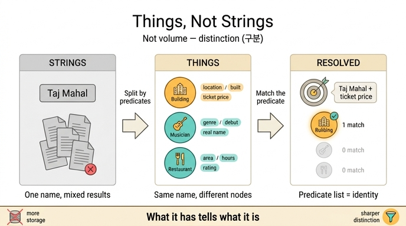

# 「문자열이 아니라 사물」의 핵심은 무엇인가?

> **답**: 저장량이 아니라 **구분**이다. 같은 이름 뒤에 다른 노드가 있고 노드마다 다른 술어를 가지며, 술어 목록이 곧 그 사물의 정체다.

---

## 1. 흔한 오해부터 걷어내기

2012년 구글이 지식 그래프를 발표하며 내놓은 표어가 [things, not strings](https://blog.google/products/search/introducing-knowledge-graph-things-not/)입니다. 발표문에 「5억 개의 사물, 35억 개의 사실」 같은 숫자가 함께 나왔기 때문에, 이 선언이 **「데이터를 더 많이 모으자」**는 규모 선언으로 읽히기 쉽습니다.

그게 아닙니다. 핵심은 **저장량이 아니라 구분**입니다.

| 오해 | 실제 |
|---|---|
| 더 많이 저장하자 | 사물마다 **다른 술어**를 갖게 하자 |
| 문서를 더 많이 색인하자 | 이름 뒤의 **어느 사물인지 먼저 정하자** |
| 검색 품질 개선 기법 | 데이터를 **어떤 단위로 세는가**의 변경 |

5장 요약이 그대로 이 말을 합니다. "「문자열이 아니라 사물」의 핵심은 저장량이 아니라 구분입니다. 같은 이름 뒤에 다른 노드가 있고, 노드마다 다른 술어를 갖습니다. 술어 목록이 곧 그 사물의 정체예요."

## 2. 세 문장으로 쪼갠 답

답은 세 계단으로 되어 있고, 순서가 있습니다.

1. **같은 이름 뒤에 다른 노드가 있다** — 「타지마할」이라는 문자열 하나에 건물·음악가·식당이 매달려 있습니다. 문자열은 하나지만 사물은 셋입니다. 문자열 세계에서는 이 셋이 구분되지 않고, 그래프 세계에서는 서로 다른 노드 세 개입니다.
2. **노드마다 다른 술어를 갖는다** — 건물에는 `위치`, `완공`, `입장료`가 있고, 음악가에는 `장르`, `활동시작`, `본명`이 있고, 식당에는 `지역`, `영업시간`, `평점`이 있습니다. 술어(predicate, 곧 속성 키·관계 이름)의 **구성이 다릅니다**.
3. **술어 목록이 곧 그 사물의 정체다** — 그래서 질문에 나온 낱말을 술어 목록에 맞춰 보기만 하면 어느 사물인지 정해집니다. 정체를 따로 선언할 필요 없이, **어떤 술어를 가졌는가가 그 사물이 무엇인지를 말해 줍니다.**

## 3. 예제로 보는 결정 순간 (`ex4_things_not_strings.py`)

같은 이름을 가진 서로 다른 사물 셋이 이렇게 놓여 있습니다.

```python
THINGS = {
    "t1": {"name": "타지마할", "type": "건물",   "props": {"위치": ..., "완공": ..., "입장료": ...}},
    "t2": {"name": "타지마할", "type": "음악가", "props": {"장르": ..., "활동시작": ..., "본명": ...}},
    "t3": {"name": "타지마할", "type": "식당",   "props": {"지역": ..., "영업시간": ..., "평점": ...}},
}
```

질문은 **"타지마할 입장료"** 하나입니다. 두 방식의 결과가 갈립니다.

### 문자열 검색 — 겹치는 문서를 준다

```python
def string_search(q):
    return [d for d in DOCS if all(w in d for w in q.split())]
```

「타지마할」이 들어간 문서를 전부 돌려줍니다. 무굴 제국 묘당 이야기, 블루스 앨범 이야기, 이태원 예약 이야기가 **한 목록에 섞입니다.** 어느 것이 내가 찾던 타지마할인지 고르는 일은 사람 몫으로 남습니다. 문자열에는 그걸 구분할 **손잡이가 없기** 때문입니다.

### 사물 검색 — 어느 사물인지부터 정한다

```python
def thing_search(q):
    """질문에 나온 낱말이 어느 사물의 «술어»와 겹치는지 본다."""
    words = q.split()
    scored = []
    for tid, t in THINGS.items():
        if t["name"] not in q:
            continue
        hit = sum(1 for w in words for k in t["props"] if k in w or w in k)
        scored.append((hit, tid, t))
    scored.sort(reverse=True, key=lambda x: x[0])
    return scored
```

여기서 실제로 하는 일은 딱 하나입니다. **질문의 낱말이 어느 사물의 술어와 겹치는지 세는 것.**

| 후보 | 타입 | 술어 목록 | 「입장료」와 겹침 |
|---|---|---|---|
| t1 | 건물 | 위치, 완공, **입장료** | 1 ★ |
| t2 | 음악가 | 장르, 활동시작, 본명 | 0 |
| t3 | 식당 | 지역, 영업시간, 평점 | 0 |

「입장료」라는 낱말을 **술어로 가진 사물이 하나뿐**이라 답이 정해집니다. 확정된 사물은 건물이고, 그 뒤에 붙은 사실들(`위치: 인도 아그라`, `완공: 1653`, `입장료: 1,100루피`)이 바로 답으로 나갈 내용입니다.

주목할 점: 여기서 **저장량이 늘어난 게 아닙니다.** 문서 네 개, 사물 세 개로 규모는 그대로인데, 같은 규모를 **구분 가능한 단위로 쪼개 놓았기** 때문에 답이 정해졌습니다. 이게 "저장량이 아니라 구분"의 뜻입니다.

## 4. 왜 「술어」인가 — 문자열에 없는 손잡이

문자열은 단일 덩어리입니다. "타지마할 입장료가 올해 인상되었다"라는 문장 안에 「입장료」가 들어 있어도, 그건 그냥 이어진 글자들일 뿐 **가리킬 수 있는 항목이 아닙니다.**

그래프에서는 `입장료`가 하나의 술어, 즉 이름이 붙은 손잡이입니다. 손잡이가 있으면:

- **찾을 수 있습니다** — "입장료라는 술어를 가진 노드" 질의가 가능합니다.
- **구분할 수 있습니다** — 그 술어를 가진 노드와 안 가진 노드가 갈립니다.
- **더 붙일 수 있습니다** — 그 술어에 출처·신뢰도·시각을 매달 수 있습니다.

5장의 다른 절이 이 마지막 항목을 파고듭니다. LPG는 속성을 주머니(property bag)에 담아 노드 하나로 세고, RDF는 속성마다 트리플 한 줄로 펴 놓습니다. `ex1_two_models.py`가 짚는 진짜 차이는 여기입니다.

> "속성 하나에 출처를 달 때: RDF 는 그 트리플을 가리키면 된다. LPG 는 속성이 주머니 안에 있어서 가리킬 손잡이가 없다. 이게 진짜 차이다."

즉 **「가리킬 손잡이가 있는가」**라는 같은 질문이 두 층위에서 반복됩니다.

| 층위 | 질문 | 손잡이 없는 쪽 | 손잡이 있는 쪽 |
|---|---|---|---|
| 문자열 vs 사물 (§5.1) | 같은 이름의 어느 사물인가 | 문자열 검색 | 노드 + 술어 목록 |
| LPG vs RDF (§5.2) | 속성 하나를 가리킬 수 있는가 | 속성 주머니 | 트리플 한 줄 |

## 5. 이 생각이 다시 돌아오는 곳

예제 4의 마지막 문단이 4부를 예고합니다.

> "술어 목록이 곧 그 사물의 정체다. 이 생각은 4부에서 도구 라우팅으로 돌아온다. 에이전트가 어떤 도구를 부를지 고르는 일도 «어떤 술어를 가졌나»를 보는 일이다."

에이전트가 도구를 고르는 문제도 구조가 같습니다. 도구 이름(문자열)만 보면 `search`가 여러 개일 때 무엇을 부를지 모릅니다. 도구가 **어떤 파라미터·어떤 능력(술어)을 가졌는가**를 보면 정해집니다. 「타지마할 + 입장료」로 건물을 골라낸 것과 정확히 같은 판정입니다.

## 6. 한 줄로 외울 것

- **저장량 ✗ / 구분 ✓** — 더 많이가 아니라 갈라 놓기
- **같은 이름 → 다른 노드** — 문자열은 하나, 사물은 여럿
- **노드 → 다른 술어** — 구분의 근거는 술어 구성
- **술어 목록 = 정체** — 무엇을 가졌는지가 무엇인지를 말한다

## 7. 헷갈리기 쉬운 지점

| 질문 | 답 |
|---|---|
| 「술어」는 RDF 용어인가? | RDF 트리플의 두 번째 항이 술어(predicate)지만, 여기서는 LPG의 속성 키·관계 타입까지 포함하는 넓은 뜻입니다. 이름이 붙어 가리킬 수 있는 항목이면 술어입니다. |
| 타입 라벨(건물/음악가/식당)이 정체 아닌가? | 라벨은 결과이고, 근거는 술어 구성입니다. 예제 4는 라벨을 보지 않고 **술어 겹침만 세서** 사물을 확정하고, 그 뒤에 타입을 출력합니다. |
| 데이터가 많아야 구분이 되는 거 아닌가? | 예제 4는 사물 셋, 문서 넷뿐인데도 구분이 됩니다. 필요한 건 양이 아니라 **술어가 서로 다르게 붙어 있는 구조**입니다. |
| 문자열 검색은 필요 없다는 뜻인가? | 아닙니다. 문자열 검색은 후보를 넓게 주는 일을 잘합니다. 선언의 요지는 그 뒤에 **어느 사물인지 정하는 단계를 두자**는 것입니다. |

## 인포그래픽


