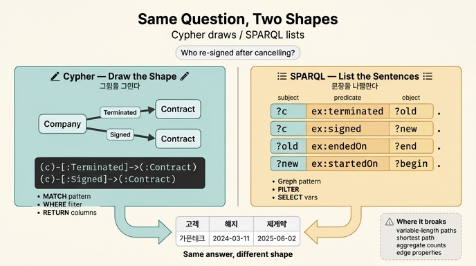

# Cypher와 SPARQL의 문장 모양은 어떻게 다른가?

> Cypher는 `(c)-[:Signed]->(:Contract)`처럼 **그림을 그리고**, SPARQL은 `?c ex:signed ?new .`처럼 **문장을 나열한다**. 답은 같다.

5장 5.4절 「같은 질문, 두 언어」와 예제 `code/ex3_cypher_vs_sparql.py`가 이 카드의 근거입니다. 같은 질문을 두 언어로 써 놓고 나란히 보는 것이 요점이고, 이 문서는 그 나란히 놓기를 **절 단위로 쪼개서** 대응시킨 다음, 「모양만 다르고 답은 같다」가 **어디까지 사실이고 어디서 깨지는지**를 정리합니다.

---

## 1. 같은 질문 하나

예제가 던지는 질문은 이것 하나입니다.

> **해지했다가 그 뒤에 다시 계약한 고객은?**

데이터는 회사 3개, 계약 4개입니다.

| 회사 | 해지한 계약 | 새로 맺은 계약 | 답에 드는가 |
|---|---|---|---|
| 가온테크 | M-2021-077 (2024-03-11 종료) | C-2025-118 (2025-06-02 시작) | **○** 해지 후 재계약 |
| 나루소프트 | — | C-2025-004 (2025-01-20 시작) | ✕ 해지 이력 없음 |
| 라온에너지 | M-2020-031 (2024-08-05 종료) | — | ✕ 재계약 없음 |

두 언어 모두 **가온테크 한 줄**을 돌려줍니다.

### Cypher (예제는 임베디드 엔진 Kuzu 0.11.3에서 실행)

```cypher
MATCH (c:Company)-[t:Terminated]->(:Contract),
      (c)-[s:Signed]->(:Contract)
WHERE t.at < s.at
RETURN c.name AS 고객, t.at AS 해지, s.at AS 재계약
```

### SPARQL (예제는 rdflib 7.5.0에서 실행)

```sparql
PREFIX ex: <http://example.org/>
SELECT ?고객 ?해지 ?재계약 WHERE {
    ?c ex:name ?고객 ;
       ex:terminated ?old ;
       ex:signed     ?new .
    ?old ex:endedOn   ?해지 .
    ?new ex:startedOn ?재계약 .
    FILTER(?해지 < ?재계약)
}
```

**첫인상이 곧 핵심입니다.** Cypher 쪽은 화살표가 있어서 눈으로 그래프가 보입니다. `(c)-[t:Terminated]->(:Contract)`는 화이트보드에 그리던 동그라미와 화살표를 그대로 키보드로 옮긴 것(ASCII art 패턴)입니다. SPARQL 쪽에는 화살표가 없습니다. 대신 「주어 술어 목적어 .」로 끝나는 짧은 **문장**이 줄줄이 놓입니다. 같은 그래프를 한쪽은 **그려서**, 한쪽은 **불러서** 지정합니다.

---

## 2. 절 단위 대응표

두 언어를 문법 표로 외우는 것보다, **같은 일을 하는 절끼리 짝지어 두는 것**이 실무에서 훨씬 빨리 붙습니다.

| 하는 일 | Cypher | SPARQL | 비고 |
|---|---|---|---|
| 찾을 모양 선언 | `MATCH` + 경로 패턴 | WHERE 안의 **기본 그래프 패턴**(basic graph pattern) | Cypher는 절 이름이 있고, SPARQL은 `{ }` 안에 그냥 놓는다 |
| 한 관계 | `(c)-[:Signed]->(:Contract)` | `?c ex:signed ?new .` | 화살표 ↔ 마침표 |
| 같은 주체 재사용 | 변수 `c`를 두 패턴에 다시 쓴다 (`,`로 이어 조인) | 세미콜론 `;` 술어-목적어 목록 | 둘 다 「그리고(AND) 조인」이다 |
| 변수 | `c`, `t`, `s` (접두사 없음) | `?c`, `?old`, `?new` (`?` 또는 `$`) | |
| 타입/분류 | 라벨 `(c:Company)` | `?c a ex:Company .` (= `rdf:type`) | Cypher 라벨은 언어 장치, RDF 타입은 **그냥 트리플 하나** |
| 값 조건 | `WHERE t.at < s.at` | `FILTER(?해지 < ?재계약)` | 이름만 다르고 역할이 같다 |
| 없어도 되는 부분 | `OPTIONAL MATCH` | `OPTIONAL { }` | |
| 부정 | `WHERE NOT (a)-[:X]->(b)` | `FILTER NOT EXISTS { }` / `MINUS` | `MINUS`는 미묘하게 다르다 |
| 결과 열 | `RETURN ... AS 고객` | `SELECT ?고객` (`(expr AS ?x)`) | 표를 만드는 절 |
| 중복 제거 | `RETURN DISTINCT` | `SELECT DISTINCT` | 둘 다 **기본은 중복 허용**(bag) |
| 정렬·자르기 | `ORDER BY` / `SKIP` / `LIMIT` | `ORDER BY` / `OFFSET` / `LIMIT` | `SKIP`↔`OFFSET`만 다르다 |
| 집계 | `RETURN c.name, count(*)` — **묶는 키를 자동 추론** | `SELECT ?c (COUNT(*) AS ?n) ... GROUP BY ?c` — **GROUP BY 명시 필수** | 여기서 손이 한 번 걸린다 |
| 집계 후 조건 | `WITH ... WHERE` | `HAVING` | |
| 합집합 | `UNION`(중복 제거) / `UNION ALL` | `UNION` (중복 **유지**) | 같은 낱말, 다른 뜻 |
| 이름 공간 | 없음 (라벨·타입 문자열) | `PREFIX ex: <...>` (IRI 필수) | RDF는 전역 식별자를 강제한다 |
| 가변 길이 경로 | `-[:Signed*1..3]->` | 프로퍼티 경로 `ex:signed+`, `ex:signed/ex:signed` — **`{n,m}` 없음** | ↓ 3절에서 자세히 |
| 최단 경로 | `shortestPath()`, `allShortestPaths()`, GQL `SHORTEST` | **없음** | ↓ 3절 |
| 엣지의 속성 | `t.at` — 관계에 직접 붙는다 | 관계에 속성을 못 붙인다 → 구체화 / RDF-star / 이름 붙인 그래프 | ↓ 3절, 그리고 5.3절 |
| 관계 종류를 변수로 | 패턴에 못 넣는다 (`type(r)`로 사후 확인) | `?c ?p ?x .` — 술어 자리에 변수를 그냥 놓는다 | RDF는 술어도 노드라서 가능 |
| 데이터 쓰기 | `CREATE` / `MERGE` / `SET` | SPARQL Update: `INSERT DATA`, `DELETE ... INSERT ... WHERE` | |
| 스키마 | Kuzu는 `CREATE NODE TABLE` 필수, Neo4j 5.x는 라벨 쓰는 순간 생김 | 없음 (RDFS/OWL/SHACL은 별도 층) | 예제 주석이 짚는 지점 |

### 대응표에서 한 칸만 더 들여다보면

예제의 두 질의는 표에 없는 **비대칭**이 하나 더 있습니다. Cypher는 날짜를 `t.at`, `s.at` — 즉 **관계에 붙은 속성**에서 읽습니다. SPARQL은 `?old ex:endedOn`, `?new ex:startedOn` — 즉 **계약 노드의 속성**에서 읽습니다. 예제 데이터에서는 「해지 관계의 날짜 = 계약의 종료일」이 되도록 값을 맞춰 놓았기 때문에 답이 같습니다. 만약 서명일과 계약 시작일이 다른 데이터라면 **두 질의는 다른 답을 줍니다.** 같은 질문을 옮겨 적을 때 실제로 사고가 나는 자리가 여기입니다.

또 하나. Cypher는 `(:Contract)`로 상대편의 라벨을 못 박지만, SPARQL 쪽은 `?old`가 무엇인지 아무 타입도 검사하지 않습니다. 대신 **`ex:endedOn`이라는 술어를 가졌다는 사실**이 그 자리에서 타입 검사를 대신합니다. 이것이 5.1절의 「술어 목록이 곧 그 사물의 정체다」가 질의 언어 안에서 드러나는 모습입니다.

---

## 3. 「답은 같다」가 깨지는 네 곳

카드의 마지막 문장 「답은 같다」는 **예제가 던진 종류의 질문에 대해서는** 사실입니다. 조인과 필터로 끝나는 질문, 즉 **고정 길이 패턴 + 값 비교 + 표로 출력**이면 두 언어는 같은 답을 냅니다. 이론적으로도 이 범위(conjunctive query)에서는 서로 기계적으로 번역됩니다.

깨지는 곳은 네 군데입니다.

### (1) 가변 길이 경로 — 여기가 가장 크게 깨진다

Cypher `-[:Signed*1..3]->`는 세 가지를 동시에 줍니다. 길이 하한·상한, **경로 자체를 변수에 담기**, 그리고 지나온 관계 하나하나의 속성 접근(`all(r IN relationships(p) WHERE r.at > date('2024-01-01'))`).

SPARQL 1.1의 프로퍼티 경로는 이 중 어느 것도 제대로 주지 않습니다.

- **`{n,m}` 카운팅 수량자가 없습니다.** SPARQL 1.1 초안에는 있었지만 최종 권고에서 빠졌습니다. 경로 개수를 세는 문제의 계산 복잡도 때문에 `*`/`+`를 **비카운팅(집합) 의미론**으로 바꾸면서 함께 제거됐습니다. W3C의 SPARQL 1.2 작업 초안(2026-06-25 기준)에도 여전히 없습니다. 그래서 `*1..3`을 옮기려면 `ex:signed | ex:signed/ex:signed | ex:signed/ex:signed/ex:signed`처럼 **손으로 펼쳐 써야** 합니다.
- **경로를 손에 쥘 수 없습니다.** `?a ex:signed+ ?b`는 「a에서 b로 갈 수 있다」는 **도달 가능성만** 알려 줍니다. 중간 노드가 무엇이었는지, 몇 홉이었는지, 어떤 엣지를 밟았는지 바인딩되지 않습니다.
- **중복 개수가 다릅니다.** `*`/`+`는 집합 의미론이라 (a, b) 짝을 한 번만 줍니다. 경로가 세 갈래여도 한 줄입니다. Cypher는 경로마다 한 줄씩 줍니다. `COUNT(*)`를 붙이면 **두 언어의 숫자가 갈립니다.**

### (2) 최단 경로

Cypher에는 `shortestPath()` / `allShortestPaths()`가 있고, GQL은 `SHORTEST`를 언어 차원에서 갖습니다. **SPARQL에는 없습니다.** 프로퍼티 경로는 길이를 세지 않으니 길이를 최소화할 수도 없습니다. 엔진 확장(예: 일부 트리플스토어의 경로 함수)이나 애플리케이션 코드로 밀어내야 합니다. 그래프 알고리즘성 질문 — 최단 경로, 홉 수, 중심성 — 이 필요하면 SPARQL 쪽에서는 언어 밖으로 나가야 합니다.

### (3) 집계

`RETURN c.name, count(*)`에서 Cypher는 집계가 아닌 항목을 자동으로 묶는 키로 삼습니다. SPARQL은 `GROUP BY ?c`를 반드시 적어야 하고, 안 적으면 오류입니다. 여기에 (1)의 중복 개수 차이가 겹치면, **같은 데이터에서 두 언어의 `count`가 다르게 나오는 상황**이 실제로 생깁니다. 「모양만 다르다」가 조용히 깨지는 자리라서 특히 위험합니다.

`UNION`도 같은 함정입니다. Cypher `UNION`은 중복을 없애고, SPARQL `UNION`은 남깁니다(Cypher `UNION ALL`에 해당).

### (4) 엣지 속성 접근 — 5.3절이 여기로 이어진다

Cypher는 `t.at` 한 번으로 관계의 속성을 읽습니다. RDF에는 관계에 속성을 붙이는 자리가 **없습니다.** 5.3절이 정리한 세 방법 중 하나를 골라야 하고, 고른 방법이 **질의 모양을 바꿉니다.**

| 방법 | 질의에서 벌어지는 일 |
|---|---|
| 구체화 (reification) | `ex:signed` 엣지가 노드로 승격되며 사라진다 → 그 술어를 쓰던 **기존 질의가 전부 깨진다** |
| RDF-star / RDF 1.2 트리플 항 | 원래 엣지가 남아 안 깨진다. 다만 SPARQL 1.1로는 트리플 항을 질의할 수 없고, SPARQL 1.2 초안이 `<<( ?s ?p ?o )>>`와 `TRIPLE`/`SUBJECT`/`PREDICATE`/`OBJECT`/`isTRIPLE`을 추가한다 — 아직 권고 전 |
| 이름 붙인 그래프 | `GRAPH ?g { }`로 질의한다. 묶음 단위라 엣지 하나만 가리키려면 묶음도 하나짜리로 만들어야 한다 |

그래서 예제 코드의 Cypher가 `t.at`을 그냥 읽는 것과 SPARQL이 계약 노드의 날짜로 우회한 것은 취향이 아니라 **모델의 제약**입니다.

한편 반대 방향으로도 하나 있습니다. SPARQL은 술어 자리에 변수를 놓을 수 있습니다(`?c ?p ?x`). RDF에서는 술어도 IRI로 식별되는 노드이기 때문입니다. Cypher는 관계 종류를 패턴 안에서 변수로 받을 수 없습니다. 「이 노드가 어떤 술어들을 갖고 있나」를 질의로 묻는 일 — 즉 `ex4_things_not_strings.py`가 파이썬으로 흉내 낸 그 일 — 은 SPARQL에서는 한 줄입니다.

---

## 4. 정리: 어디까지 같고 어디부터 다른가

| 질문의 종류 | 답이 같은가 |
|---|---|
| 고정 길이 패턴 + 필터 + 표 출력 (예제의 질문) | **같다.** 모양만 다르다 |
| `DISTINCT`, `ORDER BY`, `LIMIT` | 같다 (`SKIP`↔`OFFSET`만 이름이 다름) |
| `OPTIONAL`, 부정 | 대체로 같다 |
| 집계 개수 | **다를 수 있다.** GROUP BY 규칙, UNION 중복 규칙 |
| 가변 길이 경로 | **다르다.** `{n,m}` 부재, 경로 미바인딩, 중복 규칙 |
| 최단 경로·홉 수 | **SPARQL에는 없다** |
| 엣지 속성 | **모델부터 다르다.** 세 방법 중 선택이 질의 모양을 바꾼다 |

그래서 5.5절의 조언 — 「고르기 전에 질의 다섯 개를 두 언어로 써 보는 반나절이 4개월을 아낍니다」 — 이 그냥 하는 말이 아닙니다. 다섯 개 중 하나라도 위 표의 아래쪽 세 줄에 걸리면, 모델 선택이 취향 문제가 아니게 됩니다.

---

## 5. GQL(ISO/IEC 39075:2024)과 Cypher의 관계

Cypher는 오랫동안 **[사실상 표준]**이었습니다. Neo4j가 만들고 openCypher로 공개했지만 공식 명세가 없는 상태였죠. 2024년 4월 ISO/IEC 39075:2024 **GQL**이 나오면서 이 자리가 달라졌습니다. GQL은 1987년 SQL 이후 ISO가 처음 표준화한 데이터베이스 질의 언어이고, Cypher/openCypher가 가장 큰 입력이었습니다(PGQL, G-CORE, GSQL 등도 반영). 핵심 문장 모양 — `MATCH ... RETURN`, 화살표 패턴, 선형 합성 — 은 사실상 그대로입니다. 다른 곳도 있습니다. 노드·관계를 추가할 때 GQL은 `INSERT`, Cypher는 `CREATE`이고, Cypher의 `UNWIND` 자리에 GQL은 `FOR`가 옵니다. GQL은 또 경로 패턴 수량자(`{1,3}`)와 `SHORTEST`를 언어에 정식으로 넣었습니다. openCypher는 이제 「어느 판의 GQL로 수렴 중인가」로 릴리스 번호를 붙이며 GQL 기능을 흡수하는 방향으로 움직입니다. 즉 **Cypher는 GQL의 조상이자 GQL로 수렴하는 방언**입니다. 반대편의 SPARQL은 ISO가 아니라 W3C 권고(SPARQL 1.1, 2013)이고 1.2가 작업 초안 단계입니다. 표준이 만들어지는 기구 자체가 다릅니다 — 이것도 「모양이 다른」 이유의 일부입니다.

---

## 6. 손으로 확인하기

```bash
cd content/ch05/code
pip install kuzu "rdflib>=7,<8"
python3 ex3_cypher_vs_sparql.py
```

예제가 마지막에 출력하는 문장이 이 카드의 원문입니다.

```
답은 같다. 문장 모양이 다를 뿐이다.
  Cypher 는 «그림»을 그린다.  (c)-[:Signed]->(:Contract)
  SPARQL 은 «문장»을 나열한다. ?c ex:signed ?new .
```

그리고 이어지는 조언은 언어가 아니라 **데이터의 출처**를 기준으로 삼으라는 것입니다. 밖에서 오는 데이터를 합치는 일이 많으면 RDF(전역 IRI가 공짜로 조인 키가 됩니다), 우리가 만드는 데이터면 LPG가 편합니다.

---

## 참고

- [Cypher Manual](https://neo4j.com/docs/cypher-manual/current/) — Cypher 문법
- [SPARQL 1.1 Query Language](https://www.w3.org/TR/sparql11-query/) — 기본 그래프 패턴, FILTER, 프로퍼티 경로
- [SPARQL 1.2 Query Language (W3C Working Draft)](https://www.w3.org/TR/sparql12-query/) — 트리플 항 질의 문법, 프로퍼티 경로에 `{n,m}` 여전히 없음
- [SEP-0003: property path counting quantifiers](https://github.com/w3c/sparql-dev/blob/main/SEP/SEP-0003/sep-0003.md) — `{n,m}`이 왜 빠졌고 되살리자는 논의
- [ISO/IEC 39075:2024 (GQL)](https://www.iso.org/standard/76120.html)
- [GQL: A New ISO Standard for Querying Graph Databases](https://thenewstack.io/gql-a-new-iso-standard-for-querying-graph-databases/)
- [openCypher](https://opencypher.org/) — GQL로 수렴하는 릴리스 정책
- [RDF 1.2 Concepts — triple terms](https://www.w3.org/TR/rdf12-concepts/)
- [Kuzu](https://github.com/kuzudb/kuzu) — 예제가 쓰는 임베디드 그래프 엔진

## 인포그래픽


