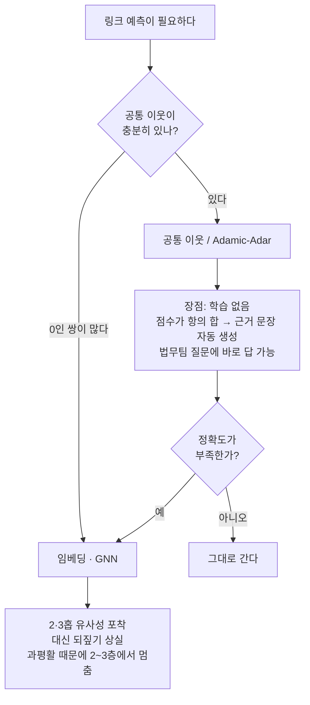

# 공통 이웃 기반 링크 예측의 장점

> **Q.** 공통 이웃 기반 링크 예측의 장점은 무엇인가?
>
> **A.** 왜 그 점수가 나왔는지 되짚을 수 있다. 어느 회사와 어떤 원인을 공유하는지 목록으로 제시할 수 있다.

---

## 1. 이 질문이 왜 6장에 있나 — 법무팀 전화

6장은 이렇게 시작합니다.

> 추천 모델이 잘 돌던 어느 날, 법무팀에서 연락이 왔습니다. "이 사용자한테 왜 이 상품을 추천했는지 설명해 주실 수 있나요."

이 전화에 답할 수 있느냐 없느냐가 6장 전체를 관통하는 축입니다. 6장의 제목("벡터에 녹인 관계를 되찾는 데 10년이 걸렸다")에서 **녹임**은 구조를 값 속으로 밀어 넣는 일이고, **되찾음**은 그 값에서 다시 구조를 꺼내려는 시도입니다. 공통 이웃 기반 링크 예측은 애초에 **녹이지 않은** 쪽입니다. 그래서 되찾을 필요조차 없습니다.

즉 이 카드의 "장점"은 정확도가 높다거나 빠르다는 이야기가 아닙니다. **설명 가능성(explainability)** 이 점수 계산 방식 자체에서 공짜로 따라 나온다는 이야기입니다.

---

## 2. 구조적 이유 — 점수가 경로들의 «합»이기 때문이다

`content/ch06/code/ex4_link_prediction.py`의 점수 계산은 이렇게 생겼습니다.

```python
peers = [p for p in companies if x in adj[p] and p != c]
score = sum(common_neighbors(adj, c, p) for p in peers)
```

핵심은 `sum` 입니다. 회사 `c`와 원인 `x` 사이의 점수는

$$\text{score}(c, x) = \sum_{p \,\in\, \text{peers}(x)} |\,N(c) \cap N(p)\,|$$

이고, 이 식은 **덧셈으로 쪼개집니다(가산 분해 가능, additive decomposition)**. 최종 점수 3은 어디선가 뭉뚱그려 나온 3이 아니라, 항이 하나씩 쌓여 만들어진 3입니다.

실제 실행 결과로 확인해 봅시다.

```
$ python3 ex4_link_prediction.py

아직 이어지지 않은 (회사, 원인) 쌍 중 이어질 법한 것
  점수 3: 라온에너지 ↔ 재시도
  점수 3: 가온테크 ↔ 캐시
  점수 2: 마루상사 ↔ 멱등성없음
  점수 2: 다올물산 ↔ 멱등성없음
  점수 1: 마루상사 ↔ 재시도
```

1위인 `라온에너지 ↔ 재시도`의 점수 3을 항별로 펼치면 이렇습니다.

| 항 (peer) | 그 peer가 라온에너지와 공유하는 원인 | 기여분 |
|---|---|---|
| 나루소프트 | 멱등성없음, 캐시 | **2** |
| 가온테크 | 멱등성없음 | **1** |
| 다올물산 | (없음) | 0 |
| | **합계** | **3** |

그리고 이 표의 각 행이 그대로 근거 문장이 됩니다. 예제가 출력하는 것도 정확히 이 표입니다.

```
왜 이 점수가 나왔는지 되짚을 수 있다
  라온에너지 와 나루소프트 가 함께 가진 원인: ['멱등성없음', '캐시']
  라온에너지 와 가온테크 가 함께 가진 원인: ['멱등성없음']
  라온에너지 와 다올물산 가 함께 가진 원인: (없음)
  → 나루소프트 와 원인 ['멱등성없음', '캐시'] 를 공유한다.
     그 나루소프트 가 재시도 를 겪었으니 라온에너지 도 겪을 수 있다는 추론이다.
```

법무팀에 낼 문장은 이미 다 나왔습니다. **"라온에너지는 나루소프트와 «멱등성없음, 캐시» 두 원인을 공유하고, 그 나루소프트가 «재시도»를 겪었기 때문입니다."** 여기에 사후 해석 도구도, 근사 설명 모델도 필요 없습니다.

### 왜 «합»이면 설명이 되는가

일반화하면, 설명 가능성은 점수 함수가 아래 두 성질을 만족할 때 따라옵니다.

1. **항마다 이름이 붙는다** — 각 항 $|N(c) \cap N(p)|$ 는 "peer $p$" 라는 실체와 1:1로 대응합니다. 항이 곧 문장의 주어입니다.
2. **항의 크기가 곧 기여도다** — 덧셈이므로 어떤 항을 빼면 점수가 정확히 그만큼 줄어듭니다. "나루소프트를 빼면 3에서 1로 떨어진다"가 근사가 아니라 사실입니다.

게다가 항 자체도 다시 쪼개집니다. $|N(c) \cap N(p)|$ 는 공유하는 원인의 목록이므로, 기여분 2는 "멱등성없음 1 + 캐시 1"로 한 단계 더 내려갑니다. **점수 → peer → 공유 원인** 세 층이 모두 손으로 짚어집니다. 답에서 "목록으로 제시할 수 있다"고 한 것이 이 지점입니다.

`adamic_adar`도 같은 성질을 가집니다.

```python
return round(sum(1 / math.log(len(adj[w])) for w in adj[u] & adj[v]
                 if len(adj[w]) > 1), 3)
```

여전히 `sum`이고, 항 하나가 공통 이웃 `w` 하나입니다. 달라진 것은 가중치뿐입니다 — 흔한 원인은 로그로 깎고 희귀한 원인은 덜 깎습니다("이웃이 적은 공통 이웃일수록 더 값지다"). 그래서 "이 예측은 «캐시»가 흔하지 않은 원인이라 특히 강합니다" 같은 한 단계 정밀한 설명까지 가능해집니다. 가중치가 붙어도 분해 가능성은 그대로입니다.

---

## 3. 대비 — 임베딩 내적에는 이 분해가 없다

임베딩 기반 링크 예측의 점수는 보통 두 벡터의 내적입니다.

$$\text{score}(u, v) = \mathbf{z}_u \cdot \mathbf{z}_v = \sum_{i=1}^{d} z_{u,i} \, z_{v,i}$$

얼핏 이것도 합처럼 보입니다. 하지만 결정적인 차이가 있습니다.

| | 공통 이웃 | 임베딩 내적 |
|---|---|---|
| 항 하나가 가리키는 것 | **나루소프트라는 회사**, **캐시라는 원인** | 잠재 차원 `dim 37` |
| 항에 이름이 있나 | 있다 (그래프의 실제 노드) | 없다 (학습으로 정해진 축) |
| 항을 빼면 | 점수가 정확히 그만큼 준다 | 값은 변하지만 의미를 말할 수 없다 |
| 설명의 출처 | 계산 과정 그 자체 | 사후 해석이 필요하다 |

내적의 각 항은 **잠재 차원(latent dimension)** 입니다. `dim 37`이 0.8만큼 기여했다는 사실은 참이지만, 법무팀에 할 말은 아닙니다. 37번 축이 무엇인지 아무도 모르기 때문입니다.

문제의 뿌리는 점수 식이 아니라 그 앞 단계, 즉 **벡터를 만드는 과정**에 있습니다. `ex3_message_passing.py`가 보여 주는 것이 정확히 그것입니다.

```python
def layer(feat, adj, w_self=0.5, w_nbr=0.5):
    """한 층: 자기 벡터와 이웃 평균을 섞는다."""
    ...
    avg = [sum(feat[m][i] for m in nbrs) / len(nbrs) for i in range(len(v))]
    out[n] = [round(w_self * v[i] + w_nbr * avg[i], 3) for i in range(len(v))]
```

`avg`를 만드는 순간 이웃들이 **평균으로 뭉개집니다**. 누가 얼마나 넣었는지는 그 평균 안에 사라집니다. 한 층이면 그래도 되짚어 볼 여지가 있지만, 두 층을 지나면

> 잃는 것: 2층을 지나면 어느 이웃이 얼마나 기여했는지 되짚기 어렵다.
> 층을 깊게 쌓으면 모든 노드가 비슷해지기까지 한다(과평활, over-smoothing).

가 됩니다. 즉 임베딩 쪽은 **분해 불가능성이 사고가 아니라 설계**입니다. 구조를 좌표로 눌러 담는 것이 목적이고, 눌러 담았으니 원래 항이 남아 있지 않은 것입니다. 이것이 6장 제목의 "녹인다"입니다.

정리하면 이 대비는 다음과 같습니다.

```
공통 이웃:  점수 3  =  나루소프트(2)  +  가온테크(1)  +  다올물산(0)
                        └ 멱등성없음, 캐시   └ 멱등성없음
             ↑ 항마다 이름이 있다 → 그대로 근거 문장

임베딩 내적: 점수 0.83 = z[0]*z'[0] + z[1]*z'[1] + ... + z[63]*z'[63]
             ↑ 항에 이름이 없다 → 근거 문장을 만들 수 없다
```

---

## 4. 한계 — 공통 이웃이 0이면 점수도 0이다

여기까지만 보면 공통 이웃 방식이 우월해 보이지만, 6장이 임베딩을 다루는 이유가 따로 있습니다. 예제의 마지막 출력이 그 이유입니다.

```
여기까지는 임베딩이 필요 없다. 이웃만 세면 된다.
임베딩이 필요해지는 건 «공통 이웃이 0인데 비슷한» 경우다.
예: 두 회사가 겹치는 원인이 하나도 없는데, 각자의 이웃들이 서로 비슷할 때.
그때는 2홉·3홉 구조를 좌표로 눌러 담아야 비교가 된다.

대신 그 순간 위의 «되짚기» 출력이 사라진다. 이게 이 장의 거래다.
```

공통 이웃은 정의상 **1홉만 봅니다**. $N(u) \cap N(v)$ 가 공집합이면 합할 항이 하나도 없고, 합할 항이 없으면 점수는 0입니다. 그리고 0점끼리는 순위를 매길 수 없습니다.

실제 데이터에서 이건 드문 상황이 아닙니다. 위 예제 출력에서도 `라온에너지 와 다올물산 가 함께 가진 원인: (없음)`이 이미 나와 있습니다. 두 회사가 겹치는 원인이 하나도 없지만, 각자의 이웃들끼리는 비슷할 수 있습니다 — 2홉·3홉을 봐야 보이는 유사성입니다. 그걸 보려면 구조를 좌표로 눌러 담아야 하고, 눌러 담는 순간 3절에서 본 이유로 되짚기가 사라집니다.

| | 공통 이웃 | 임베딩 |
|---|---|---|
| 보는 범위 | 1홉 | 2홉·3홉 이상 |
| 공통 이웃 0인 쌍 | 점수 0, 구분 불가 | 유사도 비교 가능 |
| 희소 그래프 | 대부분 0점이라 무력 | 여전히 작동 |
| 설명 | 항이 곧 문장 | 사후 해석 필요 |
| 비용 | 계산만 하면 끝, 학습 없음 | 학습·재학습 필요 |

그래서 이 카드의 답을 정확히 읽으면 **"조건 없이 좋다"가 아니라 "설명이라는 축에서 좋다"** 입니다. 6장이 "거래"라고 부르는 것이 이 맞바꿈입니다.

---

## 5. 실무 규칙 — 무엇을 먼저 시도할 것인가



- **먼저 공통 이웃부터 재 본다.** 학습이 없으니 비용이 거의 0이고, 잘 되면 설명까지 공짜로 얻습니다. 되는데도 임베딩부터 꺼내는 것은 설명 가능성을 이유 없이 버리는 일입니다.
- **설명 의무가 있는 도메인**(금융, 의료, 추천 사유 고지)에서는 정확도를 조금 내주더라도 공통 이웃 계열을 유지할 가치가 있습니다. 6장 도입부의 법무팀 전화가 바로 그 상황입니다.
- **하이브리드**도 흔한 답입니다. 순위는 임베딩으로 매기고, 상위 후보에 대해 공통 이웃을 다시 계산해 근거 문장을 붙이는 방식입니다. 다만 이때의 설명은 실제 점수의 분해가 아니라 **사후에 갖다 붙인 설명**이라는 점을 잊으면 안 됩니다. 두 결과가 어긋날 수 있습니다.

---

## 6. 한 줄 정리

공통 이웃 점수는 **경로(peer)마다 하나씩 붙은 항들의 합**이라, 각 항이 "누구와 무엇을 공유하는가"라는 근거 문장으로 그대로 번역됩니다. 임베딩의 내적은 항이 이름 없는 잠재 차원이라 그 번역이 불가능합니다. 대신 공통 이웃은 1홉만 보므로 겹치는 이웃이 없으면 점수가 0이 되고, 그 지점부터는 되짚기를 내주고 임베딩을 써야 합니다.

## 참고

- 예제 코드: `content/ch06/code/ex4_link_prediction.py`, `content/ch06/code/ex3_message_passing.py`
- Adamic & Adar, *Friends and neighbors on the Web* (2003) — 공통 이웃 가중치의 원전
- Liben-Nowell & Kleinberg, [The Link Prediction Problem for Social Networks](https://www.cs.cornell.edu/home/kleinber/link-pred.pdf) (2003) — 공통 이웃·Adamic-Adar·Katz 등 구조 기반 지표 비교
- [Neural Message Passing](https://arxiv.org/abs/1704.01212), [GCN](https://arxiv.org/abs/1609.02907) — 값에 구조를 녹이는 쪽
- [TransE](https://papers.nips.cc/paper/5071-translating-embeddings-for-modeling-multi-relational-data) — 지식 그래프 임베딩 기반 링크 예측
