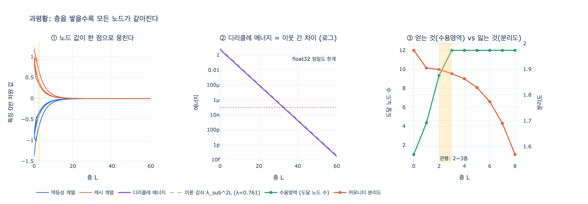

# GNN을 2~3층에서 멈추는 관행의 이유 — 과평활(over-smoothing)

> **Q.** GNN을 2~3층에서 멈추는 관행에는 어떤 이유가 있는가?
>
> **A.** 과평활(over-smoothing)이다. 층을 깊게 쌓으면 모든 노드의 벡터가 비슷해져 구분이 사라진다.

---

## 1. 먼저, 층 하나가 하는 일

GNN 한 층은 아주 단순한 동작 하나다. **이웃의 값을 뭉쳐서 자기 값에 섞는다.**

6장 `ex3_message_passing.py`의 핵심이 딱 그 한 줄이다.

```python
def layer(feat, adj, w_self=0.5, w_nbr=0.5):
    """한 층: 자기 벡터와 이웃 평균을 섞는다. 진짜 GNN 은 여기에 학습 가중치가 붙는다."""
    out = {}
    for n, v in feat.items():
        nbrs = adj[n]
        avg = [sum(feat[m][i] for m in nbrs) / len(nbrs) for i in range(len(v))]
        out[n] = [w_self * v[i] + w_nbr * avg[i] for i in range(len(v))]
    return out
```

그래서 층 수 $L$은 곧 **몇 홉까지 보느냐**다.

| 층 | 노드가 보는 범위 |
|---|---|
| 0층 | 자기 특징만 |
| 1층 | 직접 이웃(1홉)까지 |
| 2층 | 이웃의 이웃(2홉)까지 |
| $L$층 | $L$홉 이웃까지 |

예제 출력에서 노드 D를 보면 이 흐름이 보인다. 0층에서 `[2.0, 1.0]`이던 값이
1층에서 C의 값을 받고, 2층에서 C를 거쳐 B의 값까지 흘러 들어온다.
**구조가 값에 녹아드는** 과정이다.

여기까지만 보면 "층을 더 쌓을수록 멀리 보니까 좋은 것 아닌가" 싶다. 그게 아니다.

---

## 2. 과평활이 무엇인가

**섞기를 반복하면 결국 다 같은 색이 된다.**

물감 통 12개를 늘어놓고 옆 통끼리 조금씩 섞는 걸 반복한다고 생각해 보자.
한두 번은 "이 통은 이웃한테 영향받았구나" 하고 알아볼 수 있다.
스무 번쯤 하면 통 12개가 전부 똑같은 흙색이 된다.
어느 통이 원래 빨강이었는지 알 방법이 없다.

GNN 층도 정확히 같은 일을 한다. 이게 **과평활(over-smoothing)** 이다.

> 층을 깊게 쌓으면 **모든 노드의 벡터가 서로 비슷해져** 노드를 구분할 수 없게 되는 현상.

문제는 이게 "가끔 일어나는 학습 사고"가 아니라 **전파 연산의 수학적 성질**이라는 점이다.
학습이 잘 되든 안 되든, 데이터가 무엇이든, 층을 충분히 쌓으면 반드시 일어난다.

### 왜 반드시 일어나는가

GCN의 전파 연산자는 이렇게 생겼다.

$$H^{(l+1)} = \sigma\!\left(\hat{A}\,H^{(l)}\,W^{(l)}\right),
\qquad \hat{A} = \tilde{D}^{-1/2}(A+I)\,\tilde{D}^{-1/2}$$

$\hat{A}$는 대칭 행렬이고, 고윳값이 이 범위에 갇혀 있다.

$$1 = \lambda_1 > \lambda_2 \ge \cdots \ge \lambda_n > -1$$

$L$층을 쌓는다는 건 $\hat{A}$를 $L$번 곱한다는 뜻이다.
그러면 각 고유 성분은 $\lambda_i^{L}$배가 된다.

- $\lambda_1 = 1$ 성분 → **그대로 살아남는다**
- 나머지 $|\lambda_i| < 1$ 성분 → **$\lambda_i^L \to 0$, 지수적으로 사라진다**

노드마다의 개성(차이)은 전부 두 번째 이후 성분에 실려 있다.
그게 다 사라지고 나면 $\lambda_1$ 성분만 남는데, 그 고유벡터가 $\tilde{D}^{1/2}\mathbf{1}$ 이다.

즉 **끝까지 남는 정보는 $\sqrt{d_i}$ — 노드의 차수뿐**이다.
"이 노드가 몇 개랑 연결돼 있나" 말고는 아무것도 안 남는다.
`expy.py`의 4절에서 60층을 돌린 결과가 $\sqrt{d_i}$와 상관계수 0.9999999146로 일치하는 걸 확인한다.

### 얼마나 빨리 사라지는가

감쇠 속도는 $\lambda_{\text{sub}} = \max_{i \ge 2}|\lambda_i|$ 하나로 정해진다.
`expy.py`의 12노드 그래프에서는 $\lambda_{\text{sub}} = 0.7606$ 이었고, 실제 측정값이 이렇게 나왔다.

| 층 | 디리클레 에너지(이웃 간 차이) | 커뮤니티 분리도 | 평균 코사인 거리 |
|---:|---:|---:|---:|
| 0 | 7.35 | 1.973 | 1.088 |
| 2 | 1.77 | 1.899 | 1.077 |
| 3 | 1.02 | 1.883 | 1.067 |
| 10 | 2.2e-2 | 1.221 | 4.0e-1 |
| 20 | 9.3e-5 | 0.103 | 1.7e-3 |
| 60 | 2.9e-14 | 1.8e-06 | 5.4e-13 |

20층이면 노드 간 코사인 거리가 $10^{-3}$이다. 사실상 같은 벡터다.
60층이면 $10^{-13}$ — **float32 정밀도($\approx 10^{-7}$) 아래**라서 컴퓨터가 구분 자체를 못 한다.

---

## 3. 그럼 왜 1층으로 끝내지 않는가

과평활만 생각하면 층은 적을수록 좋다. 그런데 층은 **수용 영역(receptive field)** 이기도 하다.
1층짜리 GNN은 직접 이웃밖에 못 본다. 두 홉 떨어진 정보를 써야 하는 문제는 풀 수 없다.

그래서 층 수 결정은 **두 곡선이 만나는 지점**을 찾는 일이다.

| | 층을 쌓으면 |
|---|---|
| **얻는 것** | 수용 영역 확장 — 더 먼 이웃의 정보가 들어온다 |
| **잃는 것** | 과평활 — 노드 구분이 지수적으로 사라진다 |

`expy.py` 5절의 실측이 이 교차점을 그대로 보여 준다.

| L | 수용영역(평균 도달 노드) | 늘어난 양 | 분리도 유지율 | 판정 |
|---:|---:|---:|---:|---|
| 1 | 4.33 | +3.33 | 96.5% | 확장 중 — 층값 함 |
| 2 | 9.33 | +5.00 | 96.2% | 확장 중 — 층값 함 |
| 3 | 12.00 | +2.67 | 95.4% | 확장 중 — 층값 함 |
| 4 | 12.00 | **+0.00** | 94.4% | 확장 끝 — 손해만 |
| 6 | 12.00 | +0.00 | 89.9% | 확장 끝 — 손해만 |
| 8 | 12.00 | +0.00 | 79.5% | 확장 끝 — 손해만 |

3층에서 수용 영역이 **포화**된다. 더 쌓아도 새로 보이는 노드가 없다.
그런데 분리도는 계속 깎인다. **4층부터는 얻는 것 없이 잃기만 한다.**

이게 관행의 실체다. 그리고 이건 이 장난감 그래프만의 이야기가 아니다.
실제 그래프는 **좁은 세상(small-world)** 이라 평균 최단 경로가 6 안팎이고,
허브가 있으면 2~3홉만에 그래프 상당 부분이 수용 영역에 들어온다.
그래서 현실 그래프에서도 교차점은 대체로 2~3층 근처에 놓인다.

---

## 4. 같이 무너지는 것 — 되짚기

6장이 강조하는 또 하나의 손실이 있다. **설명 가능성**이다.

```
얻는 것: 이웃이 비슷하면 벡터도 비슷해진다. 그래서 링크 예측이 된다.
잃는 것: 2층을 지나면 어느 이웃이 얼마나 기여했는지 되짚기 어렵다.
```

1층이면 "이 이웃이 이만큼 기여했다"를 말할 수 있다.
2층부터는 기여가 이웃의 이웃까지 겹쳐 섞여서, 최종 벡터를 보고 출처를 분해하기 어렵다.
장 도입부의 "이 사용자한테 왜 이 상품을 추천했는지 설명해 주실 수 있나요"에 답하기가 그만큼 어려워진다.

`ex4_link_prediction.py`가 보여 주는 대조가 이 지점이다.
공통 이웃 세기(Adamic-Adar 같은 1홉 지표)는 **왜 그 점수가 나왔는지 그대로 출력할 수 있다.**
임베딩으로 넘어가는 순간 그 출력이 사라진다. 6장의 표현으로 "이게 이 장의 거래"다.

정리하면 얕게 쌓는 관행은 **과평활 대책이면서 동시에 설명 가능성을 붙잡는 수단**이기도 하다.
이유 하나로 2~3층인 게 아니라, 두 이유가 같은 방향을 가리킨다.

---

## 5. 그럼 깊은 GNN은 불가능한가

불가능하지는 않다. 다만 **전파를 그냥 반복하지 않기 위한 장치**를 따로 붙여야 한다.

| 완화 기법 | 아이디어 |
|---|---|
| Residual / Initial residual | 층마다 원래 특징 $H^{(0)}$을 다시 섞어 넣어, $\lambda_1$ 성분에 완전히 잡아먹히지 않게 한다 (예: GCNII) |
| Jumping Knowledge | 마지막 층 대신 **모든 층의 출력을 모아** 쓴다. 얕은 층의 구분력을 버리지 않는다 |
| DropEdge | 매 스텝 간선 일부를 지워 섞임 속도를 늦춘다 |
| PairNorm / 정규화 | 노드 간 거리 총합을 강제로 유지시켜 붕괴를 막는다 |
| APPNP / 개인화 PageRank | 순간이동 확률을 두어, 전파가 항상 시작 노드로 돌아오게 한다 |

이런 장치를 붙이면 수십 층도 학습된다. 다만 **아무 장치 없이 GCN을 쌓기만 하면** 여전히 2~3층이 상한이다.
"2~3층 관행"은 바닐라 GNN의 기본값에 대한 이야기다.

---

## 6. 한 줄 정리

**층을 쌓는 건 정보를 더 멀리서 가져오는 일이자 정보를 뭉개는 일이다.**
수용 영역은 몇 홉이면 포화되는데 뭉개짐은 계속 누적되므로,
이득이 남는 구간이 대체로 2~3층이다. 그 뭉개짐의 이름이 과평활이다.

---

## 참고

| 키워드 | 출처 |
|---|---|
| 그래프 합성곱 (GCN) | [Kipf & Welling, 2017](https://arxiv.org/abs/1609.02907) |
| 메시지 패싱 | [Gilmer et al., 2017](https://arxiv.org/abs/1704.01212) |
| GNN 개괄 | [Zhou et al., 2018](https://arxiv.org/abs/1812.08434) |
| 과평활 최초 규명 | [Li et al., Deeper Insights into GCN, 2018](https://arxiv.org/abs/1801.07606) |
| 과평활 지수 수렴 증명 | [Oono & Suzuki, 2020](https://arxiv.org/abs/1905.10947) |

6장 예제: `ex3_message_passing.py`(층마다 섞이는 과정), `ex4_link_prediction.py`(되짚기와 임베딩의 갈림길)

## 시각화



왼쪽부터,
① 두 커뮤니티의 노드 값이 층을 쌓을수록 한 점으로 뭉친다(20층 근처에서 이미 붙는다),
② 이웃 간 차이(디리클레 에너지)가 이론 예측 $\lambda_{\text{sub}}^{2L}$을 정확히 따라 지수적으로 붕괴하고 float32 정밀도 아래로 내려간다,
③ 수용 영역(초록)은 3층에서 포화되는데 커뮤니티 분리도(주황)는 계속 떨어진다 — 노란 띠가 관행의 2~3층 구간이다.
