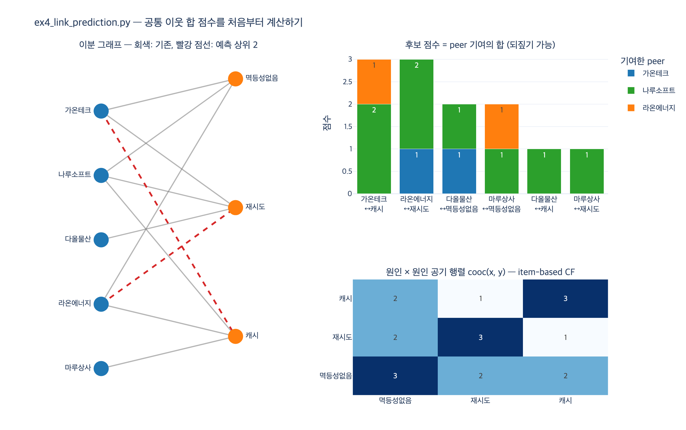

# `ex4_link_prediction.py` 의 링크 예측 점수

**질문** — `ex4_link_prediction.py` 에서 링크 예측 점수는 어떻게 계산하는가?

**답** — 아직 이어지지 않은 (회사, 원인) 쌍마다, 그 원인을 가진 다른 회사들과 해당 회사의 공통 이웃 수를 모두 합해 점수로 쓴다.

---

## 1. 그래프의 모양: 회사–원인 이분 그래프

`ex4` 가 쓰는 데이터는 9개 간선짜리 장난감 그래프다. 한쪽에는 회사, 다른 쪽에는 «장애 원인» 이 있고, 간선은 «그 회사가 그 원인으로 장애를 겪었다» 를 뜻한다.

```python
EDGES = [
    ("가온테크", "재시도"), ("가온테크", "멱등성없음"),
    ("나루소프트", "재시도"), ("나루소프트", "멱등성없음"), ("나루소프트", "캐시"),
    ("다올물산", "재시도"),
    ("라온에너지", "멱등성없음"), ("라온에너지", "캐시"),
    ("마루상사", "캐시"),
]
```

회사끼리, 원인끼리는 절대 이어지지 않는다. 이게 **이분 그래프**(bipartite graph)다. 여기서 중요한 성질 하나가 따라 나온다.

> 두 회사의 공통 이웃은 **반드시 원인**이다. 그러니 «공통 이웃 수» 는 곧 «함께 겪은 원인의 수» 이고, 그게 그대로 회사 간 유사도가 된다.

`adjacency()` 는 간선을 양방향으로 넣어 무방향 인접 집합을 만든다.

| 노드 | 이웃 |
|---|---|
| 가온테크 | 멱등성없음, 재시도 |
| 나루소프트 | 멱등성없음, 재시도, 캐시 |
| 다올물산 | 재시도 |
| 라온에너지 | 멱등성없음, 캐시 |
| 마루상사 | 캐시 |
| 멱등성없음 | 가온테크, 나루소프트, 라온에너지 |
| 재시도 | 가온테크, 나루소프트, 다올물산 |
| 캐시 | 나루소프트, 라온에너지, 마루상사 |

## 2. 후보 고르기 — «아직 없는 간선» 만

```python
cand = [(c, x) for c in companies for x in causes if x not in adj[c]]
```

이미 이어져 있는 쌍은 예측할 게 없다. 회사 5 × 원인 3 = 15개 조합 중 기존 간선 9개를 빼면 **후보는 6개**다.

## 3. 점수 식

```python
for c, x in cand:
    peers = [p for p in companies if x in adj[p] and p != c]
    score = sum(common_neighbors(adj, c, p) for p in peers)
```

수식으로 쓰면 이렇다.

$$
\mathrm{score}(c, x) \;=\; \sum_{p \,\in\, N(x),\; p \neq c} \bigl|\, N(c) \cap N(p) \,\bigr|
$$

- $N(v)$ : 노드 $v$ 의 이웃 집합
- $N(x)$ : 원인 $x$ 를 **이미 겪은 회사들** — 코드의 `peers`
- $|N(c) \cap N(p)|$ : 회사 $c$ 와 회사 $p$ 가 **함께 가진 원인의 수** — 코드의 `common_neighbors`

읽는 법은 한 문장이다. **«$x$ 를 겪은 회사들이 나와 얼마나 닮았는가» 를 전부 더한 값.** 나와 많이 닮은 회사가 겪은 원인일수록, 그런 회사가 여럿일수록 점수가 커진다.

주의할 점: 이건 **$c$ 와 $x$ 의 공통 이웃 수가 아니다.** 이분 그래프라 회사 $c$ 와 원인 $x$ 는 애초에 공통 이웃이 있을 수 없다(한쪽 이웃은 전부 원인, 다른 쪽 이웃은 전부 회사). 그래서 «회사–회사» 로 한 번 내려가서 공통 이웃을 세고, 그걸 peer 전체에 대해 합산하는 2단 구조를 쓴다.

## 4. 실제 계산 결과

`python3 ex4_link_prediction.py` 실측 출력(상위 5개).

```
아직 이어지지 않은 (회사, 원인) 쌍 중 이어질 법한 것
  점수 3: 라온에너지 ↔ 재시도
  점수 3: 가온테크 ↔ 캐시
  점수 2: 마루상사 ↔ 멱등성없음
  점수 2: 다올물산 ↔ 멱등성없음
  점수 1: 마루상사 ↔ 재시도
```

후보 6개 전부의 내역은 이렇다.

| 회사 | 원인 | peer 기여 (peer : 공통 원인 수) | 점수 |
|---|---|---|---|
| 가온테크 | 캐시 | 나루소프트 2 + 라온에너지 1 + 마루상사 0 | **3** |
| 라온에너지 | 재시도 | 가온테크 1 + 나루소프트 2 + 다올물산 0 | **3** |
| 다올물산 | 멱등성없음 | 가온테크 1 + 나루소프트 1 + 라온에너지 0 | **2** |
| 마루상사 | 멱등성없음 | 가온테크 0 + 나루소프트 1 + 라온에너지 1 | **2** |
| 다올물산 | 캐시 | 나루소프트 1 + 라온에너지 0 + 마루상사 0 | **1** |
| 마루상사 | 재시도 | 가온테크 0 + 나루소프트 1 + 다올물산 0 | **1** |

정렬은 `scored.sort(reverse=True)` 하나뿐이라, `(점수, 회사, 원인)` 튜플 전체를 내림차순으로 비교한다. 동점이면 **이름이 큰 쪽이 앞**으로 온다. 그래서 3점 동점에서 «라온에너지» 가 «가온테크» 를 제치고 1위로 찍힌다. 점수가 더 높아서가 아니라 정렬 규칙 때문이다.

## 5. 되짚기 — 이 방식의 진짜 값어치

점수가 **합**이라서, 어느 peer 가 얼마를 냈는지 그대로 쪼갤 수 있다. `main()` 후반부가 하는 일이 그것이다.

```
왜 이 점수가 나왔는지 되짚을 수 있다
  라온에너지 와 나루소프트 가 함께 가진 원인: ['멱등성없음', '캐시']
  라온에너지 와 가온테크 가 함께 가진 원인: ['멱등성없음']
  라온에너지 와 다올물산 가 함께 가진 원인: (없음)
  → 나루소프트 와 원인 ['멱등성없음', '캐시'] 를 공유한다.
     그 나루소프트 가 재시도 를 겪었으니 라온에너지 도 겪을 수 있다는 추론이다.
```

6장 전체의 주제가 여기서 뒤집힌다. 임베딩/GNN 은 이웃 정보를 좌표에 «녹여» 버려서, 코사인 유사도 0.87 이 나와도 «어느 이웃이 얼마나 기여했나» 를 되짚을 수 없다. 반면 공통 이웃 합 점수는 계산 과정 자체가 근거의 목록이다. 법무팀이 «왜 이 추천인가» 를 물었을 때 답이 있는 쪽이다.

## 6. 이건 협업 필터링과 같은 식이다

사용자 = 회사, 아이템 = 원인이라고 바꿔 읽으면, 위 식은 교과서적 **user-based CF** 의 예측식이다.

$$
\hat{r}(u, i) \;=\; \sum_{v \,\in\, U(i)} \mathrm{sim}(u, v)
$$

«아이템 $i$ 를 소비한 사용자들의 유사도 합.» 유사도로 공통 아이템 수(정규화 안 한 코사인/자카드의 분자)를 쓴 것뿐이다.

그리고 합의 순서를 바꾸면 **item-based CF** 로 그대로 넘어간다.

$$
\mathrm{score}(c,x)
= \sum_{p \in N(x)} \sum_{y \in N(c)} \mathbb{1}[\,p \in N(y)\,]
= \sum_{y \,\in\, N(c)} \bigl|\, N(x) \cap N(y) \bigr|
= \sum_{y \,\in\, N(c)} \mathrm{cooc}(x, y)
$$

$\mathrm{cooc}(x, y)$ 는 «원인 $x$ 와 $y$ 를 동시에 겪은 회사 수», 곧 **아이템–아이템 공기(co-occurrence) 행렬**이다. 후보 쌍은 $x \notin N(c)$ 라 $c \notin N(x)$ 이므로 `p != c` 예외가 저절로 사라져 두 식이 정확히 일치한다. expy 에서 6개 후보 전부에 대해 user-based 합과 item-based 합이 같은 값임을 확인했다.

행렬로 보면 더 짧다. $B$ 를 회사×원인 이분 인접 행렬이라 할 때

$$
\mathrm{score} \;=\; B B^{\top} B
$$

즉 이분 그래프에서 $c \to y \to p \to x$ 로 가는 **길이 3짜리 경로의 개수**다. $BB^\top$ 이 회사–회사 공통 원인 행렬(user-based 시선), $B^\top B$ 가 원인–원인 공기 행렬(item-based 시선)이고, 어느 쪽으로 곱해도 같은 곱이다. 이 «경로 세기» 계열의 정식 이름이 Katz 지수(경로 길이에 감쇠 가중치를 준 버전)다.

## 7. 코드에는 있지만 점수에 안 쓰이는 것

`adamic_adar()` 는 정의만 되어 있고 `main()` 에서 호출되지 않는다.

```python
def adamic_adar(adj, u, v):
    """이웃이 적은 공통 이웃일수록 더 값지다. 1홉만 봐도 이 정도는 된다."""
    return round(sum(1 / math.log(len(adj[w])) for w in adj[u] & adj[v]
                     if len(adj[w]) > 1), 3)
```

$$
\mathrm{AA}(u,v) = \sum_{w \in N(u) \cap N(v)} \frac{1}{\log |N(w)|}
$$

공통 이웃을 그냥 세지 않고 «흔한 이웃은 깎는» 개선판이다. 모두가 겪는 «재시도» 를 공유하는 것보다, 드문 원인을 공유하는 쪽이 더 강한 신호라는 발상. 점수 계산에는 안 쓰이지만 «1홉만 봐도 이 정도는 된다» 는 대비를 보여 주려고 남겨 둔 코드다. (`from itertools import combinations` 도 마찬가지로 미사용이다.)

## 8. 이 방식이 무너지는 지점

`main()` 의 마지막 문단이 예제의 결론이다.

- 공통 이웃이 **0이면 점수도 0**이다. 겹치는 원인이 하나도 없는 두 회사는, 각자의 이웃들이 서로 아무리 닮았어도 이 식으로는 잡히지 않는다. 표에서 «다올물산–라온에너지», «가온테크–마루상사» 가 0인 게 그 예다.
- 그 «2홉·3홉 너머의 닮음» 을 잡으려면 구조를 좌표로 눌러 담아야 한다 — 임베딩과 GNN.
- 대신 그 순간 5절의 되짚기 출력이 사라진다. **이게 6장이 말하는 거래다.**

## 시각화



왼쪽은 이분 그래프(회색 실선이 기존 간선, 빨간 점선이 예측 상위 2개), 오른쪽 위는 후보 점수를 peer 기여로 쪼갠 누적 막대 — 막대 조각 하나하나가 곧 «되짚기» 근거다. 오른쪽 아래는 원인–원인 공기 행렬로, item-based CF 쪽에서 같은 점수를 보는 시선이다.
