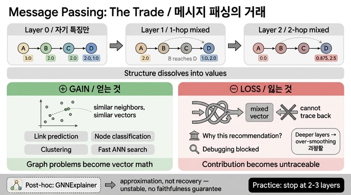

# 메시지 패싱으로 얻는 것과 잃는 것

> **Q.** 메시지 패싱으로 얻는 것과 잃는 것은 각각 무엇인가?
>
> **A.** 얻는 것은 이웃이 비슷하면 벡터도 비슷해져 링크 예측이 된다는 점이고, 잃는 것은 2층을 지나면 어느 이웃이 얼마나 기여했는지 되짚기 어려워진다는 점이다.

이 카드는 6장 「구조를 값에 녹이는 방법」의 핵심 거래(trade)를 묻는다. **한 문장으로: 구조를 좌표로 바꿔 얻는 계산 편의와, 그 대가로 잃는 되짚기 가능성의 맞바꿈이다.**

---

## 1. 메시지 패싱이란 무엇인가

그래프 신경망(GNN)의 한 층이 하는 일은 놀랄 만큼 단순하다.

1. **모으기(aggregate)** — 각 노드가 자기 이웃들의 벡터를 모아 하나로 뭉친다(평균, 합, max 등).
2. **섞기(update)** — 뭉친 이웃 값과 자기 값을 가중치로 섞어 새 벡터를 만든다.

`content/ch06/code/ex3_message_passing.py`의 한 층은 학습 가중치를 뺀 최소 형태다.

```python
def layer(feat, adj, w_self=0.5, w_nbr=0.5):
    """한 층: 자기 벡터와 이웃 평균을 섞는다. 진짜 GNN 은 여기에 학습 가중치가 붙는다."""
    out = {}
    for n, v in feat.items():
        nbrs = adj[n]
        avg = [sum(feat[m][i] for m in nbrs) / len(nbrs) for i in range(len(v))] if nbrs else [0.0] * len(v)
        out[n] = [round(w_self * v[i] + w_nbr * avg[i], 3) for i in range(len(v))]
    return out
```

층을 한 번 돌면 1홉, 두 번 돌면 2홉 정보가 섞인다. 그게 전부다. 이것이 Gilmer 등의 [Neural Message Passing](https://arxiv.org/abs/1704.01212)이 정리한 프레임이고, [GCN](https://arxiv.org/abs/1609.02907)·GraphSAGE·GAT는 모두 이 틀 안의 변주다(모으는 방식과 가중치 주는 방식만 다르다).

### 실행 결과로 보는 「녹아듦」

```
0층 — 자기 특징만        D: [2.0, 1.0]
1층 — 1홉이 섞였다        D: [1.0, 2.0]     ← C 의 값이 흘러 들어왔다
2층 — 2홉까지 섞였다      D: [0.875, 2.5]   ← C 를 거쳐 B 의 값까지 흘러 들어왔다
```

D는 C하고만 이어져 있다. 그런데 2층을 돌고 나면 D의 벡터 안에는 한 번도 직접 만난 적 없는 B의 값이 들어 있다. **간선이라는 「구조」가 숫자라는 「값」 속으로 녹아든 것이다.** 이 장의 제목 "벡터에 녹인 관계"가 바로 이 장면을 가리킨다.

---

## 2. 얻는 것 — 구조 유사성이 좌표 근접으로 바뀐다

핵심 효과는 이것이다. **이웃 구성이 비슷한 노드는 벡터도 비슷해진다.**

같은 값을 여러 번 나눠 받은 노드들은 서로 가까운 좌표로 수렴한다. 그러면 그래프 문제가 통째로 벡터 연산 문제로 바뀐다.

| 그래프 문제 | 메시지 패싱 후에는 |
|---|---|
| 링크 예측 (이 둘이 이어질까?) | 두 벡터의 내적·코사인 유사도 |
| 노드 분류 (이 회사는 어떤 유형?) | 벡터 위의 분류기 한 층 |
| 군집 (비슷한 것끼리 묶기) | 벡터 공간의 k-means |
| 추천 (뭘 보여줄까?) | 최근접 이웃 검색 (ANN 색인) |

이게 왜 큰가. 그래프 탐색은 간선을 따라가야 하지만, **벡터 연산은 GPU 행렬곱 한 번이고 ANN 색인으로 수억 건에도 밀리초 안에 답한다.** 학습된 임베딩은 미리 뽑아 캐시해 둘 수도 있다. 10년 동안 산업계가 GNN·임베딩으로 몰려간 이유가 이 성능 곡선이다.

### 언제부터 임베딩이 「필요해지는」가

중요한 단서. 얕은 문제는 임베딩 없이도 풀린다. `ex4_link_prediction.py`가 그 경계를 보여 준다.

```python
def adamic_adar(adj, u, v):
    """이웃이 적은 공통 이웃일수록 더 값지다. 1홉만 봐도 이 정도는 된다."""
    return round(sum(1 / math.log(len(adj[w])) for w in adj[u] & adj[v] if len(adj[w]) > 1), 3)
```

공통 이웃 개수(Common Neighbors), Adamic-Adar 같은 **휴리스틱은 1홉만 세면 되고, 왜 그 점수가 나왔는지 그대로 출력할 수 있다.** 예제도 그렇게 한다.

```
→ 나루소프트 와 원인 ['멱등성없음', '재시도'] 를 공유한다.
   그 나루소프트 가 캐시 를 겪었으니 가온테크 도 겪을 수 있다는 추론이다.
```

임베딩이 필요해지는 건 **공통 이웃이 0인데 비슷한** 경우다. 두 회사가 겹치는 원인이 하나도 없는데 각자의 이웃들이 서로 닮았을 때 — 2홉·3홉 구조를 좌표로 눌러 담아야 비교가 된다. 그리고 예제 마지막 줄이 정확히 짚는다.

> 대신 그 순간 위의 «되짚기» 출력이 사라진다. 이게 이 장의 거래다.

---

## 3. 잃는 것 — 기여를 되짚을 수 없다

### 왜 되짚기가 어려워지나

1층까지는 그래도 해볼 만하다. D의 값은 D 자신과 C의 선형 결합이니 계수를 나눠 쓸 수 있다. **문제는 2층부터다.**

- D의 2층 값에는 C를 거쳐 온 B의 기여, B를 거쳐 온 A·E의 기여가 **이미 합쳐진 채로** 들어 있다.
- 합·평균은 정보를 **뭉개는** 연산이다. `0.5 + 0.5 = 1.0`을 보고 원래 두 값을 복원할 수 없다.
- 여기에 실제 GNN은 학습 가중치 행렬과 ReLU 같은 비선형을 끼워 넣는다. 층마다 좌표계가 통째로 바뀐다.
- 홉이 늘수록 기여 경로 수가 지수적으로 늘어난다(3층이면 3홉 이내 모든 경로).

결과적으로 "이 예측에 어느 이웃이 얼마나 기여했나"는 **역산이 아니라 추정 문제**가 된다.

### 과평활(over-smoothing)이라는 추가 벌칙

층을 더 쌓으면 상황이 나빠지기만 하는 게 아니라 성능 자체가 무너진다.

```
0층  D: [2.0,   1.0 ]   ← 노드마다 뚜렷하게 다르다
1층  D: [1.0,   2.0 ]
2층  D: [0.875, 2.5 ]   ← 다른 노드들과 값이 가까워지기 시작
```

실행 결과의 2층 첫 칸을 훑어보면 A 2.5 / B 1.847 / C 1.042 / D 0.875 / E 2.194 / F 1.917로, 0층의 4.0~0.0 폭에 비해 확연히 좁혀졌다. 층이 깊어질수록 모든 노드 벡터가 한 점으로 수렴해 **구분이 사라진다.** 이것이 과평활이다.

> **그래서 GNN은 관행적으로 2~3층에서 멈춘다.** "깊게 쌓으면 더 좋더라"가 통하지 않는 몇 안 되는 딥러닝 영역이고, 그 관행에는 이런 물리적 이유가 있다.

### 실무에서 이게 터지는 지점

6장 도입부의 그 장면이다.

> 추천 모델이 잘 돌던 어느 날, 법무팀에서 연락이 왔습니다. "이 사용자한테 왜 이 상품을 추천했는지 설명해 주실 수 있나요."

- **규제 대응** — GDPR의 자동화된 의사결정 관련 조항, 금융권 여신 거절 사유 고지, EU AI Act의 고위험 시스템 설명 요구. "임베딩 유사도가 높았습니다"는 답변이 되지 못한다.
- **디버깅** — 이상한 추천이 나왔을 때 어느 간선이 문제였는지 짚어야 고치는데, 짚을 수가 없다.
- **감사와 신뢰** — 편향이 어느 관계에서 흘러들었는지 추적 불가.
- **데이터 삭제 요구** — 특정 노드를 지웠을 때 어떤 예측이 바뀌어야 하는지 계산이 안 된다.

---

## 4. 되찾으려는 시도 — 사후 설명 기법과 그 한계

잃어버린 되짚기를 사후(post-hoc)에 근사하려는 계열이 있다.

| 기법 | 하는 일 |
|---|---|
| **GNNExplainer** (Ying et al., NeurIPS 2019) | 예측을 유지하는 **최소 부분그래프 + 최소 특징 집합**을 찾는다. 간선마다 마스크를 두고, 마스킹된 그래프의 예측과 원래 예측 사이 상호정보량을 최대화하도록 마스크를 학습한다. |
| **PGExplainer** | 인스턴스마다 따로 최적화하지 않고, 설명 생성기를 한 번 학습해 여러 예측에 재사용한다. |
| **GraphMask / SubgraphX** | 층별 간선 제거 가능성 학습 / Shapley 값 기반 부분그래프 탐색. |
| **어텐션 가중치 (GAT)** | 이웃별 가중치를 그대로 읽어 근거로 삼는 방식. |

### 한계 — 왜 「되찾았다」고 말하기 어려운가

- **사후 근사이지 복원이 아니다.** 모델이 실제로 쓴 계산 경로가 아니라, "이 부분그래프만 남겨도 같은 답이 나오더라"는 관찰이다. 같은 답을 내는 부분그래프는 여럿일 수 있다.
- **불안정하다.** 최적화 초기값이나 시드가 바뀌면 다른 설명이 나온다. 법정에 낼 근거로는 약하다.
- **충실성(faithfulness) 보장이 없다.** 설명이 그럴듯해 보이는 것과 모델의 실제 근거인 것은 다르다. 사후 설명이 오히려 잘못된 확신을 주는 문제는 이 분야의 알려진 비판이다.
- **비싸다.** 인스턴스마다 최적화를 돌려야 하는 계열은 온라인 서빙에 못 붙인다.
- **어텐션 ≠ 설명.** 어텐션 가중치를 근거로 읽는 관행에 대해서도 반론이 많다.

**정리하면 — 녹인 것을 완전히 되돌릴 수는 없고, 근사할 수만 있다.** 이 장 제목의 "되찾는 데 10년"은 이 근사가 만족스럽지 않아 결국 그래프 자체를 다시 꺼내 들게 된 흐름(6.3절의 GraphRAG 계열)을 가리킨다.

---

## 5. 그래서 어떻게 쓰라는 것인가

- **설명이 요구되지 않는 자리에는 임베딩을 쓴다.** 후보 생성, 대규모 유사도 검색, 초벌 랭킹.
- **설명이 요구되는 자리에는 되짚을 수 있는 방법을 남긴다.** 공통 이웃·Adamic-Adar 같은 휴리스틱, 규칙, 경로 기반 근거는 그대로 출력할 수 있다.
- **하이브리드가 현실 해법이다.** 임베딩으로 후보를 좁히고, 최종 근거는 그래프 경로로 제시한다. "A와 B는 공통 원인 2개를 공유한다"는 문장은 사람도 법무팀도 읽는다.
- **층수는 2~3층.** 과평활 때문이기도 하고, 얕을수록 되짚기가 조금이라도 쉬워지기 때문이기도 하다.

---

## 한 줄 암기

**얻는 것 = 구조 유사성 → 좌표 근접 (링크 예측·분류·군집이 벡터 연산이 됨)** / **잃는 것 = 2층 넘어가면 기여 추적 불가 (+ 과평활)** — 그래서 2~3층에서 멈추고, 사후 설명은 근사일 뿐이다.

## 관련 자료

- [Neural Message Passing for Quantum Chemistry](https://arxiv.org/abs/1704.01212) — 메시지 패싱 프레임의 정리
- [Semi-Supervised Classification with GCN](https://arxiv.org/abs/1609.02907) — 가장 널리 쓰이는 한 층 형태
- [Graph Neural Networks: A Review](https://arxiv.org/abs/1812.08434) — 개괄
- [GNNExplainer](https://arxiv.org/abs/1903.03894) — 사후 설명의 대표
- 예제 코드: `content/ch06/code/ex3_message_passing.py`, `content/ch06/code/ex4_link_prediction.py`

## 인포그래픽


