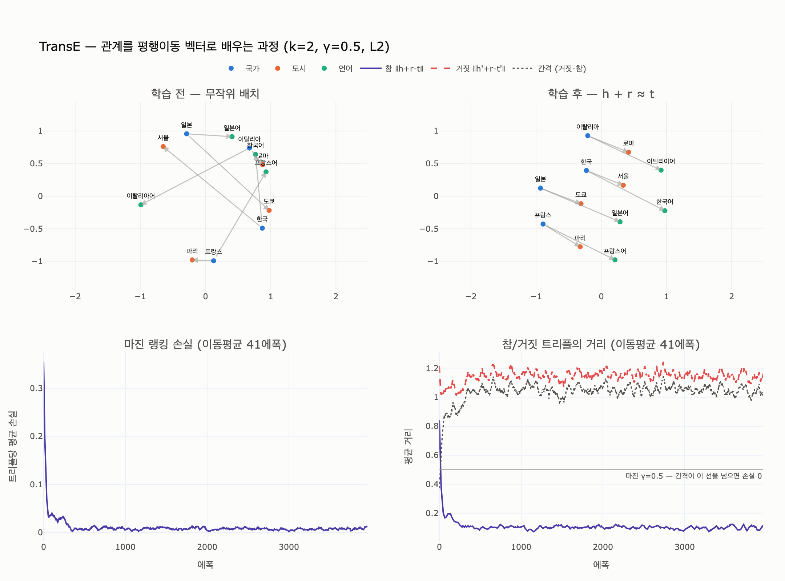

# 지식 그래프 임베딩의 대표 1차 출처

**답**: **TransE 논문** — *Translating Embeddings for Modeling Multi-relational Data*, **NIPS 2013**.

---

## 한 줄로 기억할 것

$$\mathbf{h} + \mathbf{r} \approx \mathbf{t}$$

**관계를 좌표 위의 평행이동(translation) 벡터로 본다.** 그게 TransE 전부다.
`(한국, 수도, 서울)` 이 참이면 `서울 - 한국` 이 곧 관계 `수도` 의 벡터가 되어야 한다.

6장 표에서 「지식 그래프 임베딩 / [사실상 표준] / TransE」로 걸린 그 줄이다.

---

## 1. 서지 정보

| 항목 | 값 |
|---|---|
| 제목 | Translating Embeddings for Modeling Multi-relational Data |
| 저자 | Antoine Bordes, Nicolas Usunier, Alberto García-Durán, Jason Weston, Oksana Yakhnenko |
| 학회 | **NIPS 2013** (Advances in Neural Information Processing Systems 26), pp. 2787–2795 |
| 소속 | Université de Technologie de Compiègne / Google |
| 링크 | https://papers.nips.cc/paper/5071-translating-embeddings-for-modeling-multi-relational-data |
| 6장 상태 라벨 | **[사실상 표준]** — 공식 명세는 없지만 업계가 널리 쓰는 것 |

시험식으로 외울 세 가지: **TransE / NIPS / 2013**.
「Bordes 」와 「translating」만 기억해도 검색으로 되찾을 수 있다.

### 왜 «대표» 1차 출처인가

TransE 이전에도 지식 그래프 임베딩은 있었다. RESCAL(2011, 텐서 분해), Structured
Embeddings(2011, 관계마다 행렬 두 개), Neural Tensor Network(2013, 관계마다 텐서).
전부 **관계마다 파라미터가 $O(k^2)$ 이상**이라 무거웠고, 큰 그래프에서 안 돌았다.

TransE 는 관계 하나를 **벡터 하나**로 줄였다. 그래서

- 파라미터가 $O\big((|E|+|R|)\cdot k\big)$ 로 끝난다
- 백만 엔티티급 Freebase 부분집합(FB1M)에서 처음으로 돌아갔다
- 그런데도 당시 무거운 모델들을 이겼다

「가장 단순한 게 가장 잘 됐다」가 이 논문의 논지다. 그래서 이후 10년간 나온 KGE 모델이
전부 TransE 를 기준선으로 삼는다. 지식 그래프 임베딩을 인용할 때 관례적으로 이 논문을 건다.

> 착상의 출처: 저자들은 word2vec 계열 단어 벡터에서 관찰된 규칙성
> (`king - man + woman ≈ queen`)을 지목한다. 「1차원 평행이동이 관계를 표현할 수 있다면,
> 지식 그래프의 관계도 그렇게 표현해 보자」가 출발점이다.

---

## 2. 모델 — 무엇을 하는 모델인가

### 2.1 점수 함수 (score / dissimilarity)

$$d(h, r, t) = \lVert \mathbf{h} + \mathbf{r} - \mathbf{t} \rVert_{1 \text{ or } 2}$$

**작을수록 참에 가깝다.** $L_1$ 과 $L_2$ 중 검증셋으로 고른다(논문은 대체로 $L_1$).

### 2.2 마진 랭킹 손실 (margin ranking loss)

$$\mathcal{L} = \sum_{(h,r,t)\in S}\ \sum_{(h',r,t')\in S'_{(h,r,t)}}
\big[\, \gamma + d(h,r,t) - d(h',r,t') \,\big]_+$$

- $[x]_+ = \max(0, x)$ — hinge
- $\gamma > 0$ 은 마진 (논문은 1 또는 2)

핵심은 **절대적인 거리를 맞추지 않는다**는 것이다. 참 트리플이 거짓 트리플보다
«적어도 $\gamma$ 만큼 더 가깝기»만 하면 그 항은 0이 되고 학습이 멈춘다.
회귀가 아니라 **랭킹** 문제로 푼다. 링크 예측의 평가 방식이 랭킹이라서 그렇다.

### 2.3 네거티브 샘플링 (negative sampling)

지식 그래프에는 **참 트리플만** 들어 있다. 「거짓」 목록이 없다.
거짓이 없으면 모든 벡터를 0으로 만드는 게 손실 최소해가 된다. 그래서 거짓을 **만들어 낸다**.

$$S'_{(h,r,t)} = \{(h',r,t)\ |\ h'\in E\}\ \cup\ \{(h,r,t')\ |\ t'\in E\}$$

- 참 트리플의 **머리 또는 꼬리 하나**를 무작위 엔티티로 갈아끼운다 (둘 다 동시에는 안 바꾼다)
- **관계는 갈아끼우지 않는다**
- 원논문은 균등 샘플링. 나중에 TransH 가 1-N/N-1 비율을 반영한 **Bernoulli 샘플링**을 제안한다

### 2.4 노름 제약 — 안 걸면 모델이 꼼수를 쓴다

손실은 «참을 가깝게» 해서도 줄지만 «거짓을 멀게» 해서도 준다.
제약이 없으면 모델은 **엔티티 벡터의 크기만 무한히 키워서** $d(h',r,t')$ 를 부풀린다.

그래서 논문은 매 배치마다 엔티티 임베딩을 $\lVert \mathbf{e} \rVert_2 = 1$ 로 되돌린다.
**관계 벡터에는 제약을 걸지 않는다.**

### 2.5 알고리즘 전체 (논문 Algorithm 1)

```
초기화: e ~ Uniform(-6/√k, 6/√k),  r ~ Uniform(-6/√k, 6/√k) 뒤 정규화
반복:
  1. 엔티티 임베딩을 ‖e‖₂ = 1 로 정규화
  2. 미니배치 S_batch 를 샘플링
  3. 각 참 트리플마다 손상 트리플(negative) 하나를 샘플링
  4. Σ [γ + d(참) − d(거짓)]₊ 의 경사로 SGD 한 걸음
```

하이퍼파라미터는 $k \in \{20, 50\}$, $\gamma \in \{1, 2\}$, 학습률 $\{0.001, 0.01\}$ 수준.
**아주 작다.** 이 단순함이 논문의 주장 그 자체다.

### 2.6 평가 — filtered 설정도 이 논문이 냈다

$(h, r, ?)$ 의 물음표에 모든 엔티티를 넣어 $d$ 로 정렬하고, 정답의 **순위**를 잰다.

| 지표 | 뜻 |
|---|---|
| Mean rank | 정답 순위의 평균 (낮을수록 좋다) |
| Hits@10 | 정답이 상위 10위 안에 든 비율 |
| **filtered** | 후보 중 «이미 학습셋에 있는 다른 참 트리플»은 세지 않고 뺀다 |

filtered 개념이 여기서 처음 나왔다. 지금도 KGE 논문의 표준 보고 방식이다.
논문 결과(filtered): **WN18 Hits@10 89.2%**, **FB15k Hits@10 47.1%**.
FB15k 쪽이 낮은 게 아래 3절의 한계 때문이다.

---

## 3. 한계 — TransE 의 가정이 곧 한계다

### 3.1 1대다 · 다대1 · 다대다 관계

$\mathbf{h}+\mathbf{r}=\mathbf{t}$ 는 **머리와 관계가 정해지면 꼬리가 한 점으로 정해진다**는 뜻이다.
그런데 실제 지식 그래프의 관계 대부분은 1대1이 아니다.

`(한국, 도시, 서울)`, `(한국, 도시, 부산)`, `(한국, 도시, 인천)` 이 모두 참이면

$$\mathbf{서울} \approx \mathbf{한국}+\mathbf{r} \approx \mathbf{부산} \approx \mathbf{인천}$$

서울·부산·인천이 **같은 자리로 뭉개진다**(collapse). 구분이 불가능해진다.

| 유형 | 무너지는 쪽 | 예 |
|---|---|---|
| 1대다 (1-to-N) | 꼬리들이 한 점으로 | `(한국, 도시, ...)` |
| 다대1 (N-to-1) | 머리들이 한 점으로 | `(..., 국적, 한국)` |
| 다대다 (N-to-N) | 양쪽 다 | `(배우, 출연, 영화)` |

TransE 논문 자체도 이 문제를 FB15k 결과에서 인정한다.
1대1 관계에서는 Hits@10 이 높고, N대N 관계에서는 뚝 떨어진다.

`expy.py` 6절에서 $k=20$ 으로 돌려도 붕괴가 그대로 나온다.
**차원을 늘려서 해결되는 문제가 아니다. 모델 형태 자체의 한계다.**

### 3.2 대칭 관계를 표현할 수 없다

`협력`, `형제`, `인접` 같은 대칭 관계는 $(a,r,b)$ 와 $(b,r,a)$ 가 **둘 다 참**이다.

$$\mathbf{a}+\mathbf{r}=\mathbf{b}, \quad \mathbf{b}+\mathbf{r}=\mathbf{a}$$

두 식을 더하면

$$\mathbf{a}+\mathbf{b}+2\mathbf{r} = \mathbf{a}+\mathbf{b}
\;\Longrightarrow\; \mathbf{r} = \mathbf{0} \;\Longrightarrow\; \mathbf{a}=\mathbf{b}$$

**관계 벡터가 0으로 무너지고, 짝지어진 두 엔티티가 같은 점이 된다.**
관계가 아무 정보도 못 담는다. 재귀 관계 $(a,r,a)$ 도 같은 이유로 $\mathbf{r}=\mathbf{0}$ 을 강요한다.

### 3.3 표현할 수 있는 것 / 없는 것

| 관계 성질 | 정의 | TransE |
|---|---|---|
| 대칭 (symmetry) | $r(a,b) \Rightarrow r(b,a)$ | ✗ $r=0$ 으로 붕괴 |
| 반대칭 (antisymmetry) | $r(a,b) \Rightarrow \lnot r(b,a)$ | ✓ |
| 역관계 (inversion) | $r_1(a,b) \Leftrightarrow r_2(b,a)$ | ✓ $\mathbf{r}_2 = -\mathbf{r}_1$ |
| 합성 (composition) | $r_1(a,b) \land r_2(b,c) \Rightarrow r_3(a,c)$ | ✓ $\mathbf{r}_3=\mathbf{r}_1+\mathbf{r}_2$ |
| 1-N / N-1 / N-N | — | ✗ 붕괴 |

### 3.4 그 밖의 구조적 한계

- **전이적(transductive)**: 학습에 없던 엔티티는 좌표 자체가 없다. 노드가 새로 들어오면 다시 학습해야 한다.
- **되짚기 불가**: 「왜 이 점수인가」를 좌표에서 복원할 수 없다. 6장이 말하는 그 거래다.
- **닫힌 세계 가정 아님**: 네거티브가 «진짜 거짓»이라는 보장이 없다(false negative).

---

## 4. 6장 맥락에서 — 왜 이 출처가 이 장에 걸려 있나

6장 요약은 이렇게 말한다.

> 그래프 신경망은 이웃 값을 뭉쳐 자기 값에 섞습니다. 층을 돌 때마다 구조가 값에 녹아들고,
> 그 대가로 되짚기가 어려워집니다.

TransE 는 그 «녹임»의 **가장 순수한 형태**다. GNN 처럼 이웃을 뭉치는 것도 아니고,
층도 없다. 그냥 **트리플 한 줄을 좌표 세 개의 덧셈 관계로 눌러 담는다**.

6장 예제와 이어 보면 자리가 분명해진다.

| 6장 예제 | 하는 일 | TransE 와의 관계 |
|---|---|---|
| `ex3_message_passing.py` | GNN 한 층 — 이웃 값을 섞는다 | 노드 임베딩 쪽 |
| `ex4_link_prediction.py` | 공통 이웃(Adamic-Adar)으로 링크 예측 | TransE 없이 되는 구간 |

`ex4` 의 마지막 문단이 정확히 TransE 가 들어오는 지점을 가리킨다.

> 임베딩이 필요해지는 건 «공통 이웃이 0인데 비슷한» 경우다. (…)
> 그때는 2홉·3홉 구조를 좌표로 눌러 담아야 비교가 된다.
> **대신 그 순간 위의 «되짚기» 출력이 사라진다. 이게 이 장의 거래다.**

`ex4` 는 「가온테크와 나루소프트가 원인 2개를 공유한다」를 문장으로 출력할 수 있다.
TransE 는 `[0.648, -0.431]` 같은 좌표만 내놓는다. **정확도를 얻고 설명을 잃는다.**
장 첫머리 법무팀 이야기가 붙는 곳이 여기다.

---

## 5. TransE 이후 — 한계를 고친 계보

| 모델 | 연도 | 핵심 아이디어 | 고친 것 |
|---|---|---|---|
| **TransE** | 2013 NIPS | $h+r\approx t$ | (기준선) |
| TransH | 2014 AAAI | 관계별 초평면에 사영한 뒤 평행이동 | 1-N/N-1/N-N |
| TransR | 2015 AAAI | 관계별 사영 «행렬»로 별도 공간에 옮김 | 위 + 엔티티/관계 공간 분리 |
| TransD | 2015 ACL | 사영 행렬을 벡터 곱으로 분해 | TransR 의 파라미터 폭증 |
| DistMult | 2015 ICLR | 쌍선형 대각 $\langle h, r, t\rangle$ | 단순·빠름. 단 **모든 관계가 대칭이 됨** |
| ComplEx | 2016 ICML | 복소 임베딩 + 켤레 | 대칭 **과** 반대칭 동시에 |
| ConvE | 2018 AAAI | 2D 합성곱 | 표현력, 파라미터 효율 |
| **RotatE** | 2019 ICLR | 복소평면 **회전** $t = h \circ r$, $\lvert r_i\rvert=1$ | 대칭($\theta=\pi$)·반대칭·역·합성 전부 |

RotatE 를 「TransE 의 직계 후계자」로 보면 이해가 쉽다.
**덧셈(평행이동)을 곱셈(회전)으로 바꾸자 대칭이 표현된다.** 회전각 $\pi$ 짜리 회전은
두 번 하면 제자리로 돌아오기 때문이다.

구현체: PyKEEN, DGL-KE, OpenKE, AmpliGraph. 전부 TransE 를 기본 기준선으로 넣는다.

---

## 6. 시험 대비 체크리스트

- [ ] **출처**: TransE, *Translating Embeddings for Modeling Multi-relational Data*, **NIPS 2013**, Bordes 외
- [ ] **핵심 식**: $\mathbf{h}+\mathbf{r}\approx\mathbf{t}$ / 점수 $d=\lVert h+r-t\rVert_{1,2}$ (작을수록 참)
- [ ] **손실**: 마진 랭킹 손실 $[\gamma + d_{pos} - d_{neg}]_+$ — 절대값이 아니라 **순위**
- [ ] **네거티브 샘플링**: 머리 **또는** 꼬리 하나 치환, 관계는 그대로
- [ ] **노름 제약**: 엔티티만 $\lVert e\rVert_2=1$ (없으면 크기 키우기 꼼수)
- [ ] **한계 1**: 1대다 · 다대1 · 다대다 → 한쪽이 한 점으로 붕괴
- [ ] **한계 2**: 대칭 관계 → $r=0$ 강요, 두 엔티티가 같은 점
- [ ] **잘하는 것**: 반대칭 · 역관계 · 합성
- [ ] **부수 기여**: filtered 평가 설정
- [ ] **후계**: TransH/TransR(사영) → ComplEx(복소) → RotatE(회전)

---

## 시각화

`expy.py` 를 실행하면 엔티티 12개 · 관계 2개짜리 장난감 지식 그래프에 TransE 를 직접
학습시킨다. 오른쪽 위 패널의 화살표 8개가 **서로 평행하고 길이도 같아진 것**이
곧 «관계 하나 = 평행이동 벡터 하나» 다.



- **왼쪽 위**: 무작위 초기값. 화살표가 제멋대로다.
- **오른쪽 위**: 4000 에폭 뒤. `국가 → 도시`(짧은 화살표)와 `국가 → 언어`(긴 화살표)가
  각각 하나의 평행이동으로 정리됐다. 나라마다 다른 규칙을 배운 게 아니다.
- **왼쪽 아래**: 마진 랭킹 손실이 0으로 떨어진다.
- **오른쪽 아래**: 참 트리플 거리는 내려가고 거짓 트리플 거리는 올라간다.
  둘의 **간격**이 마진 $\gamma$ 를 넘는 순간 손실이 0이 되고 학습이 멈춘다.

실행 결과 요약 (시드 고정, 재현 가능):

```
손실     0.3948 → 0.0000
참 거리   1.6287 → 0.1544
거짓 거리 1.8561 → 1.5794
Mean rank 1.00 / Hits@1 100%

학습된 r_수도 = [ 0.648 -0.431]
  서울 - 한국     = [ 0.565 -0.227]
  도쿄 - 일본     = [ 0.621 -0.239]
  파리 - 프랑스   = [ 0.569 -0.347]
  로마 - 이탈리아 = [ 0.626 -0.253]
```

6·7절에서는 같은 코드로 **한계**를 재현한다.
1대다 관계에 묶인 `부산`·`인천` 의 거리가 0.038 까지 붕괴하고(다른 묶음 사이는 1.5),
대칭 관계 `협력` 의 벡터 노름은 0.29 까지 주저앉는다(비대칭 관계 `자회사` 는 1.45 유지).
