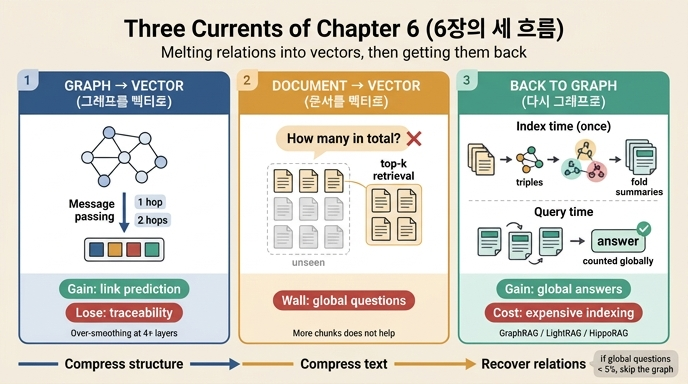

# 6장이 다루는 세 가지 흐름

## 한 줄 답

1. **그래프를 벡터로 누른 쪽** — 지식 그래프 임베딩과 그래프 신경망(GNN)
2. **문서를 벡터로 누른 쪽** — RAG(검색 증강 생성)
3. **양쪽 다 벽에 부딪히고 다시 그래프를 꺼낸 쪽** — GraphRAG 계열

장 제목의 "벡터에 녹인 관계를 되찾는 데 10년이 걸렸다"가 그대로 이 구성입니다. 앞의 둘은 **녹임(누르기)**, 셋째는 **되찾음**입니다.

## 왜 이렇게 세 갈래인가

두 갈래는 **무엇을 벡터로 눌렀느냐**로 나뉩니다.

| 흐름 | 무엇을 눌렀나 | 대표 기술 | 얻은 것 | 잃은 것 |
|---|---|---|---|---|
| ① 그래프 → 벡터 | 노드·엣지의 **구조** | TransE 등 KG 임베딩, GCN·메시지 패싱 | 유사도 계산, 링크 예측 | 되짚기(설명 가능성), 과평활 |
| ② 문서 → 벡터 | 텍스트 **조각(chunk)** | RAG (top-k 검색 + 생성) | 한 조각에 답이 있는 질문 처리 | 전역 질문("전부 몇 건인가") |
| ③ 다시 그래프 | — | GraphRAG, LightRAG, HippoRAG | 전역 요약, 근거 추적 | 비싼 색인, 갱신 어려움 |

이 장의 절 구성도 그대로 대응합니다.

| 절 | 제목 | 대응하는 흐름 |
|---|---|---|
| 6.1 | 구조를 값에 녹이는 방법 | ① 그래프 → 벡터 |
| 6.2 | 문서를 벡터로 눌렀을 때 생기는 벽 | ② 문서 → 벡터 |
| 6.3 | 그래서 다시 그래프를 꺼냈다 | ③ GraphRAG 계열 |

## 흐름 ① 그래프를 벡터로 누르기 (임베딩·GNN)

**핵심 동작은 메시지 패싱**입니다. 한 층을 돌 때마다 이웃의 값을 뭉쳐 자기 값에 섞습니다.

- 1층 → 1홉 이웃이 섞임
- 2층 → 이웃의 이웃(2홉)까지 섞임

예제 `ex3_message_passing.py`의 노드 D를 보면, 0층에서 `[2.0, 1.0]`이던 값에 1층에서 C가, 2층에서 B까지 흘러 들어옵니다. 이것이 "구조가 값에 녹아드는" 과정입니다.

**거래 조건**
- 얻는 것: 이웃이 비슷하면 벡터도 비슷해진다 → 링크 예측이 된다
- 잃는 것: 2층을 지나면 **어느 이웃이 얼마나 기여했는지 되짚기 어렵다**
- 더 깊이 쌓으면 모든 노드가 비슷해진다 → **과평활(over-smoothing)**. GNN을 2~3층에서 멈추는 관행의 이유가 이것입니다.

`ex4_link_prediction.py`는 이 거래의 경계선을 보여 줍니다. 공통 이웃(Adamic-Adar 등)만 세도 되는 예측은 **왜 그런 점수가 나왔는지 되짚을 수 있습니다**. 임베딩이 필요해지는 건 "공통 이웃이 0인데 비슷한" 경우 — 2홉·3홉 구조를 좌표로 눌러 담아야 비교가 됩니다. 그 순간 되짚기 출력이 사라집니다.

> 장 첫머리의 법무팀 질문 "이 사용자한테 왜 이 상품을 추천했는지 설명해 주실 수 있나요"가 바로 이 잃어버린 되짚기를 요구하는 장면입니다.

## 흐름 ② 문서를 벡터로 누르기 (RAG)

조각 검색은 **답이 한 조각 안에 들어 있을 때** 잘 돕니다. 벽은 **전역 질문**에서 생깁니다.

`ex1_rag_limits.py`의 설정: 장애 회고 12건, 질문은 "우리 장애 회고 전체에서 반복되는 원인은 무엇인가?", 정답은 `{멱등성 없음, 재시도}`.

top-4만 뽑으면 나머지 8건에 무엇이 있는지 모르므로 **셀 수가 없습니다**. 이 벽의 실체는 이것입니다.

> k를 12로 올려 전부 넣으면 이 예제에서는 됩니다. 문서가 12건이니까요. 문서가 12만 건이면 못 넣습니다.

즉 **"조각을 더 넣기"로는 못 넘는 벽**입니다. 컨텍스트 창을 키우는 방향으로는 해결되지 않습니다.

## 흐름 ③ 다시 그래프를 꺼내기 (GraphRAG 계열)

풀이는 **세는 시점을 옮기는 것**입니다.

- **색인 시점(한 번만)**: 문서에서 트리플을 뽑아 그래프를 만들고, 커뮤니티 탐지로 뭉치를 찾고, 뭉치마다 요약을 **접어 둔다**
- **질의 시점**: 접어 둔 요약을 **펴기만 한다**

`ex2_graphrag_lite.py`는 라벨 전파(label propagation)로 커뮤니티를 찾고, 커뮤니티별 원인 분포를 합쳐 정답 `{멱등성 없음, 재시도}`에 도달합니다. (진짜 GraphRAG는 요약문을 모델이 씁니다. 예제가 보여 주려는 건 요약 품질이 아니라 **언제 접느냐**입니다.)

**대가**: 색인이 비싸고, 문서가 바뀌면 다시 접어야 합니다. 자주 바뀌는 데이터에는 안 맞습니다.

**정직한 결론**: 사실 조회(단일 조각으로 답이 나오는 질문)에서는 그래프를 붙인 쪽이 **살짝 집니다**. 전역 질문 비율이 5%도 안 되면 안 붙이는 게 맞습니다.

## 기억용 뼈대

> 눌렀다(그래프→벡터) · 눌렀다(문서→벡터) · 벽에 부딪혀 다시 꺼냈다(GraphRAG)

세 흐름 모두 같은 축을 공유합니다: **압축해서 얻는 것 vs. 되짚기로 잃는 것**.

## 1차 출처

| 키워드 | 상태 | 출처 |
|---|---|---|
| 그래프 신경망 개괄 | 사실상 표준 | https://arxiv.org/abs/1812.08434 |
| 메시지 패싱 | 사실상 표준 | https://arxiv.org/abs/1704.01212 |
| 그래프 합성곱 (GCN) | 사실상 표준 | https://arxiv.org/abs/1609.02907 |
| 지식 그래프 임베딩 (TransE) | 사실상 표준 | https://papers.nips.cc/paper/5071-translating-embeddings-for-modeling-multi-relational-data |
| 검색 증강 생성 (RAG) | 사실상 표준 | https://arxiv.org/abs/2005.11401 |
| Microsoft GraphRAG | 사실상 표준 | https://github.com/microsoft/graphrag |
| LightRAG | 실험 | https://arxiv.org/abs/2410.05779 |
| HippoRAG | 실험 | https://arxiv.org/abs/2405.14831 |

## 인포그래픽

