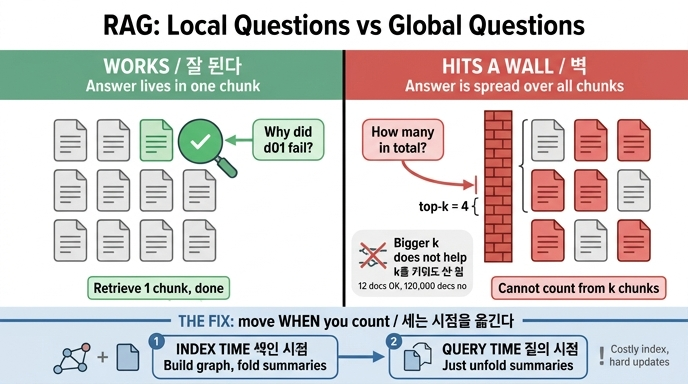

# 조각 검색(RAG)이 잘 되는 질문과 벽에 부딪히는 질문

## 카드

**질문** — 조각 검색(RAG)은 어떤 질문에 잘 동작하고 어떤 질문에 벽이 있는가?

**답** — 답이 한 조각에 들어 있을 때 잘 동작한다. 「전부 몇 건인가」 같은 전역 질문에는 벽이 있고, 조각을 더 넣어도 넘어지지 않는다.

---

## 한 줄로 먼저

조각 검색의 성패는 **"정답이 어디에 흩어져 있느냐"** 하나로 갈린다.
정답이 한 조각(청크) 안에 뭉쳐 있으면 top-k 검색이 그걸 집어 오기만 하면 끝이고,
정답이 말뭉치 **전체에 흩뿌려져 있으면** k를 아무리 키워도 못 집는다.

---

## 조각 검색은 원래 무엇을 하는 장치인가

RAG(Retrieval-Augmented Generation, 검색 증강 생성)의 기본 회로는 이렇다.

1. **색인 시점**: 문서를 조각(chunk)으로 쪼갠다 → 각 조각을 벡터로 만들어 저장한다.
2. **질의 시점**: 질문을 같은 방식으로 벡터화한다 → 가장 가까운 **상위 k개 조각**을 꺼낸다 → 그 k개를 프롬프트에 붙여 모델에게 답을 시킨다.

여기서 놓치기 쉬운 전제가 하나 있다. 이 회로는 **"정답을 담은 조각이 존재한다"**를 가정한다.
검색기가 하는 일은 그 조각을 *찾아 주는 것*이지, 여러 조각을 *합쳐 주는 것*이 아니다.

원 논문: [RAG (Lewis et al., 2020)](https://arxiv.org/abs/2005.11401)

---

## 잘 도는 질문 — 국소(local) 질문

답이 한 조각에 통째로 들어 있는 질문이다.

- 「d01 장애의 원인이 뭐였지?」 → d01 조각 하나만 꺼내면 답이 나온다.
- 「멱등 키를 안 써서 생긴 사고 사례 하나만 보여 줘」 → 해당 조각 하나면 충분하다.
- 「환불 금액 오류는 왜 났나?」 → d11 조각에 다 적혀 있다.

이런 질문은 검색기의 정확도만 좋으면 되고, k를 조금 올리면 재현율이 올라가면서 품질도 같이 올라간다.
**k를 늘리는 것이 실제로 도움이 되는 영역**이다.

---

## 벽에 부딪히는 질문 — 전역(global) 질문

말뭉치 **전체를 훑고 세어야** 답이 나오는 질문이다.

- 「우리 장애 회고 전체에서 **반복되는** 원인은 무엇인가?」
- 「그 원인이 **전부 몇 건**인가?」
- 「올해 회고 전체의 **주제를 요약**해 줘」
- 「가장 자주 등장하는 팀/서비스는?」

6장 예제 말뭉치(`corpus.py`)로 보면 정답은 `{"멱등성 없음", "재시도"}`다.
그런데 이건 12건을 **전부 세어야** 나오는 답이다.

`ex1_rag_limits.py`가 보여 주는 실패는 정확히 이 지점이다.

```
질문: 우리 장애 회고 전체에서 반복되는 원인은 무엇인가?

상위 4개 조각
  [...] d01 결제 서비스 장애. 재시도 로직이 중복 결제를 만들었다. 멱등 키가 없었다.
  ...
이 4개만 보고 «반복되는 원인»을 셀 수 있나?
전체 12건 중 4건만 봤다. 나머지 8건에 무엇이 있는지 모른다.
```

여기서 핵심 대사가 나온다.

> k 를 12로 올려 전부 넣으면? 이 예제에서는 된다. 문서가 12건이니까.
> **문서가 12만 건이면 못 넣는다. 그게 이 한계의 실체다.**

---

## 왜 "조각을 더 넣어도" 안 넘어지는 벽인가

"k를 키우면 되지 않나?"는 가장 자연스러운 반사 반응이고, 그래서 이 카드의 핵심이기도 하다.
k 증가로는 못 넘는 이유가 세 겹이다.

### 1. 규모 — 전역 질문의 정답 근거는 말뭉치 크기에 비례한다

「전부 몇 건인가」의 근거는 원리상 **문서 전부**다.
k를 N(문서 총수)까지 올려야 정답이 보장되는데, N이 12면 되고 12만이면 안 된다.
즉 **k 증가는 규모에 대해 확장되지 않는(non-scaling) 해법**이다. 장난감 예제에서만 통한다.

### 2. 검색기의 성질 — 유사도는 "세기"를 모른다

top-k 검색은 질문 벡터와 **비슷한** 조각을 고른다.
그런데 「반복되는 원인」이라는 질문 벡터는 특정 원인 단어와 특별히 가깝지 않다.
빈도가 높은 원인일수록 뽑히는 것도 아니다 — 오히려 TF-IDF 계열에서는 **여러 문서에 흔한 항목의 가중치가 내려간다**(IDF).
집계·계수 질문에서 검색 점수는 정답 신호가 아니다.

### 3. 맥락창을 키워도 남는 문제

컨텍스트가 커져 조각을 잔뜩 넣더라도, 모델은 수만 건에 대해 정확한 계수·집계를 신뢰성 있게 못 한다
(중간이 묻히는 현상, 토큰 비용, 지연). 그리고 애초에 어떤 크기의 맥락창도 말뭉치 성장 속도를 못 따라간다.

**정리**: 이건 검색 품질(정밀도/재현율)의 문제가 아니라 **질문의 유형(scope)이 다른 문제**다.
튜닝으로 고치는 결함이 아니라, 구조적으로 다른 답을 요구하는 벽이다.

---

## 그래서 풀이는 무엇인가 — "세는 시점"을 옮긴다

6장의 결론은 명쾌하다. 벽을 정면으로 밀지 말고 **세는 타이밍을 바꾼다**.

| | 조각 검색(RAG) | GraphRAG 계열 |
|---|---|---|
| 전체를 훑는 시점 | 훑을 기회가 없음 (질의 시점에 k개만) | **색인 시점**에 한 번 전부 훑음 |
| 색인 시점에 하는 일 | 청크를 벡터화해 저장 | 엔티티/관계 추출 → 그래프 구성 → 커뮤니티 탐지 → **커뮤니티 요약을 접어 둠** |
| 질의 시점에 하는 일 | 유사한 k개를 꺼내 붙임 | 접어 둔 요약을 **펴서** 합침 |
| 전역 질문 | 벽 | 답할 수 있음 |

`ex2_graphrag_lite.py`가 이걸 최소 구현으로 보여 준다.
트리플로 그래프를 만들고 → 라벨 전파(label propagation)로 커뮤니티를 찾고 → 커뮤니티마다 원인 분포를 요약해 접어 둔다.
질의 시점에는 커뮤니티 요약만 합치면 `{"멱등성 없음", "재시도"}`가 나온다.

```
달라진 건 «언제 세느냐»이다.
조각 검색은 질의 시점에 k개만 본다. 전체를 셀 기회가 없다.
GraphRAG 는 색인 시점에 전부 훑어 접어 두고, 질의 시점에는 접어 둔 것만 편다.
```

관련 구현: [Microsoft GraphRAG](https://github.com/microsoft/graphrag) · [LightRAG](https://arxiv.org/abs/2410.05779) · [HippoRAG](https://arxiv.org/abs/2405.14831)

---

## 공짜가 아니다 — 반대쪽 정직한 이야기

카드 답을 "그러니까 GraphRAG를 쓰자"로 읽으면 6장의 절반만 가져간 것이다. 장 요약이 붙여 놓은 단서가 있다.

- **색인이 비싸다.** 엔티티 추출과 커뮤니티 요약에 모델 호출이 대량으로 든다.
- **갱신이 어렵다.** 문서가 바뀌면 다시 접어야 한다. 자주 바뀌는 데이터에는 안 맞는다.
- **사실 조회에서는 오히려 진다.** 그래프를 붙인 쪽이 단순 사실 검색에서는 살짝 성능이 떨어진다.
- **비율로 판단하라.** 전역 질문 비율이 **5%도 안 되면 안 붙이는 게 맞다.**

즉 이 카드의 실전 판단 기준은 이렇게 정리된다.

> 내 질문 분포에서 「전부/몇 건/전체 요약」류가 몇 퍼센트인가?
> 낮으면 조각 검색으로 충분하다. 높으면 색인 시점에 접어 두는 비용을 지불할 가치가 있다.

---

## 기억용 요약

- **국소 질문**(답이 한 조각) → RAG가 잘한다. k 늘리면 좋아진다.
- **전역 질문**(전부 세야 함) → RAG의 벽. **k를 늘려도 안 넘어진다.**
- 벽의 실체 = 정답 근거가 말뭉치 크기에 비례 + 유사도는 빈도를 모름.
- 풀이 = **세는 시점을 질의 시점 → 색인 시점으로 이동**(GraphRAG).
- 대가 = 비싼 색인, 어려운 갱신, 사실 조회 소폭 손해. 전역 질문 5% 미만이면 붙이지 말 것.

## 인포그래픽


