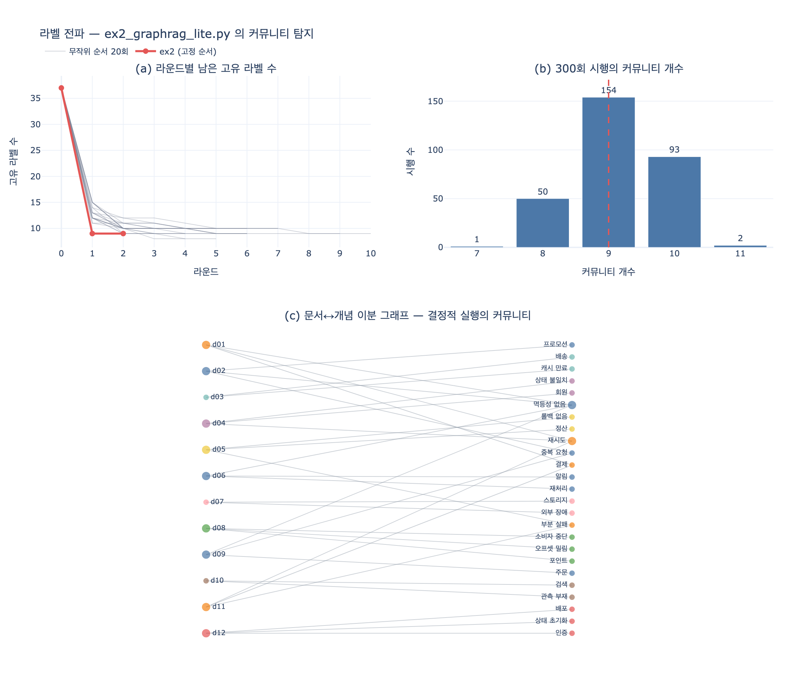

# `ex2_graphrag_lite.py` 의 커뮤니티 탐지 알고리즘은 무엇인가?

> **답** — 라벨 전파(label propagation)를 직접 구현했다.
> 이웃에서 가장 흔한 라벨을 가져오는 과정을 몇 바퀴 돌리면 노드가 뭉친다.

파일 첫머리 독스트링이 그대로 말해 준다.

```python
"""
예제 2 — 같은 질문을 GraphRAG 방식으로. 색인 시점에 접어 둔다.
...
의존성 없음. 커뮤니티 탐지는 라벨 전파(label propagation)를 직접 구현했다.
"""
```

핵심은 **직접 구현했다**는 부분이다. `networkx` 도, `igraph` 도, `python-louvain` 도 안 쓴다.
6장 예제 전체의 원칙이 「의존성 없음」이라서, 표준 라이브러리 `collections` 만으로 쓸 수 있는
알고리즘 중 가장 짧은 것을 골랐다.

---

## 1. 코드 — 이게 전부다

```python
def label_propagation(adj, rounds=12):
    """이웃에서 제일 흔한 라벨을 가져온다. 몇 바퀴 돌면 뭉친다."""
    label = {n: i for i, n in enumerate(sorted(adj))}   # ① 전원 서로 다른 라벨
    for _ in range(rounds):                             # ② 몇 바퀴
        changed = False
        for n in sorted(adj):
            if not adj[n]:
                continue
            best = Counter(label[m] for m in adj[n]).most_common(1)[0][0]  # ③ 이웃 최빈
            if label[n] != best:
                label[n] = best                          # ④ 즉시 반영 (비동기)
                changed = True
        if not changed:                                  # ⑤ 안 바뀌면 끝
            break
    groups = defaultdict(list)
    for n, l in label.items():
        groups[l].append(n)
    return [sorted(v) for v in groups.values() if len(v) > 1]   # ⑥ 싱글톤 버림
```

18줄. 목적함수도, 파라미터 튜닝도, 외부 패키지도 없다.
전체 흐름에서 이 함수의 자리는 **색인 시점**이다.

```
TRIPLES → build_graph()  →  label_propagation()  →  summarize()  →  (접어 둔 요약)
          문서↔개념 이분 그래프   커뮤니티 탐지        커뮤니티별 원인 집계
                                    ↑ 여기
──────────────────────── 색인 시점 (한 번만) ────────────────────────
──────────────────────── 질의 시점 (매번) ──────────────────────────
                                                 (접어 둔 요약) → 합쳐서 답
```

---

## 2. 라벨 전파란 — Raghavan, Albert, Kumara (2007)

원논문은 *Near linear time algorithm to detect community structures in large-scale networks*,
Phys. Rev. E **76**, 036106 ([arXiv:0709.2938](https://arxiv.org/abs/0709.2938)).
절차는 세 줄로 끝난다.

**① 초기화** — 모든 노드에 서로 다른 라벨을 준다.

$$\ell_v^{(0)} = v \qquad \text{(노드 수만큼의 라벨)}$$

**② 갱신** — 노드를 훑으며 이웃의 최빈 라벨을 가져온다.

$$\ell_v \;\leftarrow\; \arg\max_{L}\; \bigl|\{\, u \in N(v) \;:\; \ell_u = L \,\}\bigr|$$

동률이면 그중 하나를 **무작위로** 고른다.
갱신은 **비동기(asynchronous)** — 방금 바꾼 라벨을 같은 라운드의 다음 노드가 곧바로 본다.
(동기 갱신은 이분 그래프에서 두 라벨이 서로 뒤바뀌며 영원히 진동한다. 논문이 비동기를 쓰는 이유다.)

**③ 정지** — 모든 노드가 이미 이웃 최빈 라벨 중 하나를 갖고 있으면 멈춘다.

$$\forall v:\quad \ell_v \in \arg\max_{L} \bigl|\{u \in N(v) : \ell_u = L\}\bigr|$$

이때 남은 라벨 하나하나가 커뮤니티다.

**비용**: 라운드당 $O(m)$ (간선 수에 비례), 라운드 수가 그래프 크기와 거의 무관해서 **거의 선형**.
이름의 "near linear time" 이 그 뜻이다.

**직관**: 소문이 퍼지는 그림에 가깝다. 서로 촘촘히 붙어 있는 무리 안에서는 라벨 하나가
금방 무리 전체를 장악하고, 무리 사이는 다리가 가늘어서 라벨이 잘 못 넘어간다.
그 결과 남는 라벨 경계가 곧 커뮤니티 경계다.

### `ex2` 가 원논문에서 바꾼 것

| | 원논문 | `ex2_graphrag_lite.py` |
|---|---|---|
| 노드 방문 순서 | 매 라운드 **무작위** 섞기 | `for n in sorted(adj)` — 이름 오름차순 **고정** |
| 동률 타이브레이크 | **무작위** 선택 | `Counter(...).most_common(1)` — 집합 순회 순서에 맡김 |
| 정지 | 라벨 안정 시 | `changed` 플래그 + `rounds=12` 상한 |
| 반환 | 모든 그룹 | `len(v) > 1` — 싱글톤(고립 노드) 버림 |

방문 순서를 고정한 건 재현성을 노린 것이다. 하지만 **타이브레이크는 못 막았고**,
그게 4절의 문제가 된다.

---

## 3. 이 그래프에서 실제로 무슨 일이 일어나나

`corpus.py` 의 트리플 33개로 만든 그래프는 **노드 37개 = 문서 12 + 개념 25**,
간선 33개인 **이분(bipartite)** 구조다. 문서끼리, 개념끼리 직접 이어진 간선은 없다.

```
d01 ──┬── 재시도 ──┬── d04
      ├── 멱등성 없음 ──┬── d02
      └── 결제           ├── d06
                         └── d09
```

문서 두 건이 한 뭉치에 들어가려면 반드시 **공유 개념(허브)** 을 거쳐야 한다.
차수가 가장 큰 `멱등성 없음`(4), `재시도`(3) 가 그 다리다.

라벨이 줄어드는 속도는 놀랍게 빠르다 — **37개 → 9개, 한 바퀴 만에.**

```
라운드 1: 라벨 바뀐 노드 28개 → 남은 고유 라벨 9개
라운드 2: 라벨 바뀐 노드  0개 → 남은 고유 라벨 9개   ← changed==0, 조기 종료
```

`rounds=12` 는 진동을 막는 안전판일 뿐, 실제로는 2~5바퀴면 끝난다.

결과 커뮤니티는 이렇게 생겼다(결정적 타이브레이크 기준).

```
C1 (n=9) 문서=[d02, d06, d09]  개념=[멱등성 없음, 알림, 재처리, 주문, 중복 요청, 프로모션]
C2 (n=5) 문서=[d01, d11]       개념=[결제, 부분 실패, 재시도]
C3~C9    문서 1건 + 자기만 쓰는 개념 2개짜리 파편
```

**C1 이 이 예제가 노리는 그림이다.** `멱등성 없음` 이라는 개념 노드 하나가
세 건의 회고 문서를 한 뭉치로 끌어당겼다. 문서를 따로따로 읽어서는 안 보이던
**반복 패턴**이, 색인 시점에 그래프로 뭉쳐 두면 커뮤니티 하나로 드러난다.

이어지는 `summarize()` 는 커뮤니티 안에서 **문서와 원인이 둘 다 같은 뭉치에 있는**
트리플만 센다. 즉 **커뮤니티 분할이 곧 집계 단위**다. 이 사실이 다음 절의 핵심이다.

---

## 4. 비결정성 — 이 알고리즘의 진짜 함정

라벨 전파에는 **두 개의 자유도**가 있고, 둘 다 결과를 바꾼다.

1. **노드 방문 순서** — 비동기 갱신이라 누구를 먼저 보느냐가 라벨의 흐름 방향을 정한다.
2. **동률 타이브레이크** — 이분 그래프에서 차수 2짜리 노드는 거의 항상 1:1 동률이다.

`ex2` 는 `sorted(adj)` 로 1번을 막았다. 하지만 2번은 열려 있다.

```python
best = Counter(label[m] for m in adj[n]).most_common(1)[0][0]
```

`adj[n]` 은 **`set`** 이고, 파이썬 3의 문자열 해시는 프로세스마다 무작위화된다(`PYTHONHASHSEED`).
`Counter` 는 동률을 삽입 순서로 깨므로, 결국 **집합 순회 순서 = 해시 시드**가 타이브레이크를 정한다.
즉 `ex2_graphrag_lite.py` 는 같은 입력으로 **실행할 때마다 다른 커뮤니티**를 낸다.

직접 확인할 수 있다.

```bash
cd content/ch06/code
for i in 1 2 3 4 5; do python3 ex2_graphrag_lite.py | grep '^답:'; done
# 답: ['멱등성 없음', '재시도']      ← 정답
# 답: ['재시도', '중복 요청']
# 답: ['재시도', '중복 요청']
# 답: ['재시도', '캐시 만료']
# 답: ['부분 실패', '재시도']
```

`expy.py` 에서 두 자유도를 명시적으로 흔들어 300회 측정한 결과다.

| 지표 | 관측 범위 |
|---|---|
| 커뮤니티 개수 | 7 ~ 11 (최빈 9) |
| 최대 커뮤니티 크기 | 4 ~ 16 |
| 최종 답 | 4가지로 갈림 |
| **정답 적중률** | **101 / 300 = 33.7%** |

**책 본문의 "맞았나: 예" 는 알고리즘의 보증이 아니라 그 실행에서의 운이다.**

그렇다고 예제의 논지가 무너지지는 않는다. 논지는 "라벨 전파가 정확하다" 가 아니라
**"세는 시점을 색인 시점으로 옮기면 전역 질문에 답할 창구가 생긴다"** 이기 때문이다.
라벨 전파는 그 창구를 20줄로 만들어 보여 주는 **자리 표시자(placeholder)** 이고,
이 흔들림 자체가 실제 GraphRAG 가 굳이 Leiden 을 쓰는 이유이기도 하다.

### 완화하는 세 가지

| 방법 | 하는 일 | 대가 |
|---|---|---|
| **결정적 타이브레이크** | `sorted(adj[n])` 로 순회 + 동률이면 라벨 최솟값 | 재현되지만 이름 순 편향이 생김 |
| **시드 고정** | `random.Random(seed)` 로 순서·타이브레이크 재현 | 여전히 시드마다 다른 답 |
| **합의 클러스터링** | $R$ 회 돌려 «같은 뭉치에 든 비율» 행렬을 만들고 임계값으로 자름 | 비용 $R$ 배 |

첫 번째만으로도 재현성은 얻는다 — 단, 재현되는 답이 **맞는 답은 아니다**.
`expy.py` 의 결정적 실행은 `['멱등성 없음', '중복 요청']` 이라는 **틀린 답**을 안정적으로 낸다.

세 번째(합의 클러스터링, Lancichinetti & Fortunato 2012)는 더 값진 걸 준다 —
**불확실성의 지도**다. 200회 합의 결과에서

- `d04 — 상태 불일치 — 회원` 같이 잎(차수 1)이 자기 문서에 붙는 쌍은 **100%** 로 굳고,
- `부분 실패` 는 `d05`(정산)와 `d11`(결제) **양쪽에 걸친 다리**라서 50~55% 에서 진동한다.

"이 뭉치는 믿을 만하고 저 뭉치는 아니다" 를 알려 주는 신호다.
다만 비용을 200배 쓴다. 그럴 바에는 애초에 목적함수가 있는 알고리즘을 쓰는 게 맞다.

---

## 5. 왜 Louvain / Leiden 이 아니었나

| | **라벨 전파** (2007) | **Louvain** (2008) | **Leiden** (2019) |
|---|---|---|---|
| 목적함수 | **없음** (지역 규칙) | 모듈도 $Q$ 탐욕 최적화 | 모듈도/CPM + refinement |
| 계층 구조 | **없음** (평평한 1단) | 있음 (aggregate 반복) | 있음 |
| 품질 보증 | 없음 | 커뮤니티가 **끊길 수** 있음 | 연결성 보장, 수렴 시 국소 최적 |
| 해상도 조절 | 불가 | resolution 파라미터 | resolution / `max_cluster_size` |
| 구현 | **~20줄, 의존성 0** | 수백 줄 | 사실상 라이브러리 필수 |
| 결정성 | 순서·타이 의존 | 순서 의존 | 순서 의존(시드 고정 필요) |
| 비용 | 거의 선형 $O(m)$ | $O(n \log n)$ 수준 | Louvain 과 비슷하거나 빠름 |

Louvain·Leiden 이 최적화하는 모듈도는

$$Q = \frac{1}{2m}\sum_{i,j}\Bigl[A_{ij} - \frac{k_i k_j}{2m}\Bigr]\delta(c_i, c_j)$$

— "무작위 그래프였다면 기대되는 것보다 커뮤니티 내부 간선이 얼마나 더 많은가" 다.
라벨 전파는 이 $Q$ 를 **쳐다보지도 않는다**. 그래서 빠르고, 그래서 보증이 없다.

Leiden 논문(Traag, Waltman, van Eck 2019, *From Louvain to Leiden: guaranteeing
well-connected communities*, [arXiv:1810.08473](https://arxiv.org/abs/1810.08473))이
지적한 Louvain 의 결함은 구체적이다 — Louvain 이 내놓은 커뮤니티가 **내부적으로 끊겨 있을 수**
있다. Leiden 은 refinement 단계를 넣어 이를 막는다.

**그럼에도 책이 라벨 전파를 고른 이유는 하나다: 6장 예제의 원칙이 「의존성 없음」이기 때문.**
`pip install python-louvain igraph graspologic` 를 시키는 순간
독자가 보려던 것(= **언제 접느냐**)이 설치 안내에 묻힌다.
장의 논지는 커뮤니티 탐지 알고리즘의 우열이 아니라 **집계 시점의 이동**이다.

---

## 6. 실제 GraphRAG 는 무엇을 쓰나 — 계층적 Leiden

[Microsoft GraphRAG](https://github.com/microsoft/graphrag) 는 **Leiden** 을 쓴다.
그것도 평평한 Leiden 이 아니라 **계층적 Leiden**(Microsoft Research 의
[`graspologic`](https://github.com/microsoft/graspologic) 라이브러리의 `hierarchical_leiden`)이다.

큰 커뮤니티를 크기 상한(`max_cluster_size`, 기본값 **10**) 아래로 쪼개질 때까지 재귀적으로
나눠서 **레벨 0 / 1 / 2 …** 의 커뮤니티 **트리**를 만든다. 그리고 그 트리의
**레벨마다 커뮤니티 요약(community report)을 LLM 이 작성**한다.
전역 질의(global search)는 레벨을 하나 골라 그 레벨의 요약들을 map-reduce 로 훑는다.

`ex2` 에 없고 실제 GraphRAG 에 있는 것을 정리하면:

| | `ex2_graphrag_lite.py` | Microsoft GraphRAG |
|---|---|---|
| 알고리즘 | 라벨 전파 (자체 구현 18줄) | 계층적 Leiden (`graspologic`) |
| 해상도 | 하나 (평평) | 레벨 트리 (`max_cluster_size=10`) |
| 간선 가중치 | 없음 (트리플 유무만) | 엔티티 쌍의 동시 등장 횟수 |
| 연결성 보장 | 없음 | Leiden refinement 로 보장 |
| 커뮤니티 요약 | `Counter` 규칙 기반 | **LLM 이 작성** (community report) |
| 질의 | 요약 합쳐서 카운트 | global / local / drift search |

책이 명시하는 것과 같다 —
> `ex2` 의 요약문은 규칙으로 만듭니다. 진짜 GraphRAG 는 모델이 씁니다.
> 여기서 보여 주려는 건 요약 품질이 아니라 **언제 접느냐**입니다.

같은 문장을 커뮤니티 탐지에도 적용하면 된다.
**여기서 보여 주려는 건 커뮤니티 품질이 아니라 「색인 시점에 뭉쳐 둔다」는 구조다.**

---

## 7. 한 줄 정리

`ex2_graphrag_lite.py` 의 커뮤니티 탐지는 **라벨 전파** — 이웃의 최빈 라벨을 가져오는
규칙을 몇 바퀴 돌리는 것뿐이다. **의존성 없이 20줄**로 되니까 골랐고, 그 대가로
**목적함수도, 계층도, 결정성도 없다.** 실제 GraphRAG 는 같은 자리에 **계층적 Leiden** 을 놓는다.

### 출처

- Raghavan, Albert, Kumara (2007), *Near linear time algorithm to detect community structures in large-scale networks* — [arXiv:0709.2938](https://arxiv.org/abs/0709.2938)
- Blondel et al. (2008), *Fast unfolding of communities in large networks* (Louvain) — [arXiv:0803.0476](https://arxiv.org/abs/0803.0476)
- Traag, Waltman, van Eck (2019), *From Louvain to Leiden* — [arXiv:1810.08473](https://arxiv.org/abs/1810.08473)
- Lancichinetti & Fortunato (2012), *Consensus clustering in complex networks* — [arXiv:1203.6093](https://arxiv.org/abs/1203.6093)
- [Microsoft GraphRAG](https://github.com/microsoft/graphrag) / [Community detection 문서](https://www.mintlify.com/microsoft/graphrag/concepts/community-detection)
- 원 코드: `content/ch06/code/ex2_graphrag_lite.py`, `content/ch06/code/corpus.py`

## 시각화



- **(a)** 라운드별 남은 고유 라벨 수. 빨간 선이 `ex2` 방식(고정 순서), 회색이 무작위 순서 20회.
  37 → 9 로 **한 바퀴 만에** 떨어지는 게 라벨 전파가 빠른 이유다.
- **(b)** 순서·타이브레이크를 흔든 300회 시행의 커뮤니티 개수 분포. 7~11 사이에서 출렁인다.
- **(c)** 문서↔개념 이분 그래프. 색이 결정적 실행의 커뮤니티. 왼쪽이 회고 문서 12건,
  오른쪽이 개념 25개. 점 크기는 차수 — 큰 점(`멱등성 없음`, `재시도`)이 문서들을 묶는 다리다.
