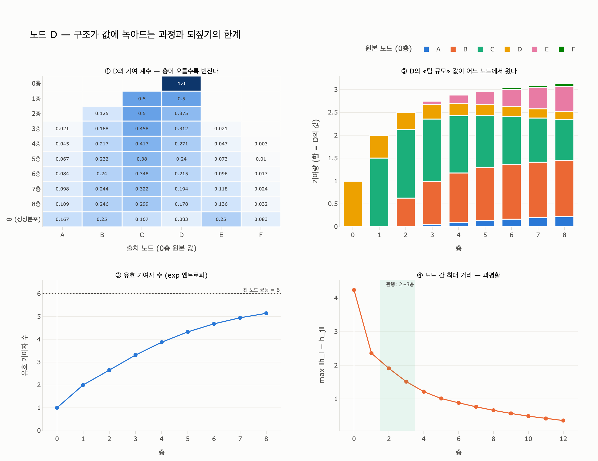

# `ex3_message_passing.py`에서 노드 D의 변화가 보여 주는 것

## 한 줄 답

0층에서 `[2.0, 1.0]`이던 값에 1층에서 C의 값이, 2층에서 B의 값까지 흘러든다.
**구조가 값에 녹아드는 과정**이다.

---

## 1. 무대 설정

예제의 그래프는 간선 6개짜리 장난감이다.

```
A ── B ── C ── D
│    │
└─ E ─┘
   │
   F
```

| 노드 | 이웃 | 차수 | 0층 특징 `[장애 횟수, 팀 규모]` |
|---|---|---|---|
| A | B, E | 2 | `[4.0, 2.0]` |
| B | A, C, E | 3 | `[1.0, 5.0]` |
| C | B, D | 2 | `[0.0, 3.0]` |
| **D** | **C** | **1** | **`[2.0, 1.0]`** |
| E | A, B, F | 3 | `[3.0, 4.0]` |
| F | E | 1 | `[0.0, 2.0]` |

D는 **이웃이 C 하나뿐인 말단 노드**다. 그래서 정보가 스며드는 순서가 깔끔하게 보인다.
이 카드가 D를 고른 이유가 그것이다.

한 층의 규칙은 이렇다 (학습 가중치도 활성화도 없다).

$$h_v^{(l+1)} = \tfrac12 h_v^{(l)} + \tfrac12 \cdot \frac{1}{|N(v)|}\sum_{u \in N(v)} h_u^{(l)}$$

「자기 절반 + 이웃 평균 절반」. 이게 전부다.

---

## 2. 실제 실행 결과

```
$ python3 content/ch06/code/ex3_message_passing.py

0층 — 자기 특징만
  A: [4.0, 2.0]   B: [1.0, 5.0]   C: [0.0, 3.0]
  D: [2.0, 1.0]   E: [3.0, 4.0]   F: [0.0, 2.0]

1층 — 이웃(1홉)이 섞였다
  A: [3.0, 3.25]  B: [1.667, 4.0] C: [0.75, 3.0]
  D: [1.0, 2.0]   E: [2.333, 3.5] F: [1.5, 3.0]

2층 — 이웃의 이웃(2홉)까지 섞였다
  A: [2.5, 3.5]   B: [1.847, 3.625] C: [1.042, 3.0]
  D: [0.875, 2.5] E: [2.194, 3.458] F: [1.917, 3.25]
```

D만 따라가면:

| 층 | D의 값 | 무슨 일이 있었나 |
|---|---|---|
| 0 | `[2.0, 1.0]` | D 자신뿐 |
| 1 | `[1.0, 2.0]` | **C가 들어왔다** (D–C는 1홉) |
| 2 | `[0.875, 2.5]` | **B까지 들어왔다** (D–C–B는 2홉) |

`[2.0, 1.0]`은 "장애 2번, 팀 1명"이었다. 2층에서는 `[0.875, 2.5]`다.
D 자체는 아무것도 안 바뀌었는데 값이 바뀌었다. **바뀐 건 D가 아니라 D의 이웃 관계**다.
그 관계가 값 속으로 들어간 것 — 그게 「녹아든다」는 말의 뜻이다.

---

## 3. 층 하나는 사실 행렬 하나다 (기여 계수 추적)

이 예제의 층에는 비선형이 없다. 그래서 **완전히 선형**이고, 전파 행렬로 압축된다.

$$P = \tfrac12 I + \tfrac12 D^{-1}A, \qquad H^{(l)} = P^{\,l} H^{(0)}$$

$P$의 각 행은 합이 1이다(자기 0.5 + 이웃들 합쳐서 0.5). 따라서
**$P^l$의 D행이 곧 "l층 D의 값 중 각 원본 노드가 차지하는 비중"** — 기여 계수다.

| 층 | A | B | C | D | E | F | 기여 노드 수 |
|---|---|---|---|---|---|---|---|
| 0 | · | · | · | **1.000** | · | · | 1 |
| 1 | · | · | **0.500** | 0.500 | · | · | 2 |
| 2 | · | **0.125** | 0.500 | 0.375 | · | · | 3 |
| 3 | **0.021** | 0.188 | 0.458 | 0.312 | **0.021** | · | 5 |
| 4 | 0.045 | 0.217 | 0.417 | 0.271 | 0.047 | **0.003** | 6 |
| 6 | 0.084 | 0.240 | 0.348 | 0.215 | 0.096 | 0.017 | 6 |
| 8 | 0.109 | 0.246 | 0.299 | 0.178 | 0.136 | 0.032 | 6 |
| ∞ | 0.167 | 0.250 | 0.167 | 0.083 | 0.250 | 0.083 | 6 |

굵게 표시한 칸이 **그 노드가 처음 등장하는 층**이다. 정확히 홉 수와 같다.

- D→C = 1홉 → 1층에서 등장
- D→C→B = 2홉 → 2층에서 등장
- D→C→B→{A, E} = 3홉 → 3층에서 등장
- D→…→F = 4홉 → 4층에서 등장

검산해 보면 2층 D의 값은 정확히

$$h_D^{(2)} = 0.125\,B + 0.5\,C + 0.375\,D = 0.125[1,5] + 0.5[0,3] + 0.375[2,1] = [0.875,\ 2.5]$$

카드의 문장이 계수 세 개로 완전히 재현된다.

---

## 4. 그래서 왜 「되짚기 어렵다」인가

예제의 마지막 문단은 이렇게 말한다.

> 잃는 것: 2층을 지나면 어느 이웃이 얼마나 기여했는지 되짚기 어렵다.

이유는 셋이고, 셋 다 위 표에서 나온다.

### (a) 기여자가 늘고 계수가 평평해진다

계수는 합이 1인 분포다. 엔트로피의 지수 $\exp(-\sum_n c_n \log c_n)$로
「유효 기여자 수」를 재면:

| 층 | 유효 기여자 수 | 최대 기여자 | 자기(D) 비중 |
|---|---|---|---|
| 1 | 2.00 | C (0.500) | 0.500 |
| 2 | 2.65 | C (0.500) | 0.375 |
| 3 | 3.31 | C (0.458) | 0.312 |
| 4 | 3.87 | C (0.417) | 0.271 |
| 6 | 4.68 | C (0.348) | 0.215 |
| 8 | 5.14 | C (0.299) | 0.178 |

1층의 "C가 절반"은 설명이 된다. 8층의 "여섯 노드가 대충 골고루"는 설명이 아니다.
법무팀에 가져갈 수 있는 문장이 못 된다.

### (b) 값에서 기여를 역산할 수 없다

실전에서 우리 손에 남는 건 계수가 아니라 **출력 벡터**뿐이다.
미지수는 6노드 × 2차원 = 12개인데 관측은 2개. 애초에 부정방정식이다.

계수를 알아도 마찬가지다. $h_D^{(2)} = 0.125B + 0.5C + 0.375D$ 이므로
$B \mathrel{+}= \delta$, $C \mathrel{-}= 0.25\delta$ 로 맞바꾸면 D의 값은 **정확히 그대로**다.

| | B의 특징 | C의 특징 | 2층 D |
|---|---|---|---|
| 원본 | `[1, 5]` | `[0, 3]` | `[0.875, 2.5]` |
| 변형 | `[5, 9]` | `[-1, 2]` | `[0.875, 2.5]` |

A·B·C·E·F의 2층 값은 전부 달라졌는데 **D만 한 톨도 안 움직였다**.
D의 벡터만 보고서는 두 세계를 구별할 방법이 없다.
"B 때문인가 C 때문인가"에 답이 없다는 뜻이다.

### (c) 과평활(over-smoothing) — 층을 더 쌓으면 모두가 같아진다

$P$는 확률 행렬이라 $l \to \infty$에서 모든 행이 같은 정상 분포로 수렴한다.
무방향 그래프에서 그 분포는 차수 비례다.

$$\pi_n = \frac{\deg(n)}{\sum_m \deg(m)} \quad\Rightarrow\quad
\pi = \{A\,0.167,\ B\,0.25,\ C\,0.167,\ D\,0.083,\ E\,0.25,\ F\,0.083\}$$

50층을 돌리면 D행이 실제로 π와 소수점 셋째 자리까지 같아진다.
**출발 노드가 어디였든 계수가 같아진다** = 모든 노드 벡터가 같은 값이 된다.

| 층 | 노드 간 최대 거리 | D 계수와 π의 거리 |
|---|---|---|
| 0 | 4.243 | 1.833 |
| 2 | 1.908 | 1.250 |
| 4 | 1.215 | 0.875 |
| 8 | 0.659 | 0.453 |
| 12 | 0.356 | 0.239 |

D의 값이 D에 대해 아무것도 말해 주지 않게 된다.

---

## 5. 그래서 2~3층

| 층수 | 얻는 것 | 잃는 것 |
|---|---|---|
| 1 | 1홉 이웃을 안다 | 거의 없음 |
| **2~3** | **2~3홉을 안다. 링크 예측이 되는 지점** | **기여자 3~5개, 아직 읽힌다** |
| 4+ | 그래프 전체를 안다 | 유효 기여자 4~6개, 계수가 π로 수렴 |
| ∞ | 아무것도 모른다 | 모든 노드가 같은 벡터 |

예제의 마지막 줄 — "2~3층에서 멈추는 게 관행인데, 그 관행의 이유가 여기 있다" — 가
이 표다. **이득은 2층이면 대체로 얻고, 손실은 그 위에서 급격히 커진다.**

이 장 서두의 질문("이 사용자한테 왜 이 상품을 추천했는지 설명해 주실 수 있나요")이
어려운 이유도 같다. 값에 녹은 구조는 되찾기가 힘들다.
6장 제목의 "10년이 걸렸다"는 그 되찾음의 이야기다.

---

## 함께 볼 것

- 원본 예제: `content/ch06/code/ex3_message_passing.py`
- [Neural Message Passing for Quantum Chemistry](https://arxiv.org/abs/1704.01212) — 메시지 패싱 정식화
- [Semi-Supervised Classification with Graph Convolutional Networks (GCN)](https://arxiv.org/abs/1609.02907) — 여기서 쓴 「자기 + 이웃 평균」의 학습 가능 버전
- 되짚기 문제의 다른 얼굴: 같은 장 `ex4_link_prediction.py` (되짚을 수 있는 예측과 없는 예측)

---

## 시각화



- **①** 층별 D의 기여 계수 행렬($P^l$의 D행). 0층 one-hot이 층마다 옆으로 번지고, 마지막 줄 ∞에서 정상 분포로 끝난다.
- **②** D의 «팀 규모» 값을 원본 노드별 기여량으로 쌓았다. 막대 전체 높이가 그 층의 D 값이다.
- **③** 유효 기여자 수. 1 → 6으로 올라갈수록 "누가 기여했나"라는 질문의 답이 사라진다.
- **④** 노드 벡터 간 최대 거리. 0으로 수렴하는 것이 과평활이고, 초록 띠가 관행적 2~3층 구간이다.

재현: `python3 expy.py`
