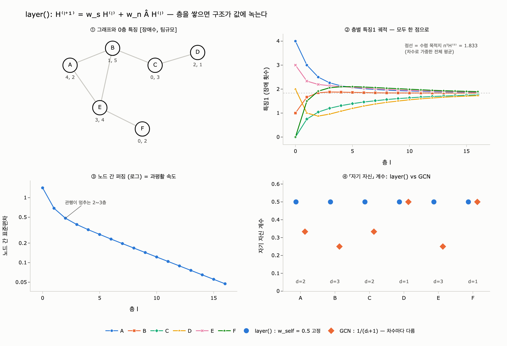

# `ex3_message_passing.py` 의 `layer()` 는 무엇을 계산하는가

## 한 줄 답

**각 노드마다 「자기 벡터」와 「이웃 벡터들의 평균」을 가중합한다.** 기본값은 `w_self=0.5`, `w_nbr=0.5`.
진짜 GNN 은 여기에 학습 가중치가 붙는다.

$$h_i^{(l+1)} \;=\; w_s\, h_i^{(l)} \;+\; w_n \cdot \frac{1}{|N(i)|}\sum_{j \in N(i)} h_j^{(l)}$$

---

## 1. 코드가 하는 일을 한 줄씩

```python
def layer(feat, adj, w_self=0.5, w_nbr=0.5):
    """한 층: 자기 벡터와 이웃 평균을 섞는다. 진짜 GNN 은 여기에 학습 가중치가 붙는다."""
    out = {}
    for n, v in feat.items():
        nbrs = adj[n]
        if nbrs:
            avg = [sum(feat[m][i] for m in nbrs) / len(nbrs) for i in range(len(v))]
        else:
            avg = [0.0] * len(v)
        out[n] = [round(w_self * v[i] + w_nbr * avg[i], 3) for i in range(len(v))]
    return out
```

| 줄 | 하는 일 | GNN 용어 |
|---|---|---|
| `nbrs = adj[n]` | 이웃 목록을 가져온다 | 이웃 수집 |
| `avg = [...]` | 이웃 벡터를 **차원별로 평균** | 집계(aggregate), 여기서는 `mean` |
| `w_self * v + w_nbr * avg` | 자기 값과 섞는다 | 갱신(update), self-loop 대신 명시적 자기 항 |
| `out` 을 따로 만든다 | 갱신값이 서로 영향 주지 않는다 | **동기 갱신**(Jacobi), Gauss–Seidel 아님 |

세 가지 짚어 둘 점.

- **이웃 평균에 자기 자신은 안 들어간다.** $j \in N(i)$ 뿐이다. 자기 기여는 `w_self` 항으로만 들어온다.
  진짜 GCN 은 반대로 self-loop 를 인접행렬에 넣어 버린다(뒤에서 본다).
- **`out` 을 새로 만들기 때문에** 한 층 안에서는 모든 노드가 같은 시점의 값(`feat`)만 읽는다.
  중간에 갱신된 값을 다시 쓰면 노드를 훑는 순서가 결과를 바꿔 버린다.
- **고립 노드**(`nbrs` 가 비었을 때)는 `avg = 0` 이라 $h_i^{(l+1)} = w_s h_i^{(l)}$, 즉 값이 그냥 절반으로 줄어든다.
  예제 그래프에는 고립 노드가 없어 이 갈래는 안 탄다.

### 예제 그래프에서 D 노드 따라가기

간선은 `A-B, B-C, C-D, A-E, E-F, B-E`. 차수는 A:2, B:3, C:2, D:1, E:3, F:1.

$D$ 의 이웃은 $C$ 하나뿐이므로

$$h_D^{(1)} = 0.5\,[2,\,1] + 0.5\,[0,\,3] = [1.0,\ 2.0]$$

2층에서는 $C$ 의 **1층 값** $[0.75, 3.0]$ 이 들어온다. 그런데 그 안에는 이미 $B$ 가 섞여 있다.
그래서 $h_D^{(2)} = 0.5[1,2] + 0.5[0.75, 3] = [0.875,\ 2.5]$ 에는 2홉 떨어진 $B$ 의 정보가 도착해 있다.
**$l$ 층 = $l$ 홉**. 이게 메시지 패싱의 전부다.

---

## 2. 행렬로 일반화하기

노드를 행, 특징을 열로 쌓은 행렬 $H^{(l)} \in \mathbb{R}^{n \times d}$ 를 두자.
인접행렬 $A$ ($i,j$ 가 이어져 있으면 $A_{ij}=1$), 차수 대각행렬 $D=\mathrm{diag}(d_1,\dots,d_n)$ 에 대해
**행 정규화 인접행렬**을 정의한다.

$$\hat{A} = D^{-1}A, \qquad (\hat{A}H)_i = \frac{1}{d_i}\sum_{j \in N(i)} h_j$$

$\hat{A}H$ 의 $i$ 번째 행이 정확히 「$i$ 의 이웃 평균」이다. 그러면 `layer()` 의 이중 `for` 문 전체가 한 줄이 된다.

$$\boxed{\;H^{(l+1)} \;=\; w_s H^{(l)} + w_n \hat{A} H^{(l)} \;=\; \underbrace{\left(w_s I + w_n \hat{A}\right)}_{\textstyle S} H^{(l)}\;}$$

$S$ 는 **그래프만으로 결정되는 고정 전파 연산자**다. 특징이 무엇이든, 몇 층을 돌든 바뀌지 않는다.
예제 그래프에서는

$$S=\begin{bmatrix}
0.5&0.25&0&0&0.25&0\\
0.167&0.5&0.167&0&0.167&0\\
0&0.25&0.5&0.25&0&0\\
0&0&0.5&0.5&0&0\\
0.167&0.167&0&0&0.5&0.167\\
0&0&0&0&0.5&0.5
\end{bmatrix}$$

행 합이 전부 1이다. $w_s + w_n = 1$ 이면 $S$ 는 **행 확률행렬**이 되고, 각 노드의 새 값은
「자기 자신과 이웃들에 대한 볼록결합(가중평균)」이다. 그래서 값의 범위가 절대 커지지 않는다.

---

## 3. 층 쌓기 = 행렬 거듭제곱, 그리고 과평활

`layer()` 에는 비선형이 없다. 그러니 $l$ 층은 그냥

$$H^{(l)} = S^{\,l} H^{(0)}$$

이다. $S$ 가 확률행렬이고 그래프가 연결되어 있으면(그리고 $w_s>0$ 이라 「게으른」 보행이면)

$$S^{\,l} \longrightarrow \mathbf{1}\pi^\top, \qquad \pi_i = \frac{d_i}{\sum_j d_j} = \frac{d_i}{2m}$$

즉 **모든 노드가 「차수로 가중한 전체 평균」이라는 똑같은 한 점**으로 수렴한다.
예제에서는 $\pi = [\tfrac{2}{12}, \tfrac{3}{12}, \tfrac{2}{12}, \tfrac{1}{12}, \tfrac{3}{12}, \tfrac{1}{12}]$ 이고
목적지는 $\pi^\top H^{(0)} = [1.833,\ 3.333]$. 실제로 30층을 돌리면 모든 노드가 그 값에 붙는다.

이것이 **과평활(over-smoothing)** 이다. 노드 간 차이(= 우리가 쓰려는 신호)가 사라진다.

속도는 고윳값이 정한다. $\hat{A}$ 의 고윳값 $\mu$ 에 대해 $S$ 의 고윳값은

$$\lambda = w_s + (1-w_s)\mu$$

이므로, $w_s$ 는 **모든 고윳값을 1 쪽으로 끌어당기는 손잡이**다.

| $w_s$ | $\vert\lambda_2\vert$ | 10층 뒤 남는 신호 |
|---|---|---|
| 0.0 | 0.860 | 0.222 |
| 0.5 (기본값) | 0.854 | 0.205 |
| 0.9 | 0.971 | 0.743 |

$w_s$ 를 키우면 과평활이 늦춰진다 — 실제 GNN 의 **잔차 연결(residual)** 이 노리는 효과가 이것이다.
덤으로 $w_s>0$ 은 음수 고윳값($\mu \approx -0.86$)을 0 근처로 밀어내 값이 층마다 좌우로 튀는 진동을 없앤다.
이것이 「게으른(lazy) 무작위 보행」의 의미다.

원본 코드 마지막 문단의 「2~3층에서 멈추는 게 관행인데, 그 관행의 이유가 여기 있다」가 이 이야기다.

---

## 4. 진짜 GCN 과 무엇이 다른가

Kipf & Welling, [Semi-Supervised Classification with Graph Convolutional Networks](https://arxiv.org/abs/1609.02907) (ICLR 2017) 의 한 층은 이렇다.

$$H^{(l+1)} = \sigma\!\left(\tilde{D}^{-1/2}\tilde{A}\tilde{D}^{-1/2}\,H^{(l)}W^{(l)}\right), \qquad \tilde{A} = A + I$$

`layer()` 와의 차이는 정확히 세 가지다.

| | `layer()` | GCN |
|---|---|---|
| **전파 연산자** | $w_s I + w_n D^{-1}A$ — 자기/이웃 비중을 사람이 손으로 정함 | $\tilde{D}^{-1/2}\tilde{A}\tilde{D}^{-1/2}$ — self-loop 를 넣고 **대칭** 정규화 |
| **특징 변환** | 없음 (항등). 차원 $d$ 가 영원히 고정 | $W^{(l)}$ — **학습되는** 가중치. 차원도 바꿈 |
| **비선형** | 없음. 층이 순수 선형 | $\sigma$ (ReLU 등) |

### (a) 대칭 정규화

$$\left(\tilde{D}^{-1/2}\tilde{A}\tilde{D}^{-1/2}\right)_{ij} = \frac{1}{\sqrt{(d_i+1)(d_j+1)}}$$

- **자기 계수가 $1/(d_i+1)$ 로 차수마다 다르다.** `layer()` 의 `w_self=0.5` 는 모든 노드에 똑같이 0.5.
  예제에서 GCN 의 자기 계수는 A 0.333, B 0.25, C 0.333, D 0.5, E 0.25, F 0.5 — 이웃 많은 노드는 자기 목소리가 자동으로 작아진다.
- **보내는 쪽 차수 $d_j$ 에도 반비례한다.** 허브 노드가 모두에게 큰 목소리를 내는 걸 억제한다.
  `layer()` 의 단순 평균은 **받는 쪽 차수만** 본다.
- **행렬이 대칭이라** 고윳값이 실수이고 $[-1, 1]$ 안에 들어온다. 스펙트럼 해석(그래프 저역통과 필터)과 수치 안정성의 근거가 여기다.
  대신 **행 합이 1이 아니다**(예제에서 0.854~1.142). GCN 의 전파는 평균이 아니라 **필터**다.

### (b) 학습 가중치 $W$

$S$ 는 **어디서 정보를 가져올지**만 정한다. $W$ 는 **가져온 특징을 어떤 축으로 다시 볼지**를 데이터로부터 배운다.
`layer()` 에는 $W$ 가 아예 없으므로 「장애 횟수」와 「팀 규모」 두 칸은 영원히 두 칸으로 남고, 섞이지도 않는다.
$W$ 가 있으면 두 칸을 「위험 점수」 한 칸으로 누르거나 64차원으로 펼칠 수 있다.

### (c) 비선형 $\sigma$ — 없으면 층이 접힌다

$\sigma$ 가 없으면

$$S\big(S H W_1\big)W_2 = S^2 H (W_1W_2)$$

이라서 **2층 = 1층**이다. 층을 아무리 쌓아도 「$S^L$ 이라는 선형 필터 하나 + 행렬곱 하나」로 접힌다.
`layer()` 를 두 번 부른 결과가 $S^2H^{(0)}$ 와 정확히 같은 것도 이 때문이다.
ReLU 가 끼어야 각 층이 서로 다른 계산이 된다. expy 에서 확인한 예:

| 노드 | 1층(활성화 전) | 선형 2층 | ReLU 2층 |
|---|---|---|---|
| A | 0.856 | 0.486 | 0.486 |
| C | −0.321 | 0.038 | 0.145 |
| D | 0.138 | **−0.062** | 0.069 |
| F | −0.146 | 0.064 | 0.137 |

C 의 음수가 선형 경로에서는 이웃 D 로 그대로 새어 들어가 D 를 음수로 만든다. ReLU 는 그걸 막는다.
순위도 달라진다(선형 `E > F > C`, ReLU `E > C > F`).

---

## 5. 그래서 이 예제가 6장에서 하는 말

- **얻는 것**: 구조가 값에 녹는다. 이웃이 비슷하면 벡터가 비슷해지고, 그래서 링크 예측이 된다(→ `ex4_link_prediction.py`).
- **잃는 것**: $H^{(l)} = S^l H^{(0)}$ 에서 $S^l$ 은 이미 모든 경로가 뒤섞인 행렬이다.
  2층만 지나도 「어느 이웃이 얼마나 기여했는지」를 되짚기 어렵다. 6장 도입부의 법무팀 질문이 여기서 막힌다.
- **한계**: 깊게 쌓으면 과평활. 그래서 2~3층.

한 문장으로: `layer()` 는 **학습도 비선형도 정규화도 다 걷어낸, GCN 의 뼈대만 남긴 버전**이다.
그 뼈대가 「자기 벡터 + 이웃 평균의 가중합」이다.

---

## 참고

- 메시지 패싱 일반형: [Neural Message Passing for Quantum Chemistry](https://arxiv.org/abs/1704.01212)
- GCN: [Kipf & Welling 2017](https://arxiv.org/abs/1609.02907)
- 개괄: [Graph Neural Networks: A Review of Methods and Applications](https://arxiv.org/abs/1812.08434)

## 시각화


