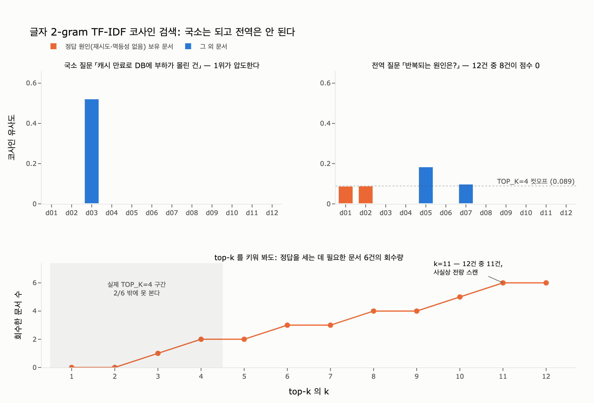

# `ex1_rag_limits.py`는 어떤 검색 방식을 쓰는가?

> **답**: 1장과 같은 **글자 2-gram TF-IDF 코사인 유사도**이며 `TOP_K`는 **4**다. **의존성이 없다.**

파일 첫 docstring이 그대로 말해 준다.

```python
"""
예제 1 — 조각 검색만으로 «전역» 질문에 답해 보기.

    python3 ex1_rag_limits.py

의존성 없음. 1장의 벡터 검색과 같은 방식(글자 2-gram TF-IDF)을 쓴다.
"""
```

import는 `math`, `re`, `collections.Counter` 뿐 — 전부 파이썬 표준 라이브러리다.
numpy도, scikit-learn도, 임베딩 모델도 없다. **60줄짜리 벡터 검색 엔진**이다.

| 구성요소 | 선택 | 코드 |
|---|---|---|
| 토큰화 | 글자 2-gram | `grams(t, n=2)` |
| 가중치 | TF-IDF (smoothed) | `idf = log((n+1)/(df+1)) + 1` |
| 유사도 | 코사인 (L2 정규화 후 내적) | `vec()` + `sum(qv[g]*dv[g])` |
| 반환 개수 | `TOP_K = 4` | `scored[:k]` |
| 데이터 | `corpus.py`의 회고 12건 | `from corpus import DOCS, …` |

---

## 1. 왜 «글자 2-gram»인가 — 형태소 분석기 없이 부분 일치

한국어는 **교착어**다. 어간에 어미·조사가 계속 달라붙는다.
`corpus.py`의 12건만 봐도 «재시도»가 네 가지 모습으로 나온다.

| 문서 | 표면형 |
|---|---|
| d01 | `재시도 로직이` |
| d04 | `재시도했는데` |
| d07 | `재시도로` |
| d11 | `재시도가` |

**공백 토큰화**로 자르면 이 넷은 전부 다른 단어다. 질의 `재시도`와 **하나도 안 겹친다.**
제대로 자르려면 형태소 분석기(mecab-ko, khaiii, Kiwi …)가 필요한데 그 순간
사전 관리·설치 의존성·신조어/오타 문제가 따라 들어온다. 「의존성 없음」이 깨진다.

**글자 n-gram**은 사전 없이 이 문제를 우회한다.

```
"재시도로"     → 재시, 시도, 도로
"재시도했는데" → 재시, 시도, 도했, 했는, 는데
질의 "재시도"  → 재시, 시도
```

`재시`, `시도`가 공유된다. **부분 일치가 공짜로 생긴다.**
실제로 이 코퍼스에서 `재시`와 `시도`의 df는 각각 **4** — 활용형 네 개를 정확히 묶었다.

### 왜 하필 $n = 2$인가

- $n=1$ (음절 1개): 변별력이 없다. `다`, `의`, `가` 같은 글자가 모든 문서에 나온다.
- $n=2$: 한국어 어근/한자어 형태소가 대개 **1~2음절**이라(`결제`, `장애`, `환불`, `쿠폰`) 의미 단위를 잘 잡는다.
- $n\ge3$: 활용 어미가 붙으면 쉽게 깨진다. `재시도했` vs `재시도로`는 3-gram에서 `재시도` 하나만 겹친다. 게다가 희소해져 매칭이 잘 안 난다.

한국어 정보검색에서 **문자 bigram은 형태소 분석 대비 재현율이 높은 고전적 기준선**이다.
검색기가 놓치는 것보다 조금 더 잡는 편(과잉 매칭)이 데모용으로도 안전하다.

한 가지 전처리가 더 있다.

```python
s = re.sub(r"[^0-9A-Za-z가-힣]", "", t)
```

공백·구두점을 **전부 제거한 뒤** 슬라이딩한다. 그래서 어절 경계를 넘는 gram(`애재`, `다멱` 등)도 생긴다.
잡음이지만 df가 낮아 idf가 높게 잡히는 부작용이 있다 — 소형 데모라 감수하는 부분이다.

---

## 2. TF-IDF 가중치 정의

문서 $d$ 안의 gram $g$가 갖는 무게는

$$w_{g,d} = \mathrm{tf}(g,d) \cdot \mathrm{idf}(g)$$

`ex1`이 쓰는 정확한 정의는 이렇다.

$$\mathrm{tf}(g,d) = (\text{문서 } d \text{ 안 } g \text{의 등장 횟수}), \qquad
\mathrm{idf}(g) = \ln\!\left(\frac{N+1}{\mathrm{df}(g)+1}\right) + 1$$

```python
tfs = [Counter(grams(d[1])) for d in docs]     # tf: 문서별 gram 카운트
df = Counter()
for tf in tfs:
    df.update(tf.keys())                       # df: 등장 «문서» 수 (횟수 아님)
n = len(docs)
idf = {g: math.log((n + 1) / (df[g] + 1)) + 1 for g in df}
```

### 각 항의 의미

| 항 | 이유 |
|---|---|
| **tf** | 문서 안에서 자주 나오면 그 문서의 주제일 가능성이 높다 |
| **df** | `tf.keys()`로 업데이트한다 — 등장 «횟수»가 아니라 등장 «문서 수»다 |
| $\ln$ | df가 배로 늘 때 무게는 상수만큼 준다. 급락을 막는 감쇠 |
| 분자·분모 `+1` | **스무딩.** df=0(질의에만 있는 gram)이나 df=N일 때 발산·0을 막는다 |
| 끝의 `+1` | **바닥 깔기.** df=N이어도 $\ln 1 + 1 = 1$이라 완전히 사라지지 않는다 |

이 공식은 scikit-learn `TfidfVectorizer(smooth_idf=True)`와 **동일하다.**
「의존성 없음」을 지키면서 업계 표준과 같은 수를 낸다는 게 이 코드의 요령이다.

이 코퍼스($N=12$)에서 나오는 실제 값:

| gram | df | idf | 해석 |
|---|---|---|---|
| `실패` | 4 | 1.956 | 12건 중 4건에 등장 — 흔하니 가볍게 |
| `재시` | 4 | 1.956 | 활용형 4개를 묶은 결과 |
| `장애` | 3 | 2.179 | |
| `멱등` | 1 | 2.872 | d01에만 — **최대 무게** |
| `쿠폰` | 1 | 2.872 | d02에만 |

**드물수록 무겁다.** 이게 IDF의 전부다.

---

## 3. 코사인 유사도

두 벡터의 코사인 유사도는

$$\cos(\mathbf{q}, \mathbf{d}) = \frac{\mathbf{q}\cdot\mathbf{d}}{\lVert\mathbf{q}\rVert\,\lVert\mathbf{d}\rVert}$$

코드는 이걸 두 단계로 나눈다. **먼저 정규화해 두고, 나중에 그냥 내적한다.**

```python
def vec(c):
    v = {g: x * idf.get(g, 0) for g, x in c.items()}       # TF-IDF
    nm = math.sqrt(sum(y * y for y in v.values())) or 1    # L2 노름
    return {g: y / nm for g, y in v.items()}               # 정규화

keys = qv.keys() & dv.keys()                                # 겹치는 gram만
scored.append((sum(qv[g] * dv[g] for g in keys), i))        # = 코사인
```

$\hat{v} = v / \lVert v \rVert$로 미리 나눠 두면

$$\cos(\mathbf{q},\mathbf{d}) = \sum_g \hat q_g \, \hat d_g$$

즉 **정규화된 벡터의 코사인은 그냥 내적**이다. 그래서 점수 계산이 한 줄이다.

### 왜 유클리드 거리가 아니라 코사인인가

**문서 길이에 안 휘둘리려고.** 긴 회고문은 gram이 많아 벡터 크기 자체가 커진다.
정규화하지 않으면 「길게 쓴 문서가 항상 이기는」 검색기가 된다.
코사인은 벡터의 **길이를 버리고 방향만** 본다. 무엇을 얼마나 말했나가 아니라, **무엇에 대해** 말했나를 잰다.

세부 두 가지:

- `or 1` — 영벡터(모든 gram의 idf가 0)일 때 0으로 나누는 걸 막는 방어다.
- `qv.keys() & dv.keys()` — 희소 벡터라서 겹치는 차원만 곱하면 된다. 265차원 전체를 돌 필요가 없다.
- 값의 범위는 $[0, 1]$이다. TF-IDF에 음수 성분이 없으므로 음의 코사인이 나올 수 없다.

---

## 4. `TOP_K = 4`의 의미

```python
TOP_K = 4
...
return scored[:k]
```

`TOP_K`는 **질의 시점에 LLM에게 넘길 조각의 개수** — RAG의 **정보 예산**이다.
실무에서 3~10 사이를 쓰는데, 정하는 기준은 컨텍스트 창 크기, 토큰 비용, 그리고 잡음이다
(관련 없는 조각을 많이 넣을수록 모델이 오히려 헷갈린다).

**4는 6장의 논증을 위해 고른 숫자다.** 문서 12건의 3분의 1이다.

### 국소 질문에서는 4가 넉넉하다

답이 한 조각 안에 통째로 있는 질문이라면 top-1만으로 충분하다.

```
질문: 캐시가 만료되어 DB에 부하가 몰린 건
  [0.523] d03 배송 조회 지연. 캐시가 만료되며 원본 DB로 요청이 몰렸다.
  [0.000] d12 …
```

1위가 0.52, 2위부터 0.000이다. **신호가 압도적이다.**

### 전역 질문에서는 4가 원리적으로 부족하다

```
질문: 우리 장애 회고 전체에서 반복되는 원인은 무엇인가?

상위 4개 조각
  [0.185] d05 정산 배치 중단. 부분 성공 상태에서 롤백을 안 했다.
  [0.100] d07 이미지 업로드 실패율 상승. 스토리지 지역 장애. 재시도로 복구.
  [0.090] d02 쿠폰 발급 장애. 같은 요청이 두 번 들어와 쿠폰이 두 장 나갔다.
  [0.089] d01 결제 서비스 장애. 재시도 로직이 중복 결제를 만들었다. 멱등 키가 없었다.
```

정답은 `{멱등성 없음, 재시도}`인데 이건 **12건을 다 세어야** 나온다.
문제가 셋이다.

1. **점수 자체가 낮다** — 1위 0.185. 국소 질문의 0.52와 비교하면 검색기 스스로 「자신 없음」을 말하고 있다.
2. **12건 중 8건이 정확히 0점이다.** 질의와 겹치는 gram이 하나도 없다. 5위 아래는 순위가 아니라 그냥 동점 정렬 순서다 — **랭킹 자체가 존재하지 않는다.**
3. **1위가 뜬 이유가 질문과 무관하다.** d05가 1등인 건 「반복되는 원인」과 아무 상관이 없고, 문장이 짧아 정규화 후 gram당 무게가 컸을 뿐이다.

근본 원인은 이것이다 — **«반복되는 원인»이라는 사실은 어느 문서에도 글자로 적혀 있지 않다.**
각 문서는 자기 사고만 서술한다. 표면 문자열이 겹치는 정도로는 「전체에서 몇 번 나왔나」를 잴 수 없다.

### k를 올리면?

예제가 스스로 답한다.

> k 를 12로 올려 전부 넣으면? 이 예제에서는 된다. 문서가 12건이니까.
> 문서가 12만 건이면 못 넣는다. 그게 이 한계의 실체다.
> «조각을 더 넣기»로는 못 넘는 벽이고, 그래서 색인 시점에 미리 접어 둬야 한다.

실측해 보면 정답 원인을 담은 문서 6건이 전부 회수되는 건 **k=11**이다.
12건 중 11건 — 그건 검색이 아니라 **전량 스캔**이다.

**핵심은 «k가 작아서» 안 되는 게 아니라는 것이다.**
전역 질문의 답은 «전부»에 대한 집계이고, top-k는 정의상 «일부»다.
$k$를 아무리 키워도 코퍼스 크기에 도달하기 전엔 «전부»가 아니고,
도달하면 그건 이미 검색이 아니다. **차원이 다른 벽이다.**

---

## 5. 그래서 6장이 하는 말

| | 조각 검색 (`ex1`) | GraphRAG (`ex2`) |
|---|---|---|
| 세는 시점 | **질의 시점**, k개만 | **색인 시점**, 전부 |
| 전역 질문 | 못 푼다 | 푼다 |
| 비용 | 질의당 저렴 | 색인이 비싸다 |
| 갱신 | 문서 추가만 하면 끝 | 다시 접어야 한다 |

풀이는 **세는 시점을 옮기는 것**이다.
색인 시점에 그래프를 만들고 커뮤니티마다 요약을 접어 두면,
질의 시점에는 접어 둔 것을 펴기만 하면 된다 → `ex2_graphrag_lite.py`.

대가도 분명하다. 색인이 비싸고 갱신이 어렵다.
그리고 6장이 정직하게 덧붙이듯 **사실 조회에서는 그래프를 붙인 쪽이 살짝 진다.**
전역 질문 비율이 5%도 안 되면 `ex1`의 단순한 방식이 맞는 선택이다.

---

## 함께 볼 것

- `content/ch06/code/ex1_rag_limits.py` — 본문
- `content/ch06/code/corpus.py` — `DOCS` 12건, `TRIPLES`, `GLOBAL_QUESTION`, `GROUND_TRUTH`
- `content/ch06/code/ex2_graphrag_lite.py` — 같은 질문을 색인 시점 접기로 푸는 쪽
- 1장 — 여기서 쓴 것과 같은 2-gram TF-IDF 검색이 처음 나오는 곳

## 시각화


