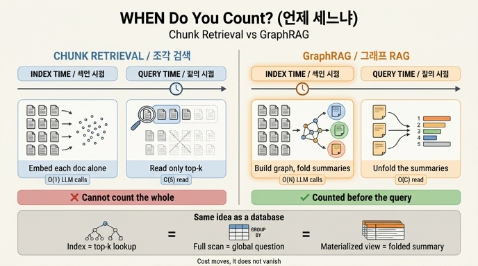

# 조각 검색 vs GraphRAG: 결정적 차이는 「언제 세느냐」

## 질문

조각 검색과 GraphRAG의 결정적 차이를 한 문장으로 말하면 무엇인가?

## 답

**언제 세느냐의 차이다.** 조각 검색은 **질의 시점**에 k개만 보고, GraphRAG는 **색인 시점**에 전부 훑어 접어 둔다.

---

## 왜 「무엇을 세느냐」가 아니라 「언제 세느냐」인가

둘 다 결국 같은 코퍼스를 본다. 같은 문서 12건, 같은 문장, 같은 원인들이다.
다른 건 **그 전부를 훑는 순간이 언제인가** 하나뿐이다.

- 조각 검색은 코퍼스를 **한 번도 통째로 세지 않는다**. 색인 시점에는 문서를 개별적으로 벡터로 바꿔 넣기만 한다. 문서끼리 비교하지 않는다. 세는 일은 질의가 들어와야 시작되는데, 그때는 이미 늦다. 컨텍스트 창에 k개밖에 못 넣기 때문이다.
- GraphRAG는 코퍼스를 **질의가 오기 전에 이미 다 세어 놨다**. 색인 시점에 문서 전체에서 엔티티·관계를 뽑아 그래프를 만들고, 커뮤니티로 뭉치고, 뭉치마다 요약을 써서 접어 둔다. 질의 시점에는 접어 둔 요약을 펴서 합치기만 한다.

그래서 「전부 몇 건인가」, 「반복되는 원인은 무엇인가」 같은 **전역(global) 질문**에서 갈린다.
전역 질문은 정의상 전체를 세어야 답이 나오는데, 조각 검색에는 전체를 셀 기회 자체가 없다.

### 코드로 확인 (`content/ch06/code`)

`ex1_rag_limits.py` — 질의 시점에 세려는 시도:

```
질문: 우리 장애 회고 전체에서 반복되는 원인은 무엇인가?
상위 4개 조각
  [0.185] d05 정산 배치 중단. 부분 성공 상태에서 롤백을 안 했다.
  [0.100] d07 이미지 업로드 실패율 상승. 스토리지 지역 장애. 재시도로 복구.
  [0.090] d02 쿠폰 발급 장애. 같은 요청이 두 번 들어와 쿠폰이 두 장 나갔다.
  [0.089] d01 결제 서비스 장애. 재시도 로직이 중복 결제를 만들었다. 멱등 키가 없었다.

전체 12건 중 4건만 봤다. 나머지 8건에 무엇이 있는지 모른다.
```

유사도 점수를 보라. 1위가 0.185, 4위가 0.089다. 이 순위는 「반복되는 원인을 많이 담고 있는 순서」가 **아니다**. 그냥 질문 문장과 글자가 겹치는 순서다. 세기(counting)와 유사도 순위는 애초에 다른 연산인데, 조각 검색은 유사도 순위밖에 가진 게 없다.

`ex2_graphrag_lite.py` — 색인 시점에 세어 두기:

```
=== 색인 시점 (한 번만) ===
노드 37개 → 커뮤니티 9개
  커뮤니티 1: 문서 3건. 자주 나온 원인: 재시도(3건), 상태 불일치(1건)
  커뮤니티 2: 문서 2건. 자주 나온 원인: 중복 요청(2건), 멱등성 없음(2건)
  ...

=== 질의 시점 ===
커뮤니티 요약을 합친 결과 — 원인 순위
  재시도: 3건 / 중복 요청: 2건 / 멱등성 없음: 2건 ...
```

질의 시점에 한 일은 **9개 요약을 더한 것**뿐이다. 원문 12건은 다시 열지 않았다.
(참고: 이 예제의 요약은 규칙 기반이라 커뮤니티 경계에 걸친 원인이 쪼개져 정답을 완벽히 맞히지는 못한다. 요약 품질은 여기서 볼 대상이 아니다. 봐야 할 건 **접는 시점**이다.)

---

## 계산량·시점·복잡도 대비

전체 문서 수 N, 질의 시점 top-k의 k, 커뮤니티 수 C라고 하자. 보통 **C ≪ N**이고, C는 N이 커져도 아주 천천히 자란다.

| 항목 | 조각 검색 (Vector RAG) | GraphRAG |
|---|---|---|
| **색인 시점 LLM 호출** | **O(1)** (문서당 임베딩 1회, 추론 호출 없음) | **O(N)** (문서마다 엔티티·관계 추출 + 커뮤니티마다 요약 생성) |
| **색인 시점 비용 성격** | 싸다. 임베딩 모델 한 번 통과 | 비싸다. 코퍼스 전체를 LLM에 한 번 먹인다 |
| **색인 산출물** | 벡터 N개 (문서끼리 무관) | 그래프 + 커뮤니티 계층 + 요약 C개 (문서 사이 관계가 남음) |
| **질의 시점 읽는 양** | **O(k)** — k는 컨텍스트 창이 정하는 상수 | **O(C)** — 전역 질문이면 요약 전체 |
| **질의 시점 LLM 호출** | 1회 (k조각 + 질문) | 전역 질문 시 요약 map-reduce로 여러 회 |
| **질의 지연** | 낮다 | 조각 검색보다 높다 |
| **전역 질문 정답률** | 낮다. k를 늘려도 안 올라간다 | 높다. 애초에 전부 세고 시작했다 |
| **지역(사실 조회) 질문** | 좋다. 오히려 GraphRAG보다 **살짝 낫다** | 중간 단계가 끼어 살짝 손해 |
| **갱신 비용** | 싸다. 바뀐 문서만 다시 임베딩 | 비싸다. 그래프·커뮤니티·요약을 다시 접어야 한다 |
| **되짚기(출처 추적)** | 조각 단위로 가능 | 요약이 한 겹 끼어 추적이 한 단계 길어짐 |

### 「k를 크게 올리면 되지 않나」에 대한 답

안 된다. 그게 이 차이가 **결정적**인 이유다.

- 컨텍스트 창은 유한하다. k에는 하드 상한이 있다.
- 12건짜리 장난감에서는 k=12로 전부 넣으면 된다. **12만 건이면 못 넣는다.**
- k를 늘리면 질의당 토큰 비용이 질의마다 반복해서 든다. 색인 시점 비용은 **한 번만** 든다. 질의가 많아질수록 접어 두는 쪽이 유리해진다.
- 근본적으로, k를 늘리는 건 O(k)를 O(N)으로 키워 **매 질의마다** 전수 조사를 하는 것이다. 그건 최적화가 아니라 포기다.

즉 조각 검색의 벽은 「조각을 더 넣기」로 못 넘는다. **연산을 다른 시점으로 옮기는 것**만이 해법이다.

---

## 데이터베이스 비유: 인덱스와 사전 집계

이 구조는 데이터베이스가 40년 전에 정리해 둔 이야기 그대로다.

| 데이터베이스 | RAG |
|---|---|
| `WHERE id = ?` — B-트리 인덱스로 몇 행만 집어 온다 | 조각 검색. top-k point lookup |
| `SELECT cause, COUNT(*) ... GROUP BY cause` — 풀 스캔 + 집계 | 전역 질문. 전수 조사가 필요하다 |
| **머티리얼라이즈드 뷰 / 롤업 테이블** — 집계를 미리 계산해 저장 | **GraphRAG의 커뮤니티 요약**. 색인 시점에 접어 둔 것 |
| 뷰 리프레시 비용, 스테일 데이터 | 재색인 비용, 오래된 요약 |

인덱스는 **찾기**를 빠르게 하지 정말로 **세기**를 빠르게 하지는 않는다. 세기를 빠르게 하려면 미리 세어 두는 수밖에 없다. 그게 사전 집계 테이블이고, GraphRAG의 커뮤니티 요약이다.

그리고 데이터베이스에서 늘 그랬듯, 대가도 똑같다.

- **쓰기가 비싸진다.** 원본이 바뀌면 뷰를 다시 만들어야 한다. 자주 바뀌는 데이터에는 안 맞는다.
- **저장 공간이 더 든다.** 원본 + 그래프 + 요약 계층.
- **모든 질의가 빨라지지는 않는다.** 사전 집계는 미리 정해둔 축(커뮤니티, 원인)에 대해서만 도움이 된다. 예상 못 한 축의 질문에는 소용없다.
- 그래서 **읽기가 압도적으로 많고 갱신이 드물 때** 사전 집계가 이긴다. GraphRAG도 정확히 그 조건에서 이긴다.

---

## 실무 판단 기준

이 장이 정직하게 붙인 단서를 잊지 말 것.

> 사실 조회에서는 그래프를 붙인 쪽이 살짝 진다. **전역 질문 비율이 5%도 안 되면 안 붙이는 게 맞다.**

- 질문 대부분이 「이 API의 타임아웃 기본값은?」 같은 지역 질문 → 조각 검색으로 충분하다. GraphRAG는 색인 비용만 내고 정확도는 오히려 조금 손해다.
- 「우리 회고 전체에서 반복되는 원인은?」, 「이 코드베이스의 아키텍처 테마는?」 같은 전역 질문이 의미 있는 비율 → 접어 둘 값어치가 있다.
- 문서가 하루에도 여러 번 바뀐다 → 접어 둔 게 계속 상해서 GraphRAG가 불리하다.

## 한 줄 정리

> 조각 검색은 **질의 시점에 O(k)만 읽고**, GraphRAG는 **색인 시점에 O(N)번 LLM을 돌려 O(C)개로 접어 둔 뒤 질의 시점에 그걸 편다.** 연산을 옮긴 것이지 없앤 게 아니다.

## 인포그래픽


