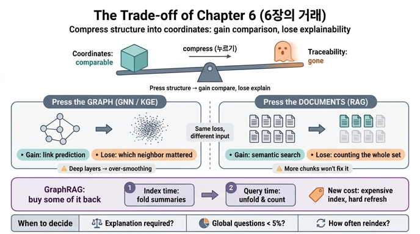

# 6장이 말하는 '거래(trade-off)'는 무엇인가?

> **답**: 구조를 좌표로 누르면 비교와 예측이 가능해지지만, 그 순간 되짚기(설명) 출력이 사라진다.

---

## 1. 한 문장으로 압축된 거래

6장의 마지막 예제(`ex4_link_prediction.py`)는 이 거래를 직접 문장으로 못 박습니다.

```
그때는 2홉·3홉 구조를 좌표로 눌러 담아야 비교가 된다.

대신 그 순간 위의 «되짚기» 출력이 사라진다. 이게 이 장의 거래다.
```

거래의 양변은 이렇게 나뉩니다.

| 얻는 것 | 잃는 것 |
|---|---|
| 좌표가 되니 **거리로 비교**할 수 있다 | 어느 이웃이 얼마나 기여했는지 **되짚을 수 없다** |
| 직접 연결이 없는 것끼리도 **유사도 판정**이 된다 | "왜 이 답인가"를 **경로로 보여줄 수 없다** |
| 아직 없는 간선을 **예측**할 수 있다 | 법무·감사·고객 문의에 낼 **설명 출력이 없다** |
| 고정 차원이라 **대규모에서도 빠르다** | 데이터가 바뀌면 **다시 눌러야** 한다 |

장 도입부의 장면이 바로 이 손실의 청구서입니다. "추천 모델이 잘 돌던 어느 날, 법무팀에서 연락이 왔습니다. 이 사용자한테 왜 이 상품을 추천했는지 설명해 주실 수 있나요." 모델은 잘 돌고 있었습니다. 없어진 건 성능이 아니라 **되짚기 출력**입니다.

## 2. 같은 거래가 두 번 반복된다

6장의 구성이 이 카드의 핵심입니다. 거래는 한 군데서만 일어나는 게 아니라, **누르는 대상만 다를 뿐 같은 형태로 두 번** 일어납니다.

```
        [ 원본: 구조가 살아 있는 형태 ]
                    │
        ┌───────────┴───────────┐
        │                       │
   그래프를 누른다          문서를 누른다
   (GNN · KGE)                (RAG)
        │                       │
   노드/관계 → 좌표         조각 → 좌표
        │                       │
   얻음: 링크 예측·비교      얻음: 의미 검색·근사 매칭
   잃음: 기여도 되짚기       잃음: 전체를 세는 능력
        │                       │
        └───────────┬───────────┘
                    │
              [ GraphRAG 계열 ]
        잃은 것 중 일부를 되사 온다
```

### 2-1. 그래프를 누른 쪽 — GNN과 지식 그래프 임베딩

`ex3_message_passing.py`가 보여 주는 건 한 층짜리 메시지 패싱입니다. 자기 벡터와 이웃 평균을 섞습니다.

- 0층: D는 자기 특징 `[2.0, 1.0]`만 가짐
- 1층: 이웃 C의 값이 섞임 (1홉)
- 2층: C를 거쳐 B의 값까지 흘러 들어옴 (2홉)

예제의 결론 문장이 거래를 그대로 진술합니다.

```
얻는 것: 이웃이 비슷하면 벡터도 비슷해진다. 그래서 링크 예측이 된다.
잃는 것: 2층을 지나면 어느 이웃이 얼마나 기여했는지 되짚기 어렵다.
```

여기에 **과평활(over-smoothing)** 이 붙습니다. 층을 깊게 쌓으면 이웃 평균이 계속 섞여 결국 모든 노드가 비슷해집니다. 구별이 사라지므로 예측도 무너집니다. 실무에서 GNN을 2~3층에서 멈추는 관행에는 이 이유가 있습니다. 즉 "더 눌러서 더 얻자"는 방향으로 무한정 갈 수 없고, **거래에는 상한선이 있습니다**.

관련 1차 출처: [Neural Message Passing](https://arxiv.org/abs/1704.01212), [GCN](https://arxiv.org/abs/1609.02907), [TransE](https://papers.nips.cc/paper/5071-translating-embeddings-for-modeling-multi-relational-data), [GNN 개괄](https://arxiv.org/abs/1812.08434)

### 2-2. 누르지 않아도 되는 구간이 있다

`ex4_link_prediction.py`의 전반부가 중요한 이유는, **거래를 하지 않고도 되는 구간**을 먼저 보여 주기 때문입니다. 공통 이웃 수, Adamic-Adar 같은 1홉 지표만으로 링크 예측이 됩니다. 그리고 이 방식은 설명이 공짜로 따라옵니다.

```
가온테크 와 나루소프트 가 함께 가진 원인: ['멱등성없음', '재시도']
→ 나루소프트 와 원인을 공유한다. 그 나루소프트가 캐시를 겪었으니
   가온테크도 겪을 수 있다는 추론이다.
```

임베딩이 필요해지는 건 **공통 이웃이 0인데 비슷한 경우**입니다. 두 회사가 겹치는 원인이 하나도 없는데, 각자의 이웃들이 서로 비슷할 때. 그때 비로소 2홉·3홉 구조를 좌표로 눌러야 비교가 됩니다. 그리고 그 순간 위의 되짚기 출력이 사라집니다.

즉 거래는 **필요할 때만** 하는 것입니다. 1홉으로 풀리는 문제를 굳이 임베딩으로 풀면, 얻는 것 없이 설명만 잃습니다.

### 2-3. 문서를 누른 쪽 — RAG

`ex1_rag_limits.py`는 같은 손실이 문서 쪽에서도 일어남을 보여 줍니다. 장애 회고 12건에 대해 "전체에서 반복되는 원인은 무엇인가"를 top-k 검색으로 묻습니다.

- 12건 중 4건만 봤다. 나머지 8건에 무엇이 있는지 모른다.
- 정답 `{멱등성 없음, 재시도}`는 **전체를 세어야** 나오는 답이다.
- k를 12로 올리면? 이 예제에서는 된다. 문서가 12건이니까. **12만 건이면 못 넣는다.**

여기서의 손실은 "기여도 되짚기"가 아니라 "전체를 세는 능력"이지만, 형태는 같습니다. **원본에 있던 전역 구조가 조각 단위 좌표로 눌리면서 사라진 것**입니다. 그리고 결정적으로, 조각을 더 넣는 방식으로는 넘을 수 없는 벽입니다. 벽의 정체는 검색 품질이 아니라 **압축 방식 자체**입니다.

관련 1차 출처: [RAG](https://arxiv.org/abs/2005.11401)

## 3. GraphRAG — 잃은 것 중 일부를 되사 오는 방법

`ex2_graphrag_lite.py`의 결론이 되사 오는 방법을 요약합니다.

```
달라진 건 «언제 세느냐»이다.
조각 검색은 질의 시점에 k개만 본다. 전체를 셀 기회가 없다.
GraphRAG 는 색인 시점에 전부 훑어 접어 두고, 질의 시점에는 접어 둔 것만 편다.
```

- **색인 시점**: 트리플로 그래프를 만들고, 라벨 전파로 커뮤니티를 찾고, 뭉치마다 요약을 접어 둔다
- **질의 시점**: 접어 둔 요약을 펴서 합친다 → 전역 질문에 답이 나온다

그런데 이건 거래의 취소가 아니라 **새로운 거래**입니다. 되찾은 대가로 새 비용이 붙습니다.

```
대가도 분명하다. 색인이 비싸고, 문서가 바뀌면 다시 접어야 한다.
그래서 자주 바뀌는 데이터에는 안 맞는다.
```

그리고 장 요약이 정직하게 덧붙입니다. **사실 조회에서는 그래프를 붙인 쪽이 살짝 집니다.** GraphRAG는 전역 질문을 위한 도구이지, 모든 검색을 개선하는 도구가 아닙니다.

관련 1차 출처: [Microsoft GraphRAG](https://github.com/microsoft/graphrag) [사실상 표준], [LightRAG](https://arxiv.org/abs/2410.05779) [실험], [HippoRAG](https://arxiv.org/abs/2405.14831) [실험]

## 4. 실무 판단 기준 세 가지

거래를 외우는 것보다 중요한 건, **어느 쪽을 고를지 정하는 질문**입니다.

### (1) 설명 요구가 있는가

- **있다** (법무·감사·규제·고객 문의·의료·금융 심사) → 누르기 전에 멈춘다. 1홉 지표, 경로 기반 추론, 규칙처럼 되짚기 출력이 따라오는 방법을 먼저 시도한다. 임베딩이 꼭 필요하면 별도 설명 경로(근거 경로 재구성, 유사 사례 제시)를 **함께 설계**해서 예산에 넣는다.
- **없다** (내부 랭킹, 후보 생성, 정확도만 보는 배치) → 편하게 눌러도 된다.

핵심: 되짚기 출력은 사후에 붙일 수 없습니다. 누르고 나면 없습니다. **설계 시점에 요구를 확인해야** 합니다.

### (2) 전역 질문 비율이 얼마인가

- **5% 미만** → GraphRAG를 붙이지 않는 게 맞습니다. 장 요약이 그렇게 말합니다. 사실 조회에서는 그래프를 붙인 쪽이 살짝 지므로, 소수의 전역 질문 때문에 다수의 사실 조회를 희생하는 셈입니다.
- **의미 있는 비율** ("전부 몇 건", "반복되는 패턴", "전체 경향") → 조각을 더 넣는 걸로는 안 됩니다. 색인 시점에 접어 두는 구조가 필요합니다.

판별법: 실제 질의 로그를 표본으로 뽑아 "한 조각 안에 답이 들어 있는가"로 분류해 보면 비율이 나옵니다.

### (3) 색인 갱신 빈도는 얼마인가

- **자주 바뀐다** (실시간 로그, 하루에도 여러 번 갱신되는 문서) → 접어 두기가 계속 무너집니다. 색인 비용이 반복 청구됩니다. 맞지 않습니다.
- **드물게 바뀐다** (분기 회고, 정책 문서, 아카이브) → 한 번 비싸게 접어 두고 오래 씁니다. 손익이 맞습니다.

여기에 부분 갱신 가능 여부도 같이 봅니다. 문서 하나가 바뀔 때 커뮤니티 전체를 다시 접어야 한다면 실질 갱신 비용은 전체 재색인에 가깝습니다.

## 5. 자주 틀리는 지점

- **"거래는 GNN 쪽 얘기다"** → 아닙니다. RAG 쪽에서도 같은 형태로 일어납니다. 6장의 구성 자체가 두 쪽을 나란히 놓는 것입니다.
- **"GraphRAG가 거래를 없앤다"** → 아닙니다. 잃은 것 중 일부를 되찾는 대신, 색인 비용과 갱신 경직성이라는 새 비용을 냅니다.
- **"임베딩이 항상 더 낫다"** → 아닙니다. 공통 이웃이 있으면 1홉만 세도 됩니다. 설명이 공짜로 따라옵니다.
- **"층을 더 쌓으면 더 좋아진다"** → 과평활 때문에 아닙니다. 2~3층이 관행인 이유가 여기 있습니다.
- **"k를 늘리면 전역 질문도 된다"** → 문서가 12건이면 됩니다. 12만 건이면 안 됩니다. 그게 벽의 실체입니다.

## 6. 암기용 한 줄

> **누르면 비교가 되고, 누르는 순간 설명이 사라진다.** 그래프든 문서든 같다. GraphRAG는 색인 시점으로 세는 시점을 옮겨 일부를 되사 오지만, 색인 비용과 갱신 경직성을 새로 낸다.

## 인포그래픽


