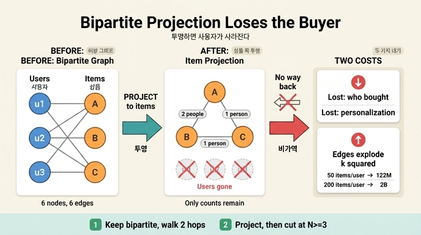

# 이분 그래프를 투영하면 사라지는 정보는 무엇인가?

**답**: 누가 샀는지, 즉 **사용자 노드**다. 상품 쪽 투영 그래프만 보면 `u1`, `u2`, `u3`이 사라진다.

---

## 1. 이분 그래프와 투영이 뭔가

**이분 그래프(bipartite graph)** 는 노드가 두 종류로 나뉘고, 엣지가 **항상 종류를 건너서만** 생기는 그래프다. 같은 종류끼리는 절대 이어지지 않는다.

- 사용자 — 상품 (구매)
- 논문 — 저자 (집필)
- 배우 — 영화 (출연)
- 학생 — 강의 (수강)

**투영(projection)** 은 이 두 종류 중 **한쪽만 남기고** 그래프를 다시 그리는 조작이다. 규칙은 하나다. *"같은 상대를 공유하면 잇는다."*

- 상품 쪽 투영 → 같은 사람이 함께 산 상품끼리 잇는다 ("함께 구매" 그래프)
- 사용자 쪽 투영 → 같은 상품을 산 사람끼리 잇는다 ("취향 비슷한 사람" 그래프)

투영이 매력적인 이유는 분명하다. 노드가 한 종류가 되면 커뮤니티 탐지, 중심성, 유사도 같은 **단일 종류 그래프용 알고리즘을 그대로 꽂을 수 있다.** 이분 그래프 위에서는 대부분의 알고리즘이 어정쩡하게 동작한다.

## 2. 예제로 보는 정보 손실

`code/ex4_bipartite.py`의 원본 데이터다.

```python
PURCHASES = [
    ("u1", "상품A"), ("u1", "상품B"),
    ("u2", "상품A"), ("u2", "상품B"), ("u2", "상품C"),
    ("u3", "상품C"),
]
```

노드 6개(사용자 3 + 상품 3), 엣지 6개.

**상품 쪽으로 투영**하면 이렇게 된다.

```
상품A — 상품B  (함께 산 사람 2명)
상품A — 상품C  (함께 산 사람 1명)
상품B — 상품C  (함께 산 사람 1명)
엣지 3개
```

예제 출력의 한 줄이 핵심이다.

> 버려진 것: 누가 샀는지. 투영 그래프만 보면 u1, u2, u3 이 사라진다.

### 정확히 무엇이 없어졌는가

| 원본에 있던 것 | 투영 후 |
|---|---|
| 사용자 노드 `u1`, `u2`, `u3` | **없음** |
| "u1이 상품A를 샀다"는 개별 사실 | **없음** |
| 상품A—상품B를 이어 준 사람이 누구인지 | **없음**. 그냥 "2명" |
| 상품A—상품B를 이어 준 **사람 수** | 남음 (엣지 가중치 `2`) |
| 사용자 한 명의 구매 목록(취향 프로필) | **없음** |

가중치는 **몇 명인지만** 기억하고 **누구인지는 잊는다.** `상품A — 상품B (2명)`이라는 엣지를 보고 그 2명이 `u1, u2`인지 `u7, u9`인지 알아낼 방법이 없다.

### u3은 흔적조차 남지 않는다

`u3`은 상품C 하나만 샀다. 상품이 하나뿐이면 `combinations(keys, 2)`가 빈 리스트라 **투영 엣지를 단 하나도 만들지 못한다.** 즉 u3의 구매 기록은 투영 그래프에 아무런 영향을 주지 않고 그대로 소멸한다. 상품C 노드는 살아남지만, 그건 u2 덕분이다.

일반화하면 **차수 1인 노드(한 번만 구매한 사용자, 신규 사용자)의 기여는 투영에서 전부 날아간다.** 롱테일이 두꺼운 실제 서비스에서 이건 작은 손실이 아니다.

## 3. 투영은 되돌릴 수 없다 (비가역)

이게 손실의 본질이다. 투영은 **정보를 잃는 압축(lossy)** 이다. 투영 그래프에서 원본 이분 그래프를 복원할 수 없다.

서로 다른 두 원본이 **같은 투영**을 만들 수 있다.

```
원본 X: u1 → {A, B, C}                 (한 사람이 셋을 다 샀다)
원본 Y: u1 → {A, B}, u2 → {B, C}, u3 → {A, C}   (세 사람이 둘씩 샀다)
```

원본 X의 상품 쪽 투영: `A—B`, `B—C`, `A—C` (삼각형)
원본 Y의 상품 쪽 투영: `A—B`, `B—C`, `A—C` (같은 삼각형)

가중치까지 봐도 셋 다 1이라 구별되지 않는다. **투영 그래프를 보고 "한 명이 셋을 산 것"과 "세 명이 둘씩 산 것"을 구분할 수 없다.** 원본에서 파생 그래프로 가는 함수는 단방향이다.

## 4. 실무에서 이 손실이 아픈 순간

- **개인화 추천이 불가능하다.** "이 사용자와 비슷한 사람이 산 상품"을 물으려면 사용자 노드가 필요하다. 상품 쪽 투영만 갖고 있으면 "이 상품과 함께 팔린 상품"까지만 답할 수 있다. 상품 중심 추천은 되지만 **사람 중심 추천은 안 된다.**
- **어트리뷰션이 끊긴다.** "이 연관 규칙이 어느 세그먼트에서 나온 건가"를 물으면 답이 없다. 20대가 만든 연결인지 60대가 만든 연결인지 투영은 기억하지 않는다.
- **감사·설명이 막힌다.** 추천 근거를 "이 상품을 산 사람들이 저것도 샀습니다"라고 말하려면 그 사람들을 짚을 수 있어야 한다.
- **필터링·삭제 요청 처리가 어렵다.** 사용자 한 명의 데이터를 지우려면 투영 전체를 다시 계산해야 한다. 어느 엣지에 그 사람이 기여했는지 투영 그래프만 봐서는 모른다.
- **어뷰징·봇을 걸러낼 수 없다.** 봇 계정 하나가 200개를 담아 만든 19,900개의 엣지가 정상 구매와 섞여 버린다. 투영 뒤에는 되돌릴 방법이 없다.

## 5. 손실만 문제가 아니다 — 엣지가 제곱으로 는다

같은 절이 지적하는 두 번째 대가다. 한 사용자가 `k`개를 사면 그 사용자 혼자 최대 `k(k-1)/2`개의 투영 엣지를 만든다. `k`에 대해 **제곱**이다.

```python
def simulate(n_users, items_per_user):
    return n_users * items_per_user * (items_per_user - 1) // 2
```

| 사용자 | 1인당 구매 | 투영 엣지(최대) |
|---:|---:|---:|
| 1,000 | 10 | 45,000 |
| 1,000 | 50 | 1,225,000 |
| 100,000 | 50 | 122,500,000 |
| 100,000 | 200 | 1,990,000,000 |

원본 이분 그래프는 엣지가 `100,000 × 200 = 2,000만` 개인데, 투영하면 **20억 개** 상한이다. 100배다. 실제로는 중복이 합쳐져 이보다 적지만, **상한이 이렇다는 게 용량 계획의 기준이 된다.**

정리하면 투영의 거래 조건은 이것이다. **정보를 버리면서 크기는 커진다.** 압축이 아니라 확장이다. 이게 투영이 "편해 보이는데 함정"인 이유다.

## 6. 그래서 어떻게 하나 — 대안 두 가지

예제 마지막이 제시하는 처방이다.

**1) 투영하지 말고 이분 그래프 그대로 2홉을 돈다.**
`상품A → (산 사람들) → (그들이 산 다른 상품)`. 필요할 때만 계산하니 저장 폭발이 없고, 중간에 사용자 노드를 지나가므로 **정보가 하나도 안 사라진다.** 대가는 질의 지연시간과, 인기 상품 허브를 지날 때의 팬아웃이다.

**2) 투영하되 임계값으로 자른다.**
"함께 산 사람 N명 이상"만 엣지로 남긴다. 대개 3명이면 충분하다. 우연히 한 번 같이 담긴 잡음 엣지가 대부분이라, 임계값 하나로 엣지 수가 급격히 줄어든다.

> 저는 2번을 쓰고, 자르는 값은 엣지 수가 노드 수의 20배를 넘지 않게 잡는다.

**엣지 수 ≤ 노드 수 × 20** 이라는 이 경험 규칙이 실무적으로 유용하다. 임계값을 이론이 아니라 **목표 밀도에서 역산**한다.

추가로 실무에서 쓰는 보완책들:
- **투영을 원본으로 취급하지 않는다.** 이분 그래프를 진실의 원천(source of truth)으로 남겨 두고, 투영은 언제든 다시 만들 수 있는 **파생 캐시**로 관리한다. 그러면 손실이 문제가 되지 않는다 — 원본이 있으니까.
- **가중치 정규화.** 200개를 산 사용자가 만든 엣지와 3개를 산 사용자가 만든 엣지를 같은 1로 세면 헤비 유저가 그래프를 지배한다. `1/(k-1)` 같은 가중치로 사용자별 기여를 나눠 준다 (Newman의 협업 그래프 가중치, 뉴스벤더식 hyperbolic weighting).
- **투영 엣지에 근거를 함께 저장.** 완전한 복원은 아니어도, 엣지에 기여자 ID 목록이나 샘플을 붙여 두면 설명·감사는 가능해진다. 저장 비용과의 교환이다.

## 7. 한 줄 정리

투영은 **"이어 준 매개체"를 버리고 "이어진 결과"만 남기는 조작**이다. 상품 쪽으로 투영하면 매개체인 사용자 노드(`u1`, `u2`, `u3`)와 개별 구매 사실이 전부 사라지고, 엣지 가중치에 "몇 명"이라는 숫자만 남는다. 되돌릴 수 없고, 게다가 엣지는 제곱으로 는다.

## 참고

- [NetworkX bipartite: projected_graph / weighted_projected_graph](https://networkx.org/documentation/stable/reference/algorithms/bipartite.html)
- 예제 코드: `content/ch07/code/ex4_bipartite.py`
- 7장 4절 「두 종류만 있는 그래프, 그리고 겹치는 엣지」

## 인포그래픽


