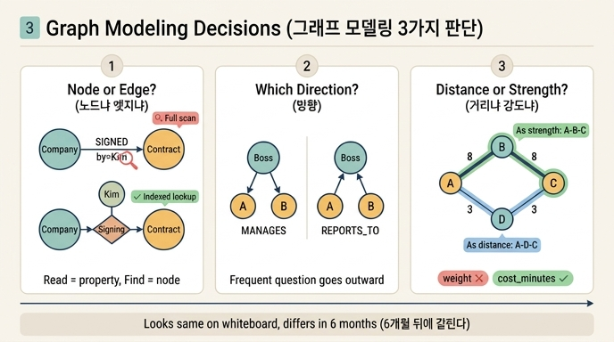

# 7장이 다루는 세 가지 모델링 판단

## 질문과 답

**질문**: 7장이 다루는 세 가지 모델링 판단은 무엇인가?

**답**: 노드냐 엣지냐, 방향을 어느 쪽으로 둘까, 가중치를 무슨 뜻으로 쓸까다. 화이트보드에서는 비슷해 보이지만 6개월 뒤에 갈린다.

## 왜 이 세 가지인가

7장의 도입부는 실패담으로 시작한다. 계약을 엣지로 그렸다는 것. `(회사)-[:계약]->(회사)`. 화이트보드에서는 예뻤지만 나중에 3주를 날렸다.

그래프를 그릴 때 반드시 내려야 하는 결정은 사실 몇 개 되지 않는다. 그런데 그 몇 개가 전부 **지금은 티가 안 나고, 나중에 비용으로 돌아온다**는 공통점을 가진다. 7장이 고른 세 가지가 그것이다.

| 판단 | 질문 형태 | 틀리면 생기는 일 |
|---|---|---|
| 노드냐 엣지냐 | 이 관계를 엣지 속성으로 둘까, 노드로 승격할까 | 전체 스캔 질의, 나중에 대규모 마이그레이션 |
| 방향 | 어느 쪽을 나가는 방향으로 둘까 | 자주 쓰는 질의가 역방향 훑기 |
| 가중치 | 이 숫자는 거리인가 강도인가 | 알고리즘이 정반대 답을 내놓고 조용히 통과 |

세 가지 모두 「스키마 그림에서는 화살표 하나 방향, 속성 이름 하나」의 차이다. 그래서 설계 회의에서 논쟁이 안 붙고 그냥 넘어간다. 6개월 뒤 데이터가 쌓이고 질의가 늘어나면 갈린다.

## 판단 1 — 노드냐 엣지냐 (7.1절)

관계를 엣지로 둘지 노드로 승격할지는 **세 번 물어보면** 정해진다.

1. 이 관계에 속성이 붙나?
2. 이 관계가 제3의 대상과 이어지나?
3. **그 속성으로 검색하나?**

마지막 질문이 결정적이다. 한 문장으로:

> **속성은 「읽는」 것이고 노드는 「찾는」 것이다. 찾기 시작하면 승격할 때다.**

예제 1(`ex1_node_or_edge.py`)이 이걸 보여 준다. 「김하늘이 담당한 체결 건은?」이라는 질문에서

- 모델 A(엣지 + `by` 속성): 엣지 속성에 색인을 못 거는 엔진이 많아서 전체 엣지를 훑는다. 엣지 3개면 티가 안 나지만 100만 개면 다르다.
- 모델 B(체결을 노드로 승격): `김하늘` 노드로 들어오는 `BY` 엣지만 따라가면 끝난다.

승격 타이밍에 대한 조언도 함께 나온다.

- **늦게 하되 미루지 마라.** 데이터가 쌓일수록 옮기는 값이 비례해서 오른다.
- 옮길 때 제일 오래 걸리는 건 데이터 이동이 아니라 **표기 통일**이다.

관계를 1급 대상으로 끌어올리는 이 조작은 RDF 쪽에서 **구체화(reification)** 라는 이름으로 표준화되어 있다.

## 판단 2 — 방향을 어느 쪽으로 (7.2절)

같은 사실을 `MANAGES`로 저장할지 `REPORTS_TO`로 저장할지의 문제다. 사실 자체는 동일한데 질의 비용이 다르다.

기준 두 가지.

1. **자주 묻는 질문을 「나가는」 방향으로.**
2. **카디널리티가 1 쪽에서 N 쪽으로.** (부하는 여럿, 상사는 하나)

둘이 충돌하면 1번을 따른다. **성능은 질의가 정한다.**

단서가 하나 붙는다. 엔진이 역방향 색인을 자동으로 만들어 주면 이 차이는 사라진다. Neo4j는 양방향 탐색이 대칭이지만 모든 엔진이 그렇지는 않다. 즉 이 판단의 중요도는 쓰는 엔진에 따라 달라진다.

## 판단 3 — 가중치가 거리인가 강도인가 (7.3절)

같은 숫자를 두 가지로 읽을 수 있다.

- **강도 해석**: 값이 클수록 가깝다 (친밀도, 유사도, 거래액)
- **거리 해석**: 값이 클수록 멀다 (비용, 시간, 요금)

예제 3(`ex3_weights.py`)은 엣지 `A-B:8, B-C:8, A-D:3, D-C:3`에서 A→C 최적 경로를 두 해석으로 각각 구한다. **같은 데이터, 반대 답**이 나온다.

저자가 실제로 겪은 사고가 이것이다. 친밀도(클수록 가깝다)를 저장해 놓고 최단 경로 알고리즘에 그대로 넣었다. 알고리즘은 「작을수록 가깝다」로 읽는다. 그래서 **제일 안 친한 경로를 「가장 가까운 사이」라고 답했고, 2주 뒤에 알았다.** 이게 위험한 이유는 예외가 나지 않는다는 점이다. 답이 그럴듯하게 나온다.

예방법은 하나.

```
weight (X)  →  cost_minutes, affinity_score (O)
```

**속성 이름에 뜻을 박아 넣는다.** 이름 하나로 막을 수 있는 사고를 이름을 아껴서 만든다.

## 세 가지 + 하나 (7.4절)

7장의 절은 네 개다. 세 가지 「판단」 뒤에 7.4절 「두 종류만 있는 그래프, 그리고 겹치는 엣지」가 붙는다. 이건 판단이라기보다 그 판단을 내릴 때 밟기 쉬운 함정 모음이다.

- **이분 그래프 투영**: 사용자-상품처럼 두 종류만 있는 그래프를 한쪽으로 투영하면 (a) 누가 샀는지 정보가 사라지고 (b) 엣지가 제곱으로 는다. 1인당 200개를 산 사용자 10만 명이면 투영 엣지 상한이 20억 개다. 대안은 투영하지 않고 2홉을 돌거나, 투영하되 「함께 산 사람 N명 이상」으로 자르는 것. 저자는 엣지 수가 노드 수의 20배를 넘지 않게 자른다.
- **다중 엣지와 자기 루프**: 가온테크의 차수가 2냐 4냐. 거래처 수를 세면 단순 그래프(2), 거래 건수를 세면 다중 그래프(4). 둘 다 맞다. 사고는 섞을 때 난다. 중심성을 다중 그래프로 계산해 놓고 「거래처가 많은 회사」라고 보고하면 틀린다. 자기 루프도 라이브러리마다 1로 세거나 2로 세서 숫자가 조용히 달라진다. **무엇을 세는지 먼저 정하라.**

## 외우는 방법

세 판단을 그래프 그림의 세 요소에 대응시키면 기억하기 쉽다.

- **점**: 이걸 점으로 그릴까, 선으로 그릴까 → 노드냐 엣지냐
- **화살촉**: 화살촉을 어디에 달까 → 방향
- **선 위의 숫자**: 이 숫자가 굵기(강도)인가 길이(거리)인가 → 가중치

그리고 공통 결론은 하나다. **화이트보드에서는 다 비슷해 보이는데, 6개월 뒤에 갈린다.**

## 인포그래픽


