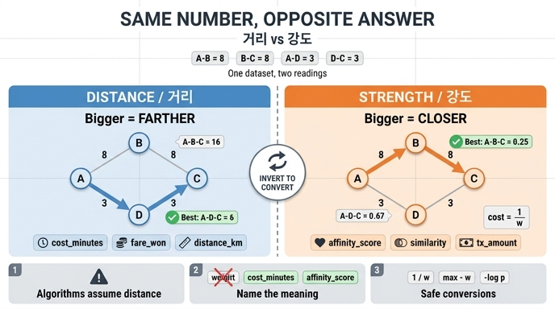

# 가중치를 '거리'로 읽는가 '강도'로 읽는가

## 질문

가중치를 '거리'로 읽는 것과 '강도'로 읽는 것은 어떻게 다른가?

## 답

- **거리 해석**: 값이 **클수록 멀다**. (비용, 시간, 요금)
- **강도 해석**: 값이 **클수록 가깝다**. (친밀도, 유사도, 거래액)

## 핵심은 '숫자'가 아니라 '숫자를 읽는 방향'

엣지에 붙은 `8`이라는 숫자 자체에는 뜻이 없습니다. 뜻은 그 숫자를 **어느 방향으로 읽는지**에서 나옵니다.

| | 거리(distance/cost) | 강도(strength/affinity) |
|---|---|---|
| 값이 크면 | 멀다 · 나쁘다 | 가깝다 · 좋다 |
| 값이 작으면 | 가깝다 · 좋다 | 멀다 · 나쁘다 |
| 좋은 경로란 | 합이 **최소**인 경로 | 합이 **최대**인(또는 곱이 최대인) 경로 |
| 전형적인 값 | 소요 시간, 요금, 거리(km), 오차 | 친밀도, 유사도, 거래액, 함께 산 횟수 |
| 이름 예시 | `cost_minutes`, `distance_km`, `fare_won` | `affinity_score`, `similarity`, `tx_amount` |

단조성이 정반대이므로, 두 해석은 **최적 경로를 서로 반대로 고릅니다.**

## 왜 사고가 나는가 — 알고리즘은 언제나 '거리'로 읽는다

다익스트라, A*, 최소 신장 트리, `shortest_path` 계열 API는 예외 없이 **가중치를 거리(비용)로 가정**합니다. "작을수록 가깝다"가 내장 규약입니다.

그래서 강도 값(클수록 가깝다)을 그대로 최단 경로에 넣으면, 알고리즘은 **가장 약한 연결**을 "가장 가까운 사이"라고 대답합니다. 에러도 안 나고, 예외도 안 뜨고, 그냥 **조용히 반대 답**을 냅니다. 7장 저자가 2주를 날린 사고가 정확히 이것입니다.

## 예제로 확인 (`code/ex3_weights.py`)

같은 엣지 집합을 두 해석으로 읽습니다.

```
EDGES = [("A","B",8), ("B","C",8), ("A","D",3), ("D","C",3)]
```

A → C 로 가는 '가장 좋은' 경로:

| 해석 | 변환 | A→B→C | A→D→C | 승자 |
|---|---|---|---|---|
| 거리로 읽으면 | `cost = w` | 8+8 = **16** | 3+3 = **6** | **A → D → C** |
| 강도로 읽으면 | `cost = 1/w` | 1/8+1/8 = **0.25** | 1/3+1/3 = **0.667** | **A → B → C** |

같은 데이터, 정확히 **반대 답**입니다. 코드에서 바뀐 것은 `as_distance` 플래그 한 개뿐입니다.

```python
cost = w if as_distance else 1.0 / w
```

## 강도를 거리로 바꾸는 방법 (변환 관용구)

강도 값을 최단 경로류 알고리즘에 넣으려면 **단조 감소 변환**으로 뒤집어야 합니다.

| 변환 | 식 | 특징 |
|---|---|---|
| 역수 | `1 / w` | 예제가 쓰는 방식. `w = 0`에서 폭발 |
| 뒤집기 | `max_w - w` (또는 `1 - w`) | 정규화된 유사도(0~1)에 잘 맞음. 합산 의미가 약간 왜곡 |
| 음의 로그 | `-log(p)` | **확률·신뢰도의 곱을 합으로** 바꿔 준다. 곱셈 경로 문제의 정석 |

특히 엣지 값이 확률이라면 "경로 확률 최대화 = `-log p` 합 최소화"라서 `-log` 변환이 수학적으로 정확한 선택입니다. 반대로 최대 신뢰도 경로를 직접 구하고 싶으면, 합(sum) 대신 최소값(min)으로 결합하는 **최대 병목 경로(widest path)** 문제로 풀 수도 있습니다.

주의: **음수 가중치로 뒤집는 것(`-w`)은 안 됩니다.** 다익스트라는 음수 엣지에서 정확성이 깨집니다.

## 예방책 — 이름에 뜻을 박아 넣는다

7장이 반복해서 강조하는 규칙입니다.

```
weight            (X)   뜻이 없다. 읽는 사람이 추측한다.
cost_minutes      (O)   거리 해석. 작을수록 좋다.
affinity_score    (O)   강도 해석. 클수록 좋다.
similarity_0_1    (O)   범위까지 이름에 담았다.
```

- `weight`라는 이름은 6개월 뒤 다른 사람(또는 미래의 나)에게 아무 정보도 주지 못합니다.
- 이름에 **단위**(`_minutes`, `_km`, `_won`)나 **방향**(`cost_`, `_score`)을 넣으면, 알고리즘에 넣기 직전에 "잠깐, 이건 뒤집어야 하지 않나?"라는 질문이 자동으로 떠오릅니다.
- 부수 효과: 리뷰어가 코드 리뷰에서 잡아낼 수 있게 됩니다. `weight`는 못 잡습니다.

## 함께 기억할 체크리스트

1. 이 엣지 값은 커지면 좋은 건가, 나쁜 건가? (한 문장으로 못 답하면 이름이 잘못됐다)
2. 넣으려는 알고리즘은 값을 거리로 읽는가 강도로 읽는가? (거의 항상 거리다)
3. 다르면 변환을 어디서 하는가? 저장 시점인가, 질의 시점인가? (한 곳으로 통일)
4. `0`이나 음수가 들어올 수 있는가? 역수 변환이 폭발하지 않는가?
5. 결과가 "말이 되는가"를 눈으로 확인할 작은 예제가 있는가? (예제 4개짜리 그래프면 충분하다)

## 1차 출처

- [Cypher: patterns](https://neo4j.com/docs/cypher-manual/current/patterns/) — 프로퍼티 그래프에서 엣지 속성 표현
- [NetworkX shortest paths](https://networkx.org/documentation/stable/reference/algorithms/shortest_paths.html) — `weight` 인자를 비용으로 해석함을 명시
- [ISO/IEC 39075:2024 GQL](https://www.iso.org/standard/76120.html) — 프로퍼티 그래프 자료 모델 표준

## 인포그래픽


