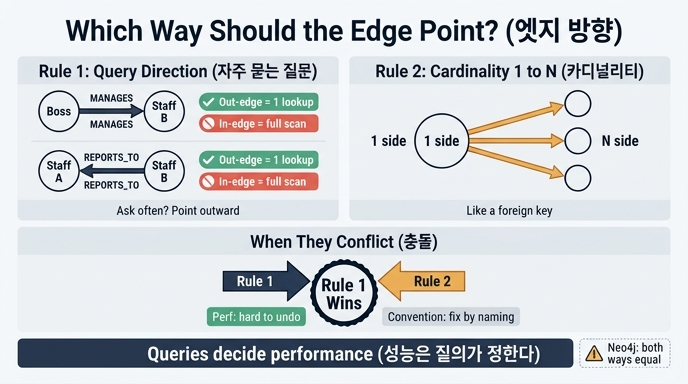

# 엣지 방향을 정하는 두 가지 기준

> **Q.** 엣지 방향을 정하는 두 가지 기준은 무엇이고 충돌하면 어떻게 하는가?
>
> **A.** 첫째, 자주 묻는 질문을 나가는 방향으로. 둘째, 카디널리티가 1 쪽에서 N 쪽으로. 충돌하면 1번을 따르며, 성능은 질의가 정한다.

---

## 한 줄로

방향은 **사실(fact)이 아니라 질의(query)를 위한 설계 결정**이다. `김부장 -[:MANAGES]-> 박대리`와 `박대리 -[:REPORTS_TO]-> 김부장`은 같은 사실을 담지만, 어느 쪽으로 그렸느냐에 따라 어떤 질문이 싸고 어떤 질문이 비싸지는지가 갈린다.

---

## 기준 1 — 자주 묻는 질문을 「나가는」 방향으로

### 왜 나가는 방향이 싼가

대부분의 그래프 저장 구조(인접 리스트, CSR 등)는 노드마다 **나가는 엣지 목록**을 붙여 둔다. 그래서 「이 노드에서 나가는 엣지」는 포인터 한 번으로 얻지만, 「이 노드로 들어오는 엣지」는 역방향 색인이 없으면 전체 엣지를 훑어야 한다.

7장 예제(`code/ex2_direction.py`)가 이걸 숫자로 보여 준다. 같은 조직도를 두 방향으로 저장하고 두 질문을 던진다.

| 저장 방향 | 「박대리의 상사는?」 | 「김부장의 부하는?」 |
|---|---|---|
| `MANAGES` (상사 → 부하) | 전체 훑기 (비용 3) | 색인 조회 (비용 1) |
| `REPORTS_TO` (부하 → 상사) | 색인 조회 (비용 1) | 전체 훑기 (비용 3) |

엣지 3개짜리 장난감이라 차이가 안 느껴지지만, 엣지가 100만 개면 「전체 훑기」는 100만 번이다.

```python
def ask_boss(name, edges, label):
    """«이 사람의 상사는?» 나가는 엣지로 답할 수 있으면 1번, 아니면 전체 훑기."""
    idx = out_index(edges)
    if label == "REPORTS_TO":
        return idx.get(name, []), 1        # 나가는 방향 → 색인 한 방
    scanned = 0
    found = []
    for a, b in edges:                     # 역방향 → 전부 훑는다
        scanned += 1
        if b == name:
            found.append(a)
    return found, scanned
```

### 「자주 묻는 질문」을 어떻게 아는가

- 실제 서비스에서 초당 몇 번 나가는 질의인지 세어 본다. 조직도라면 보통 「내 상사 체인 타고 올라가기」(승인 흐름)가 「부하 전개」보다 훨씬 잦다.
- 아직 서비스가 없으면 화면/API 목록을 적어 보고 어느 방향 탐색이 몇 개 화면에 필요한지 센다.
- 애매하면 **깊게 반복 탐색하는 쪽**을 나가는 방향으로 둔다. 1홉 차이는 견딜 수 있지만 5홉을 역방향으로 도는 비용은 못 견딘다.

### 중요한 예외: 엔진이 대신 해 주면 이 기준은 사라진다

예제 주석이 명시한다.

> 엔진이 역방향 색인을 자동으로 만들어 주면 이 차이가 사라진다.
> Neo4j 는 양방향 탐색이 대칭이지만, 모든 엔진이 그런 건 아니다.

Neo4j는 관계 레코드를 양쪽 노드의 이중 연결 리스트에 모두 걸어 두므로, `(a)<-[:MANAGES]-(b)`도 `(a)-[:MANAGES]->(b)`와 같은 비용이다. 반대로 인접 리스트만 들고 있는 자체 구현, 단방향 CSR, 일부 RDF/트리플 스토어 구성, 스트리밍 그래프 처리기에서는 역방향이 그냥 풀스캔이다. **그러니 이 기준은 「그래프의 진리」가 아니라 「내가 쓰는 엔진의 저장 구조에 대한 대응」이다.** 엔진을 먼저 확인하라.

---

## 기준 2 — 카디널리티가 「1 쪽」에서 「N 쪽」으로

관계형 DB에서 외래 키를 N 쪽 테이블에 두는 것과 같은 감각이다. 조직도에서 부하는 여럿(N)이지만 상사는 하나(1)다. 그러면 `상사 -[:MANAGES]-> 부하*`, 즉 1 쪽에서 N 쪽으로 화살표를 낸다.

이 기준이 주는 이득은 성능이 아니라 **읽기 쉬움과 제약 표현**이다.

- 화살표를 보면 「하나가 여럿을 거느린다」는 구조가 그림에서 바로 읽힌다. 스키마 다이어그램이 자기 설명적이 된다.
- 「나가는 엣지가 정확히 1개」라는 불변식(invariant)을 검사하기 쉬워진다. 반대 방향이면 「들어오는 엣지가 1개」를 검사해야 하는데, 이건 전체를 봐야 알 수 있다.
- 팬아웃이 예측 가능하다. 1 → N 방향으로 내려가면 각 단계에서 몇 개로 퍼지는지 감이 잡힌다.

`(회사)-[:소유]->(자회사)`, `(주문)-[:포함]->(주문항목)`, `(폴더)-[:CONTAINS]->(파일)` 같은 계층/소유 관계가 전형적인 사례다.

---

## 충돌하면? — 1번을 따른다

두 기준이 어긋나는 상황은 흔하다. 조직도에서 카디널리티는 `MANAGES`(1 → N)를 권하는데, 실제 질의가 「내 상사는 누구, 그 위는 누구」로 위로 타고 올라가는 것뿐이라면 기준 1은 `REPORTS_TO`를 권한다.

이때는 **기준 1이 이긴다.**

> 둘이 충돌하면 1번을 따른다. **성능은 질의가 정한다.**

논리는 간단하다.

- 기준 2가 주는 건 가독성과 관례다 — 문서, 주석, 명명, 다이어그램으로 **보완할 수 있다.**
- 기준 1이 주는 건 응답 시간이다 — 잘못 잡으면 색인 추가, 역방향 엣지 중복 저장, 스키마 마이그레이션 같은 **비싼 수단으로만 되돌릴 수 있다.**

되돌리기 비용이 비싼 쪽을 먼저 지키는 것이다. 6장·7장 전체를 흐르는 원칙과 같다. 데이터가 쌓인 뒤 방향을 뒤집는 일은 데이터 이동보다 **이미 쓰인 질의·코드·문서의 표기 통일**이 더 오래 걸린다.

### 실무 팁

- 방향을 기준 1에 맞췄고 기준 2와 어긋난다면, **관계 타입 이름으로 방향을 못 박아라.** `REPORTS_TO`처럼 이름 자체가 방향을 말하게 하면 나중에 읽는 사람이 헷갈리지 않는다. `RELATED`, `LINK` 같은 방향 없는 이름이 최악이다.
- 두 방향 질의가 모두 무겁고 엔진이 역방향을 못 받쳐 준다면, 마지막 수단으로 **양방향 엣지를 둘 다 저장**한다. 대신 쓰기 시 정합성을 지킬 책임이 생긴다. 성능을 위해 중복을 감수하는 명시적 트레이드오프다.
- 관계가 진짜 대칭이라면(`FRIEND_OF`, `SIMILAR_TO`) 방향은 의미가 없다. 이때는 무향으로 다루겠다고 선언하고, 저장은 한 방향만 하되 질의를 항상 무향으로 쓰거나(Cypher의 `-[:FRIEND_OF]-`) 양쪽을 다 저장하고 규칙으로 강제한다. 반쯤 대칭인 상태를 방치하면 차수 계산부터 어긋난다.

---

## 정리표

| | 기준 1 | 기준 2 |
|---|---|---|
| 내용 | 자주 묻는 질문을 나가는 방향으로 | 카디널리티 1 쪽 → N 쪽 |
| 근거 | 나가는 엣지는 색인 조회, 들어오는 엣지는 스캔 | 외래 키 관례, 구조 가독성, 제약 검사 |
| 얻는 것 | 성능 | 가독성, 불변식 |
| 어긋날 때 | **우선** | 양보 (이름·문서로 보완) |
| 무력화 조건 | 엔진이 양방향 대칭 (예: Neo4j) | 없음 |

한 문장으로: **방향은 사실이 아니라 질의 패턴이 정한다. 관례는 성능에 양보한다.**

## 인포그래픽


