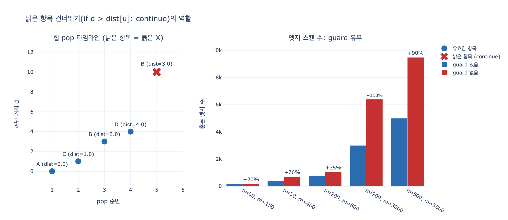

# 다익스트라의 `if d > dist.get(u, inf): continue`

## 질문

다익스트라에서 우선순위 큐를 꺼낸 뒤 `if d > dist.get(u, inf): continue`를 두는 이유는 무엇인가?

## 답

**이미 더 짧은 거리로 확정된 노드의 낡은 항목(stale entry)을 건너뛰기 위해서다.**
큐에 같은 노드를 중복 삽입하는 것을 허용하는 구현에서 필요한 검사다.

---

## 1. 문제의 코드

7장 `code/ex3_weights.py`의 다익스트라다.

```python
dist = {start: 0.0}
prev = {}
pq = [(0.0, start)]
while pq:
    d, u = heapq.heappop(pq)
    if u == goal:
        break
    if d > dist.get(u, float("inf")):   # ← 이 두 줄
        continue
    for v, c in adj[u]:
        nd = d + c
        if nd < dist.get(v, float("inf")):
            dist[v] = nd
            prev[v] = u
            heapq.heappush(pq, (nd, v))   # ← 중복 push가 여기서 생긴다
```

`heappush`가 조건문 안에 있다는 데 주목한다. **한 노드에 대해 더 짧은 거리를 찾을 때마다 push가 한 번 더 일어난다.** 즉 같은 노드가 힙에 여러 번 들어간다.

## 2. 왜 중복을 허용하나 — decrease-key가 없기 때문

교과서 다익스트라는 우선순위 큐에 노드를 **하나씩만** 두고, 더 짧은 거리를 찾으면 힙 안의 그 항목의 키를 낮춘다(**decrease-key**).

$$\text{dist}[v] \leftarrow \text{dist}[u] + w(u,v) \quad\Rightarrow\quad \text{DecreaseKey}(Q,\, v,\, \text{dist}[v])$$

그런데 파이썬 `heapq`에는 decrease-key가 없다. 힙은 리스트일 뿐이고, 특정 노드가 힙 배열의 어디에 있는지 알 방법이 없다. 찾으려면 $O(n)$ 선형 탐색이고, 위치를 따로 추적하는 인덱스드 힙(indexed heap)을 직접 구현해야 한다.

그래서 실무 구현은 대부분 **키를 낮추는 대신 새 항목을 하나 더 밀어 넣는다.** 이 방식을 **lazy insertion**(또는 lazy deletion) 다익스트라라고 부른다.

$$\text{push}(Q,\ (\text{dist}[v],\, v)) \quad\text{— 기존 } (\text{old},\, v)\text{ 는 힙에 그대로 남는다}$$

남겨진 `(old, v)`가 **낡은 항목**이다. `old > dist[v]`이므로 최소 힙에서는 새 항목보다 **나중에** 나온다. 나올 때는 이미 `v`가 더 짧은 거리로 확정된 뒤이므로 그냥 버려야 한다.

## 3. 검사식이 뜻하는 것

```python
if d > dist.get(u, float("inf")):
    continue
```

`d`는 **힙에서 꺼낸 순간의(=push된 시점의) 거리**이고, `dist[u]`는 **지금 알려진 최단 거리**다. 따라서

| 조건 | 뜻 | 처리 |
|---|---|---|
| `d == dist[u]` | 이 항목이 최신이다 | 전개한다(이웃을 훑는다) |
| `d > dist[u]` | push 이후 더 짧은 길이 발견됐다 = **나는 낡았다** | `continue`로 버린다 |
| `d < dist[u]` | 음이 아닌 가중치에서는 발생하지 않는다 | — |

`dist.get(u, inf)`의 기본값 `inf`는 방어적 코드다. `dist[u]`는 push할 때 항상 함께 갱신되므로 힙에서 나온 노드는 반드시 `dist`에 있다. 그래도 `KeyError` 대신 "무한히 멀다"로 읽어 `d > inf`가 거짓이 되게 해 둔 것이다.

## 4. 실제로 어떤 일이 벌어지나 (최소 예제)

```
A --10--> B          (B를 먼저 10으로 발견)
A --1--> C --2--> B  (나중에 B를 3으로 다시 발견)
B --1--> D
```

힙 pop 순서:

| pop | `d` | `u` | `dist[u]` | 판정 |
|---|---|---|---|---|
| 1 | 0 | A | 0 | 전개 → `(10,B)`, `(1,C)` push |
| 2 | 1 | C | 1 | 전개 → B가 3으로 개선, `(3,B)` push |
| 3 | 3 | B | 3 | 전개 → `(4,D)` push |
| 4 | 4 | D | 4 | 전개 |
| 5 | **10** | **B** | **3** | $10 > 3$ → **`continue`** |

5번 pop이 바로 그 낡은 항목이다. `(10, B)`는 2번 pop 시점에 무효가 됐지만 힙에서 지울 수 없어 끝까지 남아 있다가 나왔다.

## 5. 이 검사는 정확성 장치인가, 비용 장치인가

**가중치가 모두 음이 아니면, 이 검사를 빼도 결과는 여전히 맞다.** 낡은 항목으로 전개해도

$$d_{\text{stale}} > \text{dist}[u] \quad\Rightarrow\quad d_{\text{stale}} + w(u,v) > \text{dist}[u] + w(u,v) \ \ge\ \text{dist}[v]$$

이므로 `nd < dist[v]` 조건을 통과하지 못한다. 잘못된 덮어쓰기가 원리적으로 불가능하다.

> 주의: 이 안전성은 책 코드가 `nd = d + c`처럼 **pop해 온 `d`** 를 쓰기 때문에 성립한다. `nd = dist[u] + c`로 바꿔 쓰면 값은 같지만 재전개가 연쇄되어 훨씬 나빠진다.

대신 **이웃을 한 번 더 훑는 헛일**을 한다. 즉 이 검사는 정확성보다 **비용 장치**다. 이것이 있어야 "각 노드는 딱 한 번만 전개된다"는 불변식이 지켜지고, 그래야 복잡도가

$$O\big((V + E)\log V\big)$$

로 유지된다. 무작위 그래프 실측(expy.py 3절):

| 규모 | pop 횟수 | 낡은 항목 | 스캔(guard 있음) | 스캔(guard 없음) | 추가 비용 |
|---|---|---|---|---|---|
| n=50, m=150 | 60 | 11 | 147 | 176 | +20% |
| n=50, m=400 | 90 | 40 | 400 | 704 | +76% |
| n=200, m=800 | 260 | 66 | 776 | 1048 | +35% |
| n=200, m=3000 | 429 | 229 | 3000 | 6398 | **+113%** |
| n=500, m=5000 | 947 | 447 | 5000 | 9482 | +90% |

guard가 있으면 스캔 수가 (도달 가능한) 엣지 수에 정확히 수렴한다. 없으면 두 배 넘게 늘어난다. 간선이 촘촘할수록 개선 기회가 많아 낡은 항목도 많이 쌓인다.

## 6. 대안 — `visited` 집합, 그리고 둘의 차이

같은 목적을 집합으로도 달성할 수 있다.

```python
if u in done:
    continue
done.add(u)
```

음이 아닌 가중치에서 두 방식은 완전히 동등하다(전개 횟수까지 같다). 하지만 성격이 다르다.

| | `d > dist[u]` | `u in done` |
|---|---|---|
| 판정 기준 | **거리** | **방문 여부** |
| 추가 자료구조 | 없음 | 집합 하나 |
| 부동소수 비교 | 있음 | 없음 |
| 음수 간선 | 값이 낮아지면 새 항목이 push되어 **재전개된다** → 스스로 고친다(SPFA처럼) | 한 번 본 노드는 다시 안 봐서 **하류가 틀린 값에 갇힌다** |

실제 차이 (`A→B=2, A→C=1, C→D=1, D→B=-5, B→E=1`, 정답은 `B=-3, E=-2`):

```
d > dist[u]  : {'A': 0.0, 'B': -3.0, 'C': 1.0, 'D': 2.0, 'E': -2.0}   ← 맞다
visited 집합 : {'A': 0.0, 'B': -3.0, 'C': 1.0, 'D': 2.0, 'E':  3.0}   ← E가 틀렸다
```

`B`가 먼저 2로 pop되어 `E=3`을 만든 뒤, `D`를 거쳐 `B`가 $-3$으로 낮아진다. `d > dist[u]` 방식은 이때 `(-3, B)`가 새로 push되고 그 항목은 낡지 않았으므로 `B`를 다시 전개해 `E`를 고친다. `visited` 방식은 `B`가 이미 `done`이라 건너뛰고 `E=3`이 남는다.

(그렇다고 음수 간선에 다익스트라를 쓰라는 말은 아니다. `d > dist[u]` 방식은 사실상 SPFA로 퇴화해 최악의 경우 지수 시간이 된다. 음수 간선이 있으면 Bellman-Ford를, 음수 사이클 검출이 필요하면 그쪽 알고리즘을 쓴다.)

## 7. `if u == goal: break`와의 관계

책 코드는 낡은 항목 검사보다 **먼저** 목표 노드 도달을 확인한다.

```python
d, u = heapq.heappop(pq)
if u == goal:
    break
if d > dist.get(u, float("inf")):
    continue
```

순서가 뒤바뀐 것처럼 보이지만 문제없다. 힙은 거리 순으로 나오므로 `goal`이 **처음** pop되는 순간의 `d`가 곧 최단 거리다. 낡은 `goal` 항목은 항상 최신 항목보다 늦게 나오기 때문에 먼저 마주치는 일이 없다.

## 8. 한 문장 정리

`if d > dist.get(u, inf): continue`는 **decrease-key가 없어서 중복 push로 우회한 대가를 pop 시점에 청산하는 코드**다. 낡은 항목을 버려 각 노드가 정확히 한 번만 전개되게 만들고, 그래서 $O((V+E)\log V)$가 지켜진다.

그리고 7장의 큰 교훈은 이 검사 바깥에 있다 — 가중치의 **뜻**(거리인가 강도인가)이 알고리즘의 전제를 정한다. 친밀도(클수록 가깝다)를 그대로 넣으면 guard가 아무리 정확해도 "제일 안 친한 경로"를 최단 경로라고 답한다. 그래서 속성 이름에 뜻을 박아 넣어야 한다: `weight` (X) → `cost_minutes`, `affinity_score` (O).

## 시각화



왼쪽은 최소 예제의 힙 pop 타임라인이다. 5번째 pop `(10, B)`가 붉은 X로 표시된 낡은 항목이며, 이때 `dist[B]`는 이미 3이므로 `continue`로 버려진다. 오른쪽은 규모별 엣지 스캔 수 비교로, guard를 빼면 낡은 항목만큼 노드를 재전개해 스캔이 최대 두 배 넘게 늘어난다.
