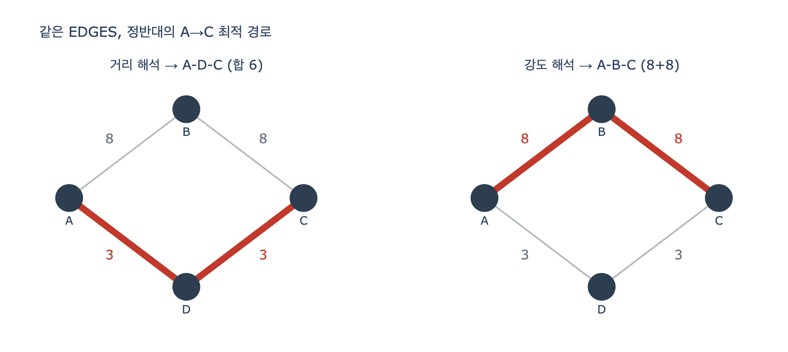

# 힌트 — `ex3_weights.py`의 A→C, 거리 해석과 강도 해석

## 질문

`ex3_weights.py`의 EDGES로 A→C 경로를 구하면 두 해석에서 어떻게 갈리는가?

## 답

거리로 읽으면 합이 작은 **A-D-C(3+3)** 를, 강도로 읽으면 값이 큰 **A-B-C(8+8)** 를 택한다.
같은 데이터에서 정반대 답이 나온다.

---

## 1. 데이터부터 보기

7장 예제 3의 엣지는 딱 네 개다.

```python
EDGES = [("A", "B", 8), ("B", "C", 8), ("A", "D", 3), ("D", "C", 3)]
```

무향으로 읽으면 A에서 C로 가는 길은 두 개뿐인 다이아몬드 모양이다.

| 경로 | 지나는 엣지 값 | 합 |
|---|---|---|
| A–B–C | 8, 8 | 16 |
| A–D–C | 3, 3 | 6 |

주석에 뜻이 명시되어 있다.

```
#  강도 해석: 값이 클수록 가깝다 (친밀도, 유사도, 거래액)
#  거리 해석: 값이 클수록 멀다 (비용, 시간, 요금)
```

**숫자 8과 3 자체에는 아무 뜻이 없다.** 뜻은 읽는 쪽이 정한다. 이 카드의 핵심이 그것이다.

## 2. 거리로 읽으면 — 합이 작은 A-D-C

값이 클수록 «멀다»는 뜻이면 좋은 경로는 합이 **작은** 쪽이다.

$$\text{cost}(P)=\sum_{(u,v)\in P} w_{uv},\qquad P^{*}=\arg\min_P \text{cost}(P)$$

- A–B–C = 8+8 = 16
- A–D–C = 3+3 = **6** ← 선택

이게 다익스트라가 기본으로 전제하는 해석이다. 코드에서는 `as_distance=True`이고,
`cost = w`로 그대로 쓴다. 출력은 `A → D → C (합 6.0)`.

## 3. 강도로 읽으면 — 값이 큰 A-B-C

값이 클수록 «가깝다»는 뜻이면 기준이 뒤집힌다. 좋은 경로는 값이 **큰** 쪽이다.

$$P^{*}=\arg\max_P \sum_{(u,v)\in P} w_{uv}$$

- A–B–C = 8+8 = **16** ← 선택
- A–D–C = 3+3 = 6

다만 다익스트라에 «최대화»를 그대로 넣을 수는 없다. 그래서 예제는 강도를 거리로
바꾸는 **역수 변환**을 쓴다.

```python
cost = w if as_distance else 1.0 / w
```

$$c_{uv}=\frac{1}{w_{uv}}\quad\Rightarrow\quad \min_P \sum \frac{1}{w_{uv}}$$

- A–B–C: $1/8+1/8=0.25$ ← 최소
- A–D–C: $1/3+1/3\approx0.667$

출력은 `A → B → C (합 0.25)`. 여기서 «합 0.25»는 거리의 6, 16과 같은 축의 값이 아니다.
역수 공간의 비용이므로 앞의 숫자와 비교하면 안 된다.

## 4. 그래서 왜 «사고»인가

두 결과를 나란히 놓으면 이렇다.

| 해석 | 고른 경로 | 근거 |
|---|---|---|
| 거리 (`as_distance=True`) | A → D → C | 합 6이 16보다 작다 |
| 강도 (`as_distance=False`) | A → B → C | 8이 3보다 크다 (역수합 0.25가 0.667보다 작다) |

**같은 `EDGES`, 같은 시작·도착점, 정반대의 답.** 플래그 하나 차이다.

7.3절이 소개하는 실제 사고는 3번의 데이터를 2번의 코드에 넣은 경우다.
친밀도(클수록 친함)를 저장해 놓고 최단 경로 알고리즘에 그대로 넣으면, 알고리즘은
«작을수록 가깝다»로 읽는다. 그래서 **가장 안 친한 A-D-C를 «가장 가까운 사이»라고
보고한다.** 결과가 그럴듯한 노드 이름으로 나오기 때문에 틀린 걸 알아채는 데 2주가 걸렸다는
이야기다. 크래시도 예외도 없고, 그냥 조용히 틀린 답이 나온다.

## 5. 한 발 더 — 역수 변환은 유일한 정답이 아니다

이 예제에서는 «강도합 최대»와 «역수합 최소»가 우연히 같은 A-B-C를 골랐다.
일반적으로는 다른 목적함수이므로 답이 갈릴 수 있다. 반례는 쉽게 만들어진다.

```python
COUNTER = [("A", "B", 10), ("B", "C", 10), ("A", "D", 1), ("D", "C", 100)]
```

| 경로 | 강도합 | 역수합 |
|---|---|---|
| A–B–C | 20 | 0.200 ← 역수 기준 승 |
| A–D–C | **101** ← 강도합 기준 승 | 1.010 |

강도를 거리로 바꾸는 방법은 여러 가지이고, 각각 다른 «최적»을 준다.

| 변환 | 식 | 쓰는 자리 |
|---|---|---|
| 역수 | $1/w$ | 예제가 쓰는 방식. 약한 엣지에 큰 벌점 |
| 뺄셈 | $w_{\max}-w$ | 값 범위가 정해진 점수 |
| 음의 로그 | $-\log w$ | 확률·신뢰도의 **곱**을 최대화할 때 |
| 병목(widest path) | 경로 최소 엣지 최대화 | 대역폭, 체인 중 가장 약한 고리 |

즉 «강도를 최단 경로에 넣으려면 변환하면 된다»가 아니라, **무엇을 최적화하려는지
먼저 정하고 그에 맞는 변환을 고른다**가 맞다.

## 6. 예방책: 이름에 뜻을 박아 넣기

7장 한 장 요약에 있는 문장이 여기 대응한다.

> 가중치는 이름에 뜻을 박아 넣으세요. `weight` 대신 `cost_minutes`나 `affinity_score`로요.

`weight`라는 이름은 두 가지를 동시에 숨긴다.

1. **방향** — 클수록 좋은가 나쁜가
2. **단위** — 분인가 km인가 0~1 점수인가

| 이름 | 판정 | 이유 |
|---|---|---|
| `weight` | X | 방향도 단위도 모른다 |
| `cost_minutes` | O | 거리 해석, 합 최소화, 단위 분 |
| `distance_km` | O | 거리 해석, 단위 km |
| `affinity_score` | O | 강도 해석 — 최단경로에 그대로 넣으면 안 된다는 신호 |
| `similarity` | O | 강도 해석, 0~1 |

예제 마지막 문장이 이 카드의 결론이다.

> 이름 하나로 막을 수 있는 사고를 이름을 아껴서 만든다.

## 7. 외우는 요령

- **3+3 = 거리**, **8+8 = 강도**. 작은 숫자 쪽이 «싸다», 큰 숫자 쪽이 «친하다».
- 헷갈리면 «다익스트라는 무조건 작은 걸 좋아한다»부터 떠올린다. 그러면 거리=A-D-C가
  자동으로 나오고, 강도는 그 반대다.
- 관련 시험 문제는 «둘 중 어느 쪽인가»가 아니라 «데이터가 어느 쪽인지 이름으로
  알 수 있는가»다.

## 시각화


