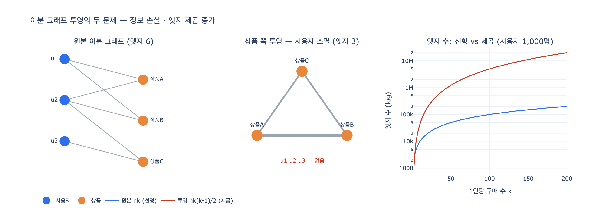

# 이분 그래프를 투영하면 생기는 두 가지 문제

**질문**: 이분 그래프를 투영하면 어떤 두 가지 문제가 생기는가?

**답**: 정보가 사라지고(누가 샀는지) 엣지가 제곱으로 늘어난다.

---

## 1. 배경 — 이분 그래프와 투영

**이분 그래프(bipartite graph)** 는 노드가 두 종류뿐이고, 엣지가 **서로 다른 종류 사이에만** 있는 그래프다.
같은 종류끼리는 절대 이어지지 않는다.

- 사용자 — 상품 (구매)
- 사용자 — 영화 (평점)
- 논문 — 저자 (집필)
- 배우 — 영화 (출연)

```
u1 ──┬── 상품A
     └── 상품B
u2 ──┬── 상품A
     ├── 상품B
     └── 상품C
u3 ───── 상품C
```

문제는 이 구조로는 「상품A와 상품B는 얼마나 비슷한가」에 **바로** 답할 수 없다는 것이다. 상품과 상품은
직접 이어져 있지 않으니 늘 2홉을 돌아야 한다. 그래서 흔히 하는 일이 **투영(projection)** 이다.
한쪽 종류만 남기고, **상대를 공유하면 잇는다**.

$$
u \sim v \iff \exists\, w \ \text{such that}\ (u,w) \in E \ \wedge\ (v,w) \in E
$$

가중치는 보통 «공유한 상대의 수»로 준다. 위 예를 상품 쪽으로 투영하면

```
상품A — 상품B  (함께 산 사람 2명)
상품A — 상품C  (함께 산 사람 1명)
상품B — 상품C  (함께 산 사람 1명)
```

화이트보드에서는 예쁘다. 「함께 팔린 상품」 그래프가 딱 나왔으니 추천에 바로 쓸 수 있어 보인다.
그런데 여기서 두 가지가 터진다.

---

## 2. 문제 하나 — 정보가 사라진다 (누가 샀는지)

위 투영 결과를 다시 보자. `u1`, `u2`, `u3` 이 **한 명도 없다**. 남은 건 「2명이 함께 샀다」는 숫자뿐이고,
그 2명이 **누구였는지**는 그래프에서 지워졌다.

그래서 투영 그래프만 들고는 이런 질문에 답을 못 한다.

- 이 두 상품을 함께 산 사람이 VIP인가 신규 가입자인가
- 그 사람에게 다음에 뭘 추천할까 (개인화가 불가능하다)
- 이 동시구매가 **한 사람의 한 장바구니**였나, **서로 모르는 여러 사람**이었나

### 되돌릴 수 없다 (비가역)

「나중에 원본에서 다시 조회하면 되지」라고 생각할 수 있지만, 투영 그래프 **자체**는 원본을 복원할 수 없다.
투영은 **다대일 사상**이라서 역상이 유일하지 않다.

$$
\pi : \mathcal{B} \to \mathcal{G}, \qquad |\pi^{-1}(G)| > 1
$$

증거는 간단하다. 아래 두 원본은 **완전히 다른 이야기**인데 투영 결과가 **완전히 같다**.

| 원본 | 구매 내역 | 상품 쪽 투영 |
|---|---|---|
| A | u1{A,B}, u2{B,C}, u3{A,C} — 세 사람이 각각 두 개씩 | A—B(1), A—C(1), B—C(1) |
| B | v1{A,B,C} — 한 사람이 세 개 다 | A—B(1), A—C(1), B—C(1) |

투영 그래프는 이 둘을 **구별하지 못한다**. 그런데 추천 품질은 정반대다.

- 원본 B는 「같이 쓰는 세트」라는 강한 근거다 (한 사람이 실제로 세 개를 한꺼번에 썼다)
- 원본 A는 세트 근거가 **전혀** 아니다 (아무도 세 개를 함께 사지 않았다)

즉 투영은 정보를 「접어두는」 게 아니라 **버리는** 것이다. 원본 이분 그래프를 지워버렸다면 그 정보는 끝이다.

---

## 3. 문제 둘 — 엣지가 제곱으로 늘어난다

상품 $k$ 개를 산 사용자 **한 명**은 투영에서 크기 $k$ 의 **완전 그래프(클리크)** 하나를 만든다.
엣지 $k$ 개가 들어와서 엣지 $\binom{k}{2}$ 개가 나간다.

$$
\binom{k}{2} = \frac{k(k-1)}{2} = O(k^2)
$$

사용자 $n$ 명이 각자 $k$ 개를 샀다면 투영 엣지의 상한은

$$
E_{\text{proj}} \le n \cdot \frac{k(k-1)}{2}
$$

원본 이분 그래프는 엣지가 $nk$ 로 **$k$ 에 선형**인데, 투영은 **$k$ 에 제곱**이다. $k$ 가 20배가 되면
엣지는 400배 근처로 뛴다.

| 사용자 | 1인당 구매 | 원본 엣지 | 투영 엣지(상한) | 배율 |
|---:|---:|---:|---:|---:|
| 1,000 | 10 | 10,000 | 45,000 | 4.5x |
| 1,000 | 50 | 50,000 | 1,225,000 | 24.5x |
| 100,000 | 50 | 5,000,000 | 122,500,000 | 24.5x |
| 100,000 | 200 | 20,000,000 | 1,990,000,000 | 99.5x |

1인당 200개를 산 사용자 10만 명이면 투영 엣지가 **20억 개**다. 실제로는 중복이 합쳐져서 이보다 적지만,
「상한이 이 자리에 있다」는 게 설계상 중요하다. 노드 수와 무관하게 **한쪽의 차수 분포**가 폭발을 결정한다.

### 허브 하나가 그래프를 죽인다

반대 방향(사용자 쪽 투영)도 똑같이 위험하다. **인기 상품 하나**가 거대한 클리크를 만든다.

| 그 상품을 산 사람 | 사용자 투영 엣지 |
|---:|---:|
| 1,000 | 499,500 |
| 10,000 | 49,995,000 |
| 100,000 | 4,999,950,000 |

「비닐봉지」 같은 상품 **하나** 때문에 엣지 50억 개가 생긴다. 노드는 10만 개뿐인 그래프에서다.
투영을 쓸 거라면 이 허브를 미리 골라 빼는 것이 사실상 필수다.

---

## 4. 대안

### 대안 1 — 투영하지 말고 이분 그래프 그대로 2홉을 돈다

필요할 때만 계산한다. 저장 비용이 0이고, 무엇보다 **경로에 「누가」가 그대로 남는다**.

```
(상품A)<-[:구매]-(사용자)-[:구매]->(상품B)
```

이 패턴 하나면 「함께 팔린 상품」이 나오면서 중간의 사용자도 손에 남는다. 문제 1이 애초에 발생하지 않는다.
비용은 질의 시점으로 옮겨가는 것뿐이다.

### 대안 2 — 투영하되 임계값으로 자른다

「함께 산 사람 $N$명 이상」만 남긴다. 대개 3명이면 충분하다. 노이즈 엣지(딱 한 명이 우연히 같이 산 것)가
투영 엣지 수의 대부분이라, 절단만으로 크기가 몇 자릿수 줄어든다.

자르는 값의 실용 기준: **엣지 수가 노드 수의 20배를 넘지 않게** 잡는다.

예제의 작은 그래프에서도 «2명 이상»으로 자르면 엣지 3개가 1개(상품A—상품B)로 줄어든다.
그리고 남은 그 하나가 실제로 유일하게 의미 있는 엣지다.

---

## 5. 정리

| 문제 | 무슨 일이 벌어지나 | 대응 |
|---|---|---|
| **정보 손실** | 투영 후 반대편 노드가 사라진다(누가 샀는지). 다대일 사상이라 복원 불가 | 이분 그래프를 원본으로 남기고, 필요할 때 2홉으로 계산 |
| **엣지 폭발** | 이웃 $k$ 개가 $\binom{k}{2}$ 엣지로 부푼다. 허브 하나가 수십억 엣지 | 임계값 절단(3명 이상), 허브 제외, 엣지 수를 노드 수의 20배 이내로 |

암기 포인트: **「누가」가 사라지고, 「$k$ 개」가 「$k^2/2$ 개」가 된다.**

---

## 참고

- [networkx: bipartite algorithms](https://networkx.org/documentation/stable/reference/algorithms/bipartite.html) — `projected_graph`, `weighted_projected_graph` 등
- 본문 예제: `content/ch07/code/ex4_bipartite.py`

## 시각화


