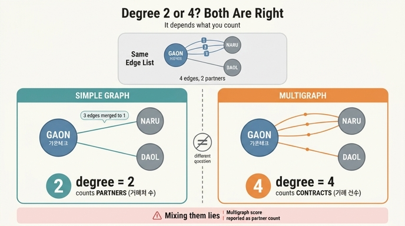

# 가온테크의 차수는 2인가 4인가

## 질문

`ex5_multigraph.py`에서 가온테크의 차수가 2 또는 4로 갈리는 이유는 무엇인가?

## 답

나루소프트와 계약이 3번, 다올물산과 1번이므로, **거래처 수로 세면 2이고 거래 건수로 세면 4**다. 둘 다 맞고 **세는 대상이 다를 뿐**이다.

## 데이터부터 보기

예제의 엣지 목록은 이렇습니다.

| 출발 | 도착 | 계약 번호 |
|---|---|---|
| 가온테크 | 나루소프트 | C-2023-011 |
| 가온테크 | 나루소프트 | C-2024-088 |
| 가온테크 | 나루소프트 | C-2025-118 |
| 가온테크 | 다올물산 | C-2025-200 |
| 라온에너지 | 라온에너지 | C-2025-301 (자기 루프) |

가온테크가 걸린 엣지는 **4줄**입니다. 그런데 그 4줄이 가리키는 **상대 회사는 2곳**뿐입니다. 이 어긋남이 차수를 두 개로 갈라놓습니다.

## 두 함수가 하는 일

### `degree_simple` — 단순 그래프 (거래처 수)

```python
pairs = {(min(a, b), max(a, b)) for a, b, _ in edges if a != b}
```

- `set`으로 만들면서 **같은 쌍은 하나로 압축**됩니다. `(가온테크, 나루소프트)`가 3번 나와도 집합에는 1개만 남습니다.
- `min`/`max`로 정렬해 넣는 것은 방향을 무시하고 `(A,B)`와 `(B,A)`를 같은 쌍으로 보겠다는 뜻입니다.
- `if a != b`로 **자기 루프는 아예 버립니다**. 그래서 라온에너지의 단순 차수는 0입니다.
- 결과: 가온테크는 `(가온테크, 나루소프트)`, `(가온테크, 다올물산)` 두 쌍에 등장 → **차수 2**.

이 숫자가 답하는 질문은 "**가온테크는 몇 곳과 거래하는가**"입니다.

### `degree_multi` — 다중 그래프 (거래 건수)

```python
for a, b, _ in edges:
    if a == b:
        deg[a] += 2
    else:
        deg[a] += 1
        deg[b] += 1
```

- 압축이 없습니다. **엣지 한 줄마다 양쪽 끝에 1씩** 더합니다.
- 결과: 가온테크는 4줄에 등장 → **차수 4**.

이 숫자가 답하는 질문은 "**가온테크는 계약을 몇 건 맺었는가**"입니다.

### 전체 표

| 노드 | 단순 차수 (거래처) | 다중 차수 (거래 건수) |
|---|---:|---:|
| 가온테크 | 2 | 4 |
| 나루소프트 | 1 | 3 |
| 다올물산 | 1 | 1 |
| 라온에너지 | 0 | 2 |

나루소프트도 같은 방식으로 1 대 3으로 갈립니다. 다올물산은 계약이 1건뿐이라 두 값이 같고, 그래서 이런 종류의 버그는 **중복이 없는 노드만 보고 검증하면 절대 드러나지 않습니다.**

## 왜 "둘 다 맞다"인가

차수(degree)는 원래 "그 노드에 붙은 엣지의 개수"입니다. 문제는 **엣지를 어떻게 세느냐가 그래프의 종류에 따라 다르다**는 것입니다.

- **단순 그래프(simple graph)**: 두 노드 사이에 엣지는 최대 1개. 자기 루프 없음. 여기서 차수 = 이웃의 수.
- **다중 그래프(multigraph)**: 같은 쌍 사이에 엣지가 여러 개 존재 가능. 여기서 차수 = 걸린 엣지의 수이고, 이웃 수와 일치하지 않습니다.

같은 데이터를 어떤 그래프로 읽었느냐에 따라 차수의 정의 자체가 달라지므로, 2도 4도 계산 오류가 아닙니다. **틀린 것은 "무엇을 셀지"를 정하지 않고 아무 숫자나 쓰는 태도**입니다.

## 사고는 두 개를 섞을 때 난다

예제의 결론 문장이 정확히 이 지점을 찍습니다.

> 중심성을 다중 그래프로 계산해 놓고 «거래처가 많은 회사»라고 보고하면 틀린다. 계약을 여러 번 한 회사가 1등이 된다.

거래처를 딱 1곳만 두고 계약을 50번 갱신한 회사가, 거래처 10곳과 각각 1번씩 계약한 회사를 차수 순위에서 이깁니다. 지표 이름("거래처가 많은")과 계산 방식(엣지 건수)이 어긋난 것이고, 결과 숫자는 정상적으로 보이기 때문에 조용히 잘못된 보고서로 넘어갑니다.

## 자기 루프라는 또 하나의 흔들림

라온에너지가 자기 자신에게 대여한 엣지 1개는 세 번째 애매함을 만듭니다.

- 예제의 `degree_multi`는 **2로 셉니다.** 엣지의 양 끝이 모두 같은 노드에 붙어 있으니 2번 세는 것이 그래프 이론의 관례입니다(핸드셰이크 정리 `Σdeg = 2|E|`를 유지하려면 2여야 합니다).
- 예제의 `degree_simple`은 **아예 0으로 만듭니다.** 자기 루프는 새 거래처를 뜻하지 않으니까요.
- 라이브러리에 따라 1로 세는 구현도 있습니다. 그래서 도구를 갈아 끼우면 코드를 하나도 안 고쳤는데 숫자가 달라집니다.

예제의 권고는 "미리 걸러 두는 편이 낫다"입니다. 계산 파이프라인 앞에서 자기 루프를 제거하거나 별도로 집계해 두면, 어떤 라이브러리를 써도 결과가 흔들리지 않습니다.

## 실무에서 남길 습관

1. **세는 대상을 이름에 박아 둔다.** `degree` 대신 `partner_count`, `contract_count`처럼. 7.3절의 `weight` → `cost_minutes` 교훈과 같은 처방입니다.
2. **그래프 종류를 코드에 선언한다.** 단순인지 다중인지 주석이나 타입으로 명시하고, 필요하면 로딩 단계에서 실제로 중복 엣지를 압축해 둡니다.
3. **자기 루프는 로딩 시점에 정책을 정한다.** 버릴지, 2로 셀지, 별도 집계할지.
4. **검증 데이터에 중복 엣지를 반드시 넣는다.** 위 표의 다올물산처럼 중복 없는 노드만으로 테스트하면 이 버그는 통과합니다.

## 참고

- [multigraph, self-loop — NetworkX MultiGraph](https://networkx.org/documentation/stable/reference/classes/multigraph.html)
- 예제 파일: `content/ch07/code/ex5_multigraph.py`

## 인포그래픽


