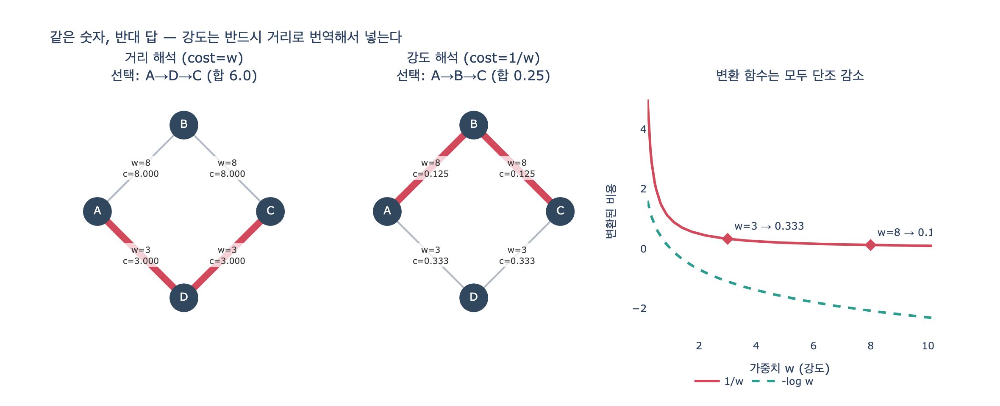

# `ex3_weights.py`의 `dijkstra()`는 강도 해석을 어떻게 처리하는가?

## 한 줄 답

`as_distance=False`일 때 가중치를 `1.0 / w`로 **역수 변환**해 거리로 바꾼다. 최단 경로 알고리즘은 항상 «작을수록 가깝다»로 읽기 때문이다.

## 문제의 뿌리: 숫자에는 단위가 없다

엣지에 `8`이라는 숫자가 붙어 있다. 이 숫자는 두 가지 정반대 뜻일 수 있다.

| 해석 | 뜻 | 예시 속성 | 좋은 경로는 |
|---|---|---|---|
| **거리(distance)** | 값이 **클수록 멀다** | 소요 시간, 요금, 비용, 홉 수 | 합이 **작은** 쪽 |
| **강도(strength)** | 값이 **클수록 가깝다** | 친밀도, 유사도, 거래액, 신뢰도 | 합이 **큰** 쪽 |

그런데 다익스트라(Dijkstra), 벨만-포드, A\*, `shortestPath()` 같은 최단 경로 알고리즘은 예외 없이 **거리 해석 하나만** 안다. 내부에서 우선순위 큐를 `heappop`으로 뽑는 순간 «누적값이 가장 작은 정점»을 고르고, `if nd < dist.get(v, inf)`로 «더 작으면 갱신»한다. 즉 알고리즘 입장에서 작은 값 = 가까움이다.

그러니 강도 데이터를 그대로 넣으면 알고리즘은 «가장 안 친한 경로»를 «가장 가까운 사이»라고 대답한다. 7장 본문에서 저자가 2주를 날린 사고가 정확히 이것이다.

## 코드가 하는 일

```python
def dijkstra(edges, start, goal, as_distance=True):
    adj = defaultdict(list)
    for a, b, w in edges:
        cost = w if as_distance else 1.0 / w   # ← 여기 한 줄이 전부다
        adj[a].append((b, cost))
        adj[b].append((a, cost))
    ...
```

핵심은 **그래프를 만드는 시점에 한 번만** 변환한다는 점이다. 탐색 루프(`heapq` 부분)는 손대지 않는다.

- `as_distance=True` → `cost = w`. 숫자를 그대로 거리로 쓴다.
- `as_distance=False` → `cost = 1.0 / w`. 강도가 클수록 비용이 작아지므로, 「강한 엣지 = 가까운 엣지」가 성립한다.

변환 함수 $f(w) = 1/w$ 가 $w > 0$ 구간에서 **단조 감소**라는 것이 유일한 근거다. 즉 $w_1 > w_2 \iff f(w_1) < f(w_2)$. 순서가 뒤집히니, 「최댓값 찾기」가 「최솟값 찾기」로 바뀐다.

## 실제로 답이 뒤집히는 예

```python
EDGES = [("A", "B", 8), ("B", "C", 8), ("A", "D", 3), ("D", "C", 3)]
```

A에서 C로 가는 경로는 두 개다.

| 경로 | 원래 가중치 | 거리 해석 비용 | 강도 해석 비용 (`1/w` 합) |
|---|---|---|---|
| A → B → C | 8, 8 | 8 + 8 = **16** | 1/8 + 1/8 = **0.25** ← 승자 |
| A → D → C | 3, 3 | 3 + 3 = **6** ← 승자 | 1/3 + 1/3 ≈ **0.667** |

같은 데이터, 정반대 답이다.

- 숫자가 «분 단위 소요 시간»이었다면 A→D→C(6분)가 맞다.
- 숫자가 «친밀도 점수»였다면 A→B→C(8점씩)가 맞다.

숫자만 보고는 어느 쪽인지 알 수 없다. 그래서 `as_distance` 같은 **플래그로 뜻을 명시**하거나, 아예 속성 이름에 뜻을 박아 넣어야 한다.

## 예방법: 이름에 뜻을 박는다

본문의 처방은 단순하다.

```
weight (X)  →  cost_minutes, affinity_score (O)
```

`weight`는 아무 뜻도 없는 이름이다. `cost_minutes`면 «작을수록 좋다»가 이름에 들어 있고, `affinity_score`면 «클수록 좋다»가 이름에 들어 있다. 6개월 뒤 다른 사람이(혹은 6개월 뒤의 나 자신이) 코드를 볼 때 이름 하나로 사고를 막는다.

## `1/w` 변환의 한계 — 여기가 진짜 함정

역수 변환은 «만능 정답»이 아니다. 이 코드에서 통하는 이유는 **엣지 단위로 순서를 뒤집기만 하면 되는 상황**이기 때문이다. 다음 세 가지는 조심해야 한다.

### 1. `w = 0`이면 터진다

`1.0 / 0` → `ZeroDivisionError`. 강도 0(전혀 안 친함)은 실무 데이터에 흔히 있다. `1.0 / (w + eps)`처럼 작은 값을 더하거나, 0인 엣지는 애초에 만들지 않는 방식으로 막아야 한다. 음수 가중치도 마찬가지로 문제인데, 다익스트라 자체가 음수 간선을 지원하지 않는다.

### 2. 「경로 강도의 정의」가 바뀐다

역수 합을 최소화한다는 것은

$$\min_P \sum_{e \in P} \frac{1}{w_e}$$

를 푸는 것이다. 이것은 「경로 강도 = 강도의 합」을 최대화하는 문제와 **같지 않다**. 예를 들어 강도 합이 큰 경로가 역수 합에서 질 수 있다. 역수 합은 오히려 **조화평균 계열의 양**이라, 「약한 엣지 하나가 있으면 경로 전체가 크게 나빠진다」는 성질을 갖는다. 병렬 저항의 역수 합, 병목 중심 사고와 결이 같다.

이 성질이 원하는 것인지 아닌지는 **도메인이 결정한다**. 「가장 신뢰할 수 있는 소개 경로」라면 약한 고리 하나가 치명적이라 역수 합이 오히려 자연스럽다. 「총 거래액이 가장 큰 경로」라면 역수 합은 답이 아니다.

### 3. 확률·유사도라면 `-log`가 정석

강도가 0에서 1 사이의 확률(신뢰 확률, 링크 존재 확률)이고, 경로의 강도를 **곱**으로 정의하고 싶다면 최대화 대상은

$$\max_P \prod_{e \in P} p_e$$

이다. 곱은 다익스트라가 다룰 수 없다(누적 연산이 덧셈이어야 한다). 양변에 로그를 씌우고 부호를 뒤집으면

$$\max_P \prod p_e \;=\; \max_P \sum \log p_e \;=\; \min_P \sum (-\log p_e)$$

이 되어, `cost = -log(p)`로 변환하면 **정확히 등가인** 최단 경로 문제가 된다. `1/w`는 「순서만 뒤집는 근사」이고, `-log(p)`는 「곱 최대화와 수학적으로 동일한 변환」이다. Neo4j GDS에서 확률 그래프에 최단 경로를 돌릴 때 흔히 쓰는 관용구다.

### 4. `w_max - w`는 위험하다

「뒤집으려면 그냥 빼면 되지」 하고 `cost = w_max - w`를 쓰면, 최댓값을 가진 엣지의 비용이 0이 되고, 새 데이터가 들어와 `w_max`가 바뀌면 답도 바뀐다. 게다가 이 변환은 **경로 길이(홉 수)에 편향**된다. 상수를 각 엣지마다 더하는 셈이라 홉이 적은 경로가 유리해진다.

## 정리

| 상황 | 변환 | 비고 |
|---|---|---|
| 숫자가 이미 거리/비용 | 없음 | `as_distance=True` |
| 강도, 경로 강도 = 합 개념 없이 그냥 순서만 뒤집기 | `1/w` | `w=0` 주의, 조화평균 성질 |
| 확률·유사도, 경로 강도 = 곱 | `-log(w)` | 곱 최대화와 정확히 등가 |
| 강도, 「가장 약한 고리」가 기준 | 최대용량 경로(bottleneck) | 다익스트라 변형, 합이 아님 |

기억할 문장 하나. **최단 경로 알고리즘은 항상 «작을수록 가깝다»로 읽는다.** 그래서 강도 데이터는 반드시 거리로 번역해서 넣어야 하고, 그 번역을 어떤 함수로 할지는 「경로의 강도를 무엇으로 정의하는가」가 결정한다.

## 시각화


