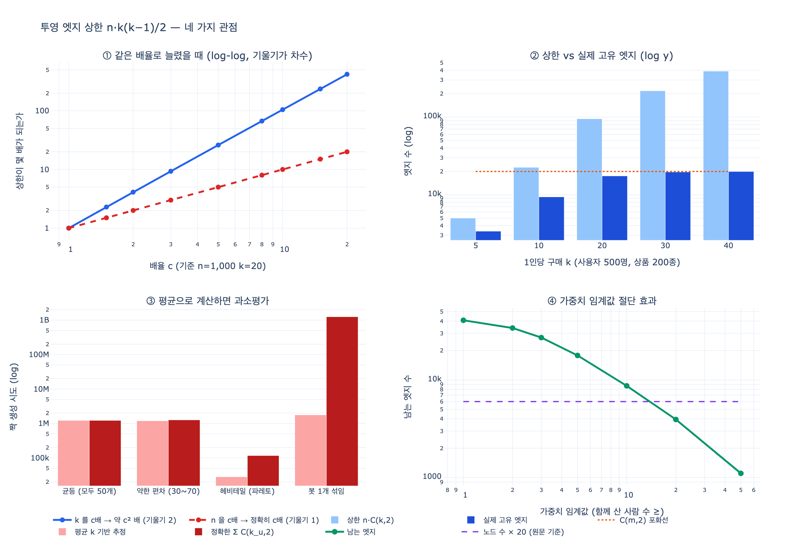

# 투영 엣지 수의 상한 공식

## 질문

투영 엣지 수의 상한 공식은 무엇인가?

## 답

$$n \times \frac{k(k-1)}{2}$$

- $n$ = 사용자 수
- $k$ = 1인당 구매 수

실제로는 중복이 합쳐져 이보다 적지만, **상한이 이렇다는 점**이 중요하다.

---

## 1. 배경: 이분 그래프와 투영

이 장(7.4절 「두 종류만 있는 그래프, 그리고 겹치는 엣지」)에서 다루는 상황이다.

**이분 그래프(bipartite graph)** 는 노드가 두 종류로만 나뉘고, 엣지가 항상 서로 다른 종류 사이에만 놓이는 그래프다. 구매 기록이 대표적이다.

```
(사용자) -[:구매]-> (상품)
```

`ex4_bipartite.py`의 데이터:

```python
PURCHASES = [
    ("u1", "상품A"), ("u1", "상품B"),
    ("u2", "상품A"), ("u2", "상품B"), ("u2", "상품C"),
    ("u3", "상품C"),
]
```

사용자 3명, 상품 3개, 엣지 6개.

**투영(projection)** 은 이 두 종류 중 한쪽만 남기고, 「같은 상대를 공유하면 잇는다」는 규칙으로 새 그래프를 만드는 것이다. 상품 쪽으로 투영하면 「함께 산 상품끼리 잇기」가 된다.

```
상품A — 상품B  (함께 산 사람 2명: u1, u2)
상품A — 상품C  (함께 산 사람 1명: u2)
상품B — 상품C  (함께 산 사람 1명: u2)
```

투영은 편하다. 「이 상품을 산 사람이 같이 산 상품」 같은 질문이 1홉으로 답이 나온다. 문제는 두 가지다.

1. **정보가 사라진다.** 투영 그래프만 보면 `u1`, `u2`, `u3`이 없다. 누가 샀는지는 버려진다.
2. **엣지가 제곱으로 는다.** 이게 이 카드의 주제다.

## 2. 공식이 나오는 이유

투영 엣지는 「한 사용자가 산 상품들끼리 서로 잇는 것」에서 생긴다.

한 사용자가 상품 $k$개를 샀다고 하자. 이 $k$개 중에서 **순서 없이 2개를 고르는 조합의 수**가 그 사용자 하나가 만드는 투영 엣지 수다.

$$\binom{k}{2} = \frac{k(k-1)}{2}$$

`ex4_bipartite.py`의 `project()` 함수에서 이게 `itertools.combinations(sorted(keys), 2)`로 나타난다.

```python
for val, keys in grouped.items():
    for x, y in combinations(sorted(keys), 2):
        out[(x, y)] += 1
```

사용자가 $n$명이고 각자 $k$개를 샀다면, 사용자별로 만들어지는 쌍을 **전부 더하면**

$$n \times \frac{k(k-1)}{2}$$

이게 코드의 `simulate()` 그대로다.

```python
def simulate(n_users, items_per_user):
    return n_users * items_per_user * (items_per_user - 1) // 2
```

## 3. 왜 「상한」인가

공식은 **중복을 세지 않고 그냥 다 더한 값**이다. 두 사용자가 똑같이 `{상품A, 상품B}`를 샀다면, 쌍 `(상품A, 상품B)`가 두 번 만들어진다. 하지만 그래프에서는 엣지 하나다. 가중치(함께 산 사람 수)가 1에서 2로 오를 뿐, 엣지 개수는 늘지 않는다.

즉 공식은 **서로 다른 쌍의 개수**가 아니라 **쌍 생성 시도의 총 횟수**다. 실제 엣지 수는

$$|E_{\text{투영}}| \le n \times \frac{k(k-1)}{2}$$

그리고 상품 종류가 $m$개라면 물리적으로 넘을 수 없는 두 번째 상한도 있다.

$$|E_{\text{투영}}| \le \binom{m}{2} = \frac{m(m-1)}{2}$$

두 상한 중 작은 쪽이 실제 최대치다.

$$|E_{\text{투영}}| \le \min\left(n \cdot \frac{k(k-1)}{2},\ \frac{m(m-1)}{2}\right)$$

그럼에도 첫 번째 공식이 중요한 이유는, **용량 산정과 계산 비용 산정에 쓰는 값**이기 때문이다.

- 투영 계산 자체의 시간 복잡도는 정확히 $\Theta\!\left(n \cdot k^2\right)$ 다. 중복이든 아니든 쌍을 만들어 보긴 해야 한다.
- 중간 산출물의 메모리 피크도 이 값에 가깝다.
- 상품 종류가 많은 실무 카탈로그(수십만~수백만)에서는 $\binom{m}{2}$ 상한이 너무 커서 제약이 되지 않는다. 실제로 목을 죄는 건 $n k^2 / 2$ 쪽이다.

## 4. 숫자로 보는 폭발

`ex4_bipartite.py`가 출력하는 표다.

| 사용자 $n$ | 1인당 구매 $k$ | 투영 엣지(최대) |
|---:|---:|---:|
| 1,000 | 10 | 45,000 |
| 1,000 | 50 | 1,225,000 |
| 100,000 | 50 | 122,500,000 |
| 100,000 | 200 | 1,990,000,000 |

읽어야 할 것은 두 가지다.

**$n$에 대해서는 선형이다.** 사용자가 10배 늘면 상한도 10배다. (1,000→100,000, $k=50$ 고정: 1,225,000 → 122,500,000, 정확히 100배)

**$k$에 대해서는 제곱이다.** 이게 진짜 위험한 축이다. $k$가 10에서 50으로 5배 늘면 상한은 약 25배($45{,}000 \to 1{,}225{,}000$)가 된다. 50에서 200으로 4배 늘면 약 16배다.

$$\frac{k(k-1)}{2} \approx \frac{k^2}{2} \quad (k \gg 1)$$

$k=200$일 때 $\frac{200 \times 199}{2} = 19{,}900$. 사용자 한 명이 투영 엣지 2만 개를 만든다. 10만 명이면 **20억 개**다.

## 5. 실무에서 이게 왜 사고가 되는가

가장 흔한 패턴은 이렇다. 화이트보드에서 「상품 유사도 그래프 만들자」고 정한다. 개발 데이터로 돌려 보면 몇만 엣지, 잘 돈다. 운영 데이터를 넣으면 죽는다.

무서운 건 **평균 $k$가 아니라 꼬리**다. 공식에 들어가는 $k$가 평균이라고 생각하면 과소평가한다. 정확한 식은 사용자별 합이다.

$$|E_{\text{투영 시도}}| = \sum_{u} \frac{k_u(k_u-1)}{2}$$

$k^2$ 은 볼록함수(convex)이므로 옌센 부등식에 의해

$$\frac{1}{n}\sum_u k_u^2 \ \ge\ \left(\frac{1}{n}\sum_u k_u\right)^{2} = \bar{k}^2$$

즉 **평균으로 계산한 값은 항상 과소평가**다. 편차가 클수록 심하다. 구매 수 분포는 대개 헤비테일(파레토/멱법칙)이라서, 상위 0.1%의 헤비 유저 몇 명이 전체 투영 비용의 대부분을 만든다. 봇, 도매상, 어드민 계정 하나가 상품 5만 개를 「구매」했으면 그 계정 하나가 $\frac{50000 \times 49999}{2} \approx 12.5$억 쌍을 만든다.

그래서 실무 순서는 이렇다.

1. 평균이 아니라 $\sum k_u^2$ 을 직접 계산한다.
2. $k_u$ 상위 노드를 눈으로 본다. 봇/어드민이면 제외한다.

## 6. 대안

`ex4_bipartite.py`가 제시하는 두 가지다.

**1. 투영하지 말고 이분 그래프 그대로 2홉을 돈다.** 「이 상품과 함께 팔린 상품」은 `(상품)<-[:구매]-(사용자)-[:구매]->(상품)` 2홉 질의로 필요할 때만 계산한다. 저장 비용이 0이고, 질의 한 번의 비용은 그 상품을 산 사람들의 구매 수 합으로 국소적이다.

**2. 투영하되 자른다.** 「함께 산 사람 N명 이상」인 쌍만 남긴다. 저자는 대개 3명이면 충분하다고 하고, 자르는 값은 **엣지 수가 노드 수의 20배를 넘지 않게** 잡는다고 한다.

임계값 절단이 효과가 있는 이유는, 가중치 분포가 한쪽으로 치우쳐 있기 때문이다. 우연에 가까운 동시 구매는 낮은 가중치에 몰리고, 진짜 의미 있는 연관은 큰 가중치를 갖는다. 다만 「가중치 1만 버리면 대부분 사라진다」고 기대하면 안 된다. `expy.py` 8단계 실험(사용자 2,000명, 상품 300종, $k=20$)에서는 이렇게 나온다.

| 임계값 | 남는 엣지 | 노드 수의 |
|---:|---:|---:|
| ≥1 | 40,782 | 135.9배 |
| ≥2 | 33,978 | 113.3배 |
| ≥3 | 27,134 | 90.4배 |
| ≥10 | 8,695 | 29.0배 |
| ≥20 | 3,938 | **13.1배** |

임계값 1→2는 17%만 줄인다. 「노드 수의 20배」 목표에 들어가려면 이 데이터에서는 15~20까지 올려야 한다. **적절한 임계값은 데이터를 보고 정하는 값이고, 목표는 「가중치 3」이 아니라 「엣지/노드 비율」이다.** 원문이 임계값이 아니라 비율을 기준으로 제시한 이유가 이것이다.

`ex4_bipartite.py`가 명시하지 않지만 같이 쓰이는 세 번째 대안도 있다.

**3. 허브 노드 제외 또는 가중치 감쇠.** 「비닐봉투」, 「배송비」처럼 거의 모두가 사는 상품(=차수가 큰 노드)은 투영에서 제외하거나, $\frac{1}{k_u - 1}$ 같은 가중을 걸어 헤비 유저의 기여를 줄인다.

## 7. 정리

| 항목 | 내용 |
|---|---|
| 상한 공식 | $n \times \dfrac{k(k-1)}{2}$ |
| 유도 | 사용자 1명이 만드는 쌍 $\binom{k}{2}$ 을 $n$명에 대해 합 |
| $n$ 의존성 | 선형 |
| $k$ 의존성 | **제곱** — 위험한 축 |
| 왜 상한인가 | 중복 쌍을 합치면 실제 엣지 수는 더 적음 |
| 또 다른 상한 | 상품 종류 $m$개일 때 $\binom{m}{2}$ |
| 왜 그래도 중요한가 | 투영 **계산 비용**과 메모리 피크는 이 값에 비례 |
| 함정 | 평균 $\bar k$ 로 계산하면 옌센 부등식에 의해 항상 과소평가 |
| 대안 | 2홉 온디맨드 / 가중치 임계값 절단 / 허브 제외 |

## 관련 개념

- **이분 그래프**: [networkx bipartite](https://networkx.org/documentation/stable/reference/algorithms/bipartite.html)
- **조합**: $\binom{k}{2}$, 고교 「확률과 통계」의 조합
- **볼록함수와 옌센 부등식**: 평균으로 대체하면 과소평가되는 이유

## 시각화


