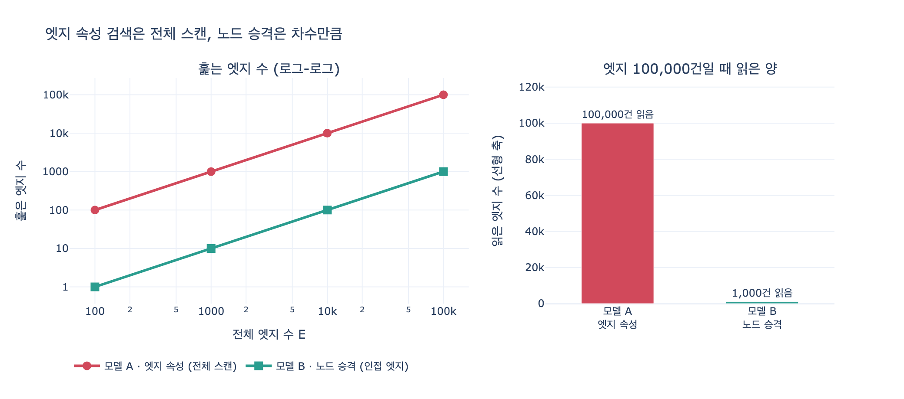

# 엣지 모델에서 "김하늘이 담당한 체결 건" 찾기

**질문**: 엣지 모델에서 "김하늘이 담당한 체결 건"을 찾으려면 어떻게 해야 하는가?

**답**: 모든 엣지를 훑으며 `props["by"]`를 확인해야 한다. 엣지 속성에는 색인을 걸 수 없는 엔진이 많아 전체 스캔이 된다.

---

## 1. 상황 설정 — 같은 사실, 두 가지 모델

7장 예제 1(`code/ex1_node_or_edge.py`)은 "회사가 계약을 체결했다"는 같은 사실을 두 방식으로 저장해 놓고 비교합니다.

### 모델 A — 관계를 엣지로

```python
EDGE_MODEL = [
    ("가온테크",   "SIGNED", "C-2025-118", {"at": "2025-06-02", "by": "김하늘"}),
    ("가온테크",   "SIGNED", "C-2024-002", {"at": "2024-01-15", "by": "박서준"}),
    ("나루소프트", "SIGNED", "C-2025-004", {"at": "2025-01-20", "by": "김하늘"}),
]
```

화이트보드에서 예쁜 그림입니다. `(회사)-[:SIGNED {at, by}]->(계약)`. 체결일과 담당자가 관계의 속성으로 깔끔하게 붙어 있습니다.

### 모델 B — 관계를 노드로 승격

```python
NODE_MODEL_NODES = {"s1": {"label": "체결", "at": "2025-06-02"}, ...}
NODE_MODEL_EDGES = [
    ("가온테크", "HAS", "s1"), ("s1", "OF", "C-2025-118"), ("s1", "BY", "김하늘"),
    ...
]
```

체결 자체가 노드가 되고, 담당자도 노드가 됩니다. 엣지가 3개에서 9개로 늘어났습니다. 한눈에 보면 손해 같습니다.

## 2. 왜 전체 스캔이 되는가

질문은 하나입니다. **"김하늘이 담당한 체결 건은?"**

모델 A로 답하려면 이렇게 해야 합니다.

```python
def q_edge_model(who):
    scanned = 0
    out = []
    for s, t, o, props in EDGE_MODEL:
        scanned += 1                      # 한 건도 건너뛸 수 없다
        if props.get("by") == who:
            out.append((s, o, props["at"]))
    return out, scanned
```

핵심은 **탐색을 시작할 자리가 없다**는 것입니다. 그래프 질의는 보통 이렇게 동작합니다.

1. 색인으로 시작 노드를 찾는다 (예: `:담당자 {name: '김하늘'}`)
2. 그 노드에 붙은 엣지만 따라간다

모델 A에서 "김하늘"은 노드가 아닙니다. 엣지 속성 딕셔너리 안에 들어 있는 **문자열 값**입니다. 그러면 1번 단계를 건너뛸 수밖에 없고, 남은 방법은 모든 엣지를 하나씩 꺼내 비교하는 것뿐입니다.

Cypher로 쓰면 이런 모양입니다.

```cypher
MATCH (c:회사)-[s:SIGNED]->(k:계약)
WHERE s.by = '김하늘'          -- 엣지 속성 조건 → 관계 전체 스캔
RETURN c, k, s.at
```

실행 계획에는 `AllRelationshipsScan` 또는 `RelationshipTypeScan` + `Filter`가 뜹니다. 즉 관계를 전부 읽고 나서 걸러냅니다.

## 3. 엣지 속성 색인의 현실

| 엔진 / 모델 | 엣지(관계) 속성 색인 |
|---|---|
| Neo4j 5.x 이상 | 관계 속성 색인 지원 (RANGE / TEXT / POINT / FULL-TEXT) |
| Neo4j 4.x 이하 | 관계 속성 색인 없음 — 전체 스캔 |
| 다수의 프로퍼티 그래프 엔진 | 노드 속성 색인만 제공. 엣지 속성은 필터 조건으로만 |
| RDF | 엣지에 속성이라는 개념 자체가 없음. reification 또는 RDF-star가 필요 |

지원하는 엔진이 늘고 있지만 문제는 남습니다.

- **저장 구조상 엣지는 노드에 매달려 있습니다.** 엣지 속성 조건만으로는 어느 노드에서 출발할지 결정되지 않는 경우가 많습니다.
- **"우리 엔진은 지원한다"에 설계를 걸어 두면 이식성이 사라집니다.** 엔진을 바꾸거나 버전을 낮추는 순간 질의가 조용히 전체 스캔으로 퇴화하고, 아무 에러도 나지 않습니다.
- **복합 조건이 어렵습니다.** "김하늘이 2025년에 담당한 건"처럼 엣지 속성 두 개를 묶어 쓰는 복합 색인은 지원 범위가 더 좁습니다.

## 4. 노드로 승격하면 무엇이 달라지는가

```python
def q_node_model(who):
    # 김하늘 노드에 «들어오는» BY 엣지만 본다
    for s, t in incoming[who]:
        if t != "BY":
            continue
        ...
```

비용의 차수 자체가 바뀝니다.

$$T_{\text{edge}} = \Theta(E) \qquad \longrightarrow \qquad T_{\text{node}} = \Theta(\log n) + \Theta(d(v))$$

- $E$: 전체 엣지 수
- $n$: 노드 수 (색인 조회 비용)
- $d(v)$: 김하늘 노드의 차수 = 김하늘이 담당한 건수

담당자가 $R$명이고 건수가 고르게 분포하면 두 모델의 비율은 대략 $R$배가 됩니다.

$$\frac{T_{\text{edge}}}{T_{\text{node}}} \approx \frac{E}{E/R} = R$$

`expy.py`의 시뮬레이션 결과(담당자 100명):

| 전체 엣지 | 결과 건수 | 모델 A 스캔 | 모델 B 스캔 | 배율 |
|---:|---:|---:|---:|---:|
| 100 | 1 | 100 | 1 | 100x |
| 1,000 | 10 | 1,000 | 10 | 100x |
| 10,000 | 100 | 10,000 | 100 | 100x |
| 100,000 | 1,000 | 100,000 | 1,000 | 100x |

읽어야 할 건 배율 자체가 아니라 **선택도(selectivity)** 입니다. 결과는 전체의 1%인데 모델 A는 항상 100%를 읽습니다. 담당자가 1만 명이면 A는 여전히 100%를 읽고 B는 0.01%만 읽습니다. **카디널리티가 높은 속성일수록, 즉 색인이 가장 값진 자리일수록 엣지 속성의 손해가 커집니다.**

## 5. 승격 판단 기준

7장은 관계를 노드로 올릴지 판단하는 질문 세 개를 제시합니다.

1. 그 관계에 속성이 붙나?
2. 그 관계가 제3의 대상과 이어지나?
3. **그 속성으로 검색하나?**

**3번이 결정적입니다.** 1번과 2번은 "그럴 수도 있다" 정도지만, 3번에 "예"가 나오는 순간 성능 문제가 확정됩니다. `props["by"]`를 `WHERE` 절에 쓰기 시작한 날이 바로 승격 신호입니다.

> 속성은 **읽는** 것이고, 노드는 **찾는** 것이다. 찾기 시작하면 승격할 때다.

`by`를 화면에 뿌리기만 할 때는 엣지 속성으로 충분합니다. "김하늘이 담당한 건"을 검색하기 시작하면, 그 값은 이미 속성이 아니라 **개체**입니다.

승격의 부수 효과도 큽니다. 담당자가 노드가 되면 "담당자별 실적", "두 담당자가 함께 맡은 회사", "담당자 교체 이력" 같은 질문이 전부 그래프 탐색으로 풀립니다. 엣지 속성으로는 하나하나 전체 스캔이었던 질문들입니다.

## 6. 승격 시점 — 늦게 하되 미루지는 말 것

- 데이터가 쌓일수록 옮기는 값이 **비례해서** 오릅니다. 엣지 100만 개를 노드 모델로 바꾸면 마이그레이션 자체가 프로젝트가 됩니다.
- 정작 제일 오래 걸리는 일은 데이터 이동이 아니라 **표기 통일**입니다. `"김하늘"`, `"김 하늘"`, `"kim.haneul"`, `"김하늘(영업1팀)"`이 섞여 있으면 노드로 만들 때 전부 하나로 정규화해야 합니다. 속성일 때는 그냥 문자열이라 아무도 신경 쓰지 않았던 것들입니다. 7장 제목의 "3주"가 이 대목입니다.
- 임시 우회책이 필요하면, 승격 전이라도 엣지 속성 값을 별도 조회 테이블/색인으로 빼 두는 방법이 있습니다. 다만 이건 결국 노드 승격을 반쯤 손으로 하는 것과 같습니다.

## 7. 한 줄 정리

엣지 모델에서 "김하늘이 담당한 체결 건"을 찾는 유일한 방법은 **모든 엣지를 훑으며 `props["by"]`를 확인하는 전체 스캔**입니다. 시작할 노드가 없고 엣지 속성 색인은 지원이 제한적이기 때문입니다. 그 질문을 계속 물을 거라면 담당자를 노드로 승격하세요.

## 시각화


