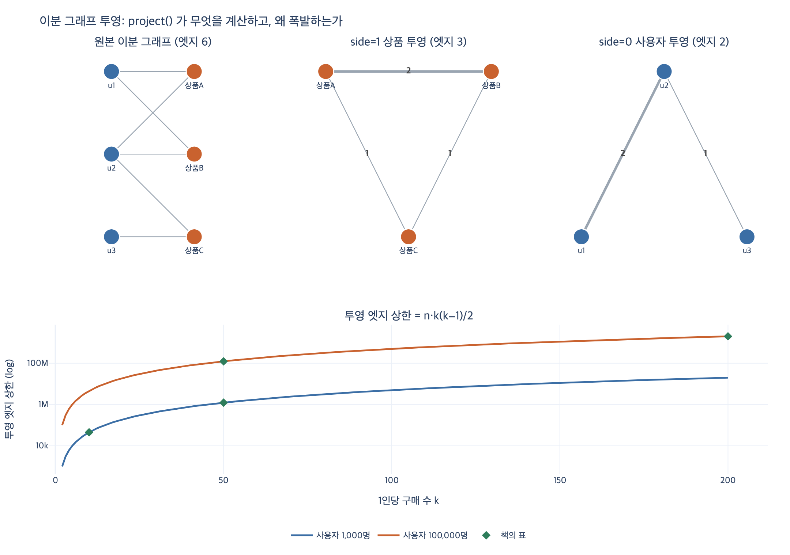

# `ex4_bipartite.py`의 `project()`는 무엇을 계산하는가

**질문:** `ex4_bipartite.py`의 `project()` 함수는 무엇을 계산하는가?

**답:** 한쪽으로 투영해 같은 상대를 공유하는 노드끼리 잇고, 공유한 상대 수를 엣지 가중치로 센다.

---

## 1. 배경: 이분 그래프란

이분 그래프(bipartite graph)는 노드가 **두 종류로 나뉘고**, 엣지가 **항상 서로 다른 종류 사이에만** 놓이는 그래프다. 7.4절이 다루는 「두 종류만 있는 그래프」가 이것이다.

$$V = U \sqcup I, \qquad E \subseteq U \times I$$

예제의 데이터는 «사용자 — 상품» 구매 기록이다.

```python
PURCHASES = [
    ("u1", "상품A"), ("u1", "상품B"),
    ("u2", "상품A"), ("u2", "상품B"), ("u2", "상품C"),
    ("u3", "상품C"),
]
```

사용자끼리 이어진 엣지도, 상품끼리 이어진 엣지도 **없다**. 그런데 실무에서 정작 묻고 싶은 건 「이 상품과 **함께** 팔리는 상품은?」, 「나와 취향이 **비슷한** 사람은?」처럼 **한 종류 안에서의 관계**다. 그래서 한 종류만 남기고 접는다. 이게 **투영(projection)** 이다.

## 2. `project()`가 하는 일

```python
def project(pairs, side=1):
    """한쪽으로 투영. 같은 상대를 공유하면 잇는다."""
    grouped = defaultdict(set)
    for a, b in pairs:
        key, val = (a, b) if side == 0 else (b, a)
        grouped[val].add(key)
    out = defaultdict(int)
    for val, keys in grouped.items():
        for x, y in combinations(sorted(keys), 2):
            out[(x, y)] += 1
    return dict(out)
```

수식으로 한 줄이다. $N(x)$를 $x$의 이웃 집합(= 반대편 종류 노드들)이라 하면,

$$w(x, y) = \bigl|\; N(x) \cap N(y) \;\bigr|, \qquad (x,y) \in E_{\text{proj}} \iff w(x,y) > 0$$

두 노드가 **공유하는 상대**가 있으면 잇고, **그 상대의 개수**가 가중치다. 겹치는 게 하나도 없으면 엣지 자체가 생기지 않는다.

### 세 단계로 쪼개 읽기

| 코드 | 하는 일 |
|---|---|
| `key, val = (a, b) if side == 0 else (b, a)` | 어느 쪽을 남기고 어느 쪽을 접을지 뒤집는다 |
| `grouped[val].add(key)` | 「접히는 쪽 노드 → 이웃 집합」, 즉 $N(\cdot)$을 만든다 |
| `for x, y in combinations(sorted(keys), 2)` | 이웃 집합 안의 **모든 쌍**을 잇는다 (클리크 하나) |
| `out[(x, y)] += 1` | 같은 쌍이 여러 그룹에서 반복되면 **누적** → 공유 상대 수 |

`sorted(keys)`는 `(x, y)` 순서를 정규화해서 `(상품A, 상품B)`와 `(상품B, 상품A)`가 다른 키로 갈라지는 걸 막는다. 무방향 엣지를 dict 키로 쓸 때의 정석이다.

### `side` 인자의 의미

`side`는 **투영 후에 남길 튜플 위치**다.

| `side` | 남는 쪽(`key`) | 접히는 쪽(`val`) | 결과 엣지의 뜻 |
|---|---|---|---|
| `1` (기본값) | `b` = 상품 | `a` = 사용자 | 「함께 산 사람이 $w$명인 상품 쌍」 |
| `0` | `a` = 사용자 | `b` = 상품 | 「함께 산 상품이 $w$개인 사용자 쌍」 |

같은 함수로 방향만 바꾸면 추천 시스템의 **item-item 협업 필터링**과 **user-user 협업 필터링**이 각각 나온다.

### 실행 결과 (`side=1`, 상품 쪽 투영)

`grouped`는 이렇게 만들어진다.

```
u1: {상품A, 상품B}         → 쌍 1개
u2: {상품A, 상품B, 상품C}   → 쌍 3개
u3: {상품C}                → 쌍 0개  (혼자면 쌍이 안 생긴다)
```

합산하면

```
상품A — 상품B  (함께 산 사람 2명)   ← u1, u2 둘 다
상품A — 상품C  (함께 산 사람 1명)   ← u2 만
상품B — 상품C  (함께 산 사람 1명)   ← u2 만
엣지 3개
```

`상품A — 상품B`의 가중치 2는 정의식과 정확히 맞는다.

$$w(\text{상품A}, \text{상품B}) = |\{u_1, u_2\} \cap \{u_1, u_2\}| = 2$$

### 실행 결과 (`side=0`, 사용자 쪽 투영)

```
u1 — u2  (함께 산 상품 2개)
u2 — u3  (함께 산 상품 1개)
엣지 2개
```

`u1 — u3`은 없다. 겹치는 상품이 0개이기 때문이다.

## 3. 투영의 대가 ① — 정보가 사라진다 (비가역)

`상품A — 상품B (2)`만 보면 **누가** 샀는지 알 수 없다. 접힌 쪽 노드가 아예 사라졌기 때문이다. 예제 코드의 문장이 이 지점이다.

> 버려진 것: 누가 샀는지. 투영 그래프만 보면 u1, u2, u3 이 사라진다.

더 나쁜 건 **서로 다른 원본이 같은 투영을 낸다**는 것이다. 예를 들어

```python
MERGED = [("w1","상품A"), ("w1","상품B"), ("w1","상품C"),
          ("w2","상품A"), ("w2","상품B")]        # 엣지 5개, 사용자 2명
```

는 원본 `PURCHASES`(엣지 6개, 사용자 3명)와 **구조가 다른데도** 투영 결과가 완전히 같다. 투영은 단사(injective)가 아니므로 원본을 되돌릴 수 없다. 실무에서 이게 문제가 되는 지점:

- 「왜 이 두 상품이 이어졌지?」를 추적(설명 가능성)할 수 없다.
- 사용자 한 명이 탈퇴하면 투영을 **전부** 다시 계산해야 한다 (증분 갱신이 어렵다).
- 봇 한 명이 상품 200개를 담으면 그 한 명이 만든 클리크가 그래프 전체 통계를 왜곡한다. 접힌 쪽이 안 보이니 원인 추적도 안 된다.

## 4. 투영의 대가 ② — 엣지가 제곱으로 폭발한다

`simulate()`가 계산하는 게 이 상한이다.

```python
def simulate(n_users, items_per_user):
    return n_users * items_per_user * (items_per_user - 1) // 2
```

사용자 $n$명이 각자 $k$개를 샀다면, 각자가 크기 $k$의 클리크 하나를 만든다.

$$E_{\text{proj}} \;\le\; n \cdot \binom{k}{2} \;=\; \frac{n\,k(k-1)}{2} \;=\; O(n k^2)$$

**사용자 수에는 선형, 1인당 구매 수에는 제곱**이다. 위험한 쪽은 $k$다.

| 사용자 | 1인당 구매 | 투영 엣지(최대) |
|---:|---:|---:|
| 1,000 | 10 | 45,000 |
| 1,000 | 50 | 1,225,000 |
| 100,000 | 50 | 122,500,000 |
| 100,000 | 200 | **1,990,000,000** |

원본 이분 엣지는 마지막 행에서도 $100{,}000 \times 200 = 2{,}000$만 개뿐인데, 투영하면 **20억 개**가 된다. 100배다.

단, 상한은 두 개가 동시에 걸린다. 상품이 $m$개면 상품 쌍 자체가 $\binom{m}{2}$개를 넘을 수 없다.

$$E_{\text{proj}} \;\le\; \min\!\left(n\binom{k}{2},\; \binom{m}{2}\right)$$

중복 쌍은 가중치로 합쳐지니 실제 값은 이보다 더 작다. `expy.py`의 합성 데이터(사용자 300, 상품 40, 1인당 8개)에서 $n\binom{k}{2} = 8{,}400$이지만 상품 천장 $\binom{40}{2} = 780$이 먼저 걸려 실제 투영 엣지는 780개였다. **상품 카탈로그가 좁으면 폭발이 안 보이고, 카탈로그가 넓을 때 터진다.** 예제 코드의 경고가 이 뜻이다.

> 실제로는 중복이 합쳐지니 이보다 적지만, 상한이 이렇다는 게 중요하다.

## 5. 대안 두 가지

예제 코드가 제시하는 답이다.

### 1) 투영하지 말고 2홉을 돈다

투영 그래프를 저장하지 않고, 필요한 노드에 대해서만 질의 시점에 2홉을 따라간다. `상품A → 그걸 산 사람들 → 그 사람들이 산 다른 상품`. 저장 폭발이 없고 정보 손실도 없다. 대가는 매 질의의 계산 비용.

```python
def two_hop(pairs, node, side=1):
    ...  # expy.py 참고. 결과가 project() 의 해당 행과 정확히 일치한다
# 상품A 의 2홉 이웃: {'상품B': 2, '상품C': 1}
```

투영이란 결국 **2홉 경로 개수를 미리 계산해 캐싱한 것**이라는 게 이 대조에서 드러난다. 어느 쪽을 택하느냐는 「미리 계산 vs 그때 계산」이라는 흔한 트레이드오프다.

### 2) 투영하되 가중치로 자른다

$w \ge \tau$인 엣지만 남긴다. 「한 사람만 함께 샀다」는 신호는 대개 노이즈다.

```
 컷 τ      남는 엣지       노드당 엣지
    1        780         19.5
    8        673         16.8
   11        406         10.2
   14        135          3.5
   18         14          0.8
```

컷을 조금만 올려도 엣지가 급격히 준다. 가중치 분포가 한쪽으로 몰려 있기 때문이다. 예제 코드의 기준:

> 저는 2번을 쓰고, 자르는 값은 엣지 수가 노드 수의 20배를 넘지 않게 잡는다.

즉 $\tau$를 절대값으로 못 박지 않고 **밀도 목표**($|E| \le 20|V|$)에서 역산한다. 데이터가 바뀌어도 따라오는 기준이라는 게 장점이다. 「대개 3명이면 충분하다」는 것도 같은 이야기의 경험적 출발점.

## 6. 헷갈리기 쉬운 지점 정리

- **`side`는 접히는 쪽이 아니라 남는 쪽**이다. `side=1`이면 튜플의 1번 위치(상품)가 남는다.
- **가중치는 「함께 등장한 횟수」가 아니라 「공유한 상대 노드 수」**다. `grouped`가 `set`이므로 같은 사용자가 같은 상품을 두 번 사도 1로만 센다. 즉 **원본 중복 엣지는 흡수된다**. 구매 횟수를 세고 싶다면 `set`이 아니라 `Counter`가 필요하다 — 무엇을 세는지 먼저 정하라는 7.4절의 요지와 이어진다.
- **엣지 수가 줄어들 수도 있다.** 예제에서는 원본 6 → 투영 3으로 오히려 줄었다. 작은 데이터에서는 폭발이 안 보인다. $k$가 커질 때 터진다.
- **가중치 $w$의 뜻을 이름에 박아라.** 7.3절의 교훈이 그대로 적용된다. 이 $w$는 **강도**(클수록 가깝다)다. 그대로 최단 경로에 넣으면 「제일 안 비슷한 경로」가 답으로 나온다. `weight`가 아니라 `co_buyer_count` 같은 이름을 쓰자.

## 7. 관련 자료

- [NetworkX: bipartite algorithms](https://networkx.org/documentation/stable/reference/algorithms/bipartite.html) — `bipartite.projected_graph`, `weighted_projected_graph`, `overlap_weighted_projected_graph`. `project()`는 이 중 `weighted_projected_graph`의 축약판이다.
- [networkx.algorithms.bipartite.projection](https://networkx.org/documentation/stable/reference/algorithms/generated/networkx.algorithms.bipartite.weighted_projected_graph.html) — 가중치를 공유 수 대신 자카드 계수 등으로 정규화하는 변종들.

## 시각화


