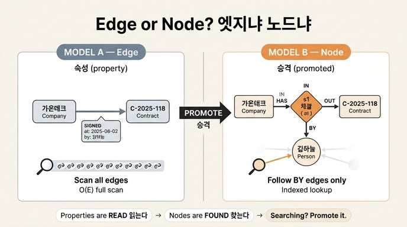

# `ex1_node_or_edge.py`의 모델 A와 모델 B

## 질문

`ex1_node_or_edge.py`의 모델 A와 모델 B는 각각 어떤 구조인가?

## 답

- **모델 A**: `SIGNED` 엣지에 `at`(체결일), `by`(담당자) 속성을 붙인 구조.
- **모델 B**: 「체결」이라는 사건 자체를 노드(`s1`, `s2`, `s3`)로 승격하고, `HAS` / `OF` / `BY` 엣지로 회사·계약·담당자를 연결한 구조.

## 두 모델을 나란히 보기

### 모델 A — 관계를 엣지로

```python
EDGE_MODEL = [
    ("가온테크", "SIGNED", "C-2025-118", {"at": "2025-06-02", "by": "김하늘"}),
    ("가온테크", "SIGNED", "C-2024-002", {"at": "2024-01-15", "by": "박서준"}),
    ("나루소프트", "SIGNED", "C-2025-004", {"at": "2025-01-20", "by": "김하늘"}),
]
```

- 튜플 구조는 `(출발 노드, 관계 타입, 도착 노드, 엣지 속성 dict)`.
- 노드는 **회사**와 **계약**뿐이다. 체결일과 담당자는 노드가 아니라 엣지에 매달린 **속성**이다.
- 담당자 「김하늘」은 그래프 안에 독립된 존재가 없다. 그냥 문자열 값이다.

```
(가온테크) --SIGNED { at, by }--> (C-2025-118)
```

### 모델 B — 관계를 노드로 승격

```python
NODE_MODEL_NODES = {
    "s1": {"label": "체결", "at": "2025-06-02"},
    "s2": {"label": "체결", "at": "2024-01-15"},
    "s3": {"label": "체결", "at": "2025-01-20"},
}
NODE_MODEL_EDGES = [
    ("가온테크", "HAS", "s1"), ("s1", "OF", "C-2025-118"), ("s1", "BY", "김하늘"),
    ("가온테크", "HAS", "s2"), ("s2", "OF", "C-2024-002"), ("s2", "BY", "박서준"),
    ("나루소프트", "HAS", "s3"), ("s3", "OF", "C-2025-004"), ("s3", "BY", "김하늘"),
]
```

- 엣지 하나였던 「체결」이 **`체결` 라벨을 가진 노드**가 됐다. `at`은 그 노드의 속성으로 남는다.
- 세 갈래 엣지가 붙는다.
  - `HAS`: 회사 → 체결 (누가 체결했나)
  - `OF`: 체결 → 계약 (무슨 계약인가)
  - `BY`: 체결 → 담당자 (누가 담당했나)
- 담당자 「김하늘」이 **노드로 올라왔다**. 이제 다른 대상과도 연결될 수 있다.

```
(가온테크) --HAS--> (s1: 체결 { at }) --OF--> (C-2025-118)
                          |
                         BY
                          v
                      (김하늘)
```

엣지 3개 → 노드 3개 + 엣지 9개. 겉보기 규모는 3배로 커졌다. 그 대가로 얻는 것이 아래 질의 차이다.

## 왜 두 모델을 비교하는가 — 질의 비용

예제가 던지는 질문은 하나다. **「김하늘이 담당한 체결 건은?」**

| | 모델 A (엣지) | 모델 B (노드 승격) |
|---|---|---|
| 접근 방식 | 모든 `SIGNED` 엣지를 훑고 `props["by"]` 비교 | 「김하늘」 노드로 들어오는 `BY` 엣지만 따라감 |
| 훑는 양 | 전체 엣지 수에 비례 (O(E)) | 김하늘에 붙은 엣지 수에 비례 |
| 코드 | `q_edge_model()` | `q_node_model()` |

`q_edge_model`은 `for s, t, o, props in EDGE_MODEL:` 로 **전부 순회**하며 `scanned`를 올린다. `q_node_model`은 `incoming` 인덱스를 만들어 `incoming[who]`, 즉 김하늘로 들어오는 엣지만 본다.

예제가 직접 짚는 대목:

> 엣지 3개짜리라 차이가 안 느껴진다. 엣지가 100만 개면 다르다.
> `by`는 엣지 속성이라 색인을 걸 수 없는 엔진이 많다. 그러면 전체를 훑는다.
> 노드로 승격하면 「김하늘」 노드에서 들어오는 엣지만 따라가면 된다.

핵심 기술적 이유: **많은 그래프 엔진이 노드 속성에는 색인을 걸어 주지만 엣지 속성에는 못 걸거나 제약이 크다.** 그래서 엣지 속성으로 검색하면 풀스캔이 된다.

## 승격 판단 기준 세 가지

7장 「한 장 요약」이 제시하는 질문.

1. **속성이 붙나?** — 체결일, 담당자처럼 관계 자체에 딸린 값이 늘어나나.
2. **제3의 대상과 이어지나?** — 체결이 담당자(사람)와도 이어져야 하나. 엣지는 두 노드만 잇는다. 셋을 이으려면 노드가 필요하다.
3. **그 속성으로 검색하나?** — 이게 결정적이다.

> 속성은 「읽는」 것이고 노드는 「찾는」 것이다. 찾기 시작하면 승격할 때다.

즉 `by`를 화면에 **표시**만 한다면 모델 A로 충분하다. `by`로 **검색·집계·필터**를 시작했다면 모델 B로 갈 때다.

## 승격의 타이밍과 실제 비용

- 「승격은 **늦게** 하되 **미루지** 마세요.」 데이터가 쌓일수록 옮기는 값이 비례해서 오른다.
- 옮길 때 제일 오래 걸리는 건 **데이터 이동이 아니라 표기 통일**이다. 「김하늘」이 엣지 속성이던 시절에는 오타·동명이인·공백 차이가 그대로 방치됐지만, 노드가 되는 순간 하나로 합쳐야 한다. 7장 제목의 「3주」가 여기서 나온다.

## 배경 개념 — 구체화(reification)

모델 A → 모델 B의 변환은 그래프 이론·시맨틱 웹에서 **구체화(reification)**라고 부르는 패턴이다. 관계(트리플, 엣지)를 그 자체로 지칭 가능한 개체(노드)로 끌어올려, 관계에 관해 다시 말할 수 있게 만드는 것.

- 프로퍼티 그래프 모델 (ISO/IEC 39075:2024 GQL) — 엣지에 속성을 붙일 수 있으니 모델 A가 자연스럽다.
- RDF 1.2 Concepts / RDF Schema의 reification — 관계를 노드로 만드는 표준적 방법.

프로퍼티 그래프는 엣지 속성을 기본 지원해서 모델 A가 쉽고, RDF는 트리플에 속성을 못 붙이니 처음부터 모델 B 같은 구체화가 필요하다. 같은 문제, 다른 출발점이다.

## 한 줄 정리

모델 A는 「체결」을 **엣지 속성**(`SIGNED { at, by }`)으로 표현하고, 모델 B는 「체결」을 **노드**(`s1~s3`)로 승격해 `HAS`/`OF`/`BY` 세 방향으로 펼친다. 갈림길은 「그 속성으로 검색하기 시작했는가」다.

## 인포그래픽


