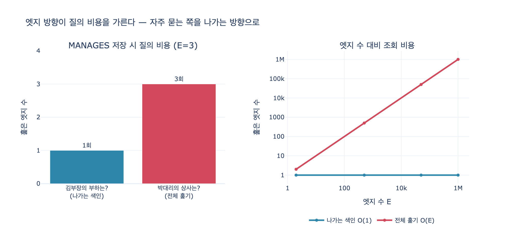

# MANAGES 방향으로 저장했을 때 두 질문의 비용

## 질문과 답

**질문**: MANAGES 방향으로 저장했을 때 두 질문의 비용은 어떻게 다른가?

**답**: 「김부장의 부하는?」은 나가는 엣지 색인으로 1회 조회지만, 「박대리의 상사는?」은 전체 엣지를 훑어야 한다.

## 같은 사실, 두 가지 저장 방향

조직도라는 **사실 자체는 하나**다. 김부장이 박대리와 이주임을 관리하고, 최이사가 김부장을 관리한다. 이 사실을 엣지로 적을 때 방향은 두 가지로 쓸 수 있다.

```python
MANAGES    = [("김부장", "박대리"), ("김부장", "이주임"), ("최이사", "김부장")]
REPORTS_TO = [(b, a) for a, b in MANAGES]
#            = [("박대리", "김부장"), ("이주임", "김부장"), ("김부장", "최이사")]
```

두 목록은 정보량이 완전히 같다. 하나를 다른 하나로 기계적으로 뒤집을 수 있다. 그런데 **질의 비용은 같지 않다.**

## 왜 방향이 비용을 바꾸는가 — 인접 리스트

그래프 저장 엔진은 보통 「출발 노드 → 도착 노드 목록」 형태의 색인을 만든다. 이게 인접 리스트(adjacency list)이고, 7장 예제의 `out_index()`가 하는 일이다.

```python
def out_index(edges):
    idx = defaultdict(list)
    for a, b in edges:
        idx[a].append(b)      # 출발 노드를 키로
    return idx
```

`MANAGES`로 색인을 만들면 이런 딕셔너리가 생긴다.

| 키 (출발) | 값 (도착 목록) |
|---|---|
| 김부장 | [박대리, 이주임] |
| 최이사 | [김부장] |

이 자료구조에서 **키로 찾는 것은 공짜**지만, **값 안을 뒤지는 것은 전체를 훑어야** 한다. 파이썬 딕셔너리의 해시 조회가 $O(1)$, 값 전수 검색이 $O(E)$인 것과 똑같은 비대칭이다.

## 두 질문의 비용

`MANAGES`로 저장한 상태에서 두 질문을 던져 보자.

### 「김부장의 부하는?」 — 1회 조회

부하를 묻는 것은 김부장에서 **나가는** 엣지를 묻는 것이다. `MANAGES`의 화살표 방향이 관리자 → 부하이므로, 색인의 키가 곧 김부장이다.

```python
idx.get("김부장", [])   # → ["박대리", "이주임"], 비용 1
```

키 하나를 찾아 값을 그대로 반환한다. 엣지가 3개든 100만 개든 조회 횟수는 1이다. 비용은 $O(1)$ (정확히는 결과 개수에 비례하는 $O(1 + d_{out})$).

### 「박대리의 상사는?」 — 전체 훑기

상사를 묻는 것은 박대리로 **들어오는** 엣지를 묻는 것이다. 그런데 색인은 출발 노드만 키로 갖고 있다. 박대리는 키에 없다. 값 목록 안에 숨어 있다. 그래서 엣지 전체를 순회하며 도착점이 박대리인 것을 골라내야 한다.

```python
scanned = 0
found = []
for a, b in edges:
    scanned += 1          # 3개 전부 훑는다
    if b == name:
        found.append(a)
# → (["김부장"], 3)
```

비용은 $O(E)$. 엣지가 100만 개면 100만 번 훑는다. 결과가 딱 1건이어도 그렇다.

### 정리 표

| 저장 방향 | 「김부장의 부하는?」 | 「박대리의 상사는?」 |
|---|---|---|
| `MANAGES` (관리자→부하) | **1** (나가는 색인) | **3** (= $E$, 전체 훑기) |
| `REPORTS_TO` (부하→관리자) | 3 (= $E$, 전체 훑기) | **1** (나가는 색인) |

7장 예제 `ex2_direction.py`를 실행하면 정확히 이 네 숫자가 나온다. 비용이 뒤집혀 있을 뿐, 두 방향 중 어느 쪽도 「양쪽 다 싸게」 만들지 못한다.

$$\text{나가는 방향 질의} = O(1), \qquad \text{역방향 질의} = O(E)$$

## 그래서 어떻게 정하는가

7장이 제시하는 기준은 두 가지다.

1. **자주 묻는 질문을 「나가는」 방향으로 둔다.**
2. **카디널리티가 「1 쪽」에서 「N 쪽」으로.** (부하는 여럿, 상사는 하나)

조직도의 경우 2번 기준은 `MANAGES`(1명의 관리자 → N명의 부하)를 가리킨다. 하지만 만약 실제 서비스에서 「내 상사가 누구지?」를 하루에 수만 번 묻고 「부하 목록」은 관리자 화면에서 하루 몇 번만 본다면, 1번 기준은 `REPORTS_TO`를 가리킨다.

**둘이 충돌하면 1번을 따른다. 성능은 질의가 정한다.** 카디널리티는 그림의 미학이고, 질의 빈도는 실제 청구서다.

## 중요한 단서 — 엔진이 역방향 색인을 만들어 주면

이 비용 차이는 **역방향 색인이 없을 때만** 성립한다. 엔진이 들어오는 엣지 색인을 함께 유지하면 두 질문이 모두 $O(1)$이 된다.

- **Neo4j**: 각 노드가 나가는 엣지와 들어오는 엣지 목록을 함께 들고 있어 양방향 탐색이 대칭이다. Cypher에서 `(a)<-[:MANAGES]-(b)`가 `(a)-[:MANAGES]->(b)`와 같은 비용으로 돈다.
- **직접 만든 인접 리스트, 일부 임베디드 엔진, 압축 CSR 포맷**: 나가는 방향만 갖고 있다. 역방향은 전체 훑기이거나, 별도의 전치 행렬(transpose)을 따로 만들어 둬야 한다.

즉 「방향을 어느 쪽으로」는 **저장 엔진의 성질을 알고 나서** 결정할 문제다. 모든 엔진이 Neo4j처럼 대칭인 건 아니다. 역방향 색인을 공짜로 얻는 대신 쓰기 비용과 저장 공간이 두 배로 든다는 트레이드오프도 있다.

## 한 문장 요약

같은 사실을 어느 방향으로 적었든 정보는 같지만, 색인은 출발 노드만 키로 갖는다. 그래서 나가는 방향 질문은 1회 조회, 반대 방향 질문은 전체 훑기가 된다. 자주 묻는 쪽을 나가는 방향으로 두자.

## 시각화


