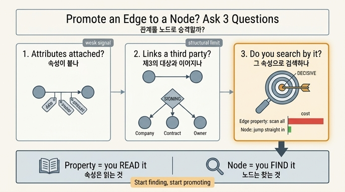

# 관계를 노드로 승격할지 판단하는 세 가지 질문

## 질문

관계를 노드로 승격할지 판단하는 세 가지 질문은 무엇인가?

## 답

1. **속성이 붙나** — 그 관계 자체에 기록할 값이 생기는가
2. **제3의 대상과 이어지나** — 관계가 두 당사자 외의 다른 노드와 연결되는가
3. **그 속성으로 검색하나** — 그 값을 조건으로 걸어 무언가를 찾기 시작했는가

세 번째가 **결정적**이다. 속성은 「읽는」 것이고, 노드는 「찾는」 것이다. 읽기만 하면 엣지 속성으로 충분하고, 찾기 시작하면 승격할 때다.

---

## 왜 이 세 질문인가

7장의 사고는 `(회사)-[:계약]->(회사)` 한 줄로 시작한다. 화이트보드에서는 깔끔하다. 그런데 6개월 뒤에 갈린다.

### 질문 1 — 속성이 붙나

계약 엣지에 처음 붙는 건 `at`(체결일) 하나다. 곧 `by`(담당자), `amount`, `renewal_of`가 붙는다. 엣지에 속성이 계속 쌓이는 건 「이 관계가 사실은 독립된 사건(event)이었다」는 첫 신호다.

다만 이것만으로는 승격 사유가 안 된다. 속성이 붙어도 그냥 같이 읽어 오기만 한다면 엣지 속성으로 두는 게 싸다. 노드 하나 늘리면 엣지는 최소 두 개 늘어난다.

### 질문 2 — 제3의 대상과 이어지나

엣지는 **두 개**의 끝점만 가질 수 있다. 그런데 「계약」에는 회사 두 곳, 담당자, 승인자, 상위 계약, 첨부 문서가 매달린다. 3개 이상의 대상이 얽히면 엣지로는 구조적으로 표현이 안 된다.

7장 예제 1이 그걸 보여준다. 담당자 `김하늘`을 엣지 속성 문자열로 두면 그건 그냥 글자다. 반면 노드로 승격하면:

```
(가온테크)-[:HAS]->(s1:체결 {at})-[:OF]->(C-2025-118)
                          └-[:BY]->(김하늘)
```

`김하늘`이 사물(노드)이 되고, 체결 노드가 세 방향으로 뻗는다. 이게 RDF 계열에서 말하는 **관계의 구체화(reification)**, 프로퍼티 그래프에서는 흔히 「중간 노드」 또는 이벤트 노드 패턴이다.

> 5장의 「문자열이 아니라 사물」과 같은 이야기다. 문자열은 이어지지 않고, 노드는 이어진다.

### 질문 3 — 그 속성으로 검색하나 (결정적)

「김하늘이 담당한 체결 건은?」이 들어오는 순간 판정이 끝난다.

| | 엣지 모델 | 노드 승격 모델 |
|---|---|---|
| 접근 경로 | 전체 엣지를 훑어 `props["by"]` 비교 | `김하늘` 노드로 들어오는 `BY` 엣지만 따라감 |
| 비용 | 엣지 수에 비례 (O(E)) | 그 사람의 차수에 비례 |
| 엣지 3개일 때 | 차이 없음 | 차이 없음 |
| 엣지 100만 개일 때 | 100만 번 비교 | 몇 번 |

엣지 3개짜리 장난감에서는 차이가 안 느껴진다. 그래서 위험하다. 100만 개가 됐을 때 드러난다.

**핵심 이유**: 엣지 속성에는 색인을 걸 수 없거나 걸어도 시작점으로 못 쓰는 엔진이 많다. 그러면 전체 스캔이 된다. 반면 노드는 라벨/속성 색인으로 바로 진입점(anchor)이 된다. 그래프 질의의 비용은 대개 「어디서 출발하느냐」로 결정되고, 노드만 출발점이 될 수 있는 경우가 많다.

> 참고: Neo4j 5 이후로는 관계 속성 색인(range/text/point)을 만들 수 있어서 이 격차가 줄었다. 하지만 (a) 엔진과 버전에 따라 지원이 갈리고, (b) 색인이 있어도 「제3의 대상과 잇기」는 여전히 불가능하다. 그래서 질문 3은 성능 문제이기 이전에 **모델링 의도**의 문제다. 검색 대상이 된 것은 이미 도메인의 일급 개체(first-class entity)다.

---

## 한 줄 판정 기준

```
속성은 읽는 것,  노드는 찾는 것.
읽고만 있으면 → 엣지 속성으로 둔다.
찾기 시작하면 → 노드로 승격한다.
```

## 승격 시점: 늦게 하되 미루지 마라

- **늦게**: 세 질문 중 하나도 예가 아니면 승격하지 않는다. 미리 승격하면 노드/엣지 수만 늘고 질의는 길어진다.
- **미루지 마라**: 데이터가 쌓일수록 옮기는 비용이 **비례해서** 오른다. 예가 나온 시점이 가장 싼 시점이다.
- **실제 병목**: 옮길 때 제일 오래 걸리는 건 데이터 이동이 아니라 **표기 통일**이다. 같은 담당자가 `김하늘`, `김 하늘`, `hakim`, `khn@...`으로 흩어져 있으면, 노드로 만드는 순간 그게 서로 다른 노드 네 개가 된다. 7장 제목의 「3주」는 대개 여기서 나간다.

## 흔한 오해

| 오해 | 실제 |
|---|---|
| 속성이 하나라도 붙으면 승격 | 아니다. 읽기만 하면 엣지 속성이 낫다 |
| 승격하면 항상 빨라진다 | 홉이 하나 늘어나므로 「읽기만 하는」 질의는 오히려 느려진다 |
| 처음부터 다 노드로 만들면 안전 | 모델이 비대해지고 모든 질의가 길어진다 |
| 성능만의 문제다 | 질문 2는 순수 표현력 문제다. 엣지로는 애초에 못 그린다 |

## 1차 출처

- [ISO/IEC 39075:2024 GQL](https://www.iso.org/standard/76120.html) — 프로퍼티 그래프 자료 모델 [표준]
- [RDF 1.2 Concepts](https://www.w3.org/TR/rdf12-concepts/) — RDF 자료 모델 [표준]
- [RDF Schema — reification](https://www.w3.org/TR/rdf12-schema/) — 관계의 구체화 [표준]
- [Cypher: patterns](https://neo4j.com/docs/cypher-manual/current/patterns/) — 노드 라벨과 관계 타입 [사실상 표준]
- 예제 코드: `content/ch07/code/ex1_node_or_edge.py`

## 인포그래픽


