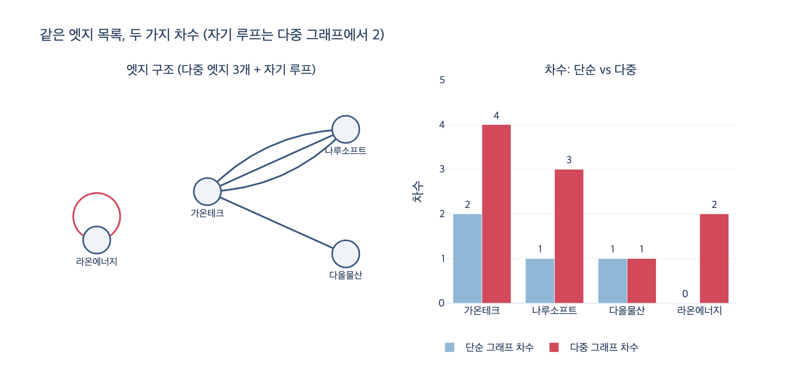

# 단순 그래프 차수 vs 다중 그래프 차수

**질문** 단순 그래프 차수와 다중 그래프 차수는 어떻게 다르게 세는가?

**답** 단순 그래프는 같은 쌍을 하나로 세고, 다중 그래프는 엣지마다 센다. 자기 루프는 관례상 다중 그래프에서 2로 센다.

---

## 한 줄로

차수(degree)는 「이 노드에 붙은 엣지 수」인데, **같은 두 노드 사이에 엣지가 여러 개 있을 때** 그걸 하나로 볼지 여러 개로 볼지가 갈립니다. 그 선택이 단순 그래프냐 다중 그래프냐입니다.

| | 같은 쌍이 여러 번 | 자기 루프 | 답하는 질문 |
|---|---|---|---|
| **단순 그래프 차수** | **하나**로 센다 | 존재할 수 없음 (제외) | 이웃이 몇 **곳**인가 |
| **다중 그래프 차수** | **엣지마다** 센다 | 관례상 **2** | 관계가 몇 **건**인가 |

## 7장의 예제로 보기

`ex5_multigraph.py` 의 엣지 목록입니다. 같은 두 회사 사이에 계약이 세 번, 그리고 자회사가 자기 자신에게 대여한 건 하나가 있습니다.

```python
EDGES = [
    ("가온테크",   "나루소프트", "C-2023-011"),
    ("가온테크",   "나루소프트", "C-2024-088"),
    ("가온테크",   "나루소프트", "C-2025-118"),
    ("가온테크",   "다올물산",   "C-2025-200"),
    ("라온에너지", "라온에너지", "C-2025-301"),   # 자기 루프
]
```

### 단순 그래프 방식 — 쌍을 집합에 넣어 중복을 없앤다

```python
pairs = {(min(a, b), max(a, b)) for a, b, _ in edges if a != b}
for a, b in pairs:
    deg[a] += 1
    deg[b] += 1
```

핵심이 두 줄에 다 들어 있습니다.

- `{...}` 집합(set)이라서 `(가온테크, 나루소프트)` 가 세 번 나와도 **하나**로 줄어듭니다.
- `(min, max)` 로 정규화해서 방향/순서를 무시합니다. `(A,B)` 와 `(B,A)` 를 같은 쌍으로 봅니다.
- `if a != b` 로 **자기 루프를 버립니다.** 단순 그래프의 정의상 $(v,v)$ 엣지는 존재할 수 없기 때문입니다.

### 다중 그래프 방식 — 엣지를 하나씩 훑는다

```python
for a, b, _ in edges:
    if a == b:
        deg[a] += 2      # 자기 루프는 2 (관례)
    else:
        deg[a] += 1
        deg[b] += 1
```

중복 제거가 없습니다. 엣지 목록을 순회하면서 양 끝에 1을 더할 뿐입니다.

### 결과

| 노드 | 단순 그래프 차수 | 다중 그래프 차수 |
|---|---:|---:|
| 가온테크 | 2 | 4 |
| 나루소프트 | 1 | 3 |
| 다올물산 | 1 | 1 |
| 라온에너지 | 0 | 2 |

**가온테크의 차수는 2인가 4인가. 둘 다 맞습니다.** 무엇을 세는지가 다를 뿐입니다.

- **거래처 수**를 알고 싶으면 → 단순 그래프. 가온테크는 2곳(나루소프트, 다올물산)과 거래합니다.
- **거래 건수**를 알고 싶으면 → 다중 그래프. 가온테크는 4건의 계약이 있습니다.

「라온에너지」가 단순 그래프에서 **0**, 다중 그래프에서 **2** 인 것도 눈여겨보세요. 같은 노드가 「완전히 고립」으로도, 「차수 2의 평범한 노드」로도 보입니다.

## 자기 루프가 왜 1이 아니고 2인가

관례라고 부르지만 근거가 있습니다. **악수 정리(handshaking lemma)** 때문입니다.

무향 그래프에서 차수의 총합은 항상 엣지 수의 두 배입니다.

$$\sum_{v \in V} \deg(v) = 2\,|E|$$

엣지 하나가 두 개의 끝점(endpoint)을 만들기 때문입니다. 그런데 자기 루프도 엣지이고, 그 **두 끝점이 모두 같은 노드에 붙습니다.** 그래서 그 노드에 2를 더해야 등식이 유지됩니다.

위 예제로 확인하면

| 자기 루프 가중치 | 차수 합 | $2\lvert E\rvert$ | 일치 |
|---|---:|---:|---|
| 2 (관례) | 10 | 10 | ✅ |
| 1 | 9 | 10 | ❌ |

정의를 다시 쓰면 이렇습니다.

$$\deg(v) = \bigl|\{\,e \in E : v \in e\,\}\bigr| + \bigl|\{\,e \in E : e = (v,v)\,\}\bigr|$$

자기 루프가 한 번 더 세어져서 2가 됩니다.

유향 그래프에서는 더 자연스럽습니다. 자기 루프는 진입 차수(in-degree)에 1, 진출 차수(out-degree)에 1을 각각 기여하므로 $\deg^{-}(v) + \deg^{+}(v) = 2$ 가 그냥 나옵니다.

## 실제로 사고가 나는 자리

7장이 경고하는 건 정의가 아니라 **섞어 쓰는 것**입니다.

1. **중심성을 다중 그래프로 계산해 놓고 「거래처가 많은 회사」라고 보고하기.** 틀립니다. 같은 한 곳과 계약을 30번 한 회사가 30곳과 거래한 회사를 이깁니다. 지표 이름과 세는 방식이 어긋난 겁니다.
2. **라이브러리를 바꾸면 숫자가 조용히 달라짐.** 자기 루프를 1로 세는 구현, 2로 세는 구현, 아예 무시하는 구현이 섞여 있습니다. NetworkX 의 `Graph.degree()` 는 자기 루프를 2로 세지만, 클러스터링 계수·PageRank·커뮤니티 탐지 등 알고리즘별 처리는 또 다릅니다. 에러가 안 나고 숫자만 달라지기 때문에 발견이 늦습니다.
3. **중복 엣지가 데이터 품질 문제인지 진짜 다중 관계인지 구분 안 함.** ETL 이 두 번 돌아서 생긴 중복인지, 계약이 정말 세 번인지에 따라 정답이 다릅니다.

### 그래서 할 일

- 먼저 **무엇을 세는지 정하고**, 그 이름을 지표에 박아 넣습니다. `degree` 대신 `partner_count` / `contract_count` 처럼요. (7.3절의 `weight` → `cost_minutes` 와 같은 처방입니다.)
- **자기 루프는 분석 전에 미리 걸러 두는** 편이 안전합니다. 없애야 한다는 뜻이 아니라, 「걸렀다」를 명시적으로 기록해 두라는 뜻입니다.
- 다중 엣지를 단순 그래프로 접을 때는 **건수를 가중치로 옮겨 둡니다.** `(가온테크)-[:거래 {건수: 3}]->(나루소프트)` 로 두면 두 관점을 다 유지할 수 있습니다. 정보를 버리지 않고 세는 방식만 고정하는 방법입니다.

## 용어 정리

| 용어 | 뜻 |
|---|---|
| 단순 그래프 (simple graph) | 같은 쌍 사이에 엣지 최대 1개, 자기 루프 없음 |
| 다중 그래프 (multigraph) | 같은 쌍 사이에 엣지 여러 개 허용 |
| 다중 엣지 (multi-edge / parallel edge) | 같은 두 노드를 잇는 두 번째 이상의 엣지 |
| 자기 루프 (self-loop) | 양 끝점이 같은 노드인 엣지 |
| 차수 (degree) | 노드에 붙은 엣지 끝점의 개수 |
| 악수 정리 (handshaking lemma) | $\sum \deg(v) = 2\lvert E\rvert$ |

## 출처

- [NetworkX MultiGraph / self-loop](https://networkx.org/documentation/stable/reference/classes/multigraph.html) — [사실상 표준]
- 7장 예제: `content/ch07/code/ex5_multigraph.py`

## 시각화


