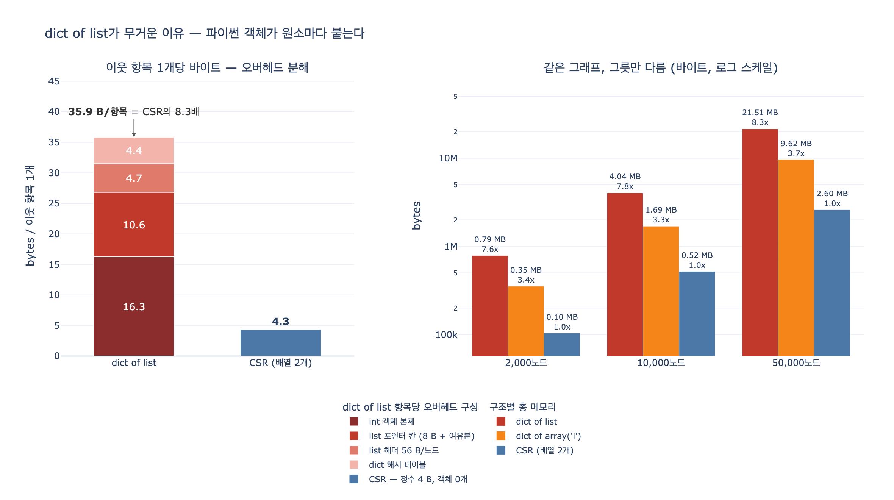

# dict of list는 왜 무거운가 — 원소마다 붙는 파이썬 객체

> **Q.** dict of list(인접 리스트)가 무거운 이유는 무엇인가?
> **A.** 파이썬 객체가 원소마다 붙기 때문이다. 편리하지만 원소당 오버헤드가 정수 배열보다 훨씬 크다.

## 한 줄로

**`array`는 값을 담고, `list`는 값을 가리키는 포인터와 그 값을 감싼 객체를 담는다.**

이웃 하나가 「노드 번호 12345」라는 정보량은 4바이트다. CSR은 정확히 4바이트를 쓴다. dict of list는 같은 정보를 담으려고 **포인터 8바이트 + `int` 객체 28~32바이트**를 쓴다. 여기에 노드마다 리스트 헤더와 dict 슬롯이 얹힌다. 합쳐서 **항목당 약 36바이트**, CSR의 **8배**다.

---

## 오버헤드의 정체 — 네 겹

### ① `int` 객체 본체 — 4바이트 값에 28바이트

CPython의 `int`는 임의 정밀도 객체(`PyLongObject`)다. 값 하나를 담는 데 이런 구조를 쓴다.

| 필드 | 크기 | 설명 |
|---|---|---|
| `ob_refcnt` | 8 B | 참조 카운트 |
| `ob_type` | 8 B | 타입 포인터 |
| `ob_size` | 8 B | 자릿수 개수(부호 포함) |
| `ob_digit[]` | 4 B × k | 30비트씩 쪼갠 실제 값 |

헤더 24바이트 + 자릿수 4바이트 = **28바이트**. 게다가 pymalloc은 8바이트 정렬로 반올림하므로 실제 점유는 **32바이트**다. `array('i')` 한 칸(4바이트)의 **8배**다.

```python
sys.getsizeof(0)      # 24  ← 헤더만, 자릿수 0개
sys.getsizeof(1)      # 28  ← 헤더 + 자릿수 1개
sys.getsizeof(2**30)  # 32  ← 자릿수 2개 (30비트를 넘으니까)
```

### ② 리스트의 포인터 칸 — 8바이트

`list`는 값을 품지 않는다. **값을 가리키는 포인터 배열**이다. 칸마다 8바이트가 든다. 그래서 `sys.getsizeof(리스트)`는 `int` 객체 본체를 **한 바이트도 세지 않는다**. `deep_size` 같은 재귀 측정이 필요한 이유다.

### ③ 리스트의 여유분(over-allocation) — 약 12.5%

`append`할 때마다 realloc하면 느리니까, CPython은 필요보다 넉넉히 잡는다. CPython 3.9의 성장 공식은 이렇다.

```
new_allocated = (newsize + (newsize >> 3) + 6) & ~3
```

용량이 `4 → 8 → 16 → 24 → 32 → 40 → 52 → 64 → 76 → 92 → ...` 로 뛴다. **차수 12짜리 노드는 16칸을 잡는다.** 4칸(32바이트)이 빈 채로 메모리를 차지한다. 실측하면 이 여유분만으로 노드 5만 개 그래프에서 1.5MB가 날아간다.

### ④ 노드마다 붙는 컨테이너 — list 헤더 56 B + dict 슬롯 약 52 B

- **빈 리스트 하나가 56바이트다.** `list.__sizeof__()`가 40이고, 리스트는 GC 추적 대상이라 `sys.getsizeof`가 GC 헤더 16바이트를 더한다. 노드 5만 개면 **리스트 껍데기만 2.8MB**다. (반면 `int`는 GC 추적 대상이 아니라 헤더가 안 붙는다.)
- **dict은 노드마다 해시 슬롯을 산다.** load factor를 2/3 아래로 유지하려고 항목 수의 1.5배 이상인 2의 거듭제곱 크기 테이블을 잡는다. 항목당 `(hash, key*, value*)` 24바이트 + 인덱스 배열 몫이 들어가서 실효 비용이 항목당 36~90바이트를 오간다.

이 두 항목은 **차수와 무관하게 노드 수에만 비례한다.** 그래서 「차수가 낮고 노드가 많은」 희소 그래프에서 특히 아프다. 차수 2짜리 노드 하나를 담는 데 컨테이너 껍데기로만 약 108바이트(56 + 52)를 쓰는 셈이다.

---

## 숫자로

무향 그래프, 노드 $n$, 이웃 항목 총수 $E' = 2E$일 때.

$$\text{CSR} = \underbrace{4(n+1)}_{\texttt{offset}} + \underbrace{4E'}_{\texttt{nbr}} \qquad\text{vs}\qquad \text{dict of list} \approx \underbrace{(8 + s_{\text{int}})}_{36\sim40}E' + \underbrace{(56 + 52)}_{\text{노드당}}n$$

노드 50,000 / 엣지 299,958 / 평균 차수 12에서 실측한 분해.

| 구성 요소 | 바이트 | 항목당 |
|---|---:|---:|
| `int` 객체 본체 | 9,753,796 | 16.3 |
| list 포인터 칸 (8 B + 여유분) | 6,333,504 | 10.6 |
| list 헤더 56 B × 노드 | 2,800,000 | 4.7 |
| dict 해시 테이블 | 2,621,536 | 4.4 |
| **dict of list 합계** | **21,508,836** | **35.9** |
| **CSR (배열 2개)** | **2,599,796** | **4.3** |

세 그릇을 규모별로 나란히 두면 배수가 안정적이다.

| 노드 | dict of list | dict of `array('i')` | CSR | 배수 |
|---:|---:|---:|---:|---:|
| 2,000 | 786,592 | 353,460 | 103,780 | 7.6x |
| 10,000 | 4,038,736 | 1,694,692 | 519,828 | 7.8x |
| 50,000 | 21,508,836 | 9,621,196 | 2,599,796 | 8.3x |

**중간 항 `dict of array('i')`가 핵심 증거다.** 자료구조를 dict of 「무엇」에서 list만 `array`로 바꿨을 뿐인데 절반 이하로 줄어든다. 그 차이가 순수하게 **「원소마다 붙은 `int` 객체 + 포인터」** 값이다. 남은 차이는 노드마다 붙은 컨테이너(④)다.

### 8배는 낙관적인 하한이다

`deep_size`는 같은 객체를 한 번만 센다. 그런데 위 실험에서는 무향 엣지 하나가 만든 `int` 객체가 **양쪽 인접 리스트에 공유**된다. 파일에서 한 줄씩 파싱해 넣는 현실에서는 그 공유가 없다.

`tracemalloc`으로 「스트림 적재 후 끝까지 붙잡고 있는 양」을 재면 이렇게 나온다(노드 10,000).

| 구조 | tracemalloc 실측 | `deep_size` 추정 |
|---|---:|---:|
| dict of list | 5,395,370 | 4,038,736 |
| CSR | 520,752 | 519,828 |

**10.4배.** `deep_size`가 말한 7.8배보다 나쁘다. 그리고 이 10~11배가 8장 도입부의 「4.1GB vs 380MB」와 같은 배수다.

차이가 나는 이유가 또 하나 있다. **CSR은 `int` 객체를 잠깐 쓰고 버린다.** 값이 배열에 복사되니 GC가 회수한다. dict of list는 리스트가 그 객체를 참조하므로 **끝까지 붙잡는다.** 적재가 끝난 뒤에도 안 놓아준다.

---

## 측정 함정 — small int 캐시

CPython은 $-5 \le v \le 256$ 인 정수를 인터프리터 시작 시 미리 만들어 두고 공유한다(`NSMALLNEGINTS=5`, `NSMALLPOSINTS=257`). 그래서 **노드 번호가 작으면 `int` 객체 비용이 안 보인다.**

```python
_rnd = random.Random(0)
small = [_rnd.randrange(256)      for _ in range(1000)]  # deep_size 15,852 B
large = [_rnd.randrange(1000, 2000) for _ in range(1000)]  # deep_size 36,856 B
array("i", large)                                          # 4,064 B
```

같은 「정수 1000개」인데 15,852 / 36,856 / 4,064로 갈린다. 값이 0~255면 서로 다른 객체가 250개만 생기고(중복 값은 캐시를 공유), 1000 이상이면 1000개가 다 생긴다.

**노드 300개짜리 장난감 그래프로 재면 「dict of list도 별로 안 무겁네?」라는 잘못된 결론이 나온다.** 이 카드의 함정이 여기다. 그리고 리터럴로 `1255 is 1255`를 확인하려 들면 컴파일러가 상수를 합쳐 버려서 `True`가 나온다. 실험이 거짓말을 하는 것이다. `int(str(v))`처럼 런타임에 만들어야 한다.

---

## 그래도 인접 리스트를 쓰는 이유

무거운 게 죄는 아니다. 8장 요약이 「인접 리스트는 편하고」라고 적은 건 정확한 평가다.

| | dict of list | CSR |
|---|---|---|
| 엣지 추가 | `append` 한 번, 상수 시간 | 뒤를 전부 밀고 `offset` 갱신 |
| 노드 추가 | 키 하나 넣기 | 배열 재구성 |
| 이웃 조회 | 해시 한 번 | 인덱싱 두 번 |
| 없는 노드 | `dict.get`으로 자연스럽게 처리 | 번호가 $0 \sim n-1$ 로 조밀해야 함 |
| 메모리 | 항목당 약 36 B | 항목당 **4 B** |

그래서 실무 패턴은 하나로 정리된다. **인접 리스트로 쌓고, 분석 직전에 CSR로 굽는다.** 적재 단계에서는 가변성이 필요하고, 순회 단계에서는 조밀함과 지역성이 필요하기 때문이다. SciPy가 `lil_matrix`(쌓기용)와 `csr_matrix`(계산용)를 따로 두는 것도 같은 이유다.

## 가벼워지는 순서

돈이 덜 드는 것부터.

1. **`list` → `array('i')`** — 노드마다 컨테이너는 남지만 `int` 객체와 포인터가 사라진다. 위 실측에서 절반 이하. 코드 변경이 거의 없다.
2. **dict → list 인덱싱** — 노드 번호가 $0 \sim n-1$ 로 조밀하면 dict 해시 테이블을 통째로 버릴 수 있다.
3. **CSR (배열 2개)** — 노드마다 붙는 컨테이너까지 전부 사라진다. 항목당 4바이트.
4. **NumPy / SciPy `csr_matrix`** — CSR을 C 레벨로. 순회까지 벡터화된다.

## 자주 헷갈리는 것

- **「dict이 무거워서」가 아니다.** dict 몫은 항목당 4.4바이트로 네 항목 중 가장 작다. 제일 큰 건 `int` 객체(16.3)와 포인터 칸(10.6)이다. 즉 **`list` 쪽이 주범**이고, 중복 제거를 위해 `dict of set`으로 바꾸면 오히려 더 무거워진다(원소 12개일 때 `set` 728 B vs `list` 152 B, 약 4.8배).
- **`sys.getsizeof(adj)`는 답이 아니다.** 그건 dict 껍데기만 잰다. 중첩 컨테이너와 원소 객체까지 세려면 재귀 측정(`deep_size`)이 필요하고, 그마저도 공유 객체와 pymalloc 반올림 때문에 하한이다.
- **속도가 아니라 메모리 이야기다.** 파이썬에서 BFS를 돌리면 CSR과 dict of list의 시간 차이가 크지 않다(인터프리터 오버헤드가 지배한다). 같은 코드를 C/Rust로 옮기면 3~10배로 벌어진다. 파이썬에서 CSR을 쓰는 이유는 **메모리에 들어가느냐**다. 안 들어가면 속도 논쟁은 의미가 없다.
- **인접 행렬과는 축이 다르다.** 인접 행렬은 노드 수의 **제곱**이라 엣지 수와 무관하게 커진다. 인접 리스트와 CSR은 둘 다 $O(n + E)$이고, 그 안에서 **상수 배수**가 8~10배 갈린다. 이 카드는 후자의 이야기다.

## 1차 출처

- [CPython `Objects/longobject.c`](https://github.com/python/cpython/blob/main/Objects/longobject.c) — `NSMALLPOSINTS = 257`, `NSMALLNEGINTS = 5` (small int 캐시)
- [CPython `Objects/listobject.c`](https://github.com/python/cpython/blob/main/Objects/listobject.c) — `list_resize()` 의 over-allocation 공식
- [`sys.getsizeof` 문서](https://docs.python.org/3/library/sys.html#sys.getsizeof) — GC 관리 객체는 GC 오버헤드가 더해진다
- [`tracemalloc` 문서](https://docs.python.org/3/library/tracemalloc.html) — 실제 할당량 추적
- [SciPy `csr_matrix`](https://docs.scipy.org/doc/scipy/reference/generated/scipy.sparse.csr_matrix.html) — `indptr` / `indices` / `data` [사실상 표준]
- 이 장의 코드: `content/ch08/code/ex1_three_forms.py`(`deep_size`, `build_adjlist`, `build_csr`), `content/ch08/code/ex2_csr_walk.py`

## 시각화


