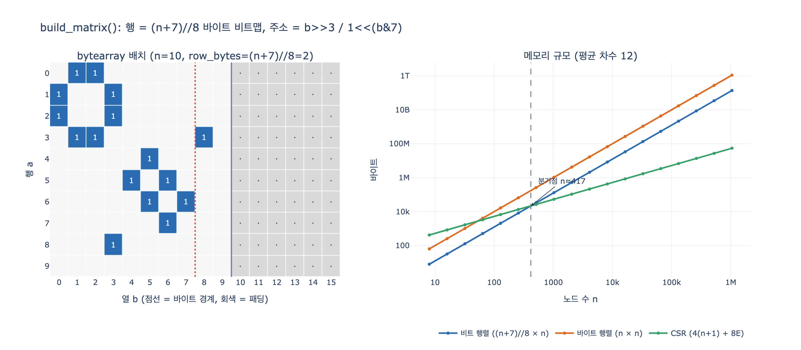

# `build_matrix()` — 인접 행렬을 비트맵으로 압축해 담기

> **Q.** `build_matrix()`는 인접 행렬을 어떻게 압축해 담는가?
> **A.** 한 행을 `(n+7)//8` 바이트의 비트맵으로 두고 `bytearray`에 담는다. 비트 위치는 `b >> 3`(바이트)과 `1 << (b & 7)`(비트)로 계산한다.

## 한 줄로

인접 행렬의 원소는 「있다/없다」뿐이므로 **1비트**면 된다. `build_matrix()`는 한 행을 $\lceil n/8 \rceil$ 바이트짜리 비트맵으로 만들고, $n$개 행을 **평평한 `bytearray` 하나**에 이어 붙인다. 2차원 리스트도, 원소당 파이썬 객체도 없다.

---

## 원본 코드

`content/ch08/code/ex1_three_forms.py`

```python
def build_matrix(edges, n):
    """인접 행렬. n×n 비트. 여기서는 bytearray 한 줄에 n비트씩."""
    row_bytes = (n + 7) // 8              # ① 한 행의 바이트 수 = ceil(n/8)
    m = bytearray(row_bytes * n)          # ② 평평한 1차원 버퍼 하나
    for a, b in edges:
        m[a * row_bytes + (b >> 3)] |= 1 << (b & 7)   # ③ (a,b) 비트 켜기
        m[b * row_bytes + (a >> 3)] |= 1 << (a & 7)   # ④ 무향이라 대칭도 켜기
    return m
```

세 줄이 전부다. 그런데 이 세 줄에 관용구가 셋 들어 있다.

---

## ① `(n + 7) // 8` — 「8로 나눈 뒤 올림」

한 행에 비트가 $n$개 필요한데, 메모리는 **바이트 단위**로만 살 수 있다. 그래서 올림이 필요하다.

$$\texttt{(n + 7) // 8} \;=\; \left\lceil \frac{n}{8} \right\rceil$$

`+7`은 「나머지가 1이라도 있으면 한 칸 더」를 **정수 연산만으로** 표현하는 관용구다. 일반형은 `(x + d - 1) // d`.

| n | `(n+7)//8` | `n//8` (틀림) | 낭비 비트 |
|---|---|---|---|
| 1 | 1 | 0 | 7 |
| 8 | 1 | 1 | 0 |
| 9 | 2 | 1 | 7 |
| 63 | 8 | 7 | 1 |
| 10,000 | 1,250 | 1,250 | 0 |

- `n // 8`은 **내림**이라 마지막 몇 비트를 담을 곳이 사라진다 → `IndexError` 또는 조용한 오염.
- `math.ceil(n / 8)`은 결과가 같아 보이지만 float을 거친다. $n > 2^{53}$에서 어긋난다(expy 2번째 셀에서 확인). 정수 나눗셈이 안전하고 빠르다.
- 행마다 최대 7비트가 **패딩**으로 남는다. `n % 8 == 0`이면 낭비가 0이다.

## ② `bytearray(row_bytes * n)` — 평평한 1차원 버퍼

`[[0]*n for _ in range(n)]` 같은 중첩 구조가 아니다. **하나의 연속된 바이트 덩어리**다.

```
bytearray:  [행0 바이트들][행1 바이트들][행2 바이트들] ... [행 n-1 바이트들]
             └ row_bytes ┘└ row_bytes ┘
```

- `bytearray(k)`는 **0으로 초기화된** 버퍼를 준다. 「엣지 없음」이 곧 0이므로 초기화가 공짜다.
- 원소가 파이썬 객체가 아니라 raw 바이트다. 객체 헤더(28B/int)·포인터(8B) 오버헤드가 **0**.
- 가변(mutable)이라 `|=`로 제자리 수정이 된다(`bytes`는 불변이라 안 된다).
- 그래서 행 $a$의 시작 주소는 곱셈 한 번: `a * row_bytes`. 이게 **행 우선(row-major)** 배치다.

## ③ `b >> 3` 과 `1 << (b & 7)` — 비트 주소 쪼개기

비트 번호 $b$를 (바이트 번호, 바이트 안의 비트 번호)로 쪼개는 일은 그냥 **8로 나눈 몫과 나머지**다. $8 = 2^3$이므로 나눗셈 대신 시프트/마스크를 쓴다.

$$b \gg 3 = \left\lfloor \frac{b}{8} \right\rfloor \quad(\text{몫}), \qquad b \,\&\, 7 = b \bmod 8 \quad(\text{나머지})$$

`7 = 0b111`이라 `& 7`은 **하위 3비트만** 남기고, `>> 3`은 그 하위 3비트를 **버린다**. 두 연산이 $b$의 비트를 겹치지 않게 정확히 나눠 갖는다. 그래서 `8 * (b >> 3) + (b & 7) == b`로 언제나 되돌릴 수 있다.

| b | 2진수 | `b>>3` (바이트) | `b&7` (비트) | `1<<(b&7)` (마스크) |
|---|---|---|---|---|
| 0 | `0b000` | 0 | 0 | `0b00000001` = 1 |
| 7 | `0b111` | 0 | 7 | `0b10000000` = 128 |
| 8 | `0b1000` | 1 | 0 | `0b00000001` = 1 |
| 42 | `0b101010` | 5 | 2 | `0b00000100` = 4 |

그래서 **최종 주소 공식**은 이렇다.

$$\text{byte index}(a,b) = a \cdot \texttt{row\_bytes} + (b \gg 3), \qquad \text{mask}(b) = 1 \ll (b \,\&\, 7)$$

- `divmod(b, 8)`과 결과가 동일하다(음수 아닌 정수에서). 시프트/마스크는 CPU 한 사이클짜리 연산이고 CPython에서도 함수 호출이 없어 더 빠르다.
- **핵심 함정:** `1 << (b & 7)`은 열 $b$를 **하위 비트(LSB)부터** 채운다. 그래서 `format(byte, '08b')`로 찍으면(MSB 먼저) 열 순서가 뒤집혀 보인다. 열 1,2가 켜진 행은 `6 = 0b00000110`이다. 이건 버그가 아니라 관습(리틀엔디안 비트 순서)이고, 읽기·쓰기가 같은 규칙을 쓰면 아무 문제 없다.

## ④ 세 가지 비트 연산

마스크 $m = 2^{\,b \bmod 8}$ 를 만들어 놓으면 나머지는 기계적이다.

| 하는 일 | 연산 | 성질 |
|---|---|---|
| **set** (엣지 추가) | `buf[i] \|= m` | **멱등**(idempotent). 같은 엣지 두 번 넣어도 결과 동일 |
| **test** (엣지 확인) | `bool(buf[i] & m)` | $O(1)$. 인접 행렬의 최대 장점 |
| **clear** (엣지 삭제) | `buf[i] &= ~m & 0xFF` | 파이썬 int는 무한 비트라 `& 0xFF`로 잘라야 한다 |

`|=`가 멱등이라 `build_matrix()`는 **중복 엣지를 따로 걸러내지 않는다**. `graphgen.make()`가 이미 `set`으로 중복을 없애 주지만, 안 없앴어도 결과가 같다. 인접 리스트(`append`)라면 중복이 그대로 쌓인다는 점과 대비된다.

무향 그래프라 `(a,b)`와 `(b,a)` **두 곳**을 켠다. 결과 행렬은 대칭이고, 켜진 비트 수는 정확히 $2E$다.

---

## 그래서 얼마나 아끼는가 — 그리고 왜 그래도 안 쓰는가

$$\text{비트 행렬} = n \cdot \left\lceil \frac{n}{8} \right\rceil \approx \frac{n^2}{8} \text{ bytes}, \qquad
\text{바이트 행렬} = n^2, \qquad \text{CSR} = 4(n+1) + 8E$$

| n | 비트 행렬 | 바이트 행렬 | CSR (평균차수 12) |
|---|---|---|---|
| 100 | 1,300 B | 10,000 B | 5,204 B |
| **416** | **21,632 B** | 173,056 B | **21,636 B** ← 여기서 뒤집힌다 |
| 20,000 | 50,000,000 B (47.7 MiB) | 400,000,000 B (381 MiB) | 1,040,004 B (1 MiB) |
| 1,000,000 | 125 GB (116 GiB) | 1 TB (931 GiB) | 52,000,004 B (50 MiB) |

- 비트맵은 「원소당 1바이트」보다 **8배** 작다(패딩 제외). 이게 이 카드가 말하는 「압축」의 정체다.
- 그런데 **8배를 아껴도 $\Theta(n^2)$는 그대로다.** 8배는 상수 인자일 뿐이고, 노드 수를 3배 늘리면 다시 9배가 된다.
- 평균 차수 12라면 **노드 400여 개**에서 이미 CSR에 진다. 8.1절이 「노드가 수천 이하일 때만 쓸 만하다」고 한 근거가 이 계산이다.
- **엣지가 몇 개든 크기가 같다.** 엣지 2개짜리 2,000노드 그래프도 488KB를 쓴다. 이게 인접 행렬의 본질이자 한계다.

### 「압축」이라는 말의 두 가지 뜻

이 장에 「압축」이 두 번 나오는데 서로 다른 이야기다.

| | 무엇을 없애는가 | 조회 |
|---|---|---|
| **비트 행렬** (`build_matrix`) | 원소 하나에 쓰는 바이트를 1비트로 (8배) | $O(1)$ 랜덤 접근 |
| **CSR** (압축 희소 **행**) | 0(없는 엣지)을 아예 저장하지 않음 | 이웃 목록을 연속 스캔 |

둘 다 gzip류 압축이 아니라 **해동 단계가 없는 배치(layout)** 이야기다. 비트 행렬은 밀집(dense) 표현을 최대한 조인 것이고, CSR은 희소(sparse) 표현이다. 실제 그래프는 거의 다 희소라서 후자가 이긴다.

## 자주 헷갈리는 것

- **`row_bytes`를 곱하는 건 행 인덱스 쪽이다.** `a * row_bytes + (b >> 3)`. `a`가 행, `b`가 열. 유향 그래프라면 `a → b` 한 방향만 켠다.
- **`>> 3`과 `& 7`의 3과 7은 세트다.** 바이트당 8비트($2^3$)라서 각각 `log2(8)=3`, `8-1=7`이다. 워드 단위를 64비트로 바꾸면 `>> 6`, `& 63`이 된다.
- **`& 7`은 `% 8`보다 넓게 쓰이는 이유가 음수 처리 때문이 아니다.** 파이썬에서는 `%`도 항상 음이 아닌 값을 주지만, C 계열에서는 `-1 % 8 == -1`이라 `& 7`이 더 안전한 관용구로 굳었다.
- **`sys.getsizeof(bytearray)`는 객체 헤더(약 57B)가 붙는다.** `((n+7)//8)*n`보다 조금 크게 나오는 게 정상이다.
- **비트 행렬은 이웃 목록 순회에 불리하다.** 노드 하나의 이웃을 찾으려면 행 전체($\lceil n/8 \rceil$ 바이트)를 훑어야 한다 — 차수가 3이든 3,000이든. 반면 「u—v 엣지 있나?」는 $O(1)$이다. 이 비대칭이 인접 행렬을 쓸/안 쓸 자리를 정한다(밀집 그래프·집합 연산·삼각형 세기에는 유리).

## 1차 출처

- [SciPy `csr_matrix` 문서](https://docs.scipy.org/doc/scipy/reference/generated/scipy.sparse.csr_matrix.html) — 비교 대상 CSR [사실상 표준]
- [NetworkX convert 문서](https://networkx.org/documentation/stable/reference/convert.html) — 인접 행렬 / 인접 리스트 [사실상 표준]
- [Python `bytearray` 문서](https://docs.python.org/3/library/stdtypes.html#bytearray) — 가변 바이트 시퀀스
- 이 장의 코드: `content/ch08/code/ex1_three_forms.py`(`build_matrix`, `build_csr`), `content/ch08/code/graphgen.py`

## 시각화


