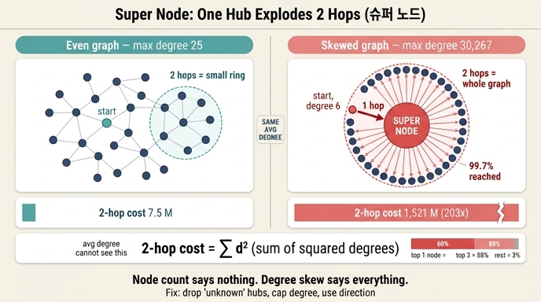

# 슈퍼 노드(super node)란 무엇인가?

> **정답**: 차수가 극단적으로 높은 노드다. 쏠린 그래프에서 이 노드를 지나가는 질의 하나가 전체 시스템을 세울 수 있다.

## 한 줄 핵심

슈퍼 노드는 **「이웃이 많은 노드」가 아니라 「이웃 목록을 한 번 읽는 비용이 그래프 전체를 읽는 비용에 맞먹는 노드」**다. 노드 하나의 속성인 것처럼 보이지만 실제로는 **워크로드의 속성**이다 — 아무도 그 노드를 지나가지 않으면 차수 3,000만이어도 아무 일도 안 일어나고, 흔한 질의가 그 노드를 지나가면 차수 1만으로도 서버가 선다. 그리고 8장의 요점은 이게 「노드 수」로는 절대 안 보인다는 것이다. **평균 차수가 같아도 슈퍼 노드 하나 때문에 2홉 비용이 200배 난다.**

## 8장이 실제로 잰 숫자

`ex3_degree_skew.py`를 돌린 실측이다. 두 그래프는 **노드 수도 엣지 수도 평균 차수도 거의 같다.**

| 그래프 | 노드 | 엣지 | 평균 차수 | 중앙값 차수 | **최대 차수** | **2홉 비용** |
|---|---:|---:|---:|---:|---:|---:|
| 고른 분포 | 50,000 | 299,958 | 12.0 | 12 | 25 | 7,494,946 |
| 쏠린 분포 | 50,000 | 280,374 | 11.2 | 6 | **30,267** | **1,520,876,110** |

**2홉 비용이 203배.** 엣지는 쏠린 쪽이 오히려 **7% 적은데도** 그렇다. 평균 차수 11.2에 최대 차수 30,267 — **평균의 2,699배, 중앙값의 5,045배**다. 그리고 이 최대 차수 노드 하나는 **전체 노드의 60.5%(30,267/50,000)와 직접 연결**돼 있다.

「극단적으로 높다」가 이 뜻이다. 상위 몇 개가 분포의 꼬리에 있는 게 아니라 **분포를 벗어나 있다.**

## 왜 슈퍼 노드가 시스템을 세우는가 — 제곱합

2홉 비용이 왜 차수의 **제곱합**인지가 이 카드의 뼈대다. `ex3_degree_skew.py`의 이 한 줄이 전부다.

```python
def two_hop_cost(edges):
    """2홉 탐색이 훑는 엣지 수의 합. 차수의 제곱합에 비례한다."""
    d = degrees(edges)
    return sum(v * v for v in d.values())
```

노드 $v$에서 2홉을 걸으면 이웃 $u$마다 그 이웃의 이웃 목록을 읽는다. 전체 노드에서 2홉을 돌린 총비용은

$$\sum_{v \in V} \sum_{u \in N(v)} d_u \;=\; \sum_{u \in V} d_u \cdot d_u \;=\; \sum_{u \in V} d_u^2$$

중간 단계가 성립하는 이유가 핵심이다. 노드 $u$는 **정확히 $d_u$번** 「누군가의 이웃」으로 등장하고, 등장할 때마다 자기 이웃 목록 $d_u$개를 내놓는다. 즉 **차수가 두 번 곱해진다.** 차수 30,267인 노드는 $30{,}267^2 \approx 9.16 \times 10^8$을 혼자 낸다.

실측으로 확인한 기여도다.

| | 2홉 비용 기여 |
|---|---:|
| 슈퍼 노드 **1개** | **60.2%** |
| 상위 **3개** | **88.1%** |
| 상위 **10개** | **97.2%** |

**노드 50,000개 중 1개가 전체 일의 60%를 만든다.** 반대로 상위 3개만 빼면 2홉 비용이 8.4배 떨어진다(15.2억 → 1.81억). 8장이 「쏠린 그래프에서 상위 노드를 지나가는 질의 하나가 전체를 세운다」고 쓴 근거가 이 표다.

### 평균이 왜 못 잡아내나

평균은 1차 모멘트($\sum d_u / n$)고 비용은 2차 모멘트($\sum d_u^2$)다. 코시-슈바르츠로

$$\sum d_u^2 \;=\; n\left(\overline{d}^2 + \sigma_d^2\right)$$

**평균이 같으면 차이는 전부 분산에서 온다.** 위 실측에서 두 그래프의 $\overline{d}$는 11~12로 같은데 2홉 비용이 203배 났다. 이 203배가 $\sigma_d^2$다. 그래서 「노드 100만 개짜리 그래프」라는 말은 성능에 대해 거의 아무 정보도 주지 않는다. 물어봐야 할 것은 **최대 차수**와 **차수 히스토그램**이다.

## 이웃까지 오염된다 — 이게 진짜 무서운 부분

「슈퍼 노드를 조회하지 않으면 되지」로 끝나지 않는다. 같은 그래프에서 실제로 2홉을 걸어 본 실측이다.

| 출발 노드 | 차수 | 훑은 엣지 | 도달 노드 | 시간 |
|---|---:|---:|---:|---:|
| 중앙값 노드 | **6** | 6,041 | 6,010 | 0.42 ms |
| 슈퍼 노드 | 30,267 | 343,759 | **49,874** | **22.15 ms** |

두 줄 모두 읽어야 한다.

**첫째 줄** — 이웃이 **6개**인 평범한 노드에서 출발했는데 엣지 6,041개를 훑었다. 이웃당 1,007개다. 왜? **그 6개 이웃 중에 허브가 섞여 있다.** 쏠린 그래프에서는 아무 노드나 잡아도 이웃에 허브가 있다(그게 선호적 연결의 정의다). 슈퍼 노드를 「피한다」는 건 시작점을 피하는 게 아니고 **경로에서 빼는** 일이라 훨씬 어렵다.

**둘째 줄** — 슈퍼 노드에서 2홉이면 **전체 노드의 99.7%(49,874/50,000)에 도달**한다. 2홉 질의 하나가 데이터베이스 전체 스캔과 같아진다. 그런데 질의를 던진 사람은 「2단계 지인만 보는」 가벼운 요청이라고 생각한다. 이 인식 차이가 사고의 형태다 — 타임아웃이 아니라 **한 요청이 커넥션 풀·힙·페이지 캐시를 다 먹고 무관한 질의까지 같이 죽는다.**

## 왜 생기는가

두 가지 경로가 있고, 대처법이 완전히 다르다.

### 1. 자연 발생 (선호적 연결)

`graphgen.py`의 `skew=True`가 흉내 내는 것이다.

```python
# 선호적 연결: 이미 차수가 높은 노드에 더 붙는다
targets = [0, 1, 2]
for a in range(3, n):
    for _ in range(avg_deg // 2):
        b = rnd.choice(targets)      # ← 차수에 비례해 뽑힌다
        ...
        targets.append(b)
    targets.append(a)
```

`targets` 리스트에 이미 많이 등장한 노드가 다시 뽑힐 확률이 높다. 이게 **부익부**고, 결과가 거듭제곱 법칙(power law) 차수 분포다. 실제 소셜 그래프의 팔로워 분포가 지수 $\gamma \approx 2.3$ 근처의 거듭제곱 법칙으로 보고돼 있다. 이런 분포에서는 $\gamma < 3$이면 **2차 모멘트가 발산**한다 — 즉 「최대 차수는 데이터가 늘면 계속 커진다」가 이론적 예측이고, 2홉 비용은 노드 수보다 빠르게 자란다.

- 유명 계정 팔로워: Lady Gaga가 인바운드 8,000만인데 아웃바운드는 12만 남짓 — **방향에 따라 600배 차이**
- 인기 해시태그, 베스트셀러 상품, 허브 공항, 서울 강남 교차로

이 부류는 **지울 수 없다.** 데이터가 맞으니까.

### 2. 모델링 실수 (8장 저자가 먼저 보는 쪽)

8장은 이렇게 못 박는다.

> 저는 1번을 먼저 봅니다. **슈퍼 노드의 절반은 모델링 실수라서요.**

전형적인 것들이다.

| 패턴 | 왜 슈퍼 노드가 되나 | 대개의 정답 |
|---|---|---|
| `(:Country {code:"UNKNOWN"})`, `(:Category {name:"기타"})` | 값이 없는 모든 레코드가 한 노드로 모인다 | **엣지를 안 만든다.** 없는 값은 없는 엣지다 |
| `NULL`을 노드로 승격 | 위와 동일. 「모르는 것들끼리 연결」은 의미가 없다 | 지운다 |
| `(:Year {value:2024})`, `(:Date)` | 그 해에 일어난 모든 사건이 붙는다 | 시간은 **속성**으로. 범위 색인을 쓴다 |
| `(:Gender {value:"M"})`, `(:Status {value:"active"})` | 카디널리티가 낮은 열거형을 노드로 만들었다 | 라벨이나 속성으로 |
| `(:Tenant)`, `(:Organization)` 루트 | 테넌트 안의 모든 노드가 붙는다 | 소유는 속성/샤드 키로 |
| 공유 IP·디바이스·전화번호 | 통신사 NAT IP 하나에 계정 수십만 | **IP 대역**으로 묶거나 별도 라벨로 격리 |

7장(「노드 하나 잘못 그려서 3주를 날렸다」)과 이어지는 지점이다. **「이건 사물인가 값인가」를 틀리면 그 대가를 8장에서 슈퍼 노드로 받는다.** 「기타」는 사물이 아니라 값의 부재다.

구별 기준은 간단하다. **차수 분포의 최상위 노드 목록을 뽑아서 하나씩 읽어 보면 된다.** 「Lady Gaga」가 나오면 자연 발생이고, 「UNKNOWN」이 나오면 실수다.

## 대처법 — 8장의 세 가지 + 엔진이 주는 것

8장이 제시하는 순서다.

> 1. 슈퍼 노드를 질의에서 피한다 («기타», «미분류» 같은 것은 대개 지워도 된다)
> 2. 차수 상한을 두고 넘으면 쪼갠다 (샤딩된 이웃 목록)
> 3. 2홉 결과를 미리 계산해 둔다 (대신 갱신 비용을 낸다)

### 1. 피한다 / 지운다 — 제일 싸다

실수로 생긴 슈퍼 노드는 **지우면 된다**. 위 실측에서 상위 3개를 빼는 것만으로 2홉 비용이 **8.4배** 줄었다. 코드 한 줄도 안 고치고 얻는 8.4배다.

지울 수 없다면 **격리**한다.

- **방향 지정**: 팔로워 8,000만은 인바운드다. `(a)-[:FOLLOWS]->(b)`를 아웃바운드로만 타면 12만이다. 무방향으로 짜면 600배를 낸다.
- **라벨/관계 타입 분리**: `(:Celebrity)`와 `(:User)`를 나누거나 `:FAN`과 `:FOLLOWS`를 나눠서, 일반 질의가 허브를 아예 안 보게 한다.
- **차수 상한 필터**: 순회 중 `degree(v) > K`인 노드에서 확장을 멈춘다. 근사가 되지만 응답 시간을 **유계**로 만든다. 이게 실무에서 가장 자주 쓰이는 방어다 — 정답의 100%보다 **안 죽는 것**이 대개 더 중요하다.

### 2. 쪼갠다 — 차수 상한과 샤딩

이웃 목록을 $K$개씩 잘라 여러 대리 노드(shard / proxy / partitioned vertex)로 나눈다. 차수 $d$인 노드가 $\lceil d/K \rceil$개로 쪼개지면 2홉 비용이 $d^2$에서 $\lceil d/K \rceil \cdot K^2 \approx dK$로 — **제곱에서 선형으로** 떨어진다. 위 그래프에서 계산한 값이다.

| 차수 상한 $K$ | 쪼갠 뒤 2홉 비용 | 감소 |
|---:|---:|---:|
| — (원본) | 1,520,876,110 | 1.0x |
| 10,000 | 840,433,077 | 1.8x |
| 1,000 | 138,289,323 | **11.0x** |
| 100 | 22,961,745 | **66.2x** |

$K$를 낮출수록 좋지만 **모든 질의가 $\lceil d/K \rceil$개 샤드를 다 훑어야** 하므로 상수 비용이 늘고 쓰기/일관성이 복잡해진다. 그래서 「최후 수단」으로 분류되는 편이다.

### 3. 미리 계산한다

2홉 결과나 이웃 수를 **비정규화**해 둔다. 「친구의 친구」를 매번 계산하지 않고 테이블로 유지한다. 읽기는 $O(1)$이 되지만 **엣지 하나 바뀔 때 갱신 비용이 슈퍼 노드 차수에 비례**한다 — 비용을 없앤 게 아니라 읽기에서 쓰기로 옮긴 것이다. 읽기:쓰기 비율이 압도적일 때만 이득이다.

### 4. 엔진이 이미 하고 있는 것

**Neo4j — dense node**

- 관계를 **50개 이상 가진 적이 있는** 노드를 「dense node」로 분류하고(`db.relationship_grouping_threshold`로 조정), 관계 체인을 하나로 잇는 대신 **relationship group store**를 두어 「타입별·방향별」로 나눠 담는다. 그래서 dense node라도 `-[:FOLLOWS]->` 하나만 요청하면 그 그룹만 읽는다. **관계 타입과 방향을 안 쓰면 이 최적화가 전부 무력화된다.**
  - 위 실측 그래프에서 차수 50 이상인 노드는 **628개(1.26%)** 였다. 「dense node」는 예외 상황이 아니라 쏠린 그래프의 정상 상태다.
- **잠금(lock)** 측면도 있다. dense node는 관계 생성/삭제 시 배타 잠금을 걸지 않고 공유 잠금 + 공유 차수 잠금으로 처리한다. 안 그러면 인기 노드에 관계를 붙이는 트랜잭션들이 전부 직렬화된다.
- 4.3부터 **관계 속성 색인**을 지원한다. 순회 전에 관계를 걸러낼 수 있다.
- Cypher `USING JOIN ON` 힌트로 플래너가 허브를 통과하지 않게 유도한다.

**JanusGraph — vertex-centric index + vertex cut**

- **vertex-centric index**: 노드에 붙은 엣지를 라벨·속성으로 정렬해 색인한다. 차수 100만이어도 「2024년 이후 엣지」를 선형 스캔 없이 뽑는다. **이게 슈퍼 노드에 대한 1차 방어다.**
- **vertex cut(partitioned vertex)**: 노드 하나의 인접 목록을 여러 파티션에 쪼개 두고, 순회가 닿으면 파티션별 결과를 자동 병합한다. 8장의 「2번 대처법」이 제품 기능으로 들어간 형태다. 단, vertex-centric index 자체가 그 노드의 파티션에 같이 저장되므로 **두 기법을 같이 쓰면 오히려 불리해질 수 있다**는 지적이 있다.

**분산 그래프 처리 — 엣지 컷 vs 정점 컷**

PowerGraph 계열이 노드가 아니라 **엣지를 나누는(vertex-cut)** 쪽을 택한 이유가 정확히 이것이다. 거듭제곱 법칙 그래프에서 노드 기준으로 나누면 허브가 있는 파티션 하나가 일을 다 하고 나머지가 놀게 된다. 슈퍼 노드는 **부하 불균형**의 다른 이름이다.

## 8장의 나머지와 어떻게 이어지나

- **CSR과의 관계**: CSR은 이웃을 연속 배열에 담아 캐시 효율을 얻는다. 슈퍼 노드는 이 이득을 무력화하지 **않는다** — 오히려 30,267개를 연속으로 읽는 건 CSR이 가장 잘하는 일이다. 슈퍼 노드가 무너뜨리는 건 **읽는 양**이지 읽는 방식이 아니다. **그릇을 바꿔서 해결되는 문제가 아니다.** 8배는 표현이 주고, 200배는 분포가 뺏는다.
- **재배치(reordering)와의 관계**: `ex4_relabel.py`의 재배치는 커뮤니티 구조를 이용해 지역성을 얻는다. 슈퍼 노드는 그래프 전체에 걸쳐 있어서 어떤 번호를 줘도 이웃들이 흩어진다. 그래서 대용량 처리 도구들은 **고차수 노드를 따로 떼어 별도 처리**하는 경로를 두는 경우가 많다.
- **다음 장 예고**: 9장의 「몇 다리 건너인지 세다가 서버가 죽었다」가 바로 이 카드의 후속이다. 죽는 이유의 대부분이 슈퍼 노드다.

## 자주 하는 오해

- **「차수 몇 개 이상이 슈퍼 노드인가」** → 절대 기준은 없다. Neo4j의 50은 저장 형식이 바뀌는 내부 경계일 뿐 성능 경계가 아니다. 실용적 기준은 **분포 대비**다 — 최대 차수가 중앙값의 수백~수천 배면 슈퍼 노드다. 위 실측이 5,045배였다.
- **「노드 수가 적으면 안전하다」** → 위 실측은 **둘 다 50,000노드**인데 203배 났다. 노드 수는 예측력이 거의 없다. 8.3절 제목이 「100만에서 멀쩡하고 10만에서 죽는 이유」인 게 이 뜻이다.
- **「엣지가 많아서 느린 것」** → 쏠린 쪽이 엣지가 **7% 적었다.** 총량이 아니라 **분포**가 문제다.
- **「슈퍼 노드를 조회 안 하면 된다」** → 실측에서 차수 **6**인 노드의 2홉이 이미 엣지 6,041개를 훑었다. 슈퍼 노드는 **지나가기만 해도** 터진다. 피해야 하는 건 시작점이 아니라 경로다.
- **「1홉은 괜찮다」** → 1홉 비용은 $d$에 선형이라 30,267개 읽는 것으로 끝난다. 파괴적인 건 **제곱이 되는 2홉부터**다. 슈퍼 노드는 「홉 수 하나 늘리는 것」이 안전하지 않다는 사실을 만드는 원인이다.
- **「인덱스를 걸면 해결된다」** → 시작 노드 찾기는 빨라지지만(8.4절) 이웃 목록 길이는 그대로다. 도움이 되는 건 **관계 자체에 대한 색인**(Neo4j 관계 속성 색인, JanusGraph vertex-centric index)이고, 노드 속성 색인은 무관하다.
- **「비정규화하면 공짜」** → 읽기 비용을 쓰기 비용으로 옮긴 것이다. 슈퍼 노드에 엣지가 붙을 때마다 갱신량이 차수에 비례한다. 그리고 그 지점이 잠금 경합의 핫스팟이 된다.

## 실행해서 확인하기

```bash
cd content/ch08/code
python3 graphgen.py          # skew=False 최대 25 / skew=True 최대 30,267
python3 ex3_degree_skew.py   # 평균은 같은데 2홉 비용이 203배
```

`graphgen.py`의 「상위 10개 합」을 꼭 보자. 고른 분포는 **241**, 쏠린 분포는 **86,040**이다. 노드 10개가 엣지의 15%를 물고 있다. 실무에서 새 그래프를 받으면 제일 먼저 돌려야 하는 것이 이 두 줄이다 — **차수 히스토그램과 상위 20개 노드 이름.** 이름을 읽는 순간 「자연 발생인지 모델링 실수인지」가 갈린다.

---

## 참고

- [super node — Neo4j Cypher 계획 및 튜닝](https://neo4j.com/docs/cypher-manual/current/planning-and-tuning/) (8장 키워드 표의 1차 출처)
- [Graph Modeling: All About Super Nodes — David Allen, Neo4j](https://medium.com/neo4j/graph-modeling-all-about-super-nodes-d6ad7e11015b) (방향 활용, 라벨 분리, 조인 힌트, 리팩터링 — Lady Gaga 8,000만 vs 12만 예시)
- [Relationship chain locks: don't block the rock! — Neo4j](https://neo4j.com/blog/developer/relationship-chain-locks-dont-block-the-rock/) (dense node 잠금 처리)
- [Neo4j Super Node Performance Issues — Justin Boylan-Toomey](https://jboylantoomey.com/post/neo4j-super-node-performance-issues) (관계 타입 색인만으로 부족한 이유)
- [Neo4j Super-Nodes and Indexed Relationships — OpenCredo](https://opencredo.com/blogs/neo4j-super-nodes-and-indexed-relationships-part-i/) (관계 색인 실험)
- [Graph Partitioning — JanusGraph 문서](https://docs.janusgraph.org/advanced-topics/partitioning/) (vertex cut / partitioned vertex)
- [Indexing for Better Performance — JanusGraph 문서](https://docs.janusgraph.org/v0.2/basics/index-performance/) (vertex-centric index)
- [Proxy node for super node — JanusGraph Discussion #2717](https://github.com/JanusGraph/janusgraph/discussions/2717) (vertex-cut과 vertex-centric index를 같이 쓸 때의 문제)
- [Graph Database Anti-Patterns That Destroy AI Speed — FalkorDB](https://www.falkordb.com/blog/graph-database-anti-patterns-ai-performance/) (공유 IP 50만 계정 사례, IP 대역으로 묶는 대처)
- [DRONE: a Distributed Subgraph-Centric Framework for Processing Large Scale Power-law Graphs](https://arxiv.org/pdf/1812.04380) (거듭제곱 법칙 그래프의 부하 불균형과 vertex-cut)
- [Elites Tweet? Characterizing the Twitter Verified User Network](https://arxiv.org/pdf/1812.09710) (팔로워 분포 거듭제곱 법칙 지수 $\gamma \approx 2.3$)

## 인포그래픽


