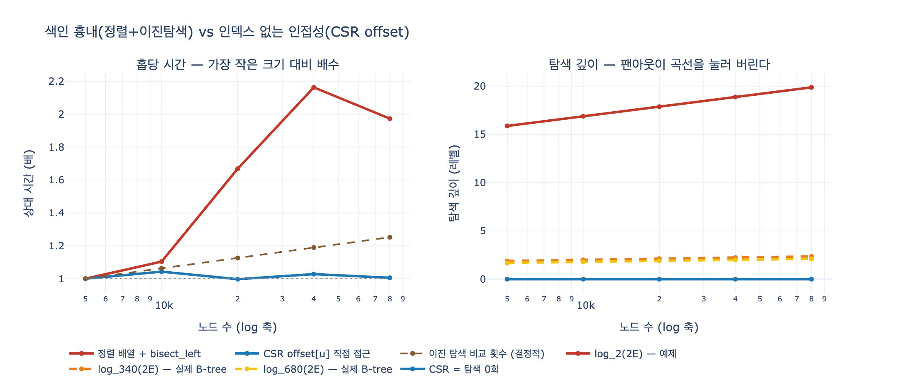

# `ex5_index_free.py`는 색인 방식을 어떻게 흉내 내는가?

> **정답**: 양방향 엣지를 정렬한 배열을 만들고 `bisect_left`로 이진 탐색해 해당 노드의 구간을 훑는다.

## 한 줄 핵심

관계형 DB에서 이웃을 찾는 일은 「`edge` 테이블의 `src` 컬럼 인덱스를 타서 `src = u`인 행 구간을 읽는」 일이다. 예제는 그 인덱스를 **B-tree 대신 정렬된 파이썬 리스트로** 세웠다. `sorted(...)`가 인덱스 빌드고, `bisect_left`가 인덱스 탐색이고, `while keys[i] == u`가 매칭 행 스캔이다. 세 조각으로 관계형 조인의 **비용 모양**을 재현하면서, B-tree의 **페이지·팬아웃·버퍼풀은 전부 버렸다**. 그래서 이 예제는 「방향」은 정확하고 「배수」는 과장한다.

## 코드를 조각으로 뜯기

```python
def build_sorted_edges(edges):
    rows = sorted([(a, b) for a, b in edges] + [(b, a) for a, b in edges])
    keys = [r[0] for r in rows]
    return rows, keys

def neighbors_via_index(rows, keys, u):
    i = bisect_left(keys, u)                 # ① 인덱스 탐색
    out = []
    while i < len(keys) and keys[i] == u:    # ② 구간 스캔
        out.append(rows[i][1]); i += 1
    return out
```

| 줄 | 관계형 DB에서 대응하는 것 |
|---|---|
| `[(a, b) …] + [(b, a) …]` | 무방향 엣지를 양방향으로 펼침. 실제로도 `(src, dst)`와 `(dst, src)` **두 방향 인덱스**를 따로 만들거나, 조회 방향마다 인덱스를 하나씩 둔다 |
| `sorted(...)` | **인덱스 빌드**. `CREATE INDEX` 한 번의 정렬 비용 |
| `keys = [r[0] for r in rows]` | 인덱스가 담는 **키 컬럼만 뽑은 사본**. 인덱스는 원본 테이블과 별도 저장이라는 사실의 대역 |
| `bisect_left(keys, u)` | **B-tree 루트 → 리프 하강**. 로그 시간, 데이터가 늘면 깊어짐 |
| `while keys[i] == u` | **인덱스 리프의 연속 구간 스캔**(range scan). 같은 키의 엔트리가 물리적으로 이어져 있다는 성질 |
| `rows[i][1]` | 값 읽기. 여기서는 **커버링 인덱스**처럼 인덱스 안에 답이 다 있는 상태 |

핵심 성질 하나: `keys`가 비감소 정렬이므로 노드 $u$의 이웃은 **반드시 한 개의 연속 구간**에 모인다.

$$\text{이웃}(u) \;=\; \texttt{rows}\big[\;\underbrace{\texttt{bisect\_left}(keys,\,u)}_{\text{왼쪽 경계}} \;:\; \underbrace{\texttt{bisect\_left}(keys,\,u{+}1)}_{\text{오른쪽 경계}}\;\big]$$

`bisect_left`는 왼쪽 경계만 로그 시간에 주고, 오른쪽 경계는 `while` 루프가 걸어가며 만난다. 그래서 홉 하나의 비용은 두 항의 합이다.

$$C_{\text{색인}}(u) \;=\; \underbrace{\lceil \log_2 2E \rceil}_{\text{탐색}} \;+\; \underbrace{\deg(u)}_{\text{스캔}}$$

## CSR의 `offset`은 「bisect_left의 답안지」다

노드 8개짜리 그래프로 두 방식을 나란히 찍으면 정체가 드러난다.

```
rows  idx :  0  1  2  3  4  5  6  7  8  9 10 11 12 13 14 15
      key :  0  0  1  2  3  3  3  4  5  5  5  5  6  6  7  7
      val :  3  5  3  5  0  1  6  5  0  2  4  7  3  7  5  6

CSR   offset : [0, 2, 3, 4, 7, 8, 12, 14, 16]
      nbr    : [3, 5, 3, 5, 0, 1, 6, 5, 0, 2, 4, 7, 3, 7, 5, 6]
```

| $u$ | `bisect_left(keys, u)` | `offset[u]` |
|---:|---:|---:|
| 0 | 0 | 0 |
| 1 | 2 | 2 |
| 2 | 3 | 3 |
| 3 | 4 | 4 |
| 5 | 8 | 8 |
| 7 | 14 | 14 |

**전부 일치한다.** `nbr`는 `rows`의 `val` 열과 같고, `offset`은 이진 탐색이 계산해 낼 값을 **미리 표로 굳혀 둔 것**이다. 즉

$$\text{CSR} \;=\; \text{정렬 배열} \;+\; \text{모든 키의 경계를 미리 계산한 표}$$

이것이 **인덱스 없는 인접성(index-free adjacency)** 의 기계적 정체다. 색인을 「빠르게 만든」 게 아니라 **색인을 주소 계산으로 치환**했다. `offset[u]`는 데이터가 100배 커져도 배열 접근 한 번이다.

## 흉내가 재현하는 것 — 「비용의 모양」

평균 차수를 12로 고정하고 노드 수만 5,000 → 80,000(16배)으로 키운 실측이다. 차수를 고정했으니 구간 스캔 길이는 그대로고, 변하는 것은 탐색 깊이뿐이다.

| 노드 수 | `rows` ($2E$) | 색인 방식 | CSR `offset` | 이진 탐색 비교 횟수 | $\log_2 2E$ |
|---:|---:|---:|---:|---:|---:|
| 5,000 | 59,916 | 2.43 us | 0.20 us | 15.90 | 15.87 |
| 10,000 | 119,924 | 2.68 us | 0.20 us | 16.91 | 16.87 |
| 20,000 | 239,928 | 4.05 us | 0.20 us | 17.90 | 17.87 |
| 40,000 | 479,898 | 5.25 us | 0.20 us | 18.91 | 18.87 |
| 80,000 | 959,926 | 4.79 us | 0.20 us | 19.91 | 19.87 |

배수로 읽으면,

| 노드 수 | 색인 / CSR | 색인 시간 증가 | CSR 시간 증가 | 비교 횟수 증가 |
|---:|---:|---:|---:|---:|
| 5,000 | 12.4x | 1.00x | 1.00x | 1.00x |
| 10,000 | 13.1x | 1.10x | 1.04x | 1.06x |
| 20,000 | 20.7x | 1.67x | 1.00x | 1.13x |
| 40,000 | 26.0x | 2.16x | 1.03x | 1.19x |
| 80,000 | 24.2x | 1.97x | 1.01x | 1.25x |

읽는 법 셋.

1. **비교 횟수가 정확히 $\log_2 2E$를 따라간다.** 데이터 16배 → 비교 4회 추가($\log_2 16 = 4$, 배수로 1.25배). 이 열만 결정적이고 시간 열은 실행마다 흔들린다(80,000에서 2.16 → 1.97로 꺾인 것은 노이즈다).
2. **CSR은 평평하다.** 어느 크기에서나 0.20 us, 1.00x 근처다. `offset[u]`가 크기와 무관하다는 뜻이다.
3. **색인 시간은 비교 횟수보다 빠르게 는다.** 비교는 1.25배인데 시간은 2배 남짓이다. 이진 탐색은 배열을 절반씩 건너뛰므로 **캐시 적대적**이다. 배열이 커지면 초반 몇 번의 점프가 매번 새 캐시 줄을 끌어온다. 즉 깊이가 느는 동시에 **깊이 한 단의 값도 비싸진다.** 8장 8.2절의 「연속이면 빠르다」가 반대 방향으로 작동한 사례다.

그리고 이 차이는 홉마다 붙는다.

$$C_{\text{색인}}(k\text{홉}) = \sum_{i=1}^{k}\big(d(\text{크기}) + \deg\big) \qquad\text{vs.}\qquad C_{\text{CSR}}(k\text{홉}) = \sum_{i=1}^{k}\big(\underbrace{0}_{\text{탐색}} + \deg\big)$$

크기에 의존하는 항 $d(\text{크기})$가 홉마다 곱해지는가 아닌가 — 그게 인덱스 없는 인접성의 전부다. 8장이 「두 번째 홉부터 이득」이라 적은 이유다.

## 흉내가 재현하지 **못** 하는 것

여기가 이 카드에서 가장 중요한 부분이다. 예제의 배수를 「관계형 DB가 그래프 DB보다 20배 느리다」로 읽으면 틀린다.

### 1. 팬아웃 — 예제는 깊이를 **8배 이상 과장**한다

정렬 배열의 이진 탐색은 **팬아웃 2**의 트리다. 실제 B-tree는 한 **페이지**에 키를 수백 개 담아 팬아웃이 수백이다.

$$\underbrace{d_2 = \log_2 (2E)}_{\text{예제}} \qquad\text{vs.}\qquad \underbrace{d_f = \log_f (2E) = \frac{\log_2 2E}{\log_2 f}}_{\text{실제 B-tree}}$$

8KB 페이지에 (4바이트 키 + 8바이트 포인터)를 채우면 $f \approx 8192/12 \approx 680$. B-tree는 노드를 보통 절반~70% 정도만 채우므로 실효 팬아웃은 $f \approx 340$쯤으로 보면 된다. $\log_2 340 \approx 8.4$이므로 **예제의 깊이 곡선은 실제의 8배 이상이다.**

| 행 수 ($2E$) | $\log_2$ (예제) | $\log_{340}$ | $\log_{680}$ |
|---:|---:|---:|---:|
| 59,916 | 15.9 | 1.9 | 1.7 |
| 959,926 | 19.9 | 2.4 | 2.1 |
| 1,000,000 | 19.9 | 2.4 | 2.1 |
| 100,000,000 | 26.6 | 3.2 | 2.8 |
| 1,000,000,000 | 29.9 | 3.6 | 3.2 |

**10억 행에서도 B-tree 깊이는 3~4 레벨이다.** 예제 코드가 출력하는 `이론 색인 깊이 log2(len(rows))`는 그래서 「깊이」의 상한선 같은 숫자지, 실제 레벨 수가 아니다. 예제가 맞게 보여 주는 건 **$d$가 $n$에 대해 단조 증가한다**는 사실이고, 틀리게 보여 주는 건 **기울기**다.

### 2. 디스크 페이지 단위 I/O — 예제에는 없고, 실제에서는 이게 전부다

예제는 전부 인메모리 리스트다. 비교 한 번의 값이 나노초 수준이다. 실제 B-tree에서 레벨 하나를 내려가는 값은 **페이지 하나를 읽는 값**이고, 페이지가 버퍼 풀에 없으면 랜덤 I/O다. 즉 예제는

- 값의 **단위**를 잘못 잡았다 (나노초 대 마이크로~밀리초)
- 그 대신 **레벨 수**를 크게 잡았다

두 오차가 서로 반대 방향이라 우연히 「그럴싸한 배수」가 나온다. 실제 시스템에서 지배 항은 비교 횟수가 아니라 **캐시/버퍼 미스 횟수**다.

### 3. 버퍼 풀에 상주하는 상위 레벨 — 실제 디스크 접근은 1~2회

B-tree 루트는 항상, 그 아래 레벨도 거의 항상 버퍼 풀에 있다. 4레벨 인덱스에서도 실제로 스토리지를 때리는 건 리프와 그 위 한 단 정도, 즉 **1~2회**다. 예제에는 이 「위쪽은 공짜」 구조가 전혀 없다. `keys` 리스트도 CPU 캐시 덕에 상위 절반은 사실상 상주하지만, 예제가 이를 **모델로 표현하지는 않는다** — 우연히 하드웨어가 해 주는 것과, 시스템이 설계로 보장하는 것은 다르다.

### 4. 그 밖에 빠진 것들

| 실제 조인의 요소 | 예제 |
|---|---|
| 커버링 인덱스 vs **힙 페치**(인덱스에서 rowid 얻고 테이블 랜덤 접근) | `rows[i][1]`이 곧 답. 힙 페치가 없다 — 예제는 관계형 쪽에 **유리하게** 단순화했다 |
| 플래너의 조인 알고리즘 선택(중첩 루프 / 해시 / 머지) | 방법 하나로 고정. 실제로는 대량 조인에 해시 조인이 붙어 홉당 로그 항이 사라질 수도 있다 |
| 잠금·MVCC·WAL·통계 갱신 | 없음. 읽기 전용 정적 배열 |
| 인덱스 유지 비용(삽입 시 페이지 분할) | 없음. `sorted()` 한 번 |
| 실제 그래프 DB의 저장소도 페이지 기반이라는 사실 | Neo4j 등도 레코드를 페이지에 담아 읽는다. 「포인터 따라가기」가 항상 메모리 접근인 것은 아니다 |

마지막 항이 특히 자주 오해된다. **인덱스 없는 인접성이 없애는 것은 「탐색」이지 「I/O」가 아니다.** 이웃 레코드가 페이지 캐시에 없으면 그래프 DB도 디스크를 읽는다. 그래서 8장 8.2절(연속 배치)과 예제 4(재배치)가 같은 장에 있는 것이다 — 탐색을 없앤 다음 남는 병목이 지역성이다.

## 흉내가 **일부러 생략**한 것: 시작 노드 찾기

예제의 프로브는 정수 노드 번호다. 그래서 CSR이 `offset[u]`로 바로 갈 수 있다. 하지만 현실의 질의는 「이름이 `user_12345`인 사람의 친구」다. **이름 → 내부 번호** 변환에는 그래프 DB도 색인이 필요하다.

노드 20,000개에서 이름으로 시작 노드를 찾는 값:

| 방법 | 시간 |
|---|---:|
| 전체 훑기 (색인 없음) | 341.56 us |
| 정렬 + 이진 탐색 | 0.55 us |
| 해시 색인 (dict) | 0.37 us |
| (참고) 시작 노드를 안 뒤의 1홉 | 0.36 us |

**전체 훑기는 이진 탐색의 약 620배.** 첫 홉의 색인은 「있으면 좋은 것」이 아니라 필수다. 그래서 Neo4j에도 `CREATE INDEX`가 있고, 실무에서 느린 Cypher의 절반은 시작 노드에 인덱스가 없어서 `AllNodesScan`을 하는 경우다. 8장이 「이 점을 자주 잊는다」고 적은 대목이다.

$$C_{\text{질의}} = \underbrace{d(\text{색인 탐색})}_{\text{그래프 DB도 낸다}} + \underbrace{\sum_{i=1}^{k} \deg_i}_{\text{여기부터 공짜}}$$

## 이 예제를 정직하게 재정리하면

예제 5는 「관계형 대 그래프」의 **성능 벤치마크가 아니다.** 두 비용 함수의 **모양 차이**를 보여 주는 교구다.

| 예제가 증명하는 것 | 예제가 증명하지 않는 것 |
|---|---|
| 홉당 비용에 크기 의존 항이 있는가 없는가 | 그 항의 실제 크기 |
| 그 항이 $k$홉에서 $k$번 곱해진다 | 실제 DB에서 $k$홉이 몇 배 느린가 |
| 첫 홉에는 두 방식 모두 색인이 필요하다 | 그래프 DB가 I/O도 안 한다 |

읽는 문장 하나로 요약하면 — **정렬 배열 + 이진 탐색은 B-tree의 「깊이가 크기에 의존한다」는 성질만 남긴 골격 모형이고, 실제 깊이는 팬아웃 때문에 8배 얕고 상위 레벨 캐싱 때문에 유효 비용이 더 얕다. 그래도 0은 아니다.** 예제의 결론(「두 번째 홉부터 이득」)은 이 축소된 $d$로도 유지된다. 3~4레벨이든 20레벨이든, 홉마다 곱해지는 항이 있느냐 없느냐의 차이는 남기 때문이다.

## 시각화



왼쪽은 홉당 시간의 상대 배수와, 그 위에 겹친 결정적 지표(이진 탐색 비교 횟수)다. 시간 곡선은 노이즈를 타지만 비교 횟수 곡선은 정확히 $\log_2 2E$를 따라 오르고, CSR은 평평하다. 오른쪽은 같은 데이터에 팬아웃을 넣은 결과 — 예제의 $\log_2$ 곡선(20레벨)이 실제 B-tree의 $\log_{340}$ / $\log_{680}$(2레벨대)로 납작하게 눌리고, CSR은 그 아래 0에 붙는다. **예제가 과장한 거리와 남는 거리가 이 한 장에 같이 있다.**
