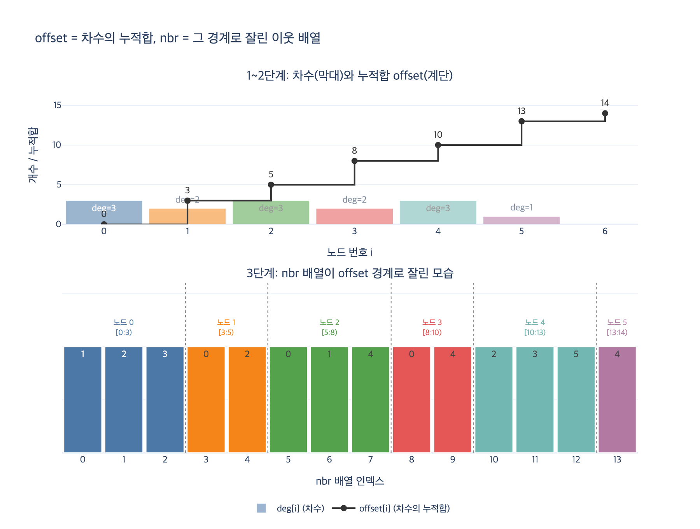

# `build_csr()`은 오프셋 배열을 어떻게 만드는가?

> **정답**: 먼저 각 노드의 차수를 세고, `offset[i+1] = offset[i] + deg[i]`로 누적합을 계산한다. 즉 오프셋은 차수의 누적합이다.

## 한 줄 핵심

CSR의 오프셋 배열은 **차수 배열의 누적합(prefix sum, cumulative sum)** 이다. 차수를 세는 순간 각 노드가 이웃 배열에서 몇 칸을 차지할지 정해지고, 그 칸 수를 앞에서부터 쌓아 올린 값이 곧 「이 노드의 이웃이 시작하는 위치」다.

## 세 줄짜리 코드가 하는 일

8장 예제 1의 `build_csr()`에서 오프셋을 만드는 부분만 떼면 이렇다.

```python
deg = [0] * n
for a, b in edges:              # 1) 차수 세기
    deg[a] += 1
    deg[b] += 1

offset = array("i", [0] * (n + 1))
for i in range(n):              # 2) 누적합
    offset[i + 1] = offset[i] + deg[i]
```

### 1단계 — 차수 세기

엣지 목록을 한 번 훑으면서 양쪽 끝의 카운터를 올린다. 무향 그래프이므로 엣지 하나가 두 노드의 차수를 각각 1씩 올린다. 그래서 `sum(deg) == 2 * len(edges)`가 된다(악수 보조정리).

### 2단계 — 누적합

정의부터 보면 이렇다.

$$\text{offset}[i] = \sum_{k < i} \deg[k], \qquad \text{offset}[0] = 0$$

이 값을 노드마다 다시 더하면 $O(n^2)$이다. 대신 **바로 앞 값에 자기 차수만 얹는** 점화식으로 굴리면 한 번의 루프, $O(n)$으로 끝난다.

$$\text{offset}[i+1] = \text{offset}[i] + \deg[i]$$

작은 예(노드 6개, 엣지 7개, `deg = [3, 2, 3, 2, 3, 1]`)로 따라가면

| 계산 | 결과 |
|---|---|
| `offset[0]` | `0` (시작은 항상 0) |
| `offset[1] = 0 + 3` | `3` |
| `offset[2] = 3 + 2` | `5` |
| `offset[3] = 5 + 3` | `8` |
| `offset[4] = 8 + 2` | `10` |
| `offset[5] = 10 + 3` | `13` |
| `offset[6] = 13 + 1` | `14` |

→ `offset = [0, 3, 5, 8, 10, 13, 14]`

## 왜 길이가 `n + 1`인가

`offset[i]`는 노드 $i$ 구간의 **시작**이고, 노드 $i$ 구간의 **끝**은 `offset[i+1]`이다. 즉 이웃 조회는 두 값을 짝으로 읽는다.

```python
neighbors(u) == nbr[offset[u] : offset[u + 1]]
```

마지막 노드 $n-1$도 끝 경계가 필요하므로 칸이 하나 더 있어야 한다. 그래서 배열 길이는 $n+1$이고, 마지막 값 `offset[n]`은 **전체 이웃 배열의 길이**, 즉 $2E$가 된다. 예제에서 `nbr = array("i", [0] * offset[n])`으로 이웃 배열 크기를 잡는 데 이 값이 바로 쓰인다.

## 오프셋이 있으면 차수 배열은 버려도 된다

누적합의 역연산이 차분이므로 차수는 뺄셈 한 번으로 복원된다.

$$\deg[i] = \text{offset}[i+1] - \text{offset}[i]$$

CSR이 「정수 배열 두 개가 전부」인 이유가 여기 있다. 차수를 따로 저장할 필요가 없다. 오프셋 하나가 **경계와 차수를 동시에** 들고 있는 셈이다.

## 3단계 — 커서로 이웃 채우기

오프셋이 완성되면 이웃 배열을 채운다. 이때 **오프셋을 복사해서 쓰기 커서로 쓴다.**

```python
cursor = list(offset[:n])            # ← 복사가 핵심
nbr = array("i", [0] * offset[n])
for a, b in edges:
    nbr[cursor[a]] = b; cursor[a] += 1
    nbr[cursor[b]] = a; cursor[b] += 1
```

각 노드의 커서는 자기 구간 시작점에서 출발해 한 칸씩 전진한다. 엣지 목록을 **딱 한 번** 훑으면서 각 이웃이 제자리에 꽂힌다. 채우기가 끝나면 `cursor[i] == offset[i+1]`이 되는데, 커서가 자기 구간을 정확히 꽉 채웠다는 검증으로도 쓸 수 있다.

### 흔한 버그: `offset`을 직접 커서로 쓰기

`list(...)`로 복사하지 않고 `offset` 자체를 밀면, 채우기가 끝난 뒤 `offset[i]`에는 시작점이 아니라 **끝 경계**가 들어 있다. 오프셋 배열 전체가 한 칸 왼쪽으로 밀린 모양이 되고, 이후 모든 이웃 조회가 조용히 엉뚱한 구간을 읽는다. 예제 코드에서 위 예를 그대로 돌려 보면 `[0, 3, 5, 8, 10, 13, 14]`가 `[3, 5, 8, 10, 13, 14, 14]`로 바뀌어, `이웃(0)`이 `[1, 2, 3]`이 아니라 `[0, 2]`로 나온다.

(다르게 하는 방법도 있다. 커서를 따로 두지 않고 `offset`을 밀어 쓴 뒤, 마지막에 배열을 오른쪽으로 한 칸 시프트하고 `offset[0] = 0`을 넣어 복구하는 구현도 널리 쓰인다. 어느 쪽이든 **밀린 오프셋을 되돌려야 한다**는 사실 자체를 잊지 않는 게 요점이다.)

## 전체 비용

| 단계 | 훑는 대상 | 비용 |
|---|---|---|
| 차수 세기 | 엣지 목록 1회 | $O(E)$ |
| 누적합 | 노드 배열 1회 | $O(n)$ |
| 이웃 채우기 | 엣지 목록 1회 | $O(E)$ |

합쳐서 $O(n + E)$. 정렬도 해시도 필요 없다. 엣지 목록을 두 번 훑는 것으로 끝난다. 이 「세어서 누적합 내고 제자리에 꽂는」 패턴 자체가 계수 정렬(counting sort)과 같은 구조이며, 버킷 경계를 미리 확정해 두는 곳이면 어디서나 되풀이해 나타난다.

## 이게 왜 중요한가

- **연속성**: 노드 $u$의 이웃이 `nbr` 안에서 물리적으로 붙어 있다. 순회할 때 캐시 한 줄(64바이트)에 4바이트 정수 16개가 함께 올라온다. 8장이 말하는 「CSR이 빠른 이유는 알고리즘이 아니라 메모리를 읽는 방식」이 이 배치에서 나온다.
- **조밀함**: 파이썬 객체 헤더도, 포인터도, 딕셔너리 해시 테이블의 빈 슬롯도 없다. 예제 1에서 같은 그래프가 `dict of list` 대비 훨씬 작게 담기는 이유다.
- **대가**: 대신 엣지 추가·삭제가 비싸다. 노드 하나에 이웃을 끼워 넣으려면 뒤쪽 오프셋이 전부 밀리기 때문에, CSR은 보통 **한 번 만들어 읽기만 하는** 정적 스냅숏에 쓴다.

## 시각화


