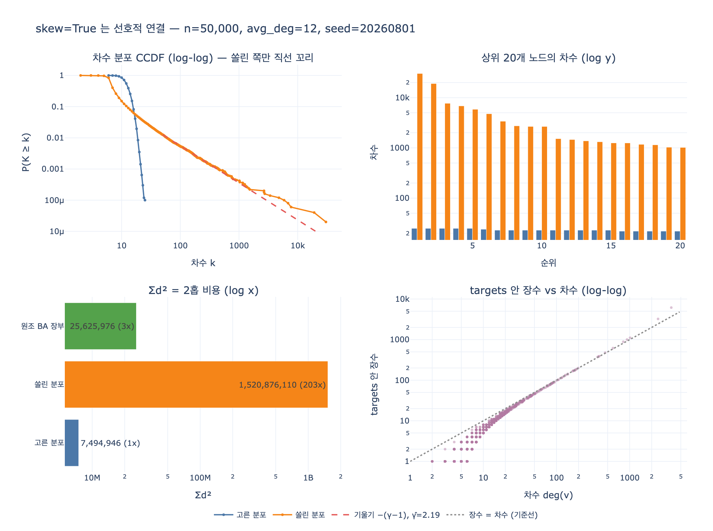

# `graphgen.py`의 `skew=True`는 어떤 방식으로 쏠린 그래프를 만드는가?

> **정답**: 선호적 연결(preferential attachment)이다. `targets` 리스트에 이미 등장한 노드를 반복 추가해, 차수가 높은 노드가 더 많이 선택되게 한다.

## 한 줄 핵심

`random.choice`는 **균등 추출**이다. 균등 추출로 편향된 결과를 얻는 방법은 하나뿐이다 — **통 속에 같은 이름을 여러 장 넣는 것**. `graphgen.py`는 딱 그걸 한다. 노드가 엣지 하나를 얻을 때마다 그 노드의 이름표를 `targets`에 한 장 더 넣는다. 그래서 「차수 비례 확률」이라는 계산을 어디에도 쓰지 않고, `append` 한 줄로 부익부를 만들어 낸다.

## 코드가 하는 일

```python
targets = [0, 1, 2]
for a in range(3, n):
    for _ in range(avg_deg // 2):          # m = 6번 던진다
        b = rnd.choice(targets)            # ← 통에서 한 장 뽑기
        if a != b:
            edges.add((min(a, b), max(a, b)))
            targets.append(b)              # ← 뽑힌 놈을 한 장 더 넣는다  (핵심)
    targets.append(a)                      # ← 새 노드도 통에 등록 (딱 한 장)
```

`skew=False` 분기와 비교하면 차이는 **한 줄**이다.

| | `skew=False` | `skew=True` |
|---|---|---|
| 이웃 고르기 | `rnd.randrange(n)` | `rnd.choice(targets)` |
| 각 노드의 확률 | 모두 $1/n$ | 통 안 장수에 비례 |
| 통 갱신 | 없음 | `targets.append(b)` |
| 결과 분포 | 이항 ≈ 포아송 (지수적으로 얇은 꼬리) | 멱법칙 (두꺼운 꼬리) |

## 왜 「반복 추가」가 곧 차수 비례 샘플링인가

노드 $v$가 통에 들어 있는 장수를 $\text{mult}(v)$라 하자. `random.choice`는 통의 한 칸을 균등하게 고르므로, 노드가 뽑힐 확률은 정확히

$$\Pi(v) \;=\; \frac{\text{mult}(v)}{|\texttt{targets}|}$$

이다. 그리고 코드를 보면 $\text{mult}(v)$가 어떻게 자라는지 알 수 있다.

$$\text{mult}(v) \;=\; \underbrace{1}_{\texttt{targets.append(a)} \text{ — 태어날 때 한 장}} \;+\; \underbrace{t(v)}_{\texttt{targets.append(b)} \text{ — 타깃으로 뽑힌 횟수}}$$

$t(v)$는 「$v$가 이웃으로 선택된 횟수」이고, 그게 바로 $v$가 얻은 엣지 수다. 즉

$$\Pi(v) \;\propto\; 1 + t(v) \;\approx\; \deg(v)$$

**뽑히면 차수가 오르고 → 차수가 오르면 통에 한 장 더 들어가고 → 그러면 더 뽑힌다.** 양성 피드백이다. 이걸 부익부(rich-get-richer), 마태 효과(Matthew effect), 또는 선호적 연결이라고 부른다.

수식 대신 통을 쓰는 게 왜 좋은가. 차수 비례 샘플링을 정직하게 구현하려면 매번 전체 차수 배열의 누적합을 만들고 이진 탐색을 해야 한다 — 뽑기 한 번에 $O(n)$ 또는 $O(\log n)$이다. 통 트릭은 **뽑기 $O(1)$, 갱신 $O(1)$**이다. 이 트릭이 BA 모형 구현의 사실상 표준이고, `networkx.barabasi_albert_graph`도 `repeated_nodes` 리스트로 같은 일을 한다.

### 실측 — 장수가 정말 차수를 따라가나

`n=5,000`으로 돌려 통을 열어 보면 이렇다.

| 노드 | 차수 | 통 안 장수 | 장수/차수 |
|---:|---:|---:|---:|
| 2 | 3,705 | 6,148 | 1.66 |
| 0 | 2,444 | 3,240 | 1.33 |
| 1 | 1,013 | 1,112 | 1.10 |
| 5 | 920 | 1,006 | 1.09 |
| 3 | 818 | 888 | 1.09 |
| 6 | 591 | 620 | 1.05 |
| … | | | |
| 151 | 3 | 1 | 0.33 |

허브는 장수 ≈ 차수다. 비율이 1을 살짝 넘는 이유는 `targets.append(b)`가 **중복 엣지에도** 실행되기 때문이다 — 같은 `a`가 같은 허브 `b`를 두 번 뽑으면 `edges` 집합에서는 하나로 접히지만 통에는 두 장 들어간다. 그래서 초거대 허브는 실제 차수보다 통에서 더 큰 지분을 갖는다(더 센 부익부).

반대로 한 번도 안 뽑힌 노드는 영원히 **1장**이다. 5,000장이 아니라 35,000장짜리 통에서 1장이면 사실상 보이지 않는다. 이게 「멱법칙 꼬리 + 두꺼운 몸통」의 두 얼굴이다.

## Barabási–Albert 모형과의 관계

선호적 연결은 1999년 Barabási–Albert 논문(*Emergence of Scaling in Random Networks*)이 정식화했다. 두 재료뿐이다.

1. **성장(growth)** — 노드가 하나씩 추가된다. `for a in range(3, n)`
2. **선호적 연결(preferential attachment)** — 새 노드는 차수에 비례해 기존 노드를 고른다. `rnd.choice(targets)`

결과는 멱법칙 차수 분포다.

$$P(k) \;\sim\; k^{-\gamma}, \qquad \gamma_{\text{BA}} = 3$$

$\gamma = 3$은 성장과 선호적 연결 둘 다 있어야 나온다. 성장 없이 선호적 연결만 하면 승자독식으로 붕괴하고, 선호적 연결 없이 성장만 하면 지수 분포가 된다.

### 그런데 `graphgen`의 지수는 3이 아니다

힐(Hill) 최대우도 추정으로 꼬리를 재 보면 이렇다 (`n=50,000`, `avg_deg=12`).

| $k_{\min}$ | 꼬리 노드 | $\hat\gamma$ |
|---:|---:|---:|
| 20 | 2,214 | 2.32 |
| 50 | 628 | 2.19 |
| 100 | 266 | 2.11 |

**2.2 근처**다. 3보다 훨씬 두꺼운 꼬리다. 원인은 `targets.append(a)`의 **위치**다.

- 원조 BA는 엣지마다 **양쪽 끝**을 통에 넣는다. 통은 $2mN$장으로 자란다.
- `graphgen`은 새 노드를 안쪽 루프 **바깥에서 한 번만** 넣는다. 통은 $(m+1)N$장으로만 자란다. (실측: $|\texttt{targets}| = 7.00 \cdot n$, $m+1 = 7$)

통이 천천히 자라면 기존 허브의 지분이 덜 희석된다. 평균장(mean-field)으로 보면 허브의 장수는 $w \propto N^{\beta}$로 자라고,

$$\beta = \frac{m}{|\texttt{targets}|/N} = \frac{m}{m+1} = \frac{6}{7} \approx 0.86,
\qquad \gamma = 1 + \frac{1}{\beta} = 1 + \frac{7}{6} \approx 2.17$$

원조 BA는 $\beta = m/(2m) = 1/2$이므로 $\gamma = 3$이다. 예측 2.17, 측정 2.19 — 맞는다.

`append` 한 줄만 안쪽 루프로 옮겨 확인해 보면 이렇게 갈린다.

| 장부 방식 | $\lvert\texttt{targets}\rvert$ | 최대 차수 | $\sum d^2$ | $\hat\gamma$ ($k_{\min}=50$) |
|---|---:|---:|---:|---:|
| `graphgen` (루프 바깥 1회) | 349,982 = 7.00·n | **30,267** | 1,520,876,110 | **2.19** |
| 원조 BA (엣지마다 양끝) | 599,943 = 12.00·n | 1,694 | 25,625,976 | **2.95** |

같은 시드, 같은 $m$, 같은 $n$인데 최대 차수가 **18배**, $\sum d^2$가 **59배** 다르다. 통이 자라는 속도가 꼬리 두께를 정한다.

참고로 일반화된 결과(Dorogovtsev–Mendes–Samukhin)는 연결 커널이 $\Pi \propto k + a$일 때 $\gamma = 3 + a/m$이다. `graphgen`의 $+1$ 오프셋은 이 형태이지만, 여기서 지수를 2.2로 끌어내린 주범은 오프셋이 아니라 **분모(통의 크기)** 쪽이다.

$\gamma < 3$이면 차수의 **분산이 발산**한다($\int k^2 P(k)\,dk$가 안 수렴). $\gamma < 2$면 평균조차 발산한다. 즉 2.2라는 값은 「$\sum d^2$를 유한한 값으로 예측할 수 없다」는 뜻이고, 다음 절이 그 실물이다.

## 8장 본문과의 연결 — 이게 왜 중요한가

`ex3_degree_skew.py`가 이 두 분기를 나란히 세우는 이유는, 8.3절의 주장 「**노드 수는 성능을 설명하지 못한다. 차수의 제곱합이 설명한다**」를 보이기 위해서다.

| 그래프 | 노드 | 엣지 | 평균 차수 | 최대 차수 | 상위 10개 차수 합 | $\sum d^2$ (2홉 비용) |
|---|---:|---:|---:|---:|---:|---:|
| 고른 분포 | 50,000 | 299,958 | 12.00 | 25 | 241 | 7,494,946 |
| 쏠린 분포 | 50,000 | 280,374 | 11.21 | **30,267** | **86,040** | **1,520,876,110** |

- 노드 수 같음. 엣지 수도 비슷함. 평균 차수도 12 vs 11.2 — **거의 같다.**
- 최대 차수는 **1,211배**. $\sum d^2$는 **203배**. 8장이 말하는 「200배」가 이 숫자다.
- 1위 노드의 차수 30,267은 전체 노드의 **61%**와 연결됐다는 뜻이다. 이게 **슈퍼 노드**다.
- 상위 1% 노드(500개)가 전체 엣지의 **61.7%**에 걸쳐 있다. 고른 분포에서는 3.2%다.

2홉 탐색이 훑는 엣지 수는 $\sum_v \deg(v)^2$에 비례한다(노드 $v$를 거쳐 가는 경로가 $\deg(v)^2$개니까). 평균은 이 값을 못 잡아낸다. 제곱합은 **가장 큰 항 하나**가 지배하기 때문이다 — 여기서는 $30{,}267^2 \approx 9.2 \times 10^8$ 한 항이 전체 $1.52 \times 10^9$의 **60%**다. 노드 하나가 전체 비용의 절반을 넘게 먹는다.

그래서 8.3절이 내놓는 대처법도 「평균을 낮춰라」가 아니라 「**꼬리를 잘라라**」다 — 슈퍼 노드를 질의에서 피하고, 차수 상한을 두고 쪼개고, 2홉을 미리 계산한다.

## 왜 하필 이 모형인가

`skew=True`가 인위적인 극단이 아니라는 게 요점이다. 선호적 연결은 **실제 그래프가 자라는 방식**의 가장 단순한 모형이다.

- 웹 링크 — 이미 많이 링크된 페이지에 링크가 더 붙는다
- 소셜 팔로우 — 팔로워 많은 계정이 더 노출되고 더 팔로우된다
- 인용 — 많이 인용된 논문을 더 인용한다 (Price 1976, 「누적 이득」)
- 상품/태그 — 인기 태그에 더 붙는다

그래서 실무 그래프의 차수 분포는 대개 고른 분포보다 쏠린 분포에 가깝다. 「우리 그래프 평균 차수 12개니까 괜찮겠지」라는 추정이 프로덕션에서 무너지는 이유가 여기 있다. 평균을 보고 용량을 잡으면, 실제 비용을 정하는 꼬리를 아예 못 본 것이다.

## 곁가지 두 개

**1. 왜 쏠린 쪽 평균 차수가 12를 못 채우나 (11.21)**

`if a != b`가 자기 루프를 버리고, `edges`가 `set`이라 중복 엣지가 접힌다. 통이 허브로 뒤덮일수록 「같은 허브를 두 번 뽑기」와 「자기 자신 뽑기」가 잦아져 버려지는 뽑기가 늘어난다. 목표 평균 12에 대해 실측 11.21 — 6.6% 손실이다. `skew=False` 쪽은 통이 균등해서 충돌이 거의 없고 12.00을 그대로 채운다.

**2. 초반 몇 노드의 운이 결과를 정한다**

`n=12`로 통을 찍어 보면 이렇다.

```
a= 3 뽑은 것=[2,2,2,2,1,1]  len= 10  targets=[0, 1, 2, 2, 2, 2, 2, 1, 1, 3]
a= 4 뽑은 것=[2,2,2,2,0,3]  len= 17
a= 5 뽑은 것=[2,2,2,0,2,2]  len= 24
a= 6 뽑은 것=[5,2,2,3,2,2]  len= 31
```

노드 2가 `a=3`에서 우연히 4번 뽑히자, 통에 2가 5장 쌓였다. 그 다음부터는 뽑힐 때마다 지분이 더 커진다. `n=50,000`까지 가면 노드 2가 최종 1위(차수 30,267)다. 초기 조건의 미세한 차이가 최종 순위를 정하는 것 — 선호적 연결 모형의 유명한 성질이고, 「선점 효과(first-mover advantage)」라고도 부른다. 시드 `20260801`이 고정돼 있으니 이 결과는 항상 재현된다.

## 정리

| 질문 | 답 |
|---|---|
| 방식의 이름 | 선호적 연결 (preferential attachment), Barabási–Albert 계열 |
| 구현 트릭 | `targets` 리스트에 등장한 노드를 **반복 추가** → 중복 장수가 확률 가중치 |
| 왜 되나 | `random.choice`는 균등이지만 $\Pi(v) = \text{mult}(v)/\lvert\texttt{targets}\rvert \propto 1 + t(v) \approx \deg(v)$ |
| 비용 | 뽑기 $O(1)$, 갱신 $O(1)$ — 누적합 + 이진 탐색이 필요 없다 |
| 결과 | 멱법칙 $P(k) \sim k^{-\gamma}$, 측정 $\hat\gamma \approx 2.2$ (교과서 BA는 3) |
| 3이 아닌 이유 | `targets.append(a)`가 루프 바깥 → 통이 $(m{+}1)N$장으로만 자라 부익부가 더 세다 |
| 8장에서의 역할 | 평균 차수는 같은데 $\sum d^2$가 **203배** → 슈퍼 노드, 2홉 폭발의 실물 예시 |

## 참고

- Barabási & Albert, *Emergence of Scaling in Random Networks*, Science 286 (1999) — <https://arxiv.org/abs/cond-mat/9910332>
- Barabási, *Network Science*, Chapter 5: The Barabási–Albert Model — <http://networksciencebook.com/chapter/5>
- Dorogovtsev, Mendes & Samukhin, *Structure of Growing Networks with Preferential Linking* (1999) — 연결 커널 $\Pi \propto k + a$와 $\gamma = 3 + a/m$
- `networkx.barabasi_albert_graph` 구현 — 같은 `repeated_nodes` 통 트릭을 쓴다: <https://networkx.org/documentation/stable/reference/generated/networkx.generators.random_graphs.barabasi_albert_graph.html>
- 8장 예제 `code/graphgen.py`, `code/ex3_degree_skew.py`

## 시각화


