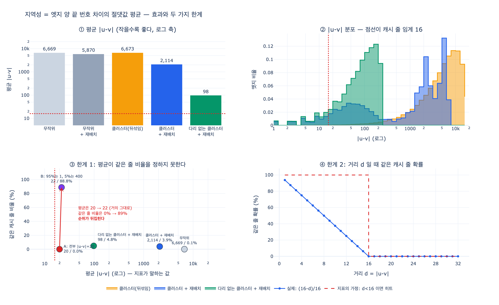

# 지역성(locality)은 어떻게 측정하는가 — 엣지 양 끝 번호 차이의 평균

> **Q.** 8장에서 지역성(locality)은 어떻게 측정하는가?
> **A.** 엣지 양 끝 노드 번호 차이의 절댓값 평균이다. 작을수록 한 번 읽어 온 캐시 줄을 여러 번 쓴다.

## 한 줄로

$$L(G) \;=\; \frac{1}{|E|} \sum_{(u,v)\in E} \bigl| u - v \bigr|$$

엣지를 한 번 훑으면서 양 끝 노드 **번호**의 차이를 절댓값으로 더하고 엣지 개수로 나눈다. 끝이다. 지표 하나에 $O(|E|)$ 시간, $O(1)$ 메모리. **작을수록 좋다.**

---

## 원본 코드

`content/ch08/code/ex4_relabel.py`

```python
def locality(edges):
    """엣지 양 끝 번호 차이의 평균. 작을수록 좋다."""
    return sum(abs(a - b) for a, b in edges) / len(edges)
```

같은 파일 docstring이 이 지표를 왜 쓰는지 한 줄로 밝혀 둔다.

> 지역성(locality)을 «이웃 번호 차이의 평균»으로 잰다. 이 값이 작을수록 한 번 읽어 온 캐시 줄을 여러 번 쓴다.

---

## 왜 하필 「번호 차이」인가

지표가 **번호**를 보는 이유는 CSR 때문이다. 8.2절에서 본 CSR은 이웃을 4바이트 정수 배열 `nbr`에 **번호 순서대로 연속으로** 깔아 둔다. 노드 번호가 곧 **메모리 주소의 대리자**다.

여기에 하드웨어 사실 하나가 붙는다. CPU는 메모리를 바이트 단위로 읽지 않고 **캐시 줄(cache line) 단위**로 읽는다. 요즘 x86·ARM 모두 64바이트다.

$$\frac{64\ \text{byte / line}}{4\ \text{byte / int}} = 16\ \text{개}$$

즉 정수 하나를 달라고 해도 **16개가 한꺼번에** 올라온다. 그래서 임계값이 **16**이다. `ex4_relabel.py` 마지막이 이 숫자를 그대로 쓴다.

```python
# 4바이트 정수, 캐시 한 줄 64바이트 = 16개가 한 번에 온다
print(f"\n캐시 한 줄(64바이트)에 4바이트 정수 16개가 들어온다.\n"
      f"이웃 번호가 평균 {after:,.0f} 만큼 떨어져 있으면 "
      f"{'같은 줄에 들어올 확률이 있다' if after < 16 else '거의 매번 새 줄을 가져온다'}.\n")
```

- 엣지 $(u,v)$를 따라가면 $u$ 근처를 읽다가 $v$ 근처로 점프한다.
- $|u-v|$가 작으면 그 점프가 **이미 캐시에 올라온 줄 안**에서 끝난다.
- $|u-v|$가 크면 새 줄을 가져와야 한다. 캐시 미스다. 최악에는 페이지 폴트고, 그때는 100배 넘게 느려진다.

그래서 지역성은 「이웃이 번호상 얼마나 붙어 있나」로 환원된다. 그리고 그걸 재는 제일 싼 방법이 평균 $|u-v|$다.

---

## 핵심: 이건 그래프의 성질이 아니라 「번호 매김」의 성질이다

이 점을 놓치면 지표를 오해한다. 노드에 번호를 다시 매기면 **구조는 하나도 안 바뀌는데** 값이 바뀐다.

```
엣지 (0,1) (1,2) (2,3) (0,5) (3,4)        →  평균 |u-v| = 1.80
노드 i를 perm[i]=[3,0,5,1,4,2] 로 다시 매김
엣지 (3,0) (0,5) (5,1) (3,2) (1,4)        →  평균 |u-v| = 3.20
```

차수 분포, 연결 구조, 엣지 개수, 지름, 클러스터링 계수 — 전부 그대로다. 오직 **라벨**만 바뀌었다. 그래서 지역성은 「이 그래프가 좋은가」가 아니라 **「이 적재 순서가 좋은가」**를 재는 지표다.

이게 곧 처방이 된다. 구조를 못 바꾸니 **번호를 바꾼다**. 그것이 **그래프 재배치(graph reordering)**다.

---

## 실측 — 노드 2만, 평균 차수 12

`expy.py`가 8장의 `make()`, `clustered()`, `bfs_order()`를 그대로 써서 재 본 값이다.

| 그래프 | 엣지 | 평균 | 중앙값 | p90 | p99 | 최대 | `\|u-v\| < 16` | 같은 캐시 줄 |
|---|---|---|---|---|---|---|---|---|
| 무작위 | 119,964 | 6,668.6 | 5,863 | 13,707 | 17,987 | 19,958 | 0.1% | 0.1% |
| 무작위 + 재배치 | 119,964 | 5,869.7 | 5,311 | 11,843 | 14,181 | 14,304 | 0.2% | 0.1% |
| 클러스터(번호 뒤섞임) | 117,953 | 6,672.9 | 5,856 | 13,704 | 18,024 | 19,947 | 0.2% | 0.1% |
| 클러스터 + 재배치 | 117,953 | **2,114.0** | 1,579 | 5,828 | 6,442 | 6,525 | 7.4% | 3.9% |
| 다리 없는 클러스터 + 재배치 | 117,553 | **98.1** | 89 | 197 | 236 | 250 | 9.7% | 4.8% |

읽는 법.

1. **무작위 그래프는 재배치해도 1.1배뿐이다.** 원래 구조가 없으니 모아 놓을 것도 없다. 8장이 「무작위 그래프에서는 재배치 효과가 크지 않다」고 못 박은 이유다.
2. **커뮤니티가 뚜렷한 그래프는 3.2배 좋아진다.** BFS로 만난 순서대로 번호를 매기면 같은 커뮤니티 노드들이 번호상 뭉친다. 소셜·웹·도로망이 이쪽이고, 그래서 대용량 그래프 처리 도구들이 적재 시점에 재배치를 먼저 한다.
3. 마지막 줄이 이 카드에서 제일 중요하다. **커뮤니티를 잇는 「다리」 400개만 빼면 같은 재배치가 98.1까지 내려간다. 68배다.** 커뮤니티 크기가 $20{,}000/60 \approx 333$이니 그 안에 갇힌 값이다.

전체 엣지의 **0.34%**(400 / 117,953)가 평균을 98에서 2,114로, 즉 **21배** 밀어 올렸다. 이 사실이 바로 첫 번째 한계다.

---

## 한계 1 — 평균이라서 꼬리를 못 잡는다

### 증거 A: 다리 400개

| | 평균 | 같은 캐시 줄 비율 |
|---|---|---|
| 클러스터 + 재배치 | 2,114.0 | 3.9% |
| 다리 없는 클러스터 + 재배치 | 98.1 | 4.8% |

평균은 **21.5배** 차이 난다. 캐시가 실제로 신경 쓰는 「같은 줄 비율」은 3.9% 대 4.8%, **1.2배**다. 지표가 차이를 20배쯤 **과장**했다.

당연하다. 다리 엣지는 $|u-v|$가 수천이라 합에 어마어마하게 기여하지만, 실제로는 그냥 **캐시 미스 400번**이다. 평균은 「미스 횟수」가 아니라 「미스의 거리」를 세고 있고, 캐시는 거리를 신경 쓰지 않는다. **한 줄 밖은 다 똑같이 밖이다.**

### 증거 B: 순위가 아예 뒤집힌다

엣지 2만 개짜리 두 그래프를 손으로 짓는다.

- **A**: 모든 엣지가 $|u-v| = 20$. 고르게 조금씩 멀다.
- **B**: 엣지 95%가 $|u-v| = 1$, 5%가 $|u-v| = 400$. 대부분 붙어 있고 소수가 아주 멀다.

$$L_A = 20, \qquad L_B \approx 0.95 \times 1 + 0.05 \times 400 = 20.95$$

| | 평균 | 중앙값 | p99 | 같은 캐시 줄 비율 |
|---|---|---|---|---|
| A: 전부 `\|u-v\| = 20` | 20.00 | 20.0 | 20 | **0.0%** |
| B: 95%는 1, 5%는 400 | 21.97 | 1.0 | 400 | **88.8%** |

지표는 「B가 A보다 조금 나쁘다」고 말한다. 캐시는 「B가 A보다 압도적으로 좋다」고 말한다. A는 모든 엣지가 20 떨어져 있어 같은 줄에 들어오는 경우가 **아예 없고**, B는 열 중 아홉이 같은 줄이다. 평균 하나로 순위를 매기면 **틀린 답**이 나온다.

### 왜 이렇게 되나

평균은 분포의 **모양을 지운다.** 특히 $|u-v|$의 분포는 실제 그래프에서 거의 항상 **꼬리가 두껍다**(대부분 짧고 소수가 아주 길다). 평균은 그 소수에 끌려간다. 그런데 캐시 히트/미스는 **엣지 개수**로 세는 세계다. 척도가 다르다.

정리하면 **평균 $|u-v|$는 「거리의 크기」를 재는데, 우리가 알고 싶은 건 「가까운 엣지의 개수」다.**

### 보완

세 가지를 같이 보면 된다. 셋 다 엣지 한 번 훑기로 구할 수 있어서 비용도 안 늘어난다.

- **중앙값과 p90/p99** — 꼬리를 분리해 본다.
- **`|u-v| < 16` 비율** — 캐시 줄에 함께 들어올 「자격」이 있는 엣지 비율.
- **같은 캐시 줄 비율** `u // 16 == v // 16` — 실제로 함께 들어오는 엣지 비율. 이게 가장 정직하다.

절단 평균(trimmed mean)도 방법이지만, 위 실측에서 상위 1%를 잘라 낸 효과는 1.4~2.1%뿐이었다. 꼬리는 상위 1%보다 **더 얇고 더 멀리** 있다. 꼬리를 잡으려면 평균을 손보지 말고 지표를 **개수 기반**으로 바꾸는 게 맞다.

---

## 한계 2 — 절댓값은 캐시 줄 경계와 무관하다

이 지표는 「$|u-v|$가 작으면 같은 줄」이라고 은근히 가정한다. 그런데 캐시 줄은 **정렬된 경계**로 잘려 있다. 정수 16개마다 새 줄이 시작된다. 노드 번호 $u$가 들어가는 줄은

$$\text{line}(u) = \left\lfloor \frac{u}{16} \right\rfloor$$

이다. $|u-v|$는 **상대 거리**이고 캐시 줄은 **절대 위치**로 잘린다. 둘은 아예 다른 정보다.

```
( 16,  17)  |u-v| =  1  줄 1 / 1  같은 줄
( 15,  16)  |u-v| =  1  줄 0 / 1  줄 갈림 ← 지표는 구분 못 함
(  0,  15)  |u-v| = 15  줄 0 / 0  같은 줄
(  0,  16)  |u-v| = 16  줄 0 / 1  줄 갈림 ← 지표는 구분 못 함
(100, 101)  |u-v| =  1  줄 6 / 6  같은 줄
(111, 112)  |u-v| =  1  줄 6 / 7  줄 갈림 ← 지표는 구분 못 함
```

$|u-v|=1$인 쌍이 한쪽은 같은 줄, 한쪽은 갈렸다. $|u-v|=15$는 같은 줄인데 $|u-v|=16$은 갈렸다. 절댓값만 보는 지표는 이 차이를 **전혀** 못 본다.

$u$가 균일하다고 보면 거리 $d$인 엣지가 같은 줄에 들어올 확률은 정확히

$$P(\text{same line} \mid d) \;=\; \max\!\left(0,\; \frac{16 - d}{16}\right)$$

다. `expy.py`의 몬테카를로가 이 식을 확인한다 (20만 회, 시드 고정).

| $d$ | 1 | 2 | 4 | 8 | 12 | 15 | 16 | 20 | 32 |
|---|---|---|---|---|---|---|---|---|---|
| 이론 $(16-d)/16$ | 93.75% | 87.50% | 75.00% | 50.00% | 25.00% | 6.25% | 0% | 0% | 0% |
| 실측 | 93.73% | 87.44% | 75.12% | 50.19% | 25.12% | 6.23% | 0% | 0% | 0% |

여기서 실무적으로 중요한 결론이 둘 나온다.

1. **16 아래에서도 히트율은 선형으로 떨어진다.** 「$d < 16$이면 히트」가 아니다. $d=8$이면 반타작이다. 위 실측 표에서 `클러스터 + 재배치`의 `|u-v|<16` 비율이 7.4%인데 같은 줄 비율이 3.9%였던 것이 이 때문이다. 대략 $7.4\% \times 0.5 \approx 3.7\%$로 계산이 맞아떨어진다.
2. **16 이상에서는 전부 똑같이 0이다.** 평균이 100이든 2,000이든 6,000이든 같은 줄 확률은 **동일하게 0**이다. 그래서 「6,669 → 2,114로 3.2배 개선」이라는 문장은 캐시 히트 관점에서 거의 의미가 없다. 3.2배 개선은 **다음 단계**(TLB, 페이지 캐시, 프리페처)에서 의미가 있을 수 있지만 L1 캐시 줄 재사용에는 아니다.

덧붙여, 이 지표는 4바이트 정수와 64바이트 줄을 **암묵적으로** 가정한다. 노드 ID가 8바이트면 줄당 8개라 임계값이 16이 아니라 **8**이고, 페이지(4KB) 단위로 보면 1,024다. 「16」은 상수가 아니라 **가정**이다.

---

## 그런데도 이 지표를 쓰는 이유

한계를 둘 짚었지만 8장이 이 지표를 고른 건 게으름이 아니다.

- **싸다.** 엣지 한 번 훑기, 의존성 없음, 한 줄. 캐시 시뮬레이터도 `perf` 카운터도 필요 없다.
- **방향이 맞다.** 값이 줄면 지역성이 좋아진 것이 맞다. 부호를 틀리지 않는다.
- **비교 목적에 충분하다.** 재배치 **전후 배수**를 보는 용도로는 잘 작동한다. 8장이 「측정값은 기계마다 다릅니다. **배수**만 보세요」라고 미리 못 박은 것과 같은 태도다.
- **고전과 이어진다.** 희소 행렬 쪽에서 $\max |u-v|$를 **대역폭(bandwidth)**이라 부르고, 이걸 줄이는 것이 RCM(Reverse Cuthill–McKee) 같은 재정렬 알고리즘의 목표다. 평균 $|u-v|$는 그 **평균 버전**이다. 새로 만든 지표가 아니라 계보가 있다.

쓰지 말아야 할 방식은 하나다. **절대 수치를 캐시 미스율로 읽는 것.** 「평균 2,114니까 미스율 얼마」는 나오지 않는다.

---

## 실무에서

- 재배치 방법은 여러 가지다. 8장이 쓴 **BFS 순서**가 가장 싸고, 그 밖에 차수 정렬, RCM, Gorder, Rabbit Order 같은 것들이 있다. 8장 키워드 표가 그래프 재배치를 **[실험]** 라벨로 둔 이유가 여기 있다. 어느 방법이 언제 이기는지가 아직 정리되지 않았다.
- 재배치는 **적재 시점**에 하는 것이 정석이다. 이미 서비스 중인 그래프의 노드 번호를 바꾸면 외부 ID 매핑을 전부 갱신해야 한다.
- 재배치에도 **비용**이 있다. BFS 한 번 + 엣지 전체 다시 쓰기다. 질의를 여러 번 돌릴 그래프에만 값어치가 있다.
- 개선 배수를 보고할 때는 평균과 함께 **같은 캐시 줄 비율**을 붙이자. 평균만 보고하면 위에서 본 「21배 개선(사실은 1.2배)」 같은 보고서가 나온다.

---

## 외워야 할 것

1. 지역성 $= \dfrac{1}{|E|}\sum_{(u,v)\in E}|u-v|$. **엣지 양 끝 노드 번호 차이의 절댓값 평균.** 작을수록 좋다.
2. 임계값은 **16**. 캐시 줄 64바이트 ÷ 4바이트 정수.
3. **번호 매김의 성질**이다. 구조를 안 건드리고 번호만 바꿔도 값이 바뀐다 → 그래프 재배치.
4. 무작위 그래프에서는 재배치해도 1.1배. **없는 구조는 못 살린다.**
5. **한계 1**: 평균이라 꼬리를 못 잡는다. 엣지 0.34%가 평균을 21배 움직이는데 같은 줄 비율은 1.2배만 변한다. 평균이 같아도 캐시 거동이 정반대일 수 있다.
6. **한계 2**: 절댓값은 캐시 줄 경계와 무관하다. 줄은 16 배수마다 정렬돼 잘리므로 $|u-v|=1$도 갈릴 수 있다. 실제 확률은 $\max(0,(16-d)/16)$이고, 16 이상은 전부 0이다.

---

## 시각화



- **①** 재배치 효과. 무작위는 그대로, 클러스터는 3.2배, 다리를 빼면 68배. 점선이 임계 16이고 어느 막대도 그 아래로 못 내려간다.
- **②** $|u-v|$ 분포. 뒤섞인 그래프(주황)는 전부 오른쪽 끝에 몰려 있다. 재배치하면(파랑) 왼쪽에 봉우리가 생기지만 오른쪽 봉우리가 그대로 남아 평균을 붙잡는다. 다리를 빼면(초록) 오른쪽 봉우리가 사라진다.
- **③** 가로축이 지표가 말하는 값(평균), 세로축이 캐시가 보는 값(같은 줄 비율)이다. 지표가 충실하다면 점들이 단조 감소 곡선에 놓여야 한다. 실제로는 2,114와 98이 가로로 21배 떨어져 있는데 세로로는 붙어 있고, A와 B는 가로로 붙어 있는데 세로로 89%p 벌어진다.
- **④** 거리 $d$일 때 같은 줄 확률. 파란 실선이 실제 $(16-d)/16$, 빨간 점선이 「$d<16$이면 히트」라는 지표의 가정이다. 두 선이 겹치지 않는 만큼이 한계 2다.
