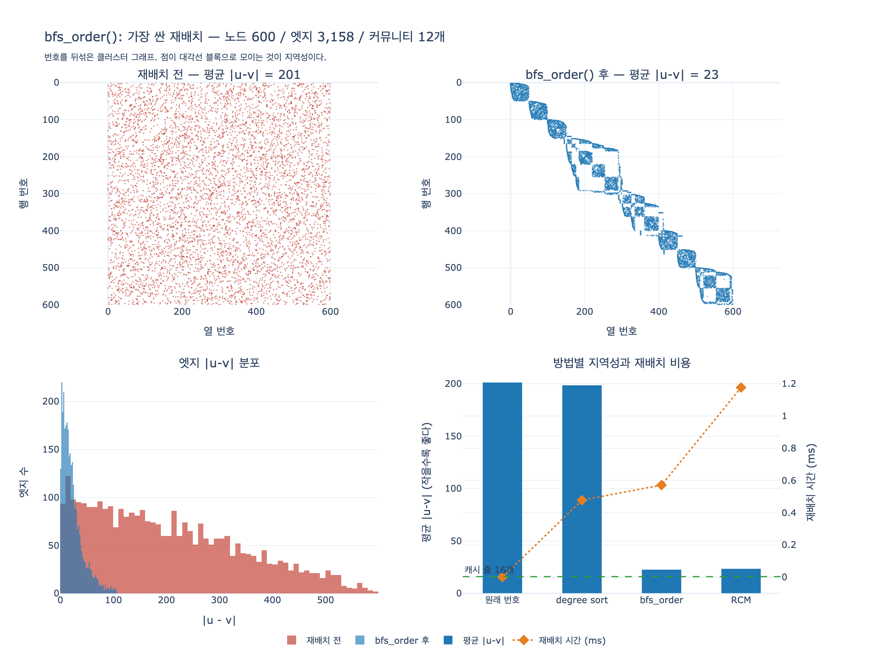

# `bfs_order()`는 어떤 재배치 방법인가?

> **정답**: BFS로 만난 순서대로 번호를 다시 매기는 가장 싼 재배치 방법이다. 연결 요소마다 새 seed에서 시작해 모든 노드를 덮는다.

## 한 줄 핵심

`bfs_order()`는 **BFS 한 번**이 전부인 재배치(reordering)다. 알고리즘이 영리해서가 아니라 **싸서** 쓸 만하다. 재배치는 「지역성을 얼마나 좋게 만드나」로만 평가할 수 없다. **재배치 자체의 비용을 순회 몇 번으로 갚는가**가 같이 걸려 있고, `bfs_order()`는 그 나눗셈에서 이기는 쪽에 서 있다.

## 코드는 이것뿐이다

8장 `ex4_relabel.py`의 원문이다.

```python
def bfs_order(edges, n):
    """BFS 로 만난 순서대로 번호를 다시 매긴다. 제일 싼 재배치 방법."""
    adj = defaultdict(list)
    for a, b in edges:
        adj[a].append(b); adj[b].append(a)
    new, cnt = {}, 0
    for seed in range(n):            # ← (A) 연결 요소마다 새 seed
        if seed in new:
            continue
        q = deque([seed]); new[seed] = cnt; cnt += 1
        while q:
            u = q.popleft()
            for v in adj[u]:
                if v not in new:     # ← (B) «처음 만났을 때» 번호를 준다
                    new[v] = cnt; cnt += 1
                    q.append(v)
    return new
```

반환값은 `{옛 번호: 새 번호}` 딕셔너리다. 그래프를 고치지 않고 **번호표만 바꿔 주는** 함수라는 점이 중요하다. 실제 재배치는 이 매핑을 CSR 빌드에 먹여서 일어난다.

비용은 인접 리스트 구축 + BFS 한 번, 즉 $O(V + E)$다. 그래프를 한 번 훑는 것과 같은 자릿수다. **이보다 싼 구조 인식 재배치는 사실상 없다.**

## 왜 BFS 순서가 지역성을 만드나

핵심은 (B) 줄이다. 번호를 **큐에서 꺼낼 때가 아니라 처음 발견할 때** 준다.

노드 `u`를 꺼내면, `u`의 아직 번호 없는 이웃들이 `cnt, cnt+1, cnt+2, ...`를 **연속으로** 받는다. 즉,

> 한 노드의 이웃 목록이 새 번호 공간에서 **연속 구간**이 된다.

그리고 BFS는 폭 우선이라 한 커뮤니티를 대체로 다 훑고 나서 다음으로 넘어간다. 그래서 커뮤니티 하나가 번호 구간 하나를 차지한다. 인접 행렬로 그리면 점들이 **대각선 근처 블록**으로 모인다 (아래 시각화의 오른쪽 위 그림).

이게 CSR에서 왜 이득인가는 8.2절의 논리 그대로다. 지역성 지표를

$$
\text{locality}(G) \;=\; \frac{1}{|E|}\sum_{(u,v)\in E}\bigl|\,u - v\,\bigr|
$$

로 정의하면, 4바이트 정수 배열과 64바이트 캐시 줄에서

$$
\frac{64\ \text{B}}{4\ \text{B}} = 16\ \text{개}
$$

가 한 번에 올라온다. $\overline{|u-v|}$가 이 16에 가까울수록 한 번 가져온 줄을 여러 번 쓴다.

## (A) seed 루프 — 없으면 함수가 깨진다

`for seed in range(n)`은 장식이 아니다. BFS를 **한 번만** 돌리면 시작 노드가 속한 연결 요소만 번호를 받는다. 나머지는 매핑에 아예 없어서, `mapping[a]`가 `KeyError`로 터진다. 지역성이 나빠지는 게 아니라 **재배치가 성립하지 않는다**.

seed 루프가 있으면:

- 요소를 다 훑고 큐가 마르면, 아직 번호 없는 다음 노드에서 새로 시작한다
- 차수 0인 고립 노드도 자기 자신을 seed로 삼아 번호를 받는다
- 결과 매핑은 항상 **$0..n-1$의 완전한 순열**이다 — 이게 「모든 노드를 덮는다」의 뜻이다

`expy.py` 5절에서 연결 요소 3개 + 고립 노드 2개짜리 그래프로 확인한다. seed 루프 있는 버전은 90/90개, 없는 버전은 30/90개만 번호를 받는다.

실무에서 이게 중요한 이유: **실제 그래프는 거의 항상 연결되어 있지 않다.** 거대 연결 요소(giant component) 하나에 자잘한 조각 수천 개가 흩어져 있는 모양이 보통이다. 「어차피 연결이겠지」로 짠 재배치는 적재 중에 터진다.

## 실측 — 8장이 잰 숫자

`ex4_relabel.py`를 노드 30,000개로 돌린 값이다 (`평균 |u-v|`, 작을수록 좋음).

| 그래프 | 전 | 후 | 개선 |
|---|---:|---:|---:|
| 무작위 그래프 | 10,009 | 8,823 | **1.1배** |
| 커뮤니티 있는 그래프 | 10,003 | 2,893 | **3.5배** |

읽어야 할 건 3.5배가 아니라 **두 줄의 대비**다.

> **재배치는 없던 구조를 만들어 내지 못한다. 원래 있던 구조를 번호로 드러낼 뿐이다.**

무작위 그래프에는 드러낼 구조가 없으니 1.1배에서 멈춘다. 그런데 소셜·웹·도로망 같은 실제 그래프는 커뮤니티가 뚜렷하다. 그래서 대용량 그래프 도구들이 **적재할 때 재배치를 먼저** 한다.

### 3.5배가 왜 더 크지 않은가 — `bfs_order()`의 진짜 한계

이 부분이 「가장 싼 방법」의 대가다. 커뮤니티 60개 × 500명이면, 재배치가 완벽할 때 기대값은 블록 내부 평균인 $500/3 \approx 167$이다. 그런데 실측은 2,893 — **이상적인 값의 17배**다.

원인은 `clustered()`가 넣어 둔 **커뮤니티 사이 다리(bridge)** 600개다. BFS 프런티어가 다리를 타고 옆 커뮤니티로 새어 나가서, 여러 커뮤니티를 섞어 훑는다. 실제로 다리를 제거하고 다시 재면 이렇게 된다.

| 그래프 | 전 | 후 | 개선 |
|---|---:|---:|---:|
| 커뮤니티 + 다리 600개 | 10,003 | 2,893 | 3.5배 |
| 커뮤니티만 (다리 제거) | 10,003 | **147** | **67.9배** |

67.9배. 이상적 기대값 167보다도 좋다. 즉 **`bfs_order()`는 커뮤니티 경계를 인식하지 못한다**. 다리 하나에 프런티어가 끌려간다.

여기서 더 비싼 방법들이 존재하는 이유가 나온다. Rabbit Order가 「커뮤니티를 먼저 검출한 뒤」 번호를 매기고, Gorder가 「윈도우 안 공유 이웃 수를 최대화하며」 탐욕적으로 고르는 건 정확히 이 누수를 막기 위한 것이다. 그리고 그만큼 비싸다.

## 재배치 스펙트럼에서 `bfs_order()`의 위치

싼 쪽에서 비싼 쪽으로 늘어놓으면 이렇다.

| 방법 | 하는 일 | 비용 | 지역성 | 구조를 보나 |
|---|---|---|---|---|
| **degree sort** (DegSort) | 차수 내림차순 정렬 | $O(V \log V)$ | 약함 | 차수만 (연결은 안 봄) |
| **`bfs_order()`** | **BFS 발견 순서** | **$O(V+E)$, 순회 1회** | **중간** | **본다 (경계는 못 봄)** |
| **RCM** (Reverse Cuthill-McKee) | 주변 노드에서 BFS + 레벨마다 차수 정렬 + 역순 | $O(V+E)$ 급, 상수가 큼 | 대역폭에 강함 | 본다 |
| **Rabbit Order** | 계층적 커뮤니티 검출 후 재귀 배치, 병렬 | 훨씬 비쌈 | 강함 | 커뮤니티까지 |
| **Gorder** | 슬라이딩 윈도우 안 공유 이웃 최대화 (탐욕) | 매우 비쌈 | 가장 강함 | 이웃 중복까지 |
| **Recursive Bisection** (BP) | 재귀 이분할로 압축률 최적화 | 비쌈 (병렬화 설계) | 압축에 최강 | 전역 |

두 가지가 눈에 걸려야 한다.

**첫째, RCM은 `bfs_order()`의 확장판이다.** Cuthill-McKee는 「주변부(peripheral) 노드에서 시작하는 BFS + 각 레벨의 이웃을 차수 오름차순으로 정렬」이고, RCM은 그 결과를 뒤집는다. 즉 `bfs_order()`는 **RCM에서 두 가지 정제(시작점 선택, 레벨 내 차수 정렬)를 뺀 골격**이다. 그래서 「BFS 순서」가 재배치 논의의 기준선(baseline)으로 계속 나온다.

**둘째, degree sort가 더 싸다고 더 좋은 게 아니다.** `expy.py`의 노드 600개 실측에서 degree sort는 재배치 비용을 냈는데 지역성은 201.4 → 198.7로 사실상 그대로였다. 차수만 보고 연결을 안 보니 당연하다. `bfs_order()`가 특별한 건 **싼 것과 효과 있는 것의 교집합**에 있다는 점이다.

## 그런데 비용을 갚는가 — 이 카드의 진짜 쟁점

8장이 「그래프 재배치」의 출처로 든 [arXiv 1602.08820](https://arxiv.org/abs/1602.08820)은 Dhulipala 등의 *Compressing Graphs and Indexes with Recursive Graph Bisection* (KDD 2016)이다. 재귀 이분할로 압축률을 크게 올리면서, 동시에 **수십억 노드에서 돌아갈 만큼 병렬·분산으로 짜는 데** 논문의 상당 부분을 쓴다. 좋은 재배치를 아는 것과 그걸 실제 규모에서 감당하는 것이 별개 문제라는 뜻이다.

이 관측을 정면으로 다룬 후속 연구들의 결론은 일관된다.

- **재배치는 순회 비용과 싸우는 게 아니라 재배치 비용과 싸운다.** RCM, Gorder, Rabbit Order 같은 전처리는 지역성을 확실히 올리지만, **순회 한 번의 실행 시간보다 자릿수로 비싸다.**
- 따라서 **그래프를 몇 번 훑는지**가 손익을 정한다. 한 번만 훑는 경우는 최악의 시나리오이고, 이때는 사실상 **모든 재배치 기법이 순손실**이다.
- 반대로 같은 그래프를 반복해서 훑는다면(PageRank 반복, 여러 질의, GNN 학습 에폭) 비용이 분할 상환되어 갚아진다.

`expy.py` 6절이 이 나눗셈을 직접 잰다 (노드 600, 재배치 비용을 「BFS 순회 몇 번분」으로 환산).

| 방법 | 평균 \|u-v\| | 개선 | 재배치 시간 | 순회 몇 번분 |
|---|---:|---:|---:|---:|
| 원래 번호 | 201.4 | 1.0x | — | — |
| degree sort | 198.7 | 1.0x | 0.48 ms | 1.3회 |
| **`bfs_order`** | **22.9** | **8.8x** | **0.57 ms** | **1.6회** |
| RCM | 23.6 | 8.5x | 1.18 ms | 3.3회 |

파이썬 장난감 규모라 절대값은 의미가 없다. 봐야 할 건 **오른쪽 두 열이 왼쪽 두 열과 함께 읽혀야 한다**는 구조다. 이 규모에서 RCM은 2배 이상 비싼데 지역성은 되레 살짝 뒤진다. 큰 실제 그래프에서는 RCM이 앞서지만, 그 격차를 갚을 만큼 순회를 반복해야 한다.

그래서 `bfs_order()`가 실무에서 자주 이기는 이유는 이렇게 요약된다.

> **지역성이 최고여서가 아니라, 싸서 금방 갚기 때문이다.**

관련 후속 문헌:

- Balaji & Lucia, [*When is Graph Reordering an Optimization?*](https://brandonlucia.com/pubs/iiswc18-lws.pdf) (IISWC 2018) — 경량 재배치의 손익분기점을 입력 그래프의 구조적 성질과 연결한다
- Faldu, Diamond, Grot, [*A Closer Look at Lightweight Graph Reordering*](https://arxiv.org/pdf/2001.08448) (IISWC 2019) — DBG 제안, 경량 기법들의 재검토
- Arai 등, *Rabbit Order: Just-in-Time Parallel Reordering for Fast Graph Analysis* (IPDPS 2016) — 「높은 지역성」과 「빠른 재배치」를 동시에 노려 **종단 간(end-to-end) 시간**을 줄이겠다는 문제 설정 자체가 이 카드의 논점이다
- Wei 등, *Speedup Graph Processing by Graph Ordering* (Gorder, SIGMOD 2016)
- [*Amortized Cost in Graph Reordering: Why BFS Ordering Deserves More Attention*](https://dl.acm.org/doi/10.1145/3733723.3733730) (SSDBM 2025) — 제목이 이 카드의 답이다

## 자주 틀리는 지점

**「평균 |u-v|가 16 미만이어야 이득」이 아니다.** 실측 2,893은 16보다 훨씬 크지만 그래도 3.5배 이득이다. 평균은 꼬리에 끌려가는 지표라서 그렇다. 노드 30,000 커뮤니티 그래프에서 재배치 후 분포를 보면 중앙값은 1,810, 그리고 엣지의 **43.7%가 $|u-v| < 1024$** 안에 들어온다. 4KB 페이지에 4바이트 정수 1,024개가 들어가니, 캐시 줄 수준이 아니라 **페이지·TLB 수준에서** 이미 이득이 나고 있다. 지역성은 「된다/안 된다」가 아니라 계층마다 정도가 다른 문제다.

**재배치는 그래프를 바꾸지 않는다.** 노드도 엣지도 그대로고 번호만 바뀐다. 그래서 재배치 후 결과는 원래 번호로 되돌릴 수 있어야 한다(역매핑 보관). 외부에 노출되는 ID를 재배치된 내부 인덱스와 섞으면 7장이 경고한 종류의 사고가 난다.

**적재 시점에 하는 일이다.** `bfs_order()`가 싸다고 질의마다 부르는 게 아니다. CSR을 빌드할 때 한 번 매핑을 적용해 이웃 배열을 물리적으로 재배치하는 것이고, 이후 모든 순회가 그 배치를 공유한다. 재배치의 이득은 「여러 번 훑는다」는 전제에서만 존재한다.

## 요약

- `bfs_order()` = **BFS 발견 순서로 재번호**. BFS 한 번, $O(V+E)$. 재배치 스펙트럼의 가장 싼 쪽 끝
- 노드를 **처음 발견할 때** 번호를 주기 때문에 한 노드의 이웃이 연속 구간이 된다 → 인접 행렬이 대각선 블록으로 모인다
- `for seed in range(n)` 루프가 **연결 요소마다 새 seed**를 잡아 고립 노드까지 덮는다. 매핑은 항상 $0..n-1$의 완전한 순열
- 구조가 있는 그래프에서만 통한다 (커뮤니티 3.5배 vs 무작위 1.1배). 커뮤니티 **경계는 인식하지 못해서** 다리를 타고 새어 나간다 (다리 제거 시 67.9배)
- 더 비싼 대안(RCM → Rabbit Order → Gorder)은 지역성이 더 좋지만, **재배치 비용을 순회 반복으로 갚아야** 한다. 한 번만 훑을 그래프라면 어떤 재배치도 손해다

## 시각화



왼쪽 위가 재배치 전, 오른쪽 위가 `bfs_order()` 후의 인접 행렬 스파이 플롯이다. 같은 그래프인데 점이 균일한 안개에서 **대각선 블록**으로 바뀐다. 블록 하나가 커뮤니티 하나이고, 이 블록이 곧 CSR에서 연속으로 읽히는 구간이다. 블록 사이를 잇는 흐릿한 선들이 위에서 말한 「다리」이고, 저것이 지역성을 깎는 몫이다.

아래 왼쪽은 $|u-v|$ 분포다. 재배치 후(파란색) 질량이 0 근처로 쏠린다. 아래 오른쪽은 방법별 지역성(막대, 낮을수록 좋음)과 재배치 시간(주황 마름모)을 겹쳐 놓은 것 — 이 두 축을 **함께** 보는 것이 이 카드의 요점이다.
