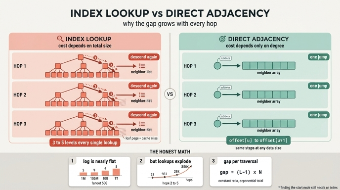

# 색인 방식과 직접 방식의 확장성 차이

> **질문** 색인 방식과 직접 방식의 확장성 차이는 무엇인가?
>
> **답** 색인 방식은 데이터가 늘면 탐색 깊이가 로그로 늘어나고, 직접 방식은 노드에서 이웃 목록으로 바로 가므로 전체 크기와 무관하다.

이 카드는 8장 4절 「인덱스 없는 인접성」과 `ex5_index_free.py`에 대응합니다.

---

## 1. 두 방식이 「이웃 찾기」를 하는 절차

같은 질문 — **노드 `u`의 이웃은 누구인가** — 을 두 방식이 어떻게 처리하는지 봅니다.

### 색인 방식 (관계형 조인)

엣지는 `edges(src, dst)` 테이블에 들어 있고, `src`에 B-트리 색인이 걸려 있습니다.

```
1. 루트 페이지를 읽는다        → u가 들어갈 자식을 고른다
2. 내부 페이지를 읽는다        → 다시 자식을 고른다
3. ... (색인 깊이만큼 반복)
4. 리프에 도착 → src = u 인 구간을 순차 스캔
```

찾는 데 드는 비교/페이지 접근은 **전체 엣지 수 `m`의 함수**입니다. `m`이 늘면 트리가 깊어지고, 절차가 한 단계 늘어납니다.

`ex5_index_free.py`가 흉내 내는 방식이 이것입니다. 정렬된 배열 + `bisect_left`, 즉 팬아웃 2인 B-트리(= 이진 탐색)입니다.

```python
def neighbors_via_index(rows, keys, u):
    i = bisect_left(keys, u)        # ← 여기가 log 시간
    out = []
    while i < len(keys) and keys[i] == u:
        out.append(rows[i][1]); i += 1
    return out
```

### 직접 방식 (인덱스 없는 인접성)

노드 레코드가 **이웃 목록의 주소를 직접 들고** 있습니다.

```
1. u의 레코드 주소를 계산한다   → 이웃 목록으로 점프
2. 끝.
```

찾는 절차가 없습니다. 주소 계산 한 번입니다. CSR로 쓰면 이렇게 됩니다.

```python
for i in range(offset[u], offset[u + 1]):   # 탐색 없음. 구간을 그냥 읽는다
    v = nbr[i]
```

Neo4j 같은 그래프 DB는 같은 원리를 **고정 크기 레코드**로 구현합니다. 노드 ID `u`의 레코드는 `파일_시작 + u × 레코드_크기`에 있다고 약속해 두면, 탐색이 아니라 곱셈 한 번으로 위치가 나옵니다. 이게 「index-free adjacency」라는 말의 실체입니다.

---

## 2. 정직하게: $O(\log m)$ 대 $O(1)$은 실제로 얼마나 다른가

여기서 많은 설명이 과장을 합니다. 「로그 대 상수니까 엄청난 차이」라고요. **한 번의 조회만 놓고 보면 그렇지 않습니다.**

B-트리의 깊이는 팬아웃 $B$에 대해

$$L = \lceil \log_B m \rceil$$

입니다. 그리고 실제 B-트리의 팬아웃은 아주 큽니다. 8KB 페이지에 (키 8B + 포인터 8B) = 16B 엔트리를 채우면 $B \approx 500$입니다.

| 엣지 수 $m$ | $\log_2 m$ (이진 탐색) | $L$ ($B{=}100$) | $L$ ($B{=}500$) |
|---:|---:|---:|---:|
| $10^6$ | 19.9 | 3 | 3 |
| $10^8$ | 26.6 | 4 | 3 |
| $10^{10}$ | 33.2 | 5 | 4 |
| $10^{12}$ | 39.9 | 6 | 5 |

**엣지가 100만에서 1조로 100만 배 늘어나는 동안 깊이는 3에서 5로 늘었습니다.** 게다가 상위 레벨은 버퍼 풀에 상주하니까, 실제로 디스크를 때리는 건 보통 리프 한 장입니다.

즉 **$O(\log m)$은 현실에서 사실상 「상수 3~4단계」**입니다. 카드의 답 문장 — 「로그로 늘어난다」 — 는 맞지만, 그 로그가 폭발적으로 자라는 건 아닙니다. 8장 본문도 이렇게 톤을 잡습니다: 「로그지만 늘긴 는다.」 *늘긴* 는다, 정도입니다.

`ex5_index_free.py`의 실측이 이걸 그대로 보여 줍니다.

```
노드   10,000  색인 방식    2.91us  직접 방식    0.14us  이론 색인 깊이 16.9
노드  100,000  색인 방식    5.37us  직접 방식    0.29us  이론 색인 깊이 20.2
```

읽는 법:

- 데이터가 10배 늘 때 **이론 깊이는 16.9 → 20.2, 겨우 1.2배**입니다. 로그의 정직한 모습입니다.
- 그런데 색인 방식의 **실측 시간은 1.85배** 늘었습니다. 깊이보다 더 늘었죠. 깊이 때문이 아니라 **탐색 경로가 캐시에서 벗어나기 시작해서**입니다. 이진 탐색의 첫 몇 번 점프는 배열 전체를 가로지르므로, 배열이 커지면 그 점프마다 새 캐시 줄을 가져옵니다.
- 직접 방식도 0.14 → 0.29us로 늘었습니다. **직접 방식이 마법이 아니라는 증거**입니다. 파이썬 dict의 랜덤 접근 역시 데이터가 커지면 캐시 미스가 늡니다.
- 배수는 20.8배 → 18.5배로 **거의 그대로**입니다. 이 예제 규모에서 벌어지는 격차는 «점근적»이 아니라 **상수 배수**입니다.

그러니 정직한 요약은 이렇습니다.

> 조회 **한 번**의 차이는 점근이 아니라 상수 배수다. 대략 색인 깊이 $L$배, 즉 한 자릿수 배수다.

---

## 3. 그런데 왜 홉이 깊어지면 격차가 벌어지는가

여기가 핵심입니다. 상수 배수인데 왜 문제가 되느냐. **그 상수가 곱해지는 대상이 지수로 자라기** 때문입니다.

### 비용 모델

기호를 정합니다.

- $n$ = 노드 수, $m$ = 엣지 수, $d$ = 평균 차수, $k$ = 홉 수
- $L = \lceil \log_B m \rceil$ = 색인 깊이
- $R_i$ = $i$홉에서 새로 만나는 노드 수, $N_k = \sum_{i=0}^{k-1} R_i$ = **이웃 조회 횟수**
- $M_k = \sum_{i=0}^{k-1} R_i \cdot d$ = 훑는 엣지 총수
- $\alpha$ = 조회 1단계 비용(포인터 추적/페이지 접근), $\beta$ = 엣지 1개 읽는 비용

두 방식의 비용은 이렇게 갈립니다.

$$T_{\text{색인}}(k) = \underbrace{\alpha L}_{\text{시작 노드}} + \alpha L \cdot N_k + \beta M_k$$

$$T_{\text{직접}}(k) = \underbrace{\alpha L}_{\text{시작 노드}} + \alpha \cdot N_k + \beta M_k$$

**차이는 딱 한 항입니다.**

$$\Delta(k) = T_{\text{색인}} - T_{\text{직접}} = \alpha (L - 1) \cdot N_k$$

$\beta M_k$ 항은 **양쪽이 똑같이** 냅니다. 이웃 목록을 실제로 읽는 일은 어느 쪽도 피할 수 없으니까요. 시작 노드를 찾는 $\alpha L$도 양쪽이 똑같이 냅니다 — 8장이 강조하는 「시작 노드를 찾는 데는 여전히 색인이 필요하다」가 이 항입니다.

### 그래서 격차가 벌어지는 이유

$N_k$가 홉 수에 대해 지수로 자랍니다.

$$N_k \approx \frac{d^k - 1}{d - 1}$$

$\Delta(k) = \alpha(L-1) \cdot N_k$ 이므로, **절대 격차도 $d^k$로 자랍니다.** 배수는 그대로인데 절대량이 폭발합니다.

$d = 30$, $L = 3$일 때 추가로 타야 하는 색인 단계 수:

| 홉 $k$ | 이웃 조회 $N_k$ | 낭비되는 색인 단계 $(L{-}1)N_k$ |
|---:|---:|---:|
| 1 | 1 | 2 |
| 2 | 31 | 62 |
| 3 | 931 | 1,862 |
| 4 | 27,931 | 55,862 |
| 5 | 837,931 | **1,675,862** |

1홉에서는 색인 단계 2번 더 타는 게 전부입니다. 아무도 신경 안 씁니다. 5홉에서는 **순전히 「찾는 데만」 167만 번의 페이지 접근**을 더 합니다. 캐시 미스 하나를 100ns로 잡으면 0.17초, 디스크를 때리면 100µs × 167만 = **167초**입니다.

이것이 8장 요약의 「**인덱스 없는 인접성은 두 번째 홉부터 이득**」입니다. 1홉짜리 질의라면 시작 노드 색인을 어차피 타니까 이득이 없습니다. 2홉부터 $N_k$가 $d$배씩 불어나고, 거기에 $(L-1)$이 곱해집니다.

### 격차를 더 벌리는 두 번째 항: $\alpha$가 상수가 아니다

$\alpha$를 상수로 놓은 게 위 모델의 거짓말입니다. 실제로는

$$\alpha_{\text{실효}} = h \cdot \alpha_{\text{캐시}} + (1 - h) \cdot \alpha_{\text{미스}}$$

이고, $h$는 색인 경로가 캐시/버퍼 풀에 상주할 확률입니다. $\alpha_{\text{미스}} / \alpha_{\text{캐시}}$는 메모리에서 ~100배, 디스크로 내려가면 ~10,000배입니다.

데이터가 커지면 무슨 일이 생기냐면 — **리프 레벨부터 $h$가 떨어집니다.** 상위 3단계는 계속 캐시에 남아 있는데 리프는 안 남습니다. 색인 방식은 조회마다 이 리프 미스를 냅니다. 즉 데이터가 늘 때 색인 방식이 비싸지는 진짜 이유는 「깊이가 3에서 4로 늘었다」가 아니라 **「단계당 비용이 계단식으로 뛰었다」**입니다. 위 실측에서 이론 깊이 1.2배 대비 실측 1.85배였던 게 이 현상입니다.

$$\Delta(k) = \alpha_{\text{실효}}(m) \cdot (L(m) - 1) \cdot N_k(d, k)$$

세 항 모두 나쁜 방향으로 움직입니다. $L$은 로그로 천천히, $\alpha_{\text{실효}}$는 캐시 경계에서 계단으로, $N_k$는 홉에 대해 지수로.

### 격차를 더 벌리는 세 번째 항: 중복 제거

모델에서 빼먹은 게 하나 더 있습니다. $k$홉 탐색은 「이미 본 노드」를 걸러야 합니다.

- **직접 방식**: 비트맵/`bytearray` 한 칸을 찍습니다. 조회당 $O(1)$. `ex2_csr_walk.py`의 `seen = bytearray(n)`이 이겁니다.
- **재귀 조인**: 매 레벨마다 커지는 중간 결과에 `DISTINCT`를 걸어야 합니다. 정렬/해시 비용 $O(N_k \log N_k)$가 붙고, 중간 결과가 메모리를 넘으면 디스크로 스필합니다.

8장이 「그래프 DB가 조인보다 빠른 이유의 나머지 절반은 3장에서 본 «중간 결과가 안 곱해진다»」라고 한 게 이 항입니다. 이 카드가 다루는 건 **절반**이라는 걸 기억하세요.

---

## 4. 반대로, 격차가 사라지는 경우

정직하려면 이쪽도 봐야 합니다. $\Delta$가 의미 없어지는 상황들입니다.

**(a) 차수가 아주 큰 노드 하나를 읽을 때.** 슈퍼 노드처럼 $d$가 10만인 노드라면, 비용은 $\beta d$가 지배합니다. $\alpha(L-1) = \alpha \cdot 2$는 노이즈입니다. 색인은 **한 번 내려간 다음 리프 구간을 순차 스캔**하니까, 「깊이 3」은 10만 개 읽는 비용 앞에서 사라집니다.

$$\frac{T_{\text{색인}}}{T_{\text{직접}}} = \frac{\alpha L + \beta d}{\alpha + \beta d} \xrightarrow{\ d \to \infty\ } 1$$

즉 **인덱스 없는 인접성의 이득은 「작은 조회를 아주 많이」 하는 패턴에서 나옵니다.** 희소 그래프의 깊은 탐색이 정확히 그 패턴이고, 「큰 덩어리 한 번 읽기」는 아닙니다.

**(b) 홉이 1일 때.** 위에서 봤습니다. 시작 노드 색인은 양쪽이 다 냅니다.

**(c) 인터프리터 오버헤드가 지배할 때.** `ex2_csr_walk.py`의 결론과 같습니다. 파이썬에서는 바이트코드 디스패치 비용이 $\alpha$보다 커서 차이가 묻힙니다. C/Rust로 옮기면 드러납니다.

**(d) 직접 방식도 랜덤 접근은 그대로 낸다.** 인덱스 없는 인접성이 없애는 건 **찾는 비용**이지 **랜덤 접근 비용**이 아닙니다. `nbr[i]`가 가리키는 이웃 노드 `v`의 레코드는 여전히 메모리 어딘가 무작위 위치입니다. 그래서 8장 2절(연속 배치)과 4절 예제 `ex4_relabel.py`(번호 재배치)가 필요합니다 — 그건 $\alpha_{\text{미스}}$를 공격하는 별개의 무기입니다.

---

## 5. 한 줄로 정리하면

| | 색인 방식 | 직접 방식 |
|---|---|---|
| 이웃 1회 조회 | $O(\log_B m)$ — 실제로 3~5단계 | $O(1)$ — 주소 계산 1회 |
| 데이터가 10배 늘면 | 깊이 +1단계 정도, 캐시 히트율은 계단식 하락 | 조회 절차는 **변화 없음** |
| $k$홉 탐색 낭비분 | $\alpha(L-1)\cdot N_k$, $N_k \approx d^k$ | 0 |
| 이득이 시작되는 지점 | — | **2홉부터** |
| 여전히 색인이 필요한 곳 | — | **시작 노드 찾기** |
| 이득이 사라지는 곳 | — | 슈퍼 노드 하나 읽기, 1홉 질의 |

**외울 문장.** 색인 방식의 조회 비용은 *그래프 전체 크기*의 함수이고, 직접 방식의 조회 비용은 *찾는 노드의 차수*만의 함수다. 전자는 데이터가 늘면 (천천히) 비싸지고 후자는 그대로다. 한 번 조회로는 상수 배수 차이지만, 그 상수가 $d^k$번 곱해지는 순간 절대 격차는 지수로 벌어진다.

---

## 6. 자주 하는 오해

**「$O(1)$이니까 데이터가 아무리 커져도 같은 시간」** — 아닙니다. $O(1)$인 것은 **조회 횟수**이고, **시간**은 아닙니다. 레코드가 캐시/페이지 캐시에 있는지에 따라 100배가 갈립니다. 8장 2·3절이 그 이야기입니다.

**「그래프 DB에는 색인이 없다」** — 아닙니다. 「인덱스 없는 인접성」은 **관계 추적에 색인을 쓰지 않는다**는 뜻입니다. `MATCH (p:Person {email: "..."})` 처럼 속성으로 시작 노드를 찾는 일에는 색인이 반드시 필요하고, 없으면 전체 스캔입니다. 8장 본문의 마지막 경고가 이거입니다: 「이 점을 자주 잊는다.」

**「로그니까 데이터가 커지면 망한다」** — 과장입니다. 팬아웃 500이면 1조 엣지에서도 5단계입니다. 색인 방식이 무너지는 이유는 깊이가 아니라 **깊은 홉에서 그 조회를 $d^k$번 반복**하기 때문이고, 거기에 **중간 결과 폭발**이 겹치기 때문입니다.

---

## 인포그래픽


