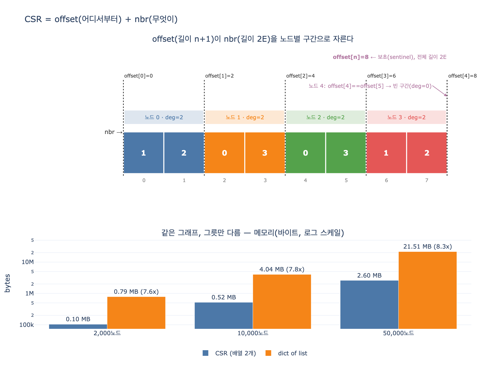

# CSR을 이루는 두 배열 — 오프셋 배열과 이웃 배열

> **Q.** CSR은 어떤 두 개의 배열로 구성되는가?
> **A.** 오프셋 배열(노드별 이웃 시작 위치, 길이 n+1)과 이웃 배열(모든 이웃을 연속으로 나열)이다.

## 한 줄로

CSR(압축 희소 행 형식, Compressed Sparse Row)은 **인접 리스트를 정수 배열 두 개로 납작하게 눕힌 것**이다. 「어디서부터」를 담는 배열 하나(`offset`)와 「무엇이」를 담는 배열 하나(`nbr`), 그게 전부다. 객체도 포인터도 없다.

---

## 배열 두 개의 정체

### 1. 오프셋 배열 `offset` — 길이 `n + 1`

노드 `u`의 이웃이 `nbr` 배열의 **몇 번째 칸에서 시작하는지**를 담는다. 「이 노드의 이웃은 여기서부터」라는 목차다.

- 항상 `offset[0] == 0`으로 시작한다.
- 마지막 칸 `offset[n]`은 전체 이웃 개수(무향이면 `2E`)와 같다.
- 값이 **단조 증가**한다(같을 수는 있다 — 차수 0인 고립 노드).

### 2. 이웃 배열 `nbr` — 길이 `2E` (무향) 또는 `E` (유향)

모든 노드의 이웃 목록을 **노드 번호 순서대로 이어 붙인** 하나의 긴 배열이다. 구분자도 없고 빈 칸도 없다. 어디서 끊어야 할지는 `offset`만 알고 있다.

```
그래프:  0—1, 0—2, 1—3, 2—3

offset = [ 0,   2,   4,   6,   8 ]      ← 길이 n+1 = 5
           │    │    │    │    └── 끝(= 2E = 8)
           │    │    │    └─────── 노드 3의 시작
           │    │    └──────────── 노드 2의 시작
           │    └───────────────── 노드 1의 시작
           └────────────────────── 노드 0의 시작

nbr    = [ 1, 2 | 0, 3 | 0, 3 | 1, 2 ]  ← 길이 2E = 8
           노드0   노드1   노드2   노드3
```

## 왜 하필 `n + 1`인가

이게 이 카드의 핵심 함정이다. 길이가 `n`이 아니라 `n + 1`인 이유는 **마지막 노드의 「끝」을 표현하기 위해서**다.

노드 `u`의 이웃 구간은 항상 이렇게 읽는다.

```python
nbr[offset[u] : offset[u + 1]]
```

즉 **한 노드의 끝은 다음 노드의 시작**이다. 이 규칙 하나로 배열 하나를 절약한다(시작 배열 + 끝 배열 = 2개 대신 1개). 그런데 마지막 노드 `n-1`에는 「다음 노드」가 없다. 그래서 보초(sentinel) 칸 하나를 더 두고, 거기에 전체 길이를 넣는다. 그게 `offset[n]`이다.

덤으로 얻는 것.

- **차수를 뺄셈 한 번으로 구한다:** `deg(u) = offset[u+1] - offset[u]`
- **전체 엣지 수도 즉시 나온다:** `offset[n]`
- 조건 분기(`if u == n-1`)가 코드에서 사라진다.

## 만드는 법 — 세 번 훑으면 끝난다 (O(n + E))

`content/ch08/code/ex1_three_forms.py`의 `build_csr()`가 정확히 이 세 단계다.

```python
def build_csr(edges, n):
    # 1) 차수 세기
    deg = [0] * n
    for a, b in edges:
        deg[a] += 1
        deg[b] += 1

    # 2) 누적합(prefix sum) → 오프셋 배열
    offset = array("i", [0] * (n + 1))
    for i in range(n):
        offset[i + 1] = offset[i] + deg[i]

    # 3) 커서를 들고 이웃 배열 채우기
    cursor = list(offset[:n])          # 각 노드의 쓰기 위치
    nbr = array("i", [0] * offset[n])
    for a, b in edges:
        nbr[cursor[a]] = b; cursor[a] += 1
        nbr[cursor[b]] = a; cursor[b] += 1
    return offset, nbr
```

기억할 순서: **차수 세기 → 누적합 → 커서로 채우기.** 2단계가 끝나면 각 노드가 쓸 자리가 이미 확정되므로, 3단계에서 리스트를 늘리는 일(realloc)이 한 번도 없다.

## 이 배치가 주는 이득

| 항목 | 값 |
|---|---|
| 메모리 | `4(n+1) + 4·2E` 바이트 (32비트 정수). 객체 헤더 0 |
| 이웃 조회 | 배열 인덱싱 2번 + 연속 구간 읽기 |
| 차수 조회 | 뺄셈 1번, O(1) |
| 순회 속도 | 이웃이 **연속**이라 캐시 한 줄(64B)에 4바이트 정수 **16개**가 함께 온다 |

같은 그래프(노드 20,000)에서 인접 리스트가 CSR보다 약 **8배** 큰 것도, 4.1GB와 380MB가 갈리는 것도 전부 이 차이에서 나온다. 그리고 8.2절의 요지 — CSR이 빠른 이유는 알고리즘이 아니라 **메모리를 읽는 방식** — 이 성립하는 이유가 `nbr`이 「하나의 연속 배열」이라는 사실 그 자체다.

## 대가

- **거의 불변(immutable)이다.** 엣지 하나를 노드 3의 이웃 목록에 끼우려면 그 뒤 전부를 한 칸씩 밀고, `offset`의 뒤쪽 값 전부에 +1을 해야 한다. 그래서 실무 패턴은 「인접 리스트로 쌓고, 분석 직전에 CSR로 굽는다」.
- **정렬은 공짜가 아니다.** 각 노드의 이웃 구간이 오름차순이라는 보장은 없다(위 `build_csr`은 엣지 입력 순서를 따른다). 이진 탐색으로 「u—v 엣지가 있나?」를 O(log deg) 에 답하고 싶으면 구간별로 정렬을 한 번 해 둬야 한다.
- **역방향은 별도다.** 유향 그래프에서 「나를 가리키는 노드」를 알려면 CSC(Compressed Sparse Column) 또는 전치 CSR을 **배열 한 쌍 더** 만들어야 한다.

## 자주 헷갈리는 것

- **「배열 두 개」는 구조에 한정한 이야기다.** 엣지에 가중치나 속성을 붙이면 `nbr`과 **같은 길이·같은 순서**의 세 번째 배열(`weight[i]`가 `nbr[i]`의 가중치)이 붙는다. SciPy `csr_matrix`가 `indptr`(=offset), `indices`(=nbr), `data`(=값) 세 개를 가지는 이유다. 즉 **위치 정보는 두 개, 값은 병렬 배열로 추가**.
- **용어 대응:** `offset` = `indptr` = row pointer = 오프셋 배열 / `nbr` = `indices` = column indices = 이웃 배열.
- **「압축」은 gzip이 아니다.** 0(없는 엣지)을 저장하지 않는다는 의미의 압축이다. 읽을 때 해동 단계가 없다.
- **오프셋 배열은 「노드 개수」가 아니라 「경계 개수」다.** 칸 `n`개를 나누는 벽은 `n+1`개다. 자로 눈금을 생각하면 쉽다.

## 1차 출처

- [SciPy `csr_matrix` 문서](https://docs.scipy.org/doc/scipy/reference/generated/scipy.sparse.csr_matrix.html) — `indptr` / `indices` / `data` [사실상 표준]
- [NetworkX convert 문서](https://networkx.org/documentation/stable/reference/convert.html) — 인접 행렬 / 인접 리스트 [사실상 표준]
- 이 장의 코드: `content/ch08/code/ex1_three_forms.py`(`build_csr`), `content/ch08/code/ex2_csr_walk.py`(`bfs_csr`)

## 시각화


