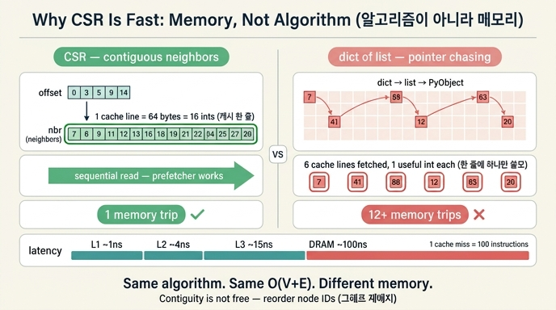

# CSR이 빠른 진짜 이유

**질문:** CSR이 빠른 진짜 이유는 무엇인가?

**답:** 알고리즘이 아니라 메모리를 읽는 방식이다. 이웃이 연속으로 놓이면 캐시 한 줄에 여러 개가 함께 온다.

---

## 1. 먼저 오해를 걷어내자

「CSR이 빠르다」는 말을 들으면 보통 이렇게 생각한다. *더 좋은 알고리즘이 들어 있겠지.* 아니다.

CSR로 BFS를 돌리는 코드와 `dict of list`로 BFS를 돌리는 코드는 **글자 그대로 같은 알고리즘**이다. 큐에서 노드를 꺼내고, 이웃을 훑고, 안 본 것만 넣는다. 방문 순서도 같고, 방문 노드 수도 같고, 훑는 엣지 수도 같다. 계산 복잡도는 양쪽 다 O(V + E)다.

```python
def bfs_csr(offset, nbr, start, n):
    ...
        for i in range(offset[u], offset[u + 1]):     # 연속 구간 그대로 읽기
            v = nbr[i]

def bfs_dict(adj, start):
    ...
        for v in adj.get(u, ()):                       # 객체를 따라 점프
```

차이는 주석 두 줄에 다 있다. **연속 구간을 그대로 읽는가**, **객체를 따라 점프하는가**. 복잡도 이론은 이 둘을 구분하지 못한다. 둘 다 「이웃 하나 읽기 = 1회 연산」으로 세니까. 그런데 실제 하드웨어에서 그 1회의 값이 100배 차이 난다.

## 2. CSR의 생김새 — 정수 배열 두 개

CSR(Compressed Sparse Row, 압축 희소 행 형식)은 그래프를 배열 두 개로 표현한다.

```python
def build_csr(edges, n):
    """오프셋 배열 + 이웃 배열. 정수 배열 두 개가 전부다."""
    deg = [0] * n
    for a, b in edges:
        deg[a] += 1; deg[b] += 1
    offset = array("i", [0] * (n + 1))
    for i in range(n):
        offset[i + 1] = offset[i] + deg[i]      # 차수 누적합
    cur = list(offset[:n])
    nbr = array("i", [0] * offset[n])
    for a, b in edges:
        nbr[cur[a]] = b; cur[a] += 1
        nbr[cur[b]] = a; cur[b] += 1
    return offset, nbr
```

- `offset` — 길이 N+1. 노드 `u`의 이웃이 `nbr` 배열의 어디서 시작하는지.
- `nbr` — 길이 2E. 모든 노드의 이웃을 **노드 번호 순으로 한 줄로 이어 붙인** 것.

노드 `u`의 이웃은 정확히 `nbr[offset[u] : offset[u+1]]`이다. 즉 **한 노드의 이웃 전체가 메모리에서 붙어 있는 한 덩어리**다. 이 문장이 이 카드의 전부다.

```
offset:  [0, 3, 5, 9, ...]
          │  │  │  └── 노드 2의 이웃은 nbr[5..9)
          │  │  └───── 노드 1의 이웃은 nbr[3..5)
          │  └──────── 노드 0의 이웃은 nbr[0..3)
nbr:     [7, 12, 41 | 3, 88 | 5, 6, 7, 20 | ...]
          └─ 노드0 ─┘ └노드1┘ └── 노드 2 ──┘
```

반면 `dict of list`는 딕셔너리 해시 버킷 → 리스트 객체 → 리스트의 포인터 배열 → 각 정수 객체(PyObject)로 **네 단계의 포인터 추적**이 일어난다. 각 단계가 메모리의 전혀 다른 곳을 가리킨다.

## 3. 진짜 이유: 캐시 줄(cache line)

CPU는 메모리에서 **바이트 하나를 가져오지 못한다**. 최소 단위가 **캐시 줄**이고, 오늘날 x86/ARM에서 보통 **64바이트**다. 4바이트 정수라면 한 번 다녀올 때 **16개가 공짜로 딸려 온다**.

```python
# 4바이트 정수, 캐시 한 줄 64바이트 = 16개가 한 번에 온다
```

이제 산수를 해 보자. 평균 차수 12인 그래프에서 노드 하나의 이웃을 다 읽으려면,

| 표현 | 이웃 12개를 읽을 때 | 메모리 왕복 |
|---|---|---|
| CSR (`nbr` 연속 48바이트) | 캐시 한 줄에 거의 다 들어온다 | **1회** (경계에 걸리면 2회) |
| dict of list | 정수 객체가 힙 곳곳에 흩어져 있다 | **12회 이상** (+ 리스트·dict 추적) |

여기에 계층별 지연 시간을 대입하면 왜 자릿수가 갈리는지 보인다.

| 저장소 | 대략 지연 | L1 대비 |
|---|---|---|
| L1 캐시 | ~1 ns | 1x |
| L2 캐시 | ~4 ns | 4x |
| L3 캐시 | ~15 ns | 15x |
| DRAM (캐시 미스) | ~80–100 ns | ~100x |

즉 **캐시 미스 한 번이 명령어 100개 값**이다. 그래프 순회는 계산이 거의 없고 「메모리에서 이웃 번호 읽기」가 일의 전부라, 성능이 곧 캐시 미스 수다. 이걸 메모리 병목(memory-bound) 워크로드라고 부른다.

여기에 두 가지 효과가 더 붙는다.

- **하드웨어 프리페처(prefetcher)** — CPU는 「연속된 주소를 순서대로 읽는다」는 패턴을 감지하면 요청 전에 미리 다음 줄을 끌어온다. CSR의 `for i in range(offset[u], offset[u+1])`은 프리페처가 가장 좋아하는 접근 패턴이다. 포인터 추적은 다음 주소가 현재 값을 읽어야만 정해지므로(포인터 체이싱) 프리페치가 원리적으로 불가능하고, 왕복 지연이 그대로 노출된다.
- **TLB와 페이지** — 흩어진 접근은 서로 다른 페이지를 건드려 TLB 미스도 늘린다. 배열 두 개는 몇 개의 큰 연속 영역에 머문다.

## 4. 그래서 「메모리도 적게 쓴다」가 따라온다

`ex1_three_forms.py`가 노드 20,000개·평균 차수 12로 세 표현을 재면 대략 이런 순서가 나온다.

| 표현 | 특징 |
|---|---|
| 인접 행렬(비트) | 노드 수의 **제곱**. 20,000노드면 엣지가 몇 개든 약 48MB. 수천 이하에서만 쓸 만하다. |
| 인접 리스트(dict of list) | 편하지만 무겁다. 원소마다 파이썬 객체 오버헤드가 붙는다. CSR의 8배 수준. |
| CSR(배열 2개) | 제일 조밀. `4*(N+1) + 4*2E` 바이트가 거의 전부. |

같은 그래프가 4.1GB와 380MB로 갈릴 수 있다는 이 장의 도입부 이야기가 이 표다. 그리고 **적게 쓰는 것 자체가 빠른 이유**이기도 하다. 데이터가 작으면 캐시에 더 많이 들어가고, 램에 들어가면 디스크를 안 탄다. 「메모리에 안 들어가면 속도 논쟁은 의미가 없다.」

## 5. 중요한 단서: 파이썬에서는 티가 잘 안 난다

`ex2_csr_walk.py`를 돌려 보면 CSR과 dict의 BFS 시간이 크게 다르지 않다. 이유는 명확하다.

> 파이썬에서는 차이가 크지 않다. **인터프리터 오버헤드가 지배**하기 때문이다.
> 같은 코드를 C나 Rust로 옮기면 CSR 쪽이 보통 **3~10배** 빨라진다.

파이썬은 `nbr[i]` 한 번에도 바이트코드 디스패치·정수 객체 생성 등 수십 ns를 쓴다. 캐시 미스 100ns가 그 잡음에 묻힌다. 캐시 지역성의 이득은 **연산 자체가 충분히 싸질 때** 드러난다. 그래서 실제 그래프 엔진(GraphBLAS, igraph, scipy.sparse, 그래프 DB의 저장 계층)이 전부 C/C++/Rust로 CSR류 배열을 쓴다.

파이썬에서 CSR을 쓸 이유는 그래도 남는다. **메모리**다.

## 6. 연속성은 저절로 생기지 않는다 — 재배치

CSR은 「한 노드의 이웃이 붙어 있다」를 보장한다. 하지만 그 **이웃 번호들이 서로 가까운지**는 보장하지 않는다. `nbr`에서 `[7, 40213, 12, 88900]`을 읽고 각 이웃의 이웃을 보러 가면(2홉), 점프는 다시 흩어진다.

`ex4_relabel.py`는 이 지역성을 **엣지 양 끝 번호 차이의 평균**으로 잰다.

```python
def locality(edges):
    """엣지 양 끝 번호 차이의 평균. 작을수록 좋다."""
    return sum(abs(a - b) for a, b in edges) / len(edges)
```

판정 기준이 바로 캐시 줄이다.

> 캐시 한 줄(64바이트)에 4바이트 정수 16개가 들어온다.
> 이웃 번호가 평균 **16보다 가까우면** 같은 줄에 들어올 확률이 있고, 그보다 멀면 **거의 매번 새 줄을 가져온다**.

그래서 BFS 순서로 노드 번호를 다시 매기는 **그래프 재배치(graph reordering)** 가 등장한다. 결과는 그래프 종류에 따라 갈린다.

- **무작위 그래프** — 재배치 효과가 작다. 원래 모아 놓을 구조가 없으니까.
- **커뮤니티가 뚜렷한 실제 그래프**(소셜, 웹, 도로망) — 훨씬 크게 줄어든다. 그래서 대용량 그래프 처리 도구들이 적재할 때 재배치를 먼저 한다.

## 7. 정리 — 한 문장으로 답하려면

CSR이 빠른 건 **연산 횟수를 줄여서가 아니라, 같은 연산 횟수를 훨씬 싼 메모리 접근으로 치르기 때문**이다. 이웃이 연속으로 놓이면 (1) 캐시 한 줄에 여러 이웃이 함께 오고, (2) 프리페처가 다음 줄을 미리 끌어오고, (3) 표현 자체가 작아서 캐시·램에 더 많이 들어간다.

**같이 기억할 반례**: 파이썬 인터프리터 아래서는 이 이득이 잡음에 묻힌다. 그리고 CSR은 **정적 구조**라 엣지 하나 추가에 배열 재구성이 필요하다. 자주 변하는 그래프에는 맞지 않는다. 「연속이면 빠르다」는 원리이고, 언제 그 원리가 값을 하는지는 따로 판단해야 한다.

## 인포그래픽


