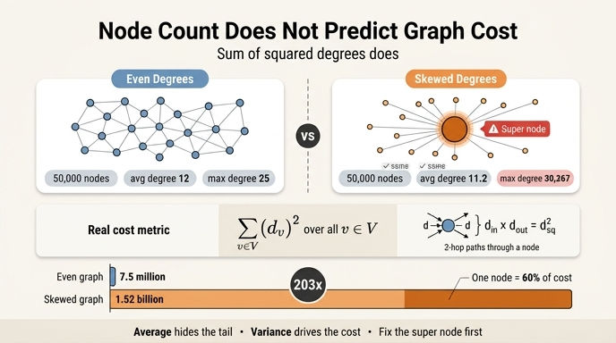

# 그래프 성능을 설명하는 지표는 노드 수인가?

**답: 아니다. 차수의 제곱합이 설명한다. 평균 차수가 같아도 2홉 비용이 200배 차이 날 수 있다.**

---

## 1. 왜 「노드 수」가 지표가 되지 못하나

「우리 그래프는 100만 노드입니다」는 성능에 관해 거의 아무것도 말해 주지 않는다.
8장 도입부의 문장이 그 이유다 — 어떤 그래프는 100만 노드에서 멀쩡하고, 어떤 그래프는 10만 노드에서 죽는다.

순회 비용을 결정하는 것은 **노드를 몇 개 갖고 있는지**가 아니라 **한 노드에서 뻗어 나가는 가지가 몇 개인지**, 그리고 그 가지 수가 **얼마나 고르지 않게 퍼져 있는지**다.

노드 수 $n$은 메모리 그릇의 크기를 결정하는 데는 의미가 있다(인접 행렬은 $O(n^2)$). 하지만 **질의 시간**은 노드 수가 아니라 훑는 엣지 수가 정한다.

---

## 2. 그럼 평균 차수는 지표가 되나 — 안 된다

평균 차수도 부족하다. 이게 이 카드의 핵심이다.

`ex3_degree_skew.py`를 그대로 돌린 실측값(노드 5만 개 고정):

| 그래프 | 노드 | 엣지 | 평균 차수 | 최대 차수 | 2홉 비용 |
|---|---|---|---|---|---|
| 고른 분포 | 50,000 | 299,958 | 12.0 | 25 | 7,494,946 |
| 쏠린 분포 | 50,000 | 280,374 | 11.2 | **30,267** | **1,520,876,110** |

- 노드 수: 같다.
- 엣지 수: 쏠린 쪽이 **더 적다**(28만 vs 30만).
- 평균 차수: 사실상 같다(11.2 vs 12.0).
- 2홉 비용: **203배** 차이.

세 가지 「상식적인」 지표가 모두 같거나 쏠린 쪽에 유리한데, 실제 비용은 두 자릿수 배로 벌어진다. 평균은 분포의 꼬리를 보지 못하기 때문이다.

---

## 3. 진짜 지표: 차수의 제곱합 $\sum_v d_v^2$

예제의 `two_hop_cost`가 재는 값은 이것 하나다.

```python
def two_hop_cost(edges):
    """2홉 탐색이 훑는 엣지 수의 합. 차수의 제곱합에 비례한다."""
    d = degrees(edges)
    return sum(v * v for v in d.values())
```

$$\text{2홉 비용} \;\propto\; \sum_{v \in V} d_v^2$$

### 왜 제곱합인가

2홉 탐색을 생각해 보자. 노드 $v$는 자기 이웃 $d_v$명 각각의 1홉 확장에서 **한 번씩 등장한다**. 그리고 등장할 때마다 자기 이웃 목록 $d_v$개를 훑는다.

$$\underbrace{d_v}_{\text{v에 도달하는 경로 수}} \times \underbrace{d_v}_{\text{v에서 다시 뻗는 가지 수}} = d_v^2$$

이걸 모든 노드에 대해 더하면 $\sum_v d_v^2$. 즉 제곱합은 「2홉 경로의 개수」이자 「2홉 질의가 만져야 하는 엣지의 총량」이다.

$k$홉으로 가면 지수가 더 커진다. 그래서 홉이 늘어날수록 쏠림의 벌점이 가혹해진다.

### 평균이 왜 이걸 못 잡는지 — 분산 항 때문

제곱합을 평균과 분산으로 분해하면 이유가 한눈에 보인다.

$$\sum_v d_v^2 = n\left(\bar{d}^2 + \sigma_d^2\right)$$

- 첫째 항 $n\bar{d}^2$: 평균이 설명하는 부분.
- 둘째 항 $n\sigma_d^2$: **평균이 전혀 모르는 부분.**

위 실측값에 넣어 보면:

| | $n\bar{d}^2$ (평균이 설명) | 실제 $\sum d^2$ | 분산이 설명하는 몫 |
|---|---|---|---|
| 고른 분포 | 약 7.2M | 7.49M | 4% |
| 쏠린 분포 | 약 6.3M | 1,520.9M | **99.6%** |

쏠린 그래프에서는 비용의 **99% 이상이 분산에서 나온다**. 평균만 보고 용량을 산정하면 실제의 1/240을 예측하는 셈이다.

### 한 노드가 전체를 삼킨다

최대 차수 30,267 노드 하나만 따로 계산해 보면

$$30{,}267^2 \approx 916{,}\!090{,}000$$

전체 1,520,876,110의 **약 60%**다. 5만 개 노드 중 **단 하나**가 2홉 비용의 절반 이상을 만든다. 이런 노드가 **슈퍼 노드(super node)**다.

---

## 4. 실무에서 이게 어떻게 터지나

- 「평균 친구 수 12명인데 왜 추천 질의가 30초씩 걸리죠?」 → 평균 12명 사이에 팔로워 3만 명짜리 계정이 섞여 있다.
- 부하 테스트는 통과하는데 운영에서 죽는다 → 무작위로 뽑은 시작 노드는 대부분 평범한 노드다. 슈퍼 노드를 지나가는 질의는 샘플에 거의 안 걸린다.
- **꼬리 지연(tail latency)이 진짜 문제다.** 평균 응답 시간은 멀쩡한데 p99가 폭발한다. 슈퍼 노드를 지나는 질의 하나가 스레드·메모리를 점유해 다른 질의까지 세운다.
- 「그래프가 커져서 느려졌다」고 오진하고 노드를 줄이러 간다. 정작 노드를 절반 줄여도 슈퍼 노드가 남아 있으면 비용은 거의 그대로다.

### 용량 산정에 쓸 규칙

노드 수나 평균 차수 대신 이걸 재라.

1. 차수 분포의 **히스토그램과 상위 백분위수**(p99, p999, 최댓값). 평균 하나로 보고하지 않는다.
2. $\sum_v d_v^2$ 를 직접 계산해 두고, 데이터가 늘 때 이 값의 추이를 본다.
3. 상위 차수 노드 몇 개가 제곱합의 몇 %를 차지하는지. 한 노드가 절반 이상이면 그건 구조 문제다.

---

## 5. 대처법 세 가지

예제가 제시하는 순서대로:

1. **슈퍼 노드를 질의에서 피한다.** 「기타」, 「미분류」, 「N/A」 같은 노드는 대개 지워도 된다. 저자의 표현: *「슈퍼 노드의 절반은 모델링 실수라서요.」* 7장의 「노드로 만들 것과 속성으로 남길 것」 판단이 여기서 청구서로 돌아온다.
2. **차수 상한을 두고 넘으면 쪼갠다** (샤딩된 이웃 목록). 이웃 목록을 여러 조각으로 나눠 병렬로 읽거나 부분만 읽는다.
3. **2홉 결과를 미리 계산해 둔다.** 읽기는 빨라지지만 갱신 비용을 낸다. 슈퍼 노드의 이웃이 바뀔 때마다 대량 무효화가 일어난다.

1번이 먼저인 이유는 명확하다. 2번과 3번은 비용을 **옮기는** 것이고, 1번은 비용을 **없애는** 것이다.

---

## 6. 다른 「메모리 지표」와 헷갈리지 말 것

이 카드의 제곱합은 **질의 시간** 지표다. 8장의 다른 지표들과 역할이 다르다.

| 지표 | 무엇을 설명하나 |
|---|---|
| 노드 수 $n$ | 인접 행렬 크기($O(n^2)$). 그래서 행렬은 수천 노드 이하에서만 쓸 만하다 |
| 엣지 수 $m$ | CSR·인접 리스트의 메모리 크기, 전체 순회(BFS 한 번) 비용 |
| **차수 제곱합 $\sum d^2$** | **2홉 이상 질의 비용, 꼬리 지연, 슈퍼 노드 위험** |
| 이웃 번호 차이 평균 | 캐시 지역성. 재배치(relabeling)로 개선하는 대상 |

한 줄로: **그릇 크기는 $n$과 $m$이 정하고, 질의가 언제 터지는지는 $\sum d^2$가 정한다.**

## 인포그래픽


