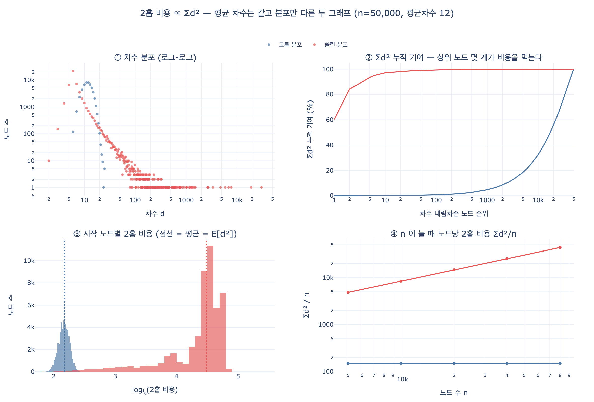

# 2홉 탐색 비용은 무엇에 비례하는가

**답: 차수의 제곱합 $\sum_v \deg(v)^2$ 에 비례한다. 평균 차수는 이 값을 잡아내지 못한다.**

이 카드는 「제곱합이다」를 외우는 것이 아니라 **왜 하필 제곱합이 나오는지 유도하고, 그 유도가 왜 평균으로는 대체될 수 없는지**를 다룬다.

---

## 1. 먼저 비용을 정의한다

「비용」이라는 말이 애매하면 유도도 애매해진다. 8장이 재는 것은 이것이다.

> **2홉 탐색이 훑는 엣지 수의 합.**

CSR로 구현했다면 이것은 곧 「이웃 배열 `nbr[]` 에서 읽은 원소의 개수」다. 실제 실행 시간을 지배하는 양이 이것이다. 결과 집합의 크기가 아니라 **작업량**이다. (둘의 차이는 10절에서 다시 본다.)

의사 코드로 쓰면 비용은 안쪽 루프가 도는 횟수다.

```python
for v in adj[u]:        # 1홉: deg(u)번
    for w in adj[v]:    # 2홉: 이 루프가 deg(v)번  ← 여기가 비용
        touch(w)
```

---

## 2. 유도 ① — 시작 노드 하나에서 출발한다

시작 노드 $u$ 를 고정하자. 위 코드에서 안쪽 루프가 도는 총 횟수는

$$\text{cost}(u) \;=\; \sum_{v \in N(u)} \deg(v)$$

여기서 이미 중요한 사실이 보인다. **비용은 $\deg(u)$ 가 아니라 «이웃들의 차수 합»이다.** 내 차수가 10이어도 이웃 하나가 3만 차수를 갖고 있으면 내 2홉 비용은 3만이다.

이 식은 아직 「제곱」이 아니다. 제곱은 다음 단계에서 나온다.

## 3. 유도 ② — 모든 시작 노드에 대해 더한다 (이중 계산)

$\text{cost}(u)$ 를 모든 $u$ 에 대해 더하면 무엇이 되는가. 합의 순서를 바꾸는 것이 핵심이다.

$$\sum_{u \in V} \text{cost}(u) \;=\; \sum_{u \in V} \sum_{v \in N(u)} \deg(v) \;=\; \sum_{v \in V} \deg(v) \cdot \bigl|\{u : v \in N(u)\}\bigr|$$

무향 그래프에서 $v \in N(u) \iff u \in N(v)$ 이므로 $\bigl|\{u : v \in N(u)\}\bigr| = \deg(v)$ 다. 즉 **노드 $v$ 는 정확히 $\deg(v)$ 개의 이웃 목록에 등장한다.** 따라서

$$\boxed{\;\sum_{u \in V} \text{cost}(u) \;=\; \sum_{v \in V} \deg(v)^2\;}$$

두 개의 $\deg(v)$ 는 서로 다른 역할을 한다. 이 구별이 유도의 전부다.

$$\underbrace{\deg(v)}_{\text{v 에 도달하는 경로 수}} \;\times\; \underbrace{\deg(v)}_{\text{v 에서 다시 뻗는 가지 수}} \;=\; \deg(v)^2$$

들어오는 길이 $\deg(v)$ 갈래이고, 들어올 때마다 나가는 일을 $\deg(v)$ 만큼 한다. 곱이 제곱이 된다. **제곱은 「크기」에서 나오는 것이 아니라 «들어오기 × 나가기»에서 나온다.**

이것은 근사가 아니라 **항등식**이다. 손으로 확인할 수 있다.

| 그래프 | 차수 | $\sum_u \text{cost}(u)$ | $\sum_v \deg(v)^2$ |
|---|---|---|---|
| 별 (중심 1 + 잎 4) | 4, 1, 1, 1, 1 | $4\cdot4 + 4\cdot1 = 20$ | $16 + 4 = 20$ |
| 경로 (5노드 일렬) | 1, 2, 2, 2, 1 | 14 | $1+4+4+4+1 = 14$ |
| 고리 (5노드) | 2, 2, 2, 2, 2 | 20 | $4 \times 5 = 20$ |

노드 5개, 엣지 4~5개로 규모가 사실상 같은데 별 그래프가 경로보다 비싸다. 차이를 만드는 것은 노드 수도 엣지 수도 아니고 **분포**뿐이다.

### 방향 그래프에서는

들어오기와 나가기가 분리되므로 유도가 그대로 갈라진다.

$$\text{2홉 비용} \;=\; \sum_v \deg_{\text{in}}(v)\cdot\deg_{\text{out}}(v)$$

무향은 $\deg_{\text{in}} = \deg_{\text{out}} = \deg$ 인 특수한 경우다. 실무 함의가 있다. **팔로워 100만·팔로잉 10인 계정은 2홉에서 그리 위험하지 않다.** 위험한 것은 in과 out이 **둘 다** 큰 노드다. 무향으로 모델링하면 이 구별이 사라지면서 위험이 과대평가된다.

## 4. 유도 ③ — 행렬로 쓰면 두 줄이다

인접 행렬 $A$ 에서 $(A^2)_{ij}$ 는 $i$ 에서 $j$ 로 가는 길이 2 워크의 개수다. 2홉 탐색의 총 작업량은 이 워크의 총 개수, 즉 $A^2$ 의 원소 전체 합이다. $\mathbf{1}$ 을 성분이 전부 1인 벡터라 하면 $A\mathbf{1}$ 이 바로 **차수 벡터**이므로

$$\mathbf{1}^{\mathsf T} A^2 \mathbf{1} \;=\; (A\mathbf{1})^{\mathsf T}(A\mathbf{1}) \;=\; \|A\mathbf{1}\|^2 \;=\; \sum_v \deg(v)^2$$

$A$ 가 대칭이라는 사실 하나만 쓴 두 줄 증명이다. 제곱합이 **차수 벡터의 노름의 제곱**이라는 관점을 준다. 즉 제곱합은 「차수 벡터가 얼마나 긴가」이고, 벡터의 길이는 성분이 한 곳에 몰릴 때 커진다.

대비해서 볼 값이 하나 있다.

$$\operatorname{tr}(A^2) \;=\; \sum_v \deg(v) \;=\; 2E$$

**제자리로 돌아오는 워크**(갔다가 되돌아오기)는 제곱합이 아니라 엣지 수만 본다. 제곱합은 **퍼져 나가는** 쪽의 양이다. BFS 한 번(전체 순회)이 $O(V+E)$ 인데 2홉 질의가 $\sum d^2$ 인 이유가 이 대비에 있다. 전체 순회는 각 엣지를 한 번만 보고, 2홉 질의는 같은 엣지를 여러 시작점에서 반복해 본다.

## 5. 유도 ④ — 확률로 보면 «친구 관계 역설»이다

무작위 노드 하나를 잡고 그 이웃 하나를 무작위로 골랐을 때, 그 이웃의 기대 차수는 $\bar d$ 가 **아니다.** 차수 $d$ 인 노드는 이웃으로 뽑힐 기회를 $d$ 번 갖는다. 뽑힐 확률이 차수에 비례한다(크기 편향 표집, size-biased sampling).

$$P(\text{뽑힌 이웃의 차수}=d) \;=\; \frac{d \cdot n_d}{\sum_k k\, n_k} \quad\Longrightarrow\quad \mathbb{E}[\deg(\text{무작위 이웃})] \;=\; \frac{\sum_v d_v^2}{\sum_v d_v} \;=\; \frac{\mathbb{E}[d^2]}{\mathbb{E}[d]}$$

그러면 무작위 시작 노드의 2홉 비용 기대값은

$$\mathbb{E}[\text{cost}] \;=\; \mathbb{E}[d] \times \frac{\mathbb{E}[d^2]}{\mathbb{E}[d]} \;=\; \mathbb{E}[d^2]$$

**노드당 2홉 비용의 평균이 곧 차수의 2차 모멘트다.** 세 번째 경로로도 같은 곳에 도착한다.

이것이 잘 알려진 **친구 관계 역설**(friendship paradox)이다. 「내 친구들은 나보다 친구가 많다.」 실측하면 쏠린 그래프에서 이 배수가 **241.8배**다. 1홉에서 12명을 보는데 2홉에서 3만 개를 만지는 이유가 이 한 줄이다.

---

## 6. 평균이 못 잡는 부분은 «정확히 분산»이다

여기가 답 후반부 — 「평균 차수는 이 값을 잡아내지 못한다」 — 의 수학적 내용이다. 분산의 정의를 전개하면

$$\sigma^2 \;=\; \frac{1}{n}\sum_v (d_v - \bar d)^2 \;=\; \frac{1}{n}\sum_v d_v^2 - \bar d^{\,2}$$

양변에 $n$ 을 곱해 정리하면

$$\boxed{\;\sum_v d_v^2 \;=\; n\left(\bar d^{\,2} + \sigma^2\right) \;=\; \underbrace{n\bar d^{\,2}}_{\text{평균이 아는 부분}} + \underbrace{n\sigma^2}_{\text{평균이 모르는 부분}}\;}$$

평균 차수만 보고 용량을 산정하는 것은 **두 번째 항을 0으로 가정하는 것**과 정확히 같다. 얼마나 틀리는지는 분포가 정한다.

### 젠슨 부등식 — 과소 추정은 «항상» 일어난다

$f(x) = x^2$ 는 볼록 함수($f'' = 2 > 0$)다. 젠슨 부등식에 의해

$$\mathbb{E}[d^2] \;\ge\; \bigl(\mathbb{E}[d]\bigr)^2$$

등호는 분산이 0일 때(모든 노드의 차수가 같을 때)뿐이다. 따라서

> **평균 차수로 계산한 2홉 비용은 언제나 과소 추정이다.** 방향은 정해져 있고, 크기만 분포가 정한다.

이건 「가끔 틀린다」가 아니라 「구조적으로 한쪽으로만 틀린다」는 진술이다. 부하 산정에서 이런 종류의 편향이 가장 위험하다. 안전 쪽으로 틀리는 게 아니라 항상 낙관 쪽으로 틀린다.

### 상한과 하한 — 제곱합이 놀 수 있는 범위

코시-슈바르츠 부등식 $\left(\sum d_v\right)^2 \le n \sum d_v^2$ 에서 하한이 나오고, $d_v \le d_{\max}$ 에서 상한이 나온다.

$$\frac{4E^2}{n} \;=\; n\bar d^{\,2} \;\le\; \sum_v d_v^2 \;\le\; d_{\max}\sum_v d_v \;=\; 2E\,d_{\max}$$

- **하한**에 붙어 있으면 정규 그래프에 가깝다. 이때는 평균으로 예측해도 맞는다.
- **상한**에 가까울수록 최대 차수 노드 하나가 비용을 독점한다.

즉 「$\sum d^2$ 가 $4E^2/n$ 의 몇 배인가」가 곧 **쏠림 배율**이다. 이 배율은 그대로 「평균 기반 예측이 몇 배 틀리는가」다.

$$\frac{\sum d^2}{4E^2/n} \;=\; \frac{\bar d^{\,2}+\sigma^2}{\bar d^{\,2}} \;=\; 1 + \left(\frac{\sigma}{\bar d}\right)^2 \;=\; 1 + \mathrm{CV}^2$$

**변동계수(CV)의 제곱**이다. 그래서 차수 분포를 보고할 때는 평균만이 아니라 **CV**를 함께 봐야 한다. CV가 1이면 2배, CV가 10이면 101배 틀린다.

## 7. 멱법칙에서는 제곱합이 «발산»한다

실제 그래프의 차수 분포는 대개 멱법칙에 가깝다. $P(d = k) \propto k^{-\gamma}$. 그러면

$$\mathbb{E}[d^2] \;=\; \sum_k k^2 \cdot c\,k^{-\gamma} \;=\; c\sum_k k^{-(\gamma - 2)}$$

$\sum k^{-p}$ 는 $p > 1$ 에서만 수렴한다. 여기서 $p = \gamma - 2$ 이므로 **수렴 조건은 $\gamma > 3$.** 한편 평균 $\mathbb{E}[d] = c\sum k^{-(\gamma-1)}$ 의 수렴 조건은 $\gamma > 2$ 다.

관측된 소셜·웹 그래프의 $\gamma$ 는 대개 **2.1~2.5** 다. 두 조건 사이에 정확히 끼어 있다.

| $\gamma$ 범위 | $\mathbb{E}[d]$ (평균 차수) | $\mathbb{E}[d^2]$ (2홉 비용) |
|---|---|---|
| $\gamma > 3$ | 수렴 | 수렴 — 평균으로 예측 가능 |
| $2 < \gamma \le 3$ | **수렴** | **발산** — 실제 그래프가 여기 |
| $\gamma \le 2$ | 발산 | 발산 |

이 표가 「평균 차수는 이 값을 잡아내지 못한다」의 가장 강한 형태다. 평균은 **수렴하는 양**이고 2홉 비용은 **발산하는 양**이다. 수렴하는 지표로 발산하는 양을 추적할 방법은 없다.

실무에서 이게 어떻게 나타나는가. 유한한 그래프에서 발산은 **크기 의존**으로 나타난다. $n$ 이 커지면 최대 차수가 $d_{\max} \sim n^{1/(\gamma-1)}$ 로 커지고, 절단된 2차 모멘트가

$$\mathbb{E}[d^2] \;\sim\; n^{(3-\gamma)/(\gamma-1)}$$

로 자란다. 즉 **데이터가 늘면 노드당 비용 자체가 늘어난다.** 평균 차수는 그대로인데. 이것이 「평균 친구 수는 그대로인데 작년보다 질의가 느려졌다」의 정체다.

## 8. 실측 — 유도한 식이 그대로 맞는다

8장 `graphgen.py` 로 노드 5만, 목표 평균 차수 12인 두 그래프를 만들어 재면(`expy.py` 실행 결과):

| | 고른 분포 | 쏠린 분포 |
|---|---|---|
| 노드 수 | 50,000 | 50,000 |
| 엣지 수 | 299,958 | 280,374 (**더 적다**) |
| 평균 차수 | 12.0 | 11.2 (**더 낮다**) |
| 최대 차수 | 25 | 30,267 |
| **$\sum d^2$** | **7,494,946** | **1,520,876,110 (203배)** |
| $\sum_u \text{cost}(u)$ (독립 계산) | 7,494,946 ✓ | 1,520,876,110 ✓ |
| $n\bar d^{\,2}$ (평균이 설명) | 7,197,984 | 6,288,766 |
| $n\sigma^2$ (분산이 설명) | 296,962 (4.0%) | **1,514,587,344 (99.6%)** |
| $\mathbb{E}[d^2]/\mathbb{E}[d]$ (친구 역설) | 12.5 | 2,712 (**241.8배**) |
| $\sum d^2 / (4E^2/n)$ = $1+\mathrm{CV}^2$ | 1.04 | 241.8 |

읽어야 할 것 세 가지.

1. **항등식이 소수점 없이 맞는다.** 3절의 유도를 쓰지 않고 순회로 직접 센 값과 $\sum d^2$ 가 완전히 일치한다.
2. **상식적인 지표 세 개가 모두 쏠린 쪽 손을 들어 준다.** 노드 수 같고, 엣지 수 적고, 평균 차수도 낮다. 그런데 비용은 203배다.
3. **비용의 99.6%가 분산 항에서 나온다.** 평균 기반 예측치는 실제의 1/242이다. 그리고 $1+\mathrm{CV}^2$ 가 정확히 그 241.8을 예측한다 — 6절의 식이 실측에서 확인된다.

### 크기가 늘 때의 추이

| $n$ | 고른: $\sum d^2/n$ | 쏠린: $\sum d^2/n$ |
|---|---|---|
| 5,000 | 150 | 4,844 |
| 10,000 | 150 | 8,426 |
| 20,000 | 150 | 14,746 |
| 40,000 | 150 | 25,618 |
| 80,000 | 150 | 44,049 |

고른 분포는 **150에서 꼼짝하지 않는다.** $n$ 을 16배 늘려도 노드당 비용이 같다. 여기서는 「노드 수」가 실제로 비용을 예측한다(총 비용 $= 150n$, 선형).

쏠린 분포는 노드당 비용이 9.1배가 됐다. 지수로 읽으면 $\log 9.1 / \log 16 \approx 0.80$ 이므로

$$\mathbb{E}[d^2] \sim n^{0.8}, \qquad \sum d^2 \sim n^{1.8}$$

**노드를 2배 늘리면 비용은 2배가 아니라 3.5배**다. 「어떤 그래프는 100만에서 멀쩡하고 어떤 건 10만에서 죽는」 이유가 이 초선형 지수다. 정확한 0.8이 중요한 게 아니고 **0이 아니라는 사실**이 중요하다.

---

## 9. 3홉 이상 — 2홉이 특별한 이유

같은 행렬 논법을 한 번 더 쓴다. 길이 3 워크의 총수는

$$\mathbf{1}^{\mathsf T} A^3 \mathbf{1} \;=\; (A\mathbf{1})^{\mathsf T} A (A\mathbf{1}) \;=\; 2\!\!\sum_{\{u,v\}\in E}\!\! d_u d_v$$

**엣지 양 끝의 차수 곱**이 더해진다. 이건 차수 분포만으로 결정되지 않는다. **누가 누구와 붙어 있는지**(차수 상관, degree assortativity)가 들어온다.

| | 2홉 $\sum d^2$ | 3홉 $2\sum_E d_u d_v$ | 3홉/2홉 |
|---|---|---|---|
| 고른 분포 | 7,494,946 | 93,490,042 | 12.5배 |
| 쏠린 분포 | 1,520,876,110 | 35,123,314,976 | 23.1배 |
| **두 그래프 격차** | **203배** | **375배** | |

고른 그래프의 12.5배는 정확히 평균 차수다. 예상대로다 — $2\sum_E d_ud_v \approx 2E\bar d^{\,2} = n\bar d^{\,3}$, $\sum d^2 \approx n\bar d^{\,2}$, 비 $=\bar d$.

쏠린 그래프는 23.1배로 「1,500배쯤 되겠지」라는 순진한 예상보다 훨씬 작다. **이유가 중요하다.** 이 생성기(선호적 연결)의 허브는 잎에만 붙어 있다(비동류적, disassortative). 그래서 $d_u d_v$ 곱에서 한쪽은 항상 작다. 허브끼리 서로 연결된 그래프(동류적)라면 그 엣지 하나가 $d_u d_v$ 만큼 기여하면서 3홉 비용이 폭발한다.

> **2홉 비용은 차수 분포만으로 완전히 결정되지만, 3홉부터는 연결 구조가 함께 들어온다.**

이것이 「2홉 비용 = 제곱합」이라는 깔끔한 명제가 정확히 2홉에서만 성립하는 이유다. 2홉은 유도가 닫히는 마지막 홉이다. 그래도 두 그래프의 절대 격차는 203배 → 375배로 벌어진다. 쏠림의 벌점은 홉마다 누적된다.

## 10. 「비례한다」의 나머지 절반

$\sum d^2$ 는 **작업량**을 센다. 실제 실행 시간으로 넘어갈 때 두 가지를 더 봐야 한다.

### 작업량과 결과 크기는 다른 양이다

`expy.py` 실측에서 쏠린 그래프의 노드 2번은 엣지 **343,759개를 만져서** 서로 다른 노드 **49,874개**를 얻는다. 중복률 6.9배다. 「일은 많이 했는데 결과는 작다.」

**비용은 결과 크기가 아니라 작업량이 정한다.** 결과 개수(`DISTINCT` 이후)로 용량을 산정하면 실제의 1/7만 예측한다. 커뮤니티가 뚜렷하거나 슈퍼 노드를 지나는 질의에서 이 괴리가 커진다.

### 상수는 자료 구조가 정한다

$\sum d^2$ 는 「메모리를 몇 번 만지는가」이고, 한 번 만지는 값이 얼마인지는 8장의 나머지 절반이다.

- **CSR**: 이웃이 연속 배열에 있으므로 순차 읽기. 캐시 한 줄(64바이트)에 4바이트 정수 16개가 함께 온다.
- **dict of list**: 원소마다 파이썬 객체를 따라 점프. 같은 $\sum d^2$ 에 훨씬 큰 상수가 붙는다.

그래서 $\sum d^2$ 는 **그릇을 바꿔서 줄일 수 없는 부분**이다. CSR로 바꾸면 상수가 줄고, 재배치(relabeling)로 지역성이 좋아지고, 그래도 $\sum d^2$ 자체는 그대로다. 이 값을 줄이려면 **그래프를 바꾸거나 질의를 바꿔야** 한다.

## 11. 흔히 틀리는 지점

| 오해 | 실제 |
|---|---|
| 「비용은 시작 노드의 차수에 비례한다」 | 시작 노드의 차수가 아니라 **이웃들의 차수 합**이다. 내 차수 10이고 이웃에 슈퍼 노드가 있으면 비용 3만이다 |
| 「$\sum d^2$ 는 최악의 경우 상한이다」 | **항등식**이다. 모든 시작 노드의 비용을 더하면 정확히 이 값이다 |
| 「평균 차수를 알면 2배 정도 오차로 예측된다」 | 오차 배율은 $1+\mathrm{CV}^2$ 다. 실측에서 242배 |
| 「제곱합은 노드가 많아서 커진다」 | 노드 수와 무관하게 커질 수 있다. 실측에서 쏠린 쪽은 노드·엣지 다 적은데 203배 |
| 「$k$홉이면 $\sum d^k$ 다」 | 2홉만 그렇다. 3홉은 $2\sum_E d_ud_v$ 로 연결 구조가 들어온다 |
| 「평균으로 예측하면 어차피 오차니 반반이다」 | 젠슨 부등식에 의해 **항상 과소 추정**이다. 낙관 쪽으로만 틀린다 |
| 「무향으로 모델링해도 상관없다」 | 방향 그래프의 비용은 $\sum \deg_{\text{in}}\cdot\deg_{\text{out}}$ 다. 팔로워만 많은 계정은 무향 모델에서 위험이 과대평가된다 |

## 12. 그래서 무엇을 재야 하나

$\sum d^2$ 는 $O(V+E)$ 로 싸게 계산된다. 순회 없이 차수만 더하면 된다. 다음 세 값을 함께 기록하자.

1. $\sum_v d_v^2$ 자체와 그 시간 추이. 데이터가 늘 때 $\sum d^2 / n$ 이 **평평한지 우상향인지**가 7절의 $\gamma$ 진단이다.
2. **변동계수 $\mathrm{CV} = \sigma/\bar d$.** $1+\mathrm{CV}^2$ 가 곧 「평균 기반 예측이 몇 배 틀리는가」다.
3. 상위 차수 노드 몇 개가 $\sum d^2$ 의 몇 %를 차지하는지. 한 노드가 절반을 넘으면 그건 구조 문제이지 용량 문제가 아니다.

8장의 대처법(슈퍼 노드 제거 / 차수 상한과 샤딩 / 2홉 미리 계산)은 전부 이 세 값을 **줄이려는** 시도로 읽으면 된다.

## 13. 출처

- CSR 형식: [scipy.sparse.csr_matrix](https://docs.scipy.org/doc/scipy/reference/generated/scipy.sparse.csr_matrix.html) [사실상 표준]
- 슈퍼 노드와 질의 계획: [Neo4j Cypher planning and tuning](https://neo4j.com/docs/cypher-manual/current/planning-and-tuning/) [사실상 표준]
- 지역성: [locality of reference / 커널 메모리 관리 문서](https://www.kernel.org/doc/html/latest/admin-guide/mm/index.html) [사실상 표준]
- 그래프 재배치: [graph reordering, arXiv:1602.08820](https://arxiv.org/abs/1602.08820) [실험]
- 8장 예제: `content/ch08/code/ex3_degree_skew.py` (`two_hop_cost` = `sum(v*v for v in d.values())`), `graphgen.py`

## 시각화


