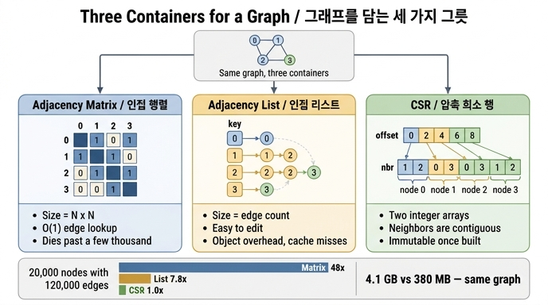

# 그래프를 담는 세 가지 그릇

> **Q.** 그래프를 담는 세 가지 그릇은 무엇인가?
> **A.** 인접 행렬, 인접 리스트, CSR(압축 희소 행 형식)이다. 같은 그래프가 4.1GB와 380MB로 갈릴 수 있다.

## 한 줄로

그래프는 「점과 선」이라는 추상이지만, 메모리에 올릴 때는 결국 **바이트 배치 방식**을 골라야 한다. 그 선택지가 셋이고, 어느 그릇을 고르느냐에 따라 같은 그래프가 **10배 이상** 다른 메모리를 먹는다.

---

## 그릇 1 — 인접 행렬 (adjacency matrix)

노드 수 N에 대해 `N × N` 격자를 만들고, `M[i][j]`가 1이면 i→j 엣지가 있다는 뜻이다.

```
     0  1  2  3
  0  0  1  1  0
  1  1  0  0  1
  2  1  0  0  1
  3  0  1  1  0
```

- **크기: 노드 수의 제곱.** 엣지가 몇 개든 상관없다. 엣지 0개인 그래프도 같은 공간을 먹는다.
- **장점:** 「i와 j가 연결됐나?」를 O(1)에 답한다. 배열 인덱싱 한 번이다. 행렬 곱으로 경로 수를 세는 등 선형대수 도구를 그대로 붙일 수 있다.
- **단점:** 비트 하나로 아껴 써도 N=20,000이면 이미 50MB, N=100만이면 **약 116TB**다. 실전 그래프는 희소(sparse)해서 1의 비율이 0.01% 아래인 경우가 흔하다. 즉 거의 전부 0을 저장하는 셈이다.
- **쓸 만한 구간:** 노드 **수천 개 이하**, 그리고 밀도가 높거나 행렬 연산이 목적일 때.

## 그릇 2 — 인접 리스트 (adjacency list)

노드마다 이웃 목록을 하나씩 들고 있는다. 파이썬이면 `dict[node] -> list[node]`, 자바면 `Map<Node, List<Node>>`.

```python
{0: [1, 2], 1: [0, 3], 2: [0, 3], 3: [1, 2]}
```

- **크기: 엣지 수에 비례.** 희소 그래프에서 행렬 대비 압도적으로 작다.
- **장점:** **제일 편하다.** 엣지 추가·삭제가 쉽고, 노드마다 속성을 붙이기 좋고, 코드가 직관적이다. NetworkX 같은 라이브러리가 이 구조를 쓴다.
- **단점:** **원소마다 객체 헤더가 붙는다.** 파이썬에서 정수 하나가 28바이트, 리스트 하나가 56바이트+ 이고, 여기에 dict 해시 테이블의 빈 슬롯까지 얹힌다. 그리고 이웃 목록들이 힙 곳곳에 흩어져 있어서 **읽을 때마다 포인터를 따라 점프**한다 → 캐시 미스.

## 그릇 3 — CSR (압축 희소 행 형식, Compressed Sparse Row)

인접 리스트를 **정수 배열 두 개로 납작하게 눕힌** 형태다.

- `offset` — 길이 N+1. 노드 u의 이웃이 `nbr` 배열의 어디서 시작하는지.
- `nbr` — 길이 2E(무향). 모든 이웃을 노드 순서대로 이어 붙인 것.

```
offset = [0, 2, 4, 6, 8]
nbr    = [1,2, 0,3, 0,3, 1,2]
          ↑노드0 ↑노드1 ↑노드2 ↑노드3
```

노드 u의 이웃은 `nbr[offset[u] : offset[u+1]]`. 슬라이스 한 번이다. 차수는 `offset[u+1] - offset[u]`로 뺄셈 한 번에 나온다.

- **크기: `4(N+1) + 4·2E` 바이트.** 셋 중 제일 조밀하다. 객체 헤더가 0이다.
- **장점:** 조밀함 + **이웃이 메모리에 연속으로 놓인다.** 캐시 한 줄(보통 64바이트)에 4바이트 정수 16개가 함께 실려 온다. 그래서 순회가 빠르다.
- **단점:** **거의 불변(immutable)이다.** 엣지 하나를 중간에 끼우려면 배열 전체를 밀어야 한다. 그래서 보통 「적재할 때 한 번 만들고, 읽기만 한다」로 쓴다. 그래프 분석 엔진·GNN 라이브러리(SciPy, DGL, PyG)가 내부적으로 이 형식이다.

---

## 실측 — 노드 20,000, 엣지 약 12만 (`content/ch08/code/ex1_three_forms.py`)

| 표현 | 바이트 | 배수 |
|---|---:|---:|
| 인접 행렬 (비트) | 50,000,057 | 48.1x |
| 인접 리스트 (dict of list) | 8,116,284 | 7.8x |
| CSR (배열 2개) | 1,039,844 | **1.0x** |

- 행렬은 **엣지 12만 개를 담기 위해 4억 개의 셀**을 들고 있다. 노드 수의 제곱이라서.
- 인접 리스트는 행렬보다 6배 작지만 CSR보다 **8배 크다**. 그 8배가 전부 파이썬 객체 오버헤드다.
- 노드를 100만으로 키우면 행렬은 아예 후보에서 사라지고, 승부는 **인접 리스트 vs CSR**로 좁혀진다. 이게 답에 나온 4.1GB와 380MB의 정체다 — 같은 그래프, 같은 엣지 수, 그릇만 다르다.

## 왜 「4.1GB와 380MB」가 중요한가

세 그릇의 실무적 함의는 「어느 쪽이 우아한가」가 아니다.

1. **RAM에 들어가는가.** 4.1GB는 노트북 하나를 잡아먹고 스왑을 유발한다. 380MB는 아무 일도 아니다. 메모리에 안 들어가면 속도 논쟁은 의미가 없다.
2. **왜 100만에서 멀쩡하고 10만에서 죽는가.** 「노드 수」가 아니라 그릇 선택과 차수 분포가 답이다(8.3절: 비용은 차수의 **제곱합**이 정한다).
3. **읽기 속도.** CSR의 속도 이점은 알고리즘이 아니라 **메모리 접근 지역성**에서 온다(8.2절). 파이썬에서는 인터프리터 오버헤드가 지배해서 차이가 잘 안 보이지만, C/Rust로 옮기면 보통 3~10배 벌어진다.

## 고르는 기준 (요약)

| 상황 | 그릇 |
|---|---|
| 노드 수천 이하, 밀도 높음, 행렬 연산 필요 | 인접 행렬 |
| 엣지가 계속 바뀜, 노드마다 속성 많음, 개발 편의 우선 | 인접 리스트 |
| 한 번 적재하고 반복 순회, 대용량, 메모리·속도가 병목 | CSR |

실무 패턴: **인접 리스트로 만들고, 분석 직전에 CSR로 굽는다(freeze).** 대용량 그래프 도구들이 적재 단계에서 노드 번호 재배치(reordering)까지 함께 하는 이유도 여기 있다(8.4절 · `ex4_relabel.py`).

## 자주 헷갈리는 것

- **CSR은 「압축」이라는 이름이지만 gzip 같은 압축이 아니다.** 0을 저장하지 않는다는 의미의 압축(희소 행렬 표현)이다. 읽을 때 해동 과정이 없다.
- **CSR과 인접 리스트는 논리적으로 같은 정보다.** 담는 방식만 다르다. 상호 변환이 O(N+E)로 가능하다.
- **CSR의 열 방향(들어오는 엣지)을 알고 싶으면 CSC(Compressed Sparse Column)나 전치 CSR을 따로 만들어야 한다.** 무향 그래프는 양쪽을 다 넣으니 문제없지만, 유향 그래프에서 「나를 가리키는 노드」를 찾으려면 배열 한 쌍이 더 필요하다.

## 1차 출처

- [SciPy `csr_matrix` 문서](https://docs.scipy.org/doc/scipy/reference/generated/scipy.sparse.csr_matrix.html) — 압축 희소 행 형식 [사실상 표준]
- [NetworkX convert 문서](https://networkx.org/documentation/stable/reference/convert.html) — 인접 행렬 / 인접 리스트 [사실상 표준]

## 인포그래픽


