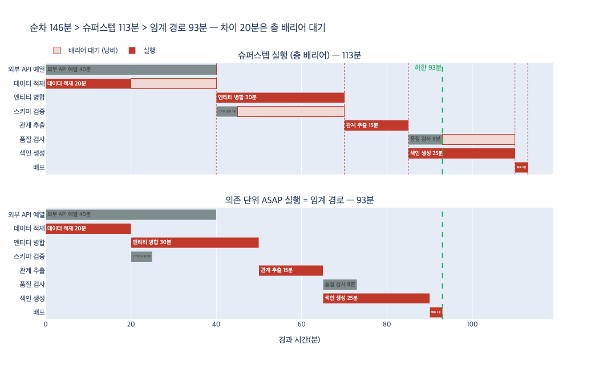

# `ex5_toposort.py`의 세 수치 — 순차 실행 · 슈퍼스텝 실행 · 임계 경로

## 한 줄 답

**순차 실행이 가장 느리고, 슈퍼스텝 실행이 그보다 빠르지만, 임계 경로가 이론적 하한이다.
슈퍼스텝 실행은 임계 경로보다 느릴 수 있다.**

즉 $T_{seq} \ge T_{ss} \ge T_{cp}$이며, 두 번째 부등호가 이 예제의 핵심이다.
슈퍼스텝은 하한을 "밑돌 수 없는" 게 아니라 **하한에 못 미치게 느릴 수 있다**.

## 세 수치가 각각 무엇인가

같은 작업 그래프를 **세 가지 다른 스케줄**로 돌렸을 때의 총 소요 시간(makespan)이다.
알고리즘 세 개가 아니라, 스케줄 정책 세 개다.

| 수치 | 정의 | 가정 |
|---|---|---|
| 순차 실행 $T_{seq}$ | $\sum_t c_t$ — 작업을 하나씩 줄 세워 실행 | 일꾼 1명 |
| 슈퍼스텝 실행 $T_{ss}$ | $\sum_i \max_{t \in L_i} c_t$ — 층을 통째로 병렬 실행, 층 끝에서 배리어 | 일꾼 무한, 층 단위 동기화 |
| 임계 경로 $T_{cp}$ | $\max_{P} \sum_{t \in P} c_t$ — 의존이 풀리는 즉시 시작(ASAP) | 일꾼 무한, 동기화 없음 |

여기서 $L_i$는 위상 정렬(Kahn)이 만든 $i$번째 층, $c_t$는 작업 $t$의 비용, $P$는 DAG 위의 경로다.

## 에셋의 TASKS로 실제 계산

```
TASKS = {
    "외부 API 예열": [],                                     # 40분
    "데이터 적재": [],                                        # 20분
    "스키마 검증": ["데이터 적재"],                             #  5분
    "엔티티 병합": ["데이터 적재"],                             # 30분
    "관계 추출": ["스키마 검증", "엔티티 병합"],                  # 15분
    "품질 검사": ["관계 추출"],                                #  8분
    "색인 생성": ["관계 추출"],                                # 25분
    "배포": ["품질 검사", "색인 생성", "외부 API 예열"],          #  3분
}
```

층은 5개로 나뉜다.

| 층 | 작업(비용) | span $s_i$ |
|---|---|---|
| 1차 | 데이터 적재(20), 외부 API 예열(40) | **40** |
| 2차 | 스키마 검증(5), 엔티티 병합(30) | **30** |
| 3차 | 관계 추출(15) | **15** |
| 4차 | 품질 검사(8), 색인 생성(25) | **25** |
| 5차 | 배포(3) | **3** |

- $T_{seq} = 40+20+5+30+15+8+25+3 = \mathbf{146}$분
- $T_{ss} = 40+30+15+25+3 = \mathbf{113}$분 (146/113 ≈ 1.3배 단축)
- $T_{cp}$: 가장 긴 경로는 `데이터 적재(20) → 엔티티 병합(30) → 관계 추출(15) → 색인 생성(25) → 배포(3)` = $\mathbf{93}$분

$146 > 113 > 93$. 슈퍼스텝은 하한보다 **20분 더** 쓴다.

## 대소 관계는 항상 성립하는가 — 근거

### ① $T_{seq} \ge T_{ss}$ 는 항상 참

각 층의 최댓값은 그 층의 합보다 클 수 없다. 비용이 음수가 아니라면($c_t \ge 0$, 작업 시간이니 당연히)

$$T_{ss} = \sum_i \max_{t \in L_i} c_t \;\le\; \sum_i \sum_{t \in L_i} c_t \;=\; \sum_t c_t = T_{seq}$$

**등호 조건**: 모든 층에서 "최댓값 = 합"이어야 한다. 즉 층마다 비용이 0보다 큰 작업이 하나씩만 있는 경우 —
사실상 **사슬(chain) DAG**다. 병렬화할 게 아예 없으니 순차와 같아지는 것이고, 당연한 결과다.

### ② $T_{ss} \ge T_{cp}$ 는 항상 참

핵심은 **Kahn 층 번호의 성질**이다. $\ell(t) = 1 + \max_{d \in \mathrm{deps}(t)} \ell(d)$ 이므로,
엣지 $u \to t$가 있으면 반드시 $\ell(t) \ge \ell(u) + 1$이다.

따라서 DAG 위의 **어떤 경로도 같은 층의 작업을 두 개 이상 지날 수 없다**. 층마다 최대 하나다.
그러면 임의의 경로 $P$에 대해

$$\sum_{t \in P} c_t \;\le\; \sum_{i \in \ell(P)} \max_{t \in L_i} c_t \;\le\; \sum_i s_i = T_{ss}$$

(첫 부등호는 각 항을 그 층의 최댓값으로 올린 것, 둘째는 경로가 건너뛴 층의 span을 더한 것)
모든 경로에 대해 성립하니, 최댓값인 $T_{cp}$에 대해서도 성립한다. **슈퍼스텝은 임계 경로 밑으로 절대 못 내려간다.**

### ③ 그래서 부등식은 순서까지 항상 고정

$T_{seq} \ge T_{ss} \ge T_{cp}$. 무작위 DAG 2,000개(노드 4~12개, 비용 1~50)를 만들어 돌려도 위반 0건이다.
`expy.py`의 7단계 셀이 이걸 확인한다.

## 슈퍼스텝이 임계 경로와 같아지는 조건

$T_{ss} = T_{cp}$가 되려면 위 ②의 두 부등호가 **동시에** 등호가 되어야 한다. 정확한 조건은:

> **각 층에서 그 층의 최고 비용 작업을 고르면서, 모든 층을 빠짐없이 지나는 경로가 DAG 안에 실제로 존재할 때.**

말로 풀면 "층별 최댓값을 만드는 작업들이 하나의 의존 사슬로 이어질 때"다.
실무에서 이 조건을 확실히 만족하는 충분조건은 두 가지다.

1. **층 안 비용이 균일할 때.**
   모든 $c_t = c$면 $s_i = c$이고, 층 정의상 층 수 $k$짜리 사슬이 반드시 존재하므로
   $T_{ss} = T_{cp} = kc$. 더 약하게는, 각 층 안에서만 비용이 같아도 웬만하면 붙는다.
   (`expy.py` 6단계: 전부 10분으로 두면 $T_{ss} = T_{cp} = 50$)
2. **사슬 DAG.** 층마다 작업 1개 → $T_{seq} = T_{ss} = T_{cp}$. 세 수치가 전부 붙는다.

이 예제로 직접 확인하면, `외부 API 예열`만 40분 → 20분으로 낮추는 순간
1차 층의 편차가 사라지면서 $T_{ss} = T_{cp} = 93$분으로 붙는다.

무작위 DAG 실험에서도 우연히 등호가 되는 경우가 약 30% 나온다. 등호가 드문 건 아니지만,
**비용 편차가 큰 층이 하나만 있어도 깨진다**는 게 요점이다.

## 20분은 정확히 어디서 새는가

층별로 뜯어보면 손실이 한 곳에 몰려 있다.

| 층 | span | 임계 경로 위의 작업 | 그 작업 비용 | 손실 |
|---|---|---|---|---|
| 1차 | 40 | 데이터 적재 | 20 | **20** |
| 2차 | 30 | 엔티티 병합 | 30 | 0 |
| 3차 | 15 | 관계 추출 | 15 | 0 |
| 4차 | 25 | 색인 생성 | 25 | 0 |
| 5차 | 3 | 배포 | 3 | 0 |
| | | | | **합 20 = 113 − 93** |

원인은 하나다. `데이터 적재`는 20분에 끝나는데, 같은 층에 묶인 `외부 API 예열`이 40분이라
배리어가 40분에야 열린다. 그 20분이 뒤의 모든 작업을 통째로 밀어 최종 20분 손해가 된다.

그런데 `외부 API 예열`의 결과는 **마지막 `배포`(90분 시점)에서야 필요**하다.
의존 관계가 요구하지 않은 대기를, 층이 강제한 것이다. 이게 슈퍼스텝이 임계 경로보다 느린 이유의 전부다.

## 자주 하는 오해

| 오해 | 사실 |
|---|---|
| "슈퍼스텝이 임계 경로보다 빠를 수도 있는 거 아닌가" | 불가능하다. ②의 증명이 그것을 막는다. |
| "임계 경로는 실제로 달성 가능한 시간이다" | 일꾼이 **무한**할 때만. $p$명이면 하한이 $\max(T_{cp},\, T_{seq}/p)$ 쪽으로 올라간다. |
| "층을 더 잘게 쪼개면 임계 경로에 가까워진다" | 층 자체가 문제가 아니다. **층 안 비용 편차**가 문제다. 배리어를 없애야 없어진다. |
| "임계 경로는 홉 수가 가장 긴 경로다" | 아니다. **비용 합이 가장 큰 경로**다. 이 예제에서도 홉 수가 같은 경로 중 비용 합이 큰 쪽이 임계 경로다. |
| "위상 정렬 결과가 유일하니 층도 유일하다" | 위상 정렬 **순서**는 여러 개지만, Kahn 층 분할(가장 이른 층 배정)은 유일하다. 그래서 $T_{ss}$도 유일하게 정해진다. |

## 엔지니어링 판단

- **층 단위(슈퍼스텝)**: 구현이 쉽다. 배리어 하나, 층 하나 끝날 때까지 기다리면 되니 상태 관리가 단순하고
  실패 재시도 지점도 명확하다. Pregel/BSP 계열이 이 모델이다.
- **의존 단위(ASAP)**: 빠르다. 대신 작업별 완료 이벤트와 준비 큐(indegree 카운터)를 직접 굴려야 하고,
  동시 실행 개수 제어·백프레셔·부분 실패 처리가 다 손으로 들어간다.

선택 기준은 **층 안 비용 편차**다. 편차가 작으면 슈퍼스텝으로 충분하고(어차피 $T_{ss} \approx T_{cp}$),
`외부 API 예열` 같은 **긴 독립 작업**이 층에 섞이는 순간 의존 단위 스케줄러가 값을 한다.
에셋 본문의 "층 단위는 구현이 쉽고, 의존 단위는 빠르다. 19장에서 다시 본다"가 이 이야기다.

## 시각화



위 패널이 슈퍼스텝(층 배리어), 아래가 의존 단위 ASAP다.

- 빨간 막대가 임계 경로 위의 작업. 아래 패널에서 이것들이 **틈 없이 이어져** 93분을 만든다.
- 위 패널의 연한 구간이 **배리어 대기**. `데이터 적재`가 20분에 끝나고도 40분까지 노는 게 보인다.
- 초록 점선이 하한 93분. 위 패널에서는 그 선을 넘어 113분까지 밀린다. 그 차이 20분이 층이 만든 손해다.
